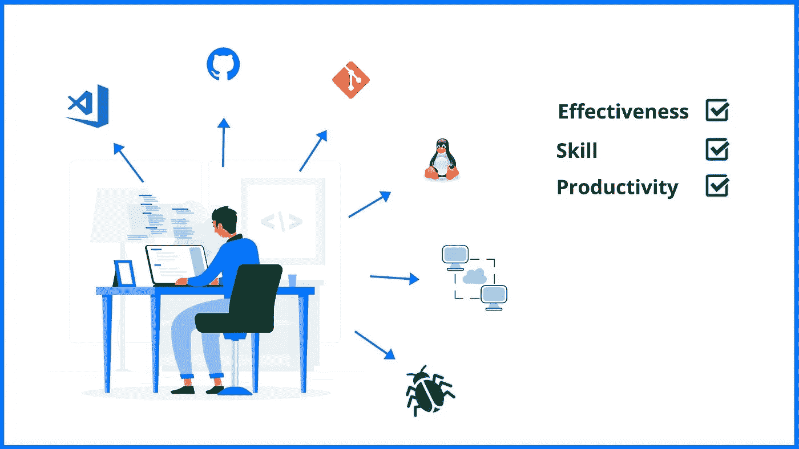

# 每个软件工程师都需要知道的 5 种工具或技术

> 原文：<https://javascript.plainenglish.io/5-tools-or-technologies-every-software-engineer-needs-to-know-64ce167ac9d0?source=collection_archive---------5----------------------->

## 成为更好的开发者

Image by Samuel Martins

作为一名软件工程师，你应该知道软件工程不仅仅是知道如何编码。如果你对自己解决问题和编写优秀代码的能力非常有信心，这是可以的。在这篇文章中，我将分享成为一名有效的软件工程师需要知道的五种工具/技术。我在这里将要谈到的工具非常广泛，而且对于每一种工具，您肯定可以学到更多的东西。现在，你知道所有的事情并不是非常重要，但是对这些工具有一个基本的了解以及如何使用它们将会对你成为一个更好的工程师大有帮助。

## 1.Git 和 GitHub

如果你在一个团队中工作，你很有可能会使用 Git 或 GitHub 或其他类型的版本控制软件。您将需要将您的本地更改与公司代码库或其他人的代码库同步，并且您将需要一种方法来获取其他人的更改并在您的本地代码库上进行更新。假设您正在使用 Git 和 GitHub 软件，您必须对它们的工作原理有深刻的理解。此外，确保您不仅了解如何从键盘上的命令行执行命令，而且还能使用 GitHub 网站上的用户界面。我将 Git 和 GitHub 分开的原因是，许多人不知道它们是两个独立的东西，尽管它们非常紧密地一起工作。

Git 在某种程度上是后端版本控制软件。它运行在你的计算机上，检查你的存储库中的变化，基本上是繁重的工作。GitHub 是前端用户界面。这是我们都知道的网站。你需要知道如何使用它们。您必须知道如何使用基本的 Git 命令。比如如何提交某个东西，如何将某个东西推送到远程存储库，如何将某个东西拉下来，具体的命令做什么，如何创建一个新的分支，等等。

除此之外，你还必须知道如何使用 GitHub 网站。比如如何进行代码审查，如何批准变更，如何将一些东西合并到分支中，等等。再说一次，你真的不需要一下子学会所有的东西。你会发现，一步一步来将确保你正在学习你实际在做什么，而不是记住命令。

## 2.Linux 命令

在许多情况下，您将无法使用图形用户界面，并且您将不得不习惯于使用 adjust 命令行来导航文件系统。即使我们以 Windows 或 Mac 为例，在许多情况下，即使您可能有图形用户界面，您与之交互或使用的工具也只能从命令行获得。现在我不是说你必须是一个绝对的专业人士，你从来没有使用图形用户界面。你需要知道如何导航文件系统，如何复制文件，移动文件，编辑文件，做这些非常常见的基本事情，如果你没有图形用户界面，或者你不能使用它来做你正在做的事情，你将不得不做很多事情。

如果您正在从事 web 开发、与任何服务器进行交互、SSH 到(比如说)一台远程机器，或者正在处理大量与机器学习相关的代码，那么很好地掌握这些命令将尤为重要。有许多命令只能在 Linux 上运行，而不能在 Mac 或 Windows 上运行。能够启动一个可以开始工作的 Linux 环境是非常重要的。

大多数开发者都会同意我的观点，不管你使用什么操作系统作为桌面环境，你都需要一个 Linux 环境，即使它只是一个虚拟的盒子。不了解 Linux 系统的缺点是，每次需要使用它时，您都必须不断地在网上查找命令，这仍然会导致学习终端。最好现在就开始。您不需要知道每一个 Linux 命令。一些基础知识会随着你的进展而发挥作用。我强烈建议您对如何导航文件系统以及在 Linux、Mac 和 Windows 上执行一些与权限相关的基本命令有一个基本的了解。

## 3.排除故障

我不能强调这项技能的重要性。作为一名软件工程师，你需要了解如何使用调试工具，以及如何调试一个复杂的程序。为什么这么重要？在很多情况下，尤其是如果你在一家公司工作，你将会处理有数万行代码的文件或者有一千多行代码的不同文件。在调试时使用“打印”式的调试风格对于成千上万行代码来说是无效的。当然，你可以用它来做一些小事情，但是你必须知道如何使用调试器，这意味着你必须知道如何放置断点，什么是单步执行、单步退出和单步进入，以及如何调试程序的一般过程和策略。

调试策略没有对错之分，因为它是针对你正在做的事情的。要带回家的要点是，你将在巨大的代码库中工作，这些代码库包含许多行的文件，首先，能够隔离你的问题是最重要的事情。这就是为什么你必须练习调试并理解如何使用这些工具。

## 4.IDE/IDE 特性

我选择在这里添加这个，因为知道如何为自己建立一个编码环境以及如何利用 ide 中的一些很酷的特性是很重要的。我认为你应该使用的一些特性是格式化器、调试器、查找、替换、重构和复制行。根据所使用的 IDE，功能显然不止这些。调试很重要，因为当你写代码时，你希望尽可能快，如果你能使用这些 IDE 特性，它将会非常有用，特别是当你使用一个大的代码库时。除此之外，了解如何导航不同的文件，并转到不同函数、方法或类的定义也是至关重要的。

使用 ide 的话题非常敏感，因为人们对此有不同的看法。就个人而言，如果你只是一个绝对的初学者，并且还在学习如何编码，我不建议你使用 IDE。我认为对于初学者来说，学习如何在没有 IDE 帮助的情况下编写代码是很重要的，这样他们就不会过于依赖 IDE。这个工具更多的是推荐给那些真正想成为软件工程师的人，那些已经具备编码基础的人，以及那些完全可以从计算机获得一点帮助的人。

## 5.具备网络基础知识

我相信每个软件工程师都应该对一些事情有一个基本的了解，比如计算机如何相互通信，分布式系统可能如何工作，为什么由于您正在使用的网络操作，您可能需要使用异步编程或多线程之类的东西，然后，当然，对 HTTP 协议有一个了解，以及如何从代码发送请求或响应。

当然，现在可能有一些软件工程师实际上不需要理解这一点。然而，在很多情况下，拥有这些知识真的很好，因为它可以让你更多地了解系统中正在发生的事情。我不是网络专家，但我意识到这一点点知识对我帮助很大，尤其是在我编写与网络相关的程序时。

这就是我想在这篇文章中分享的全部内容，我希望你能付诸实践。学习或重新使用这些工具还不算太晚。当你在学习的时候，你永远不会失去任何东西。