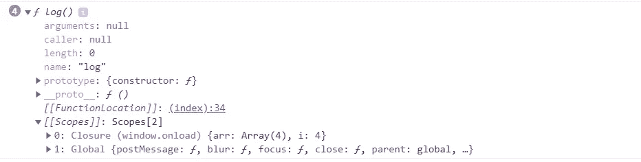
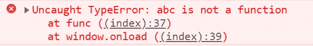
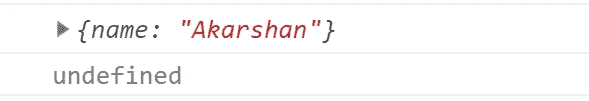

# 下次面试前要检查的 5 个棘手的 JavaScript 问题(第 1 部分)

> 原文：<https://javascript.plainenglish.io/5-tricky-javascript-problems-to-check-before-your-next-interview-part-1-60fdecaa59d6?source=collection_archive---------0----------------------->


Got you, JS!

# 我希望你们还没有因为一些从未见过的奇怪问题而搞砸面试。

JavaScript 是一种特殊的语言，它的一些设计缺陷给面试官带来了真正有趣的时光，也给面试者带来了一些令人毛骨悚然的时刻。所以为了创造那个异想天开的 ***【暴徒人生】*** 时刻出现在面试官面前，看看这些问题。

# 问题 1。for 循环内的 setTimeout

这个问题最初是在谷歌采访中提出的，现在许多公司已经开始就这个概念提出问题。看看这个问题。

```
const arr = [10, 12, 15, 21];
for (var i = 0; i < arr.length; i++) {
  setTimeout(function() {
    console.log('Index: ' + i + ', element: ' + arr[i]);
  }, 3000);
}
```

你认为输出是多少？

是这个吗？

```
*Index: 1, element: 10
Index: 2, element: 12
Index: 3, element: 15
Index: 4, element: 21*
```

当然不是。这不可能那么明显，不是吗！！

输出实际上是这样的。

```
*Index: 4, element: undefined // printed 4 times*
```

这里出现异常是因为 JavaScript 作用域的怪异性质和一个叫做“闭包”的概念。如果您不熟悉这些概念，请查阅这篇文章。

[*https://medium . com/@ akarshanbansal/everything-you-need-know-the-JavaScript-scope-f 81 CBF fa 9491*](https://medium.com/@akarshanbansal/everything-you-need-to-know-about-the-javascript-scope-f81cbffa9491)

让我们来理解这个奇怪的输出背后的逻辑。在 JS 中，每当创建一个新函数时，也会形成一个闭包，该闭包使函数能够访问外部作用域。

我们在 setTimeout 中有一个匿名函数，其中将创建一个闭包，该闭包将允许函数从 for 循环中访问变量' ***i'*** 。该函数将被调用 4 次，因为循环中有 4 次迭代。但这里的问题是，这个函数会在 3000ms 后被调用，就像 setTimeout 的第二个参数中提到的那样。所以在执行这个函数的时候，变量' ***i'*** 已经递增到 4。

关键的区别在于，第一个函数调用只会发生在循环已经结束之后，这就是为什么我们看到' ***i'*** 的值为 4。

让我们稍微改造一下这个程序，以便我们可以在浏览器控制台中可视化它。

```
const arr = [10, 12, 15, 21];
for (var i = 0; i < arr.length; i++) {
 function log() {
  console.log('Index: ' + i + ', element: ' + arr[i]);
  }
  console.dir(log)
  setTimeout(log, 1000);
}
```

现在我们添加了一个命名函数 ***log*** 而不是一个匿名函数，这样我们就可以使用 ***console.dir*** 来检查它的作用域



可以非常清楚地看到，创建的闭包有' ***i'*** 的值为 4。

现在我们该如何解决这个问题呢？有两种方法可以做到这一点。

**首先是**，我们可以使用“ ***【生命】”*** 设计将循环中计数器的值绑定到方法中的一个局部变量。让我们看看我们能做些什么。

如果你以前没看过，请看看生活设计模式。你可以关注这篇关于这个主题的精彩文章。

[*https://medium . com/JavaScript-in-plain-English/https-medium-com-JavaScript-in-plain-English-stop-feeling-iffy-about-use-an-life-7b 0292 ABA 174*](https://medium.com/javascript-in-plain-english/https-medium-com-javascript-in-plain-english-stop-feeling-iffy-about-using-an-iife-7b0292aba174)

```
const arr = [10, 12, 15, 21];
for (var i = 0; i < arr.length; i++) {
  setTimeout((function() {
    console.log('Index: ' + i + ', element: ' + arr[i]);
  })(i), 3000);
}
```

因此，我们添加了一个带有计数器' ***i'*** 的 IIFE 作为参数，而不是一个匿名函数。因此，它将更新后的值存储为函数的参数。

**其次，**我们可以使用'***' let '***变量声明。

```
const arr = [10, 12, 15, 21];
for (let i = 0; i < arr.length; i++) {
  setTimeout(function() {
    console.log('Index: ' + i + ', element: ' + arr[i]);
  }, 3000);
}
```

为什么会这样？原因是' ***let'*** 是一个块范围的声明，它将为 for 循环的每次迭代创建一个新的变量绑定。所以在每次迭代中，一个带有更新值的新变量在内存中被创建。

我知道。我也没想到会这样。

# 问题 2。写一个函数 mul(x)(y)(z)把 x，y，z 相乘。

这个问题乍一看很吓人，但是如果你使用 JS 的函数式编程模式，你可以从一个函数返回一个函数。

这个问题有三组不同的论点。因此，我们需要 3 个独立的函数来消耗参数并完成工作。我们开始吧。

```
function mul(x) {
   return function(y) {
      return function(z) {
         return x*y*z;
      }
   }
}console.log(mul(2)(3)(4)); //output is 24
```

在看到解决方案后，我知道这似乎很容易。您可以将它用于 n 个单独的参数

# 问题 3。功能与可变提升。

看看这个程序

```
function func() {
 abc = "Variable";
  function abc() {
    return("Function")
  }
  return abc();
}
console.log(func());
```

你认为答案是什么？不，它当然不是 ***“功能”。***

您实际上会得到以下错误



我知道。暂时不要拔掉你的头发。这其实和 JavaScript 中一个叫做提升的概念有关。JS 中有两种类型的吊装。可变提升和功能提升。

在变量提升中，只有变量声明，而不是变量定义/赋值，被移动到作用域链的顶端。

在函数提升中，函数声明和定义都被移动到作用域链的顶端。

我建议您在继续之前详细阅读提升的概念。看看这篇关于概念的伟大文章:[**JavaScript 中的提升是什么？**](https://medium.com/javascript-in-plain-english/https-medium-com-javascript-in-plain-english-what-is-hoisting-in-javascript-a63c1b2267a1)

现在，在这种情况下，变量和函数具有相同的名称。当这种情况发生时，函数将被提升到顶部，变量提升被忽略。因此，当 return 语句执行时，它将返回紧接在它前面的变量定义。

这是程序提升后的样子。

```
function func() {
  function abc() {
    return("Function")
  }
  abc = "Variable";
  return abc();
}
console.log(func());
```

我希望这能澄清一切，而且你现在还没有秃顶。

# 问题 4。分号偏差

参见下面的程序

```
function func1() {
  return {
    name: "Akarshan"
  };
}function func2() {
  return
  {
    name: "Akarshan"
  };
}console.log(func1())
console.log(func2())
```

理想情况下，这两个函数应该返回完全相同的东西，但是当然，它们没有。这就是为什么我们在讨论这个问题。

输出实际上是这样的



这是因为在 JavaScript 中，分号**是可选的**，JavaScript 会在需要时自动在行尾插入一个分号。所以在第二种情况下，花括号被添加到下一行，JavaScript 自动在 return 语句的末尾添加一个分号，因此，第二个函数中的值是' ***【未定义】'*** 。

# 问题 5。事件循环和调用堆栈

查看以下程序

```
console.log("1")setTimeout(function() {
 console.log("2")
}, 0)console.log("3")
```

输出不是 1，2，3，而是 1，3，2。

这个问题是基于我们的浏览器如何处理异步和同步操作。

通常，同步功能在浏览器的事件循环中执行。但是任何时候，浏览器遇到一个异步函数，它就会被添加到调用堆栈中。调用堆栈会一直等待，直到可以将函数推送到要执行的事件循环。这只有在事件循环为空时才会发生。

在我们的例子中，即使 setTimeout 被设置为 0，该函数本质上是异步的，因此被添加到调用堆栈中。事件循环直到打印出***“3”***才为空。只有在这之后，调用栈才会在事件循环中推送函数，并打印出***【2】***。

如果您想详细了解这个概念，请查看 JavaScript 并发模型。

我希望我已经帮助了你们中的一些有需要的人，也希望我能看到一些新的*“在……开始一个新的职位”*在我的 Linkedin Feed 上。我将在第二部分贴出一些更有趣的问题。在那之前。再见。