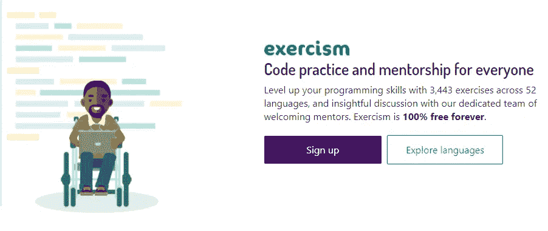
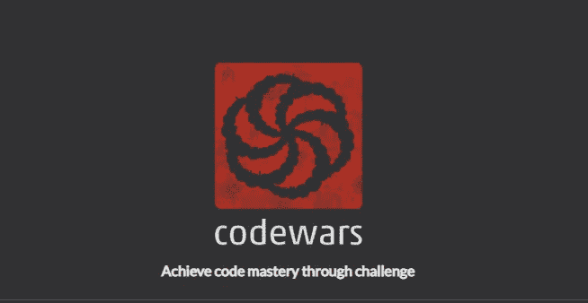
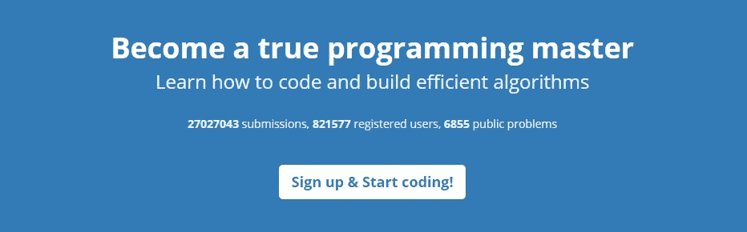

# 针对初学者的 5 个有用的编码挑战网站

> 原文：<https://javascript.plainenglish.io/5-useful-coding-challenge-websites-for-beginners-b974be3474d7?source=collection_archive---------2----------------------->

## 惊人的平台，帮助您练习和提高编码技能

Photo by [Danial RiCaRoS](https://unsplash.com/@ricaros?utm_source=medium&utm_medium=referral) on [Unsplash](https://unsplash.com?utm_source=medium&utm_medium=referral)

# 介绍

解决问题是成为更好的开发人员的最好方法。这就是编程的全部，您需要解决问题和编码挑战，以便更好地编码。这可以帮助你提高逻辑技能，为工作面试做好准备，等等。

在本文中，我们将向您展示一些有用的编码挑战网站，以帮助您更好地进行编程。让我们开始吧。

# 1.锻炼 m

operation m 是卡特里娜欧文(Katrina Owen)和杰里米沃克(Jeremy Walker)于 2013 年创建的一个在线编码平台。它有超过 3400 个不同语言的练习，免费提供给用户。

在您提交问题的可行解决方案后，operation m 还为解决方案讨论提供了导师。截至目前，锻炼管理系统在 200 多个国家有 330，000 多名用户，使用 50 种编程语言，并提交了 140 万个解决方案。

[Exercism](https://exercism.io/).

如果你感兴趣，这是[平台](https://exercism.io/)。

# 2.CodeWars

CodeWars 是一个设计合理的平台，个人通过协作来制造障碍。有两组人让它发挥作用:授权*武士刀*学习不同技术的*程序员*，通过告知他人的服务修正*武士刀*，并给予积极回应。那么*的领导者*肯定会在内容和面积上有所节制。

[CodeWars](https://www.codewars.com/).

如果您感兴趣，可以查看[网站](https://www.codewars.com/)。

# 3.平台` programmr '

平台`Programmr`是发现和练习编码的好地方。他们认为最有效的方法是在自己的地方自学。自学是进步的关键。

该平台声称是全球理想的编码模拟器，在这里您可以编写代码并运行各种程序，可以被认为是初学者最好的编码网站。

[Programmer](http://www.programmr.com/).

如果您感兴趣，可以在这里查看[。](http://www.programmr.com/)

# 4.TopCoder 挑战

TopCoder 是一个有竞争力的程序平台。它提供了一系列数学挑战，你可以用你自己的代码编辑器来应对。除了在网站上运行，还有不断的挑战。如果你愿意，你可以一直参与进来。

[Topcoder](https://www.topcoder.com/).

您可以在这里查看[。](https://www.topcoder.com/)

# 5.SPOJ 平台

SPOJ 平台基于在线评判系统，用户提交程序进行自动评估。它有 45 种不同的编程语言，超过 13000 个任务。截至目前，SPOJ 拥有大约 814，000 名注册用户、6835 个公共问题和超过 260 万条提交内容。

[SPOJ](https://www.spoj.com/).

这里是[链接](https://www.spoj.com/)如果你想去看看的话。

# 结论

还有更多其他平台可以帮助你提高和练习你的编码技能。不过上面的网站还是很有用的，尤其是对于新手来说。你可以试试任何适合你的人，他们都很棒。

感谢您阅读本文，希望您觉得有用。

# 更多阅读

*你可能也喜欢:*

 [## Web 应用程序开发中的 5 个挑战- Galaxy Weblinks

### 网络应用在互联网上无处不在！每次你发邮件、网上购物或浏览你的社交网站…

blog.galaxyweblinks.com](https://blog.galaxyweblinks.com/5-challenges-in-web-application-development/)  [## 你应该知道的 5 个惊人的前端开发工具

### 每个开发人员都应该知道的有用的前端开发工具

medium.com](https://medium.com/javascript-in-plain-english/5-amazing-front-end-development-tools-that-you-should-know-7372dc377d7)