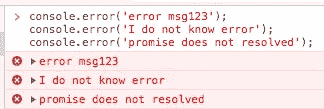
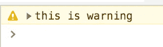
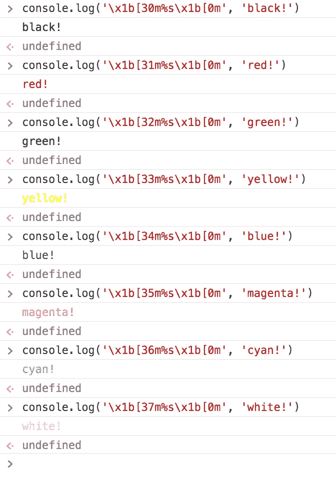
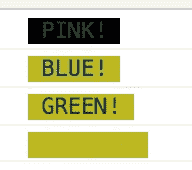
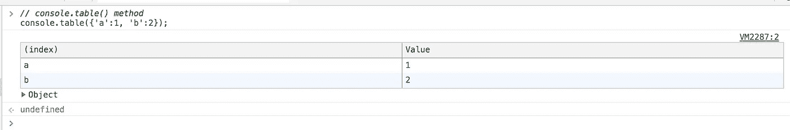

# 5 种有用的节点控制台方法

> 原文：<https://javascript.plainenglish.io/5-useful-node-console-methods-9c4f937ca987?source=collection_archive---------5----------------------->


# 1.控制台。时间和控制台。时间结束

*用同一标签*测量 `*console.time(label)*` *&* `*console.timeEnd(label)*`之间的运行时间

```
timer1: 3.558mstimer2: 22.398mstimer3: 26.962ms
```

# 2.console.error(“错误内容”)

*   *在控制台*显示错误
*   将错误内容作为参数
*   有一个默认的红色，在错误内容前面有一个 X 标记

*在浏览器控制台*上运行时



**同样地，**

**控制台. warn**

*   黄色背景



# 3.console.trace(“标签”)

*   它追溯**错误**发生的地方。通常，错误发生时会显示错误位置，但 **console.trace** 在未显示错误位置时非常有用
*   它以相反的顺序打印操作顺序

(即 **onClick** 触发器→**a)(**触发器→**b)(**)

```
**has an output of** index.html:19 ERROR CODE error tracing **// ERROR LABEL****// Order of Operation in reverse order b <-- a <-- onClick** b @ index.html:19 
a @ index.html:22
onclick @ index.html:10
```

# 4.给输出涂上颜色

*   有两种方法可以为控制台赋予颜色

1.  使用退出序列
2.  Css 样式

## >第一:退出序列

*   可以使用 escape 序列为控制台中的文本输出着色。转义序列是标识颜色的一组字符

**8 COLORS**

```
**BLACK:** \u001b[30m
**RED:** \u001b[31m
**GREEN:** \u001b[32m
**YELLOW:** \u001b[33m
**BLUE:** \u001b[34m
**MAGENTA:** \u001b[35m
**CYAN:** \u001b[36m
**WHITE:** \u001b[37m
```



> 你能看出规律吗？

30 … 31 … 32 … 37

## >第二:CSS 样式

*   为 FrontEnd 开发人员提供控制台颜色的更直观的方法是简单地为控制台方法提供 CSS 样式



# 5.console.table()

*   你也可以用`console.table()`做一张桌子

```
console.table({'a':1, 'b':2});
```



> HAPPY CODING！


Photo by [Chris Ried](https://unsplash.com/@cdr6934?utm_source=medium&utm_medium=referral) on [Unsplash](https://unsplash.com?utm_source=medium&utm_medium=referral)

**来自 JavaScript 的说明简单来说:**我们一直都有兴趣帮助推广高质量的内容。如果你有一篇文章想用简单的英语提交给 JavaScript，请发一封电子邮件到[submissions@javascriptinplainenglish.com](mailto:submissions@javascriptinplainenglish.com)用你的中号用户名，我们会把你作为一个作者加入。