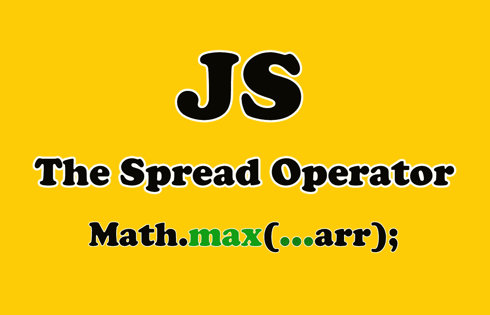

# JavaScript 中 Spread 操作符可以做的 5 件有用的事情

> 原文：<https://javascript.plainenglish.io/5-useful-things-the-spread-operator-can-do-in-javascript-f0306358bc9c?source=collection_archive---------2----------------------->

## 用 Spread 操作符编写一个更好更干净的 JavaScript 代码

Image Created with ❤️️ By Mehdi Aoussiad.

# 介绍

spread 操作符是 JavaScript 中添加的重要且有用的特性之一。它基本上传播或扩展了 JavaScript 中可迭代对象的值。它还允许我们在需要多个参数或元素的地方扩展数组和其他表达式。在很多情况下，spread 操作符对于以简单的方式编写更好、更简洁的 JavaScript 代码非常有用。

在这篇短文中，我们将探索 JavaScript 中 spread 操作符`**{…}**` 的一些用例。

Photo by [Zan](https://unsplash.com/@zanilic?utm_source=medium&utm_medium=referral) on [Unsplash](https://unsplash.com?utm_source=medium&utm_medium=referral)

那么，我们开始吧。

# 1.组合两个对象

我们可以使用 JavaScript 中的 spread 操作符合并两个对象。看看下面的例子:

Merge Two Objects.

在这里，`**employee**`和`**salary**`对象被合并在一起，这产生了一个具有合并的键值对的新对象。

# 2.组合数组

spread 运算符的另一个优点是能够组合数组，或者将一个数组中的所有元素插入到另一个数组中的任意索引处。

Spread 语法使下面的操作变得非常简单:

Combine Arrays.

使用扩展操作符`**{…}**`，我们以一种简单的方式实现了我们想要的。如果我们使用传统的方法，那将会更加复杂和冗长。

# 3.使用 Spread 运算符复制数组

我们还可以使用 spread 操作符将 JavaScript 中一个数组的内容复制到另一个数组中。你可以看看下面的例子:

Copying Arrays.

如您所见，我们已经使用 spread 操作符将`**arr1**`的所有内容复制到另一个数组`**arr2**`中。

# 4.获取数组的最大值

下面的 ES5 代码使用`**apply()**`来计算数组中的最大值:

Get the Maximum Value.

spread 操作符使得这个语法更容易阅读和维护。看看下面的例子:

Get the Maximum Value using the Spread Operator.

`**...arr**`返回一个解包的数组。换句话说，它*展开*数组。

# 5.将字符串转换为数组

我们可以使用 JavaScript 中的 spread 操作符将一个单词(字符串)拆分成一个字符数组。下面的示例将字符串转换为字符数组:

Convert String to Array.

有许多方法可以做到这一点，但是 spread 操作符通过一个简洁的 JavaScript 代码使它变得更容易。

# 结论

spread 操作符是 JavaScript 中有用的特性之一。它易于使用，也保持我们的代码干净，易于维护。

感谢您阅读本文，希望您觉得有用。

# 进一步阅读

 [## 你应该知道的 7 个初学 JavaScript 面试问题

### 7 个 JavaScript 面试问题及答案

medium.com](https://medium.com/javascript-in-plain-english/7-beginner-javascript-interview-questions-that-you-should-know-54fc3e15abf9)