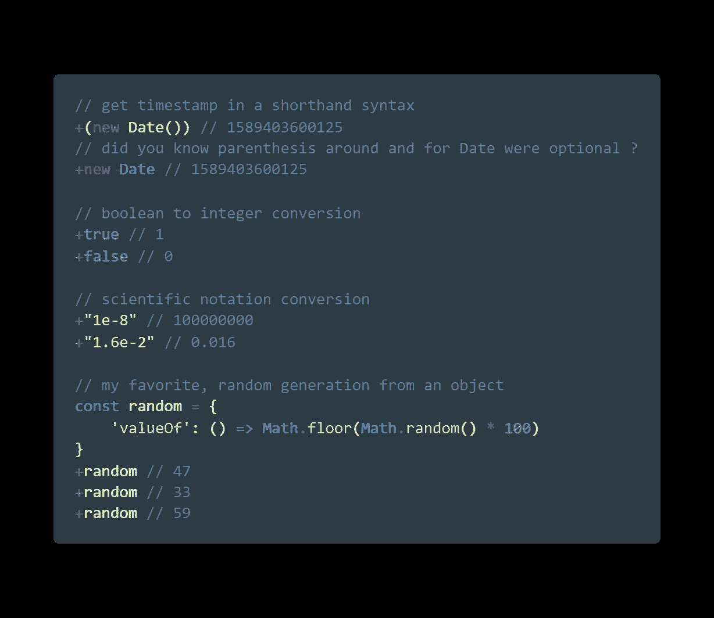
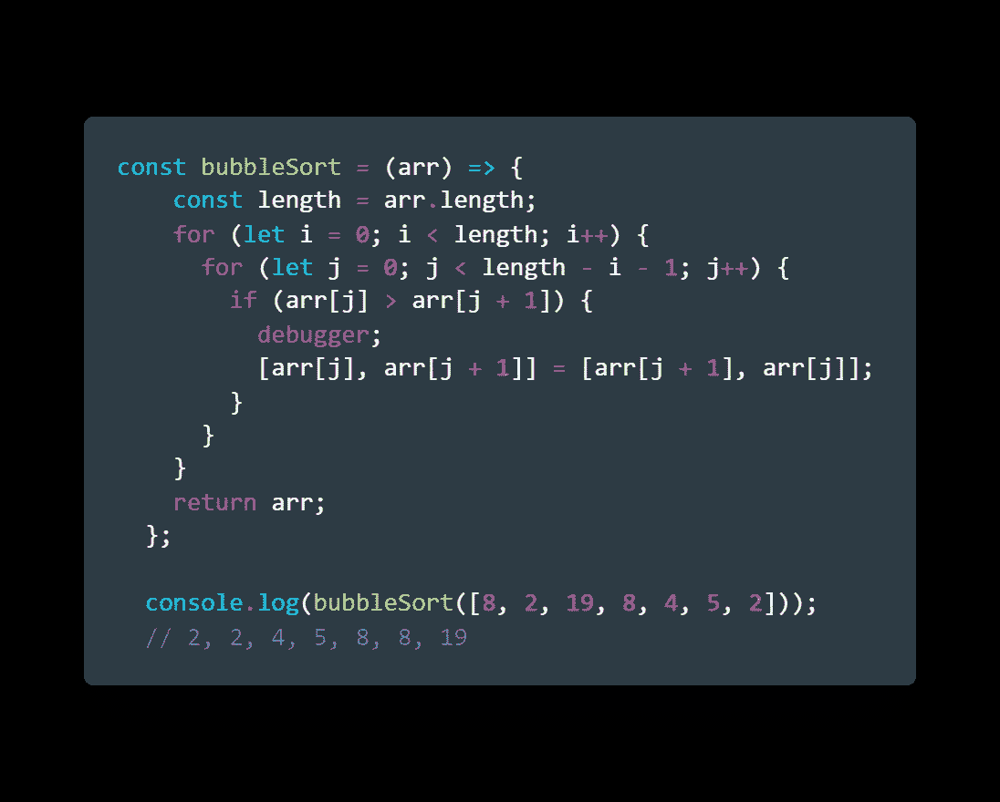
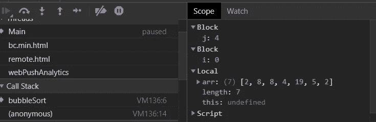
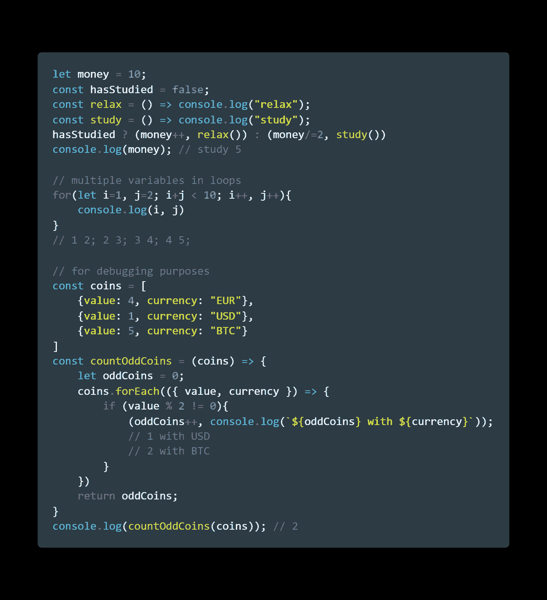
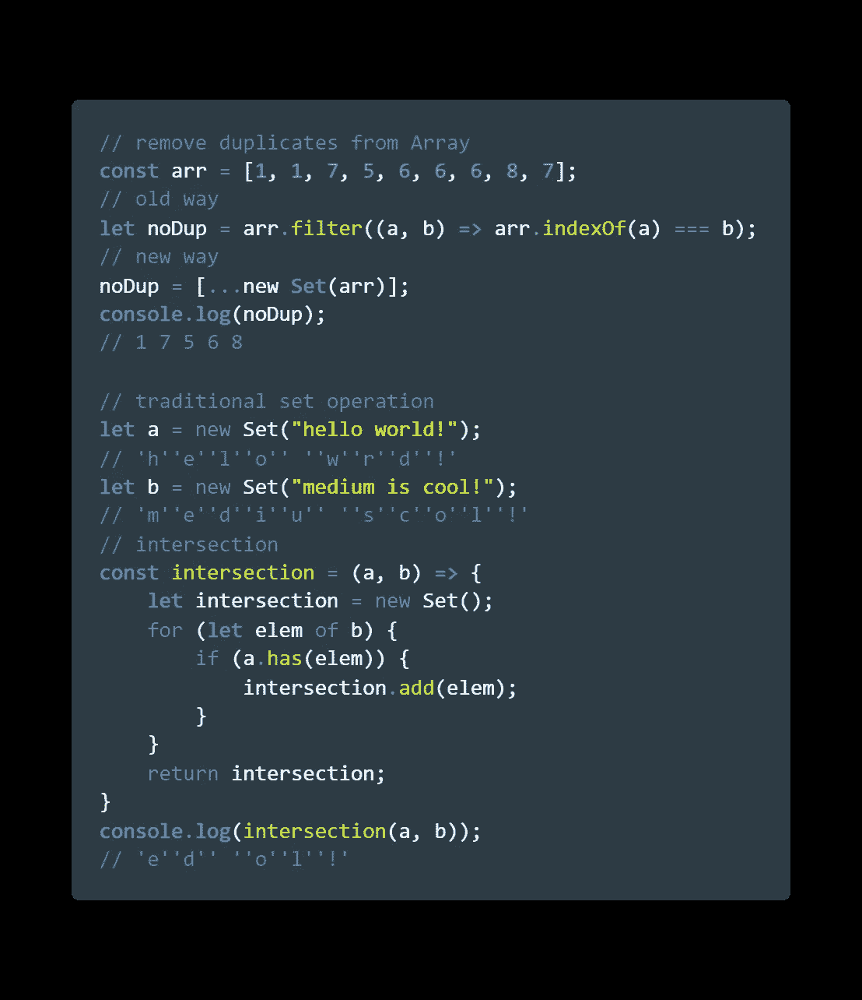
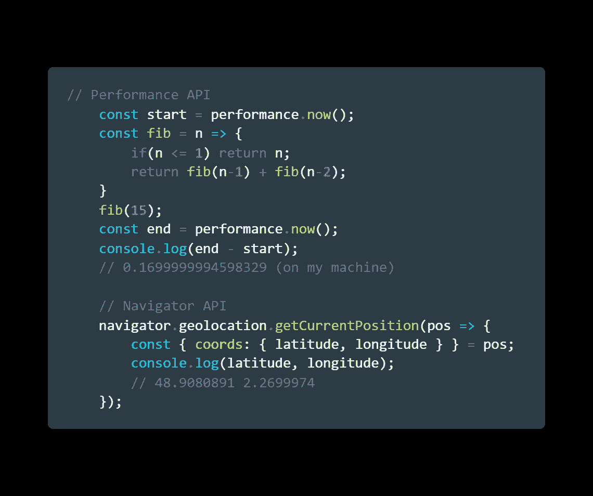

# JavaScript 对你隐藏的 5 个有用的技巧

> 原文：<https://javascript.plainenglish.io/5-useful-tricks-javascript-has-been-hiding-from-you-b7fa38bd98d8?source=collection_archive---------1----------------------->

## JAVASCRIPT 技巧

## 可能对你有益的小指南

Photo by [Alfons Morales](https://unsplash.com/@alfonsmc10?utm_source=medium&utm_medium=referral) on [Unsplash](https://unsplash.com?utm_source=medium&utm_medium=referral)

Javascript 是全球最常用的语言之一。现在比以往任何时候，有了像 [Node](https://nodejs.org/en/) 这样的框架，或者甚至是它自己，它基本上无处不在。

我记得我的一个老师甚至说:

> 我们正在见证 JavaScript 统治世界🌎

光速在不同系统间传播的矛盾之处在于，它仍然有一些*“可疑的”*特征。

我们都知道返回`"object"`的`typeof null`，即使 null 应该是一个[原始类型](https://2ality.com/2013/10/typeof-null.html)。

所以这里有 5 个鲜为人知的功能，我发现它们对一些特定的场景很有用。我们走吧💪🏻

# 1 -+运算符

> 什么？+运算符？我从一年级就知道了

是的，当然，但这里不是关于*算术*运算符:

`const four = 2 + 2;`

它还有另一个用途，可以看作是*“将给定的表达式转换成数字”，*但也可能揭示其他有趣的用例:

即使这些结果可以用`Number()`构造函数获得，在某些情况下，用`+`操作符似乎感觉要干净得多。

*💡对于最后一个例子，我们覆盖了* `*random*` *对象的* `*valueOf()*` *方法，并且* `*+*` *操作符通过将它转换为* `*Number*`来“获取”它的值

# 2-调试器语句

> 等等，我不能自己调试吗？

当然可以！实际上，有很多方法可以调试 JavaScript 应用程序。🕷️

有了附加到`console`对象的不同方法，您可以定制大多数日志记录语句。

但是我发现了一种非常不同的方法，这种方法并不为人所知，那就是使用`debugger`语句

对于基于浏览器的 JS 应用程序，它提供了一种快速简单的方法来放置断点，并快速访问强大的开发人员工具:

正如我所说的，这可能不是处理某些应用程序调试的最佳方式，但我认为演示这个*“隐藏”*特性很有趣。

*💡您还可以通过传递* `*--inspect*` *标志并远程连接到您的会话来为您的节点脚本启用它。然而，我建议为 NodeJS 应用程序附加 IDE 调试器，这样会更干净。*

# 3-逗号运算符

> 嗯..什么？

让我澄清一下。

我说的不是我们在类似于`const arr = [2, 7, 4, 8]`的容器中看到的用于分隔对象或元素的逗号**分隔符**

在表达式`const a = (2, 3)`中，逗号运算符允许对括号中的整个表达式求值，让我们来看一些有趣的例子:

基本上，这个操作符在左操作数和右操作数之间执行 and `&&`和`||`，因为它执行这两个操作数，而不考虑它们的状态。

*💡如果您仍然对它的用法感到困惑，请这样想:它允许您在 JavaScript 需要一个表达式的地方计算多个表达式。这可能是为了呈现更优雅的代码，或者更容易调试。*

# 4-设置对象

> 这个我 100%确定你已经听说过了

它是在 ES6 中引入的[，如果你熟悉 Python 的`set()`，它基本上是你所期望的那种类型的对象](http://es6-features.org/)

在各种情况下，它可能会派上用场:

关于这个数据结构还有很多需要了解的，你可以从这里开始。

*💡你可以在* [*MDN 网站*](https://developer.mozilla.org/en-US/docs/Web/JavaScript/Reference/Global_Objects/Set) *上找到其他各种设置操作，或者你也可以自己实现！*

# 5-导航器和性能 API

> 别担心，没有钥匙或访问令牌！

事实上，这有点特殊，因为浏览器中有两个可用的 Web APIs。🌐

> Web APIs 通常与 JavaScript 一起使用，尽管并不总是如此。

我想强调一下我在 JavaScript 项目中广泛使用的两个 Web API:

> *💡这些只是你能在网上找到的众多 web APIs 中的两个！随意* [*在这里*](https://developer.mozilla.org/en-US/docs/Web/API) *探索它们。*

最后，这里有一个包含 ***可执行代码*** 的要点:

今天到此为止，伙计们！你可以随时发邮件给我**联系我*[***Linkedin***](https://www.linkedin.com/in/alexandre-zajac/)*或者访问我的 [***GitHub 项目***](https://github.com/alexZajac) 。****

****

**JavaScript 黑客快乐！👨🏻‍💻**

## ****简明英语团队的笔记****

**你知道我们有四种出版物吗？给他们一个 follow 来表达爱意:[**JavaScript in Plain English**](https://medium.com/javascript-in-plain-english)[**AI in Plain English**](https://medium.com/ai-in-plain-english)[**UX in Plain English**](https://medium.com/ux-in-plain-english)[**Python in Plain English**](https://medium.com/python-in-plain-english)**—谢谢，继续学习！我们还推出了一个 YouTube，希望你能通过 [**订阅我们的简明英语频道**](https://www.youtube.com/channel/UCtipWUghju290NWcn8jhyAw) 来支持我们****

****一如既往,“简明英语”希望帮助推广好的内容。如果您有一篇文章想要提交给我们的任何出版物，请发送电子邮件至[**submissions @ plain English . io**](mailto:submissions@plainenglish.io)**，并附上您的媒体用户名和您感兴趣的内容，我们将会回复您！******