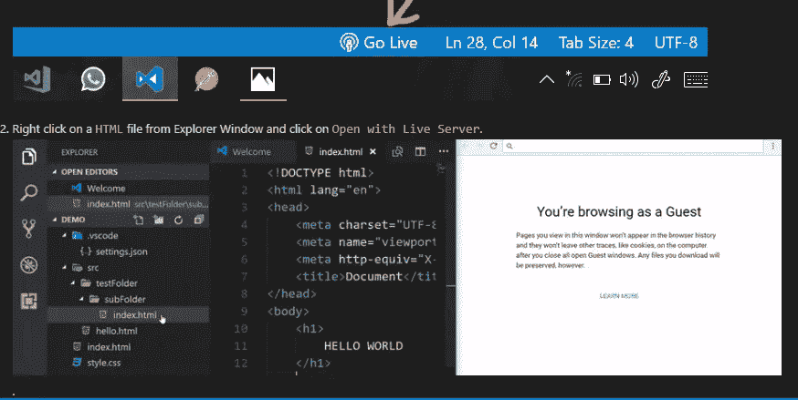
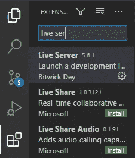
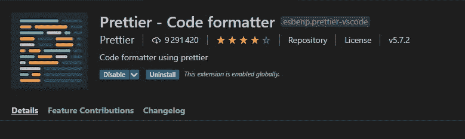
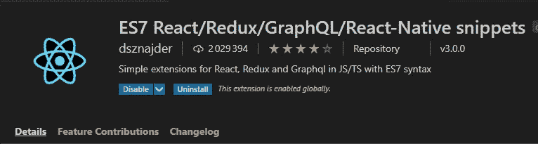
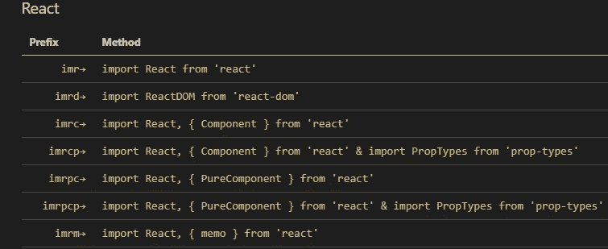
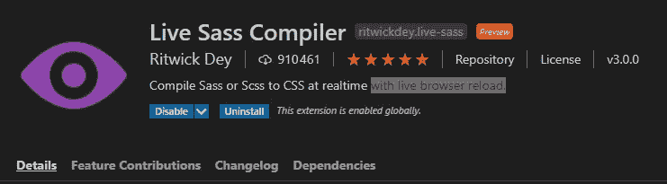
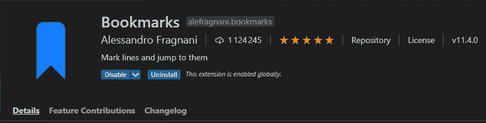
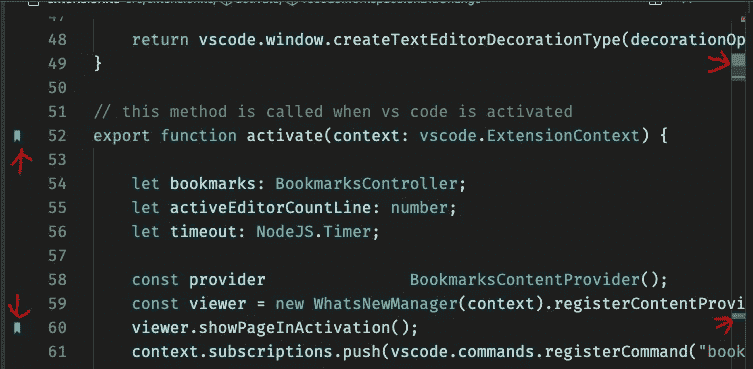

# 每个 Web 开发人员都应该拥有的 5 个 Visual Studio 代码扩展

> 原文：<https://javascript.plainenglish.io/5-visual-studio-code-extensions-that-every-web-developer-should-have-9326fcc42d2a?source=collection_archive---------4----------------------->

## 5 个有用的扩展来提高你的编码速度

Photo by [ThisisEngineering RAEng](https://unsplash.com/@thisisengineering?utm_source=medium&utm_medium=referral) on [Unsplash](https://unsplash.com?utm_source=medium&utm_medium=referral)

# 介绍

Visual studio 代码是您可以使用的最好的文本编辑器之一，尤其是在 web 开发中。它为开发者提供了一个很棒的开发界面，并提供了很多有用的功能。因此，这使得它成为世界上排名第一的编码文本编辑器。VS Code 也有很多由其他开发人员创建的有用的扩展，使开发过程变得更加容易。

在本文中，我们将发现一些有用的 VS 代码扩展，每个 web 开发人员都应该拥有。让我们开始吧。

Image Created with ❤ ️️By [Mehdi Aoussiad](https://mehdiouss315.medium.com/).

# 1.实时服务器

live server 是每个开发人员都应该拥有的 visual studio 代码扩展之一。它有超过 800 万次下载，并允许您启动一个开发本地服务器，具有静态和动态页面的实时重新加载功能。当您希望看到网页的更改，而不必在每次更改代码时都刷新网页时，这很有用。

Live Server.

您可以通过在 VS 代码中的 extensions 按钮上搜索来安装这个扩展。就像我们在下面的例子中所做的那样，同样的事情也适用于任何其他的扩展。

Searching for the extension.

# 2.较美丽

漂亮是对 VS 代码中代码格式化的一个很好的扩展。它有超过 900 万次的下载，它通过解析你的代码并根据自己的规则重新打印来强制执行一致的风格，这些规则考虑了最大行长度，并在必要时包装代码。

Prettier.

有兴趣可以去查一下他们的 [Github 库](https://github.com/prettier/prettier-vscode)。

# 3.ES7 React/Redux/React-Native/JS 片段

如果你是 React 的粉丝，这将是一个非常有用的扩展。它是为 JavaScript 或带有 ES7 语法的 TypeScript 中的 React、Redux 和 Graphql 而设计的。

这个扩展有超过 200 万的下载量，它为 VS 代码提供了很多有用的片段。

Snippets.

该扩展有许多命令，您需要知道这些命令才能生成您正在寻找的代码。

Snippets.

有兴趣可以去他们的 [Github 资源库](https://github.com/dsznajder/vscode-es7-javascript-react-snippets)看看。

# 4.实时 Sass 编译器

Live Sass 也是一个很棒的扩展，它有超过 900，000 次下载。它将你所有的 Sass 或 Scss 文件编译成普通的 css，并在浏览器中实时重载。

此扩展依赖于 live 服务器扩展来重新加载 Live 浏览器。

Live Sass Compiler.

如果你想看的话，这里是他们的 [Github 库](https://github.com/ritwickdey/vscode-live-sass-compiler)。

# 5.书签

书签是一个很棒的 VS 代码扩展，它允许你在代码中标记行并跳转到它们。

这个扩展有超过 100 万次下载。当你在大型项目中工作时，它是一个巨大的救命稻草，因为它让你不用在 1000 行的文件中滚动和搜索一段代码。

Bookmarks.

Bookmarks.

有兴趣可以去 Github 上查看他们的[资源库](https://github.com/alefragnani/vscode-bookmarks)。

# 结论

如您所见，visual studio 代码编辑器有许多有用的扩展，开发人员可以使用并利用它们。这将提高你的编码速度，帮助你更有效率。

感谢您阅读本文，希望您觉得有用。如果有，通过 [**订阅获取更多类似内容解码，我们的 YouTube 频道**](https://www.youtube.com/channel/UCtipWUghju290NWcn8jhyAw?sub_confirmation=true) **！**

# 进一步阅读

 [## 每个 Web 开发人员都应该知道的五大 Github 库

### 面向 web 开发人员的 5 个出色的 Github 存储库

medium.com](https://medium.com/javascript-in-plain-english/top-5-github-repositories-every-web-developer-should-know-d2feb3fdc214)