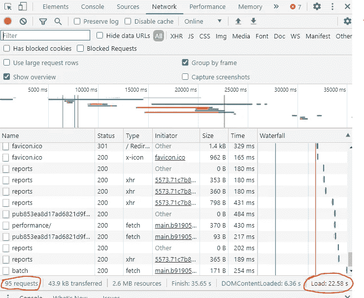

# 提高网页性能的 5 种方法

> 原文：<https://javascript.plainenglish.io/5-ways-to-improve-your-web-page-performance-1af1f57175bb?source=collection_archive---------8----------------------->

## 提高网页性能的 5 个有用技巧


Photo by [Nicole Wolf](https://unsplash.com/@joeel56?utm_source=medium&utm_medium=referral) on [Unsplash](https://unsplash.com?utm_source=medium&utm_medium=referral)

# 介绍

大多数网站所有者认为在他们的网页上有很多令人敬畏的效果将会得到最多的顾客。但是那些额外的功能(动画等)只有在用户不需要等待 10 秒来加载网站的情况下才是好的。优化你的网页性能是改善用户体验的一个好方法，但是一个快速的网站是有牺牲的。Web 性能优化是一项永无止境的工作。

在这篇文章中，我们将讨论一些有用的方法来提高您的网页性能。但是首先，让我们看看如何使用浏览器中的开发工具来跟踪我们的网站性能。

# 跟踪网站性能

您可以通过在浏览器中打开开发者工具来跟踪网站的性能(在 Chrome 中按 F12)。之后，转到网络选项卡，然后在您的网站上重新加载一个页面。您将会看到如下所示的一些结果:



Web Page Performance.

正如您在这种情况下所看到的，web 页面花费了 22.85 秒和 95 次请求来加载页面的全部内容。这是一个很长的加载时间，用户不喜欢等待太久。但是我们可以通过下面的技巧来提高性能。

# 1.捆绑和缩小

提高网页性能最流行的方法之一是捆绑和缩小你的文件(JS-CSS 等)。这有助于减小文件的大小。您可以通过使用 Webpack 或 package 这样的网络捆绑器来实现这一点。网络捆绑器使捆绑和缩小你的文件变得更加容易。

如果是你第一次听说 bundlers，我强烈推荐使用 package，因为它简单易用，不需要任何配置。如果你感兴趣，我写了一篇关于它的文章。

[](https://medium.com/javascript-in-plain-english/parcel-the-zero-configuration-webpack-alternative-1bcd6704ab9f) [## 包裹——零配置网络包替代方案

### 为您的项目开始使用超级简单的 JavaScript Bundler

medium.com](https://medium.com/javascript-in-plain-english/parcel-the-zero-configuration-webpack-alternative-1bcd6704ab9f) 

# 2.缩小图像尺寸

您可以通过减小页面上图像的大小来加快网站的运行速度。大多数图像都可以优化和缩小，有一些有用的工具可以帮助缩小和减少它们的大小。

最后，如果你的页面很长，有很多图片，你可以考虑延迟加载图片。这意味着，只要我们滚动页面，图像只有在屏幕上可见时才会加载。你可以通过一些库或者仅仅通过使用交叉点观察器 API 来实现。

[](https://mehdiouss315.medium.com/exploring-the-intersection-observer-api-in-javascript-d1e80d6b97c4) [## 探索 JavaScript 中的交叉点观察器 API

### 通过实例了解交叉口观察者

mehdiouss315.medium.com](https://mehdiouss315.medium.com/exploring-the-intersection-observer-api-in-javascript-d1e80d6b97c4) 

# 3.缓存和内容交付网络

提高性能的方法之一是利用内容交付网络(CDN)。你的网站上有一些不变的静态文件，比如 JavaScript、CSS 和图像文件。

您可以通过将这些文件缓存在离用户所在地更近的服务器上来提高网站的性能。这有助于减轻服务器的流量，加快网站的加载速度。您可以使用一些工具，如 Cloudflare，这很容易设置。

# 4.延迟您的 JavaScript 加载

将脚本放在页面底部可以让浏览器先加载页面。另一种方法是在脚本标签中使用`**defer="true"**`。defer 属性指定脚本应该在页面完成解析后执行，但是它只对外部脚本有效。你所要做的就是把下面的脚本放到你的 HTML 的 head 标签里。

```
<script src="fileName.js" defer="true"></script>
```

这个技巧有助于减少同时加载许多文件的压力，这种压力会影响网站的性能。

# 5.异步加载 JavaScript

提高性能的另一个技巧是异步加载 JavaScript 代码。如今，大多数网站都集成了一些第三方内容，如社交媒体、聊天功能、评论服务等等。因此，在这种情况下，您必须异步加载 JavaScript，这意味着您的代码不应该等待一个任务完成后再转移到另一个任务。它必须同时(异步)执行许多任务，因为这将有助于加快页面加载速度，提高性能，从而改善用户体验。

# 结论

提高性能不是一件容易的事情。随着您继续对网页进行更改，其使用和性能也将发生变化。所以你必须牺牲你的时间和精力来改善它。

感谢您阅读本文，希望您觉得有用。