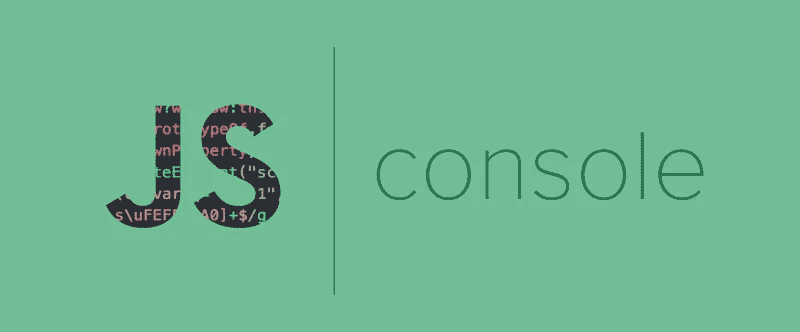
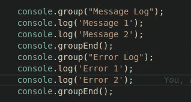
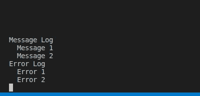
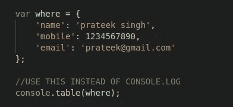
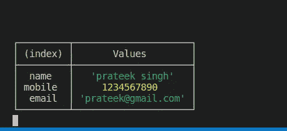
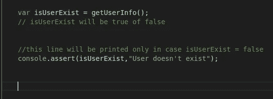
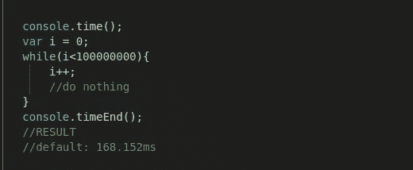
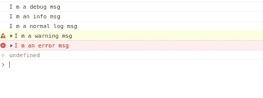

# 使用“控制台”对象的 5 种方法

> 原文：<https://javascript.plainenglish.io/5-ways-to-use-console-object-cd2553f5f718?source=collection_archive---------5----------------------->



Credits: [FreeCodeCamp](https://www.google.com/url?sa=i&url=https%3A%2F%2Fwww.freecodecamp.org%2Fnews%2Fhow-to-use-the-javascript-console-going-beyond-console-log-5128af9d573b%2F&psig=AOvVaw1NA2tV5g_OsqbYjORLvdOq&ust=1582206628273000&source=images&cd=vfe&ved=0CAMQjB1qFwoTCMj02Jfh3ecCFQAAAAAdAAAAABAF)

`console`对象让你可以访问浏览器的控制台。它允许您输出帮助调试代码的字符串、数组和对象。`console`是`window`对象的一部分，由[浏览器对象模型(BOM)](https://www.w3schools.com/js/js_window.asp) 提供。它在前端和后端都有效。我将告诉你一些使用这个对象的常用技巧和提示，它们可以提高你的编码技能。

# 控制台的分组线路

现在用`console.group()`以嵌套形式打印日志



Starts with **group()** & Ends with ***groupEnd()***



Result

# 以表格形式打印对象键值

现在，您可以通过以表格的形式打印来轻松读取这些值。



Where object with the user details



Result

# 仅打印“如果为假”

`console.assert()`帮助我们打印第一个参数为假的日志。



Print with condition

# **执行时间**

在`console.time()`的帮助下，我们可以计算代码块之间的执行时间。



it takes 168.152ms to execute while loop

# 使用不同的级别

在调试器、错误、信息等的帮助下，你可以将你的日志打印成不同的级别。

```
console.debug(‘I m a debug msg’);
console.info(‘I m an info msg’);
console.log(‘I m a normal log msg’);
console.warn(‘I m a warning msg’);
console.error(‘I m an error msg’);
```



Easy to differentiate

我希望你喜欢我们的控制台对象的这些功能。与你的朋友分享这些信息，让他们大吃一惊&关注我，了解更多有趣的编码技巧。

> 编码快乐！！