# 更快写出更简洁代码的 5 种方法

> 原文：<https://javascript.plainenglish.io/5-ways-to-write-cleaner-code-quicker-2c7d6b3617b9?source=collection_archive---------10----------------------->


Photo by [Sarah Dorweiler](https://unsplash.com/@sarahdorweiler?utm_source=unsplash&utm_medium=referral&utm_content=creditCopyText) on [Unsplash](https://unsplash.com/s/photos/clean?utm_source=unsplash&utm_medium=referral&utm_content=creditCopyText)

为了满足开发期限而偷工减料是很常见的。但它总会回来咬你。在某些时候，有人会发现你做了什么，并不得不通过谈判来解决这个问题。他们可能会花两个小时试图破译逻辑，或者，更常见的是，他们可能只是建立在上面，让别人来处理它。

项目就是这样消亡的。不是通过有意的破坏或一贯的滥用，而是一些捷径的演变。

不要指望最后期限会改变，不管它们有多不合理。利益相关者不关心你。找到快速编写干净代码的方法。

以下规则将对此有所帮助。

## **使用 TDD**


Photo by [Green Chameleon](https://unsplash.com/@craftedbygc?utm_source=unsplash&utm_medium=referral&utm_content=creditCopyText) on [Unsplash](https://unsplash.com/s/photos/test?utm_source=unsplash&utm_medium=referral&utm_content=creditCopyText)

TDD 代表*测试驱动开发。*这是一种在逻辑之前编写测试的方法。

考虑下面的函数伪代码。

```
if inputNumber = 0
  return inputNumber
else if inputNumber = 1
  return inputNumber * 2
else
  return inputNumber * 10
```

要使用 TDD 实现这一点，您首先要编写一个带有简单断言的简单测试。例如，我们可以看到，如果我们传递 0，这个函数应该返回 0，所以我们将编写如下测试(注意:我使用的是 JavaScript，但它适用于任何语言)。

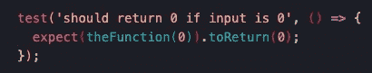

现在，您可以编写逻辑来通过测试。最简单的方法是让函数返回 0。

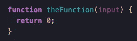

既然测试通过了，我们可以进行下一个断言，也就是说，如果输入为 1，函数应该返回 2，并为此编写一个测试。

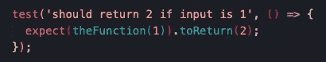

这是因为我们构建的逻辑只能通过第一个测试。因此，现在我们编写使两个测试一起通过所需的**最小代码**。

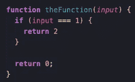

对最后一个断言重复前面的过程，其中函数应该返回任何其他乘以 10 的输入。为这样的东西编写两个或更多的断言来增加全面性是一个好主意。

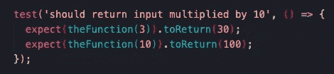

让它在不破坏其他测试的情况下再次通过。


完成了。

你会注意到我们改变了函数处理 0 值的方式。这是 TDD 的重要组成部分。每次你写代码通过另一个测试，你重构它。

TDD 几乎总是可以应用，实际上更适合比这更复杂的情况。

TDD:

*   确保你所有的逻辑都被覆盖，因为你只写通过测试所需要的东西
*   实际上是为你写逻辑，因为你把它分解成简单的、可管理的步骤，而不是试图一下子想出来
*   充当代码的清晰文档

这是快速编写干净代码的最好方法之一。

## *避免嵌套逻辑*


Photo by [Edvard Alexander Rølvaag](https://unsplash.com/@edvardr?utm_source=unsplash&utm_medium=referral&utm_content=creditCopyText) on [Unsplash](https://unsplash.com/s/photos/hierarchy?utm_source=unsplash&utm_medium=referral&utm_content=creditCopyText)

这里有一些计算裁员工资的函数的伪代码。

```
if employee's age < 20
  redundancyPay = 0
else
  if employeeRole = management
    redundancyPay = employeeTerm * (annualSalary * 0.05)
  else
    if employeeTerm <5
      redundancyPay = employeeTerm * (annualSalary * 0.02)
    else if employeeTerm > 10
      redundancyPay = employeeTerm * (annualSalary * 0.04)
    else
      redundancyPay = employeeTerm * (annualSalary * 0.03)
```

我们可以这样写。

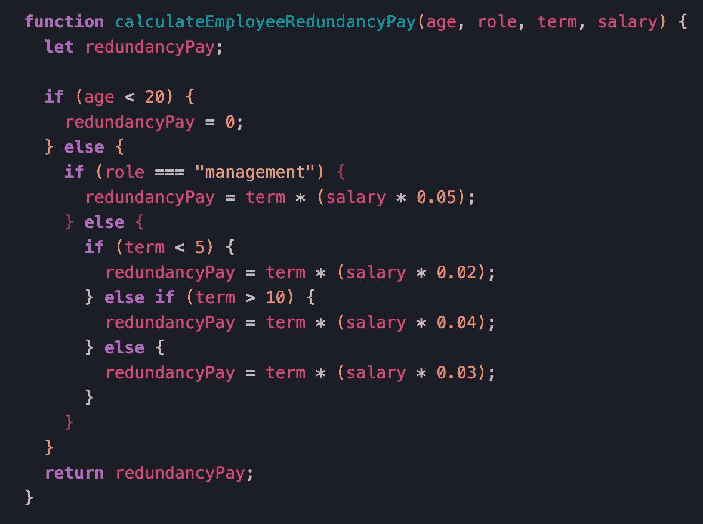

你可能见过这样的代码，公平地说，它读起来接近英语。也是一个比较简单的例子。但是想象一下更现实的代码，其中您可能必须混合 API 调用或更复杂的逻辑。你可以想象这很快会失去控制。

最好的解决方案是完全避免这样的代码，也就是说，在一个函数中提交一级嵌套。你把它分解成一个新的函数。考虑下面的重构代码。

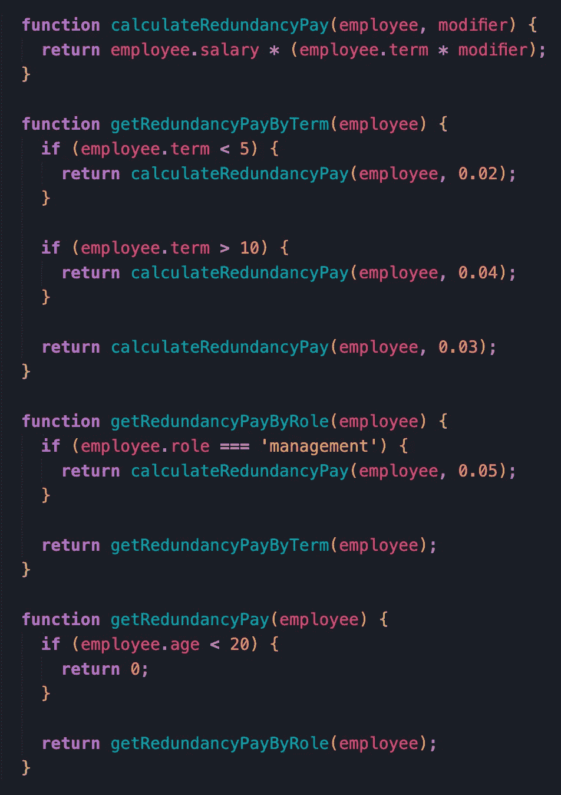

这段代码更简洁，也更容易理解。如果您从一开始就知道不希望有一层以上的嵌套，构思这段代码也不会比第一个示例花费更多的时间。您可以将所有这些函数封装在一个公开单个入口点的文件中。您还可以单独测试所有这些函数，这将使您的测试更简单，因为它们只处理逻辑的一个部分，而不是整个逻辑。

您可能会注意到，我将第一个示例中的四个参数压缩到了一个 employee 对象中。这就引出了下一条规则。

## *偏好一个参数一个责任的功能*


Photo by [Fabrizio Verrecchia](https://unsplash.com/@fabrizioverrecchia?utm_source=unsplash&utm_medium=referral&utm_content=creditCopyText) on [Unsplash](https://unsplash.com/s/photos/lonely?utm_source=unsplash&utm_medium=referral&utm_content=creditCopyText)

有多个参数的函数令人生畏。论点和复杂性之间通常也是正相关的。

有时你无法避免拥有多个参数。但是在大多数情况下，您可以执行以下一项或两项操作:

*   创建一个数据类型来封装相关参数
*   重新思考你的职能有多少职责

对于第一点，强类型语言非常好。一般来说，定义良好的自定义数据类型是使程序更容易理解和维护的可靠方法。但是，即使使用 Python 和 JavaScript 这样的语言，当数据相关时，您仍然应该更喜欢对象而不是单独的属性，因为这至少给数据作为一个整体贴上了标签，并帮助读者理解所有东西是如何组合在一起的。

但是，如果您的函数也做了过多的工作，那么将参数封装成一种数据类型并不是正确的方法。考虑下面的例子，我们从一些表单输入中构建一个雇员记录。

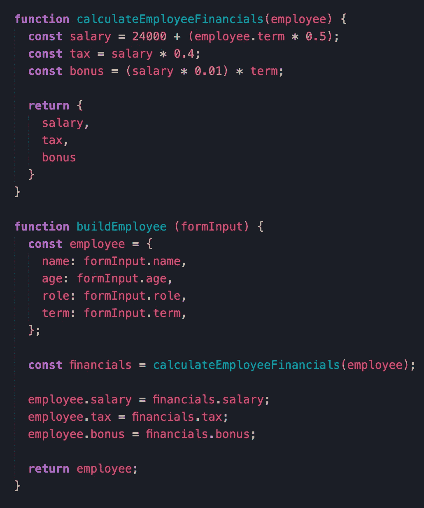

`calculateEmployeeFinancials`函数执行多项任务。你可能会说，从技术上来说，这是“计算财务”的单一职责，但它仍然可以进一步细分。一般来说，尽可能地分解你的功能是最佳的，如果你从一开始就有想法的话，这不会比选择更费力。它使你的代码更容易理解和测试。这里有一个重构的解决方案。

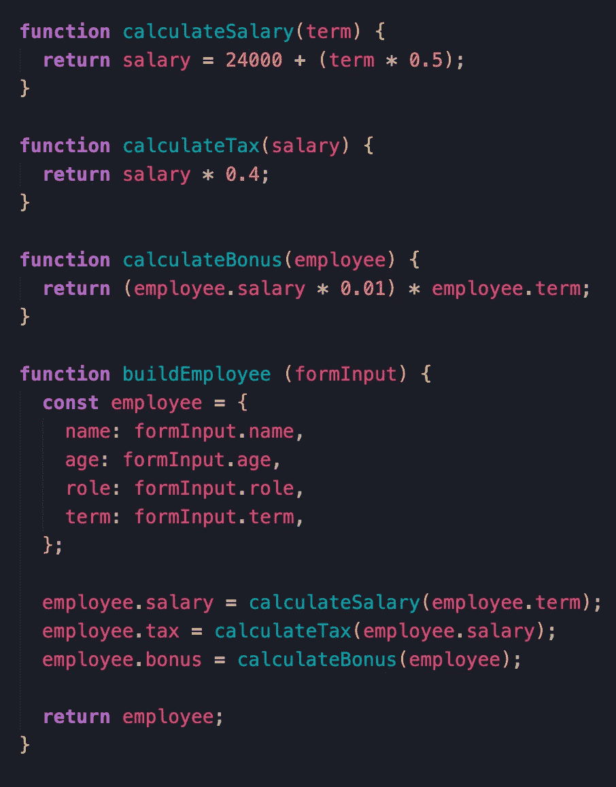

当有更复杂的事情发生时，这种技术会大放异彩，但即使在这里它也是有意义的。这些功能现在只有一个职责，很容易快速确定到底发生了什么。

`buildEmployee`函数也许也可以被分解，但是有时候你需要做一些更复杂的逻辑。想法是尽可能地分解它，然后像拼图一样把碎片拼在一起，构建更复杂的流程。

## *警惕花哨的工具*


Photo by [Obi Onyeador](https://unsplash.com/@thenewmalcolm?utm_source=unsplash&utm_medium=referral&utm_content=creditCopyText) on [Unsplash](https://unsplash.com/s/photos/fancy-tool?utm_source=unsplash&utm_medium=referral&utm_content=creditCopyText)

这个可能会有争议。大多数语言都有简洁的书写方式，但这种简洁往往是以清晰为代价的。考虑一下这个`if`语句。

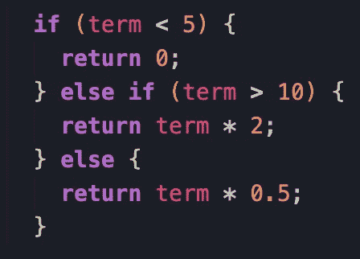

这段代码有 6 行，看起来有点笨拙。但它**是**清晰。现在，把它写成一个 JavaScript *三元表达式*。

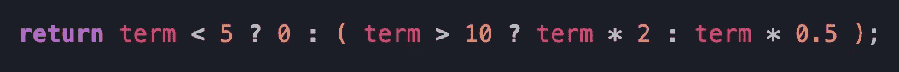

这只占了一行，看起来很花哨。但是真的不清楚。像这样的表达带来了一种认知负荷，这种负荷是常规的`if`语句所没有的。

学期并不坏。它们在非常简单的情况下也很有用，比如:

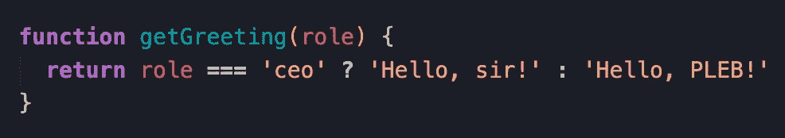

但如果比这更复杂，你就是在玩火。

## 赞成程序设计


Photo by [Maxime Guy](https://unsplash.com/@designus?utm_source=unsplash&utm_medium=referral&utm_content=creditCopyText) on [Unsplash](https://unsplash.com/s/photos/spider-web?utm_source=unsplash&utm_medium=referral&utm_content=creditCopyText)

自定义数据类型很棒，但是当你给它们附加行为时，它们就变成了对象。这就是事情变得复杂的时候。

对象是类的实例。类是属性和方法的集合。类可以拥有其他类的对象，这使得它们可以调用程序中其他对象的行为。这听起来已经很复杂了，但情况会变得更糟。

当你有一堆对象在你的程序中飞来飞去时，数据流开始看起来像蜘蛛网一样。一个对象可能向外调用另一个对象，然后该对象调用另一个对象，后者回调原始对象，后者调用另一个对象，后者修改另一个对象上的一些数据，结果创建一个对象，然后该对象启动并进行 HTTP 调用。诸如此类。

当你遇到这种情况时，就很难跟上程序的流程。调试包括试图想象迷宫中蜿蜒的虚拟路径。然后就是**继承。Eugh。**

过程编程没有这些问题。过程代码只是按清晰的顺序一步一步地运行。这并不意味着你不能调用其他函数，但是没有其他“实体”的概念，比如一个控制执行的对象或者其他什么。只是一步一步，一路走过来。它更容易理解，更容易阅读，也更容易调试。

这里有一个关于这个的很棒的[视频](https://www.youtube.com/watch?v=QM1iUe6IofM)。如果你是面向对象的爱好者，就不要看了。实际上也不会。

几乎每个项目都会受到交付期限的困扰。作为职业程序员的一部分就是理解这一点并注重实效。但是为了速度而牺牲质量的想法是有害的。每一个快捷方式都是你的应用程序基础上的另一个漏洞，有一天可能会把它推翻。在你编码的时候记住这些规则，你可以避免这种情况。