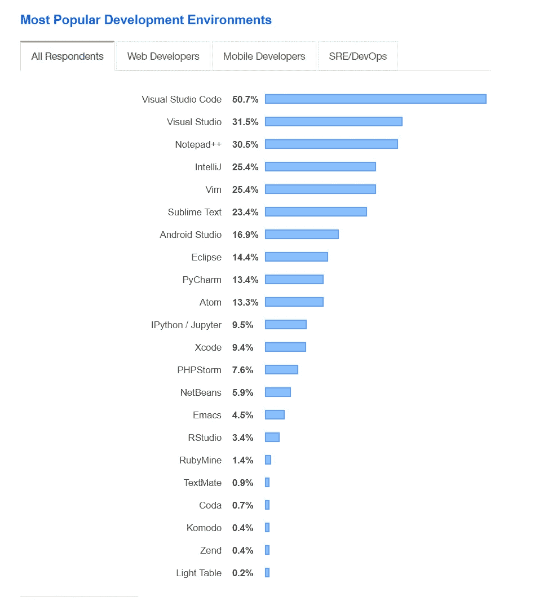
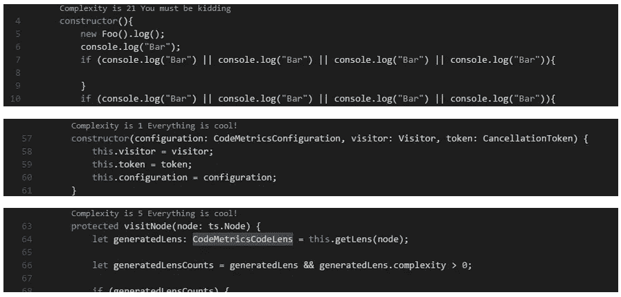
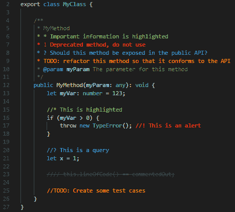
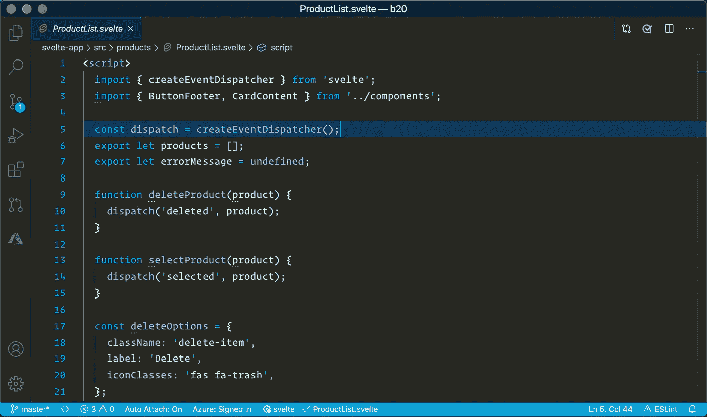
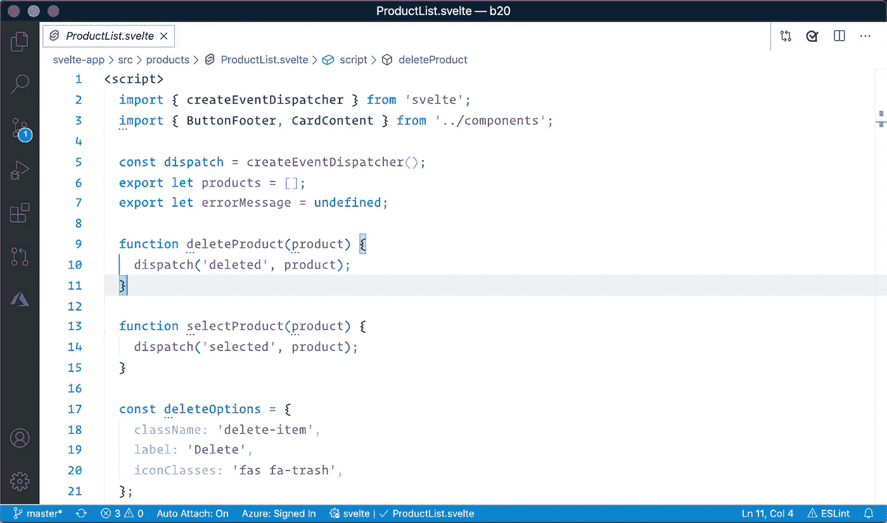
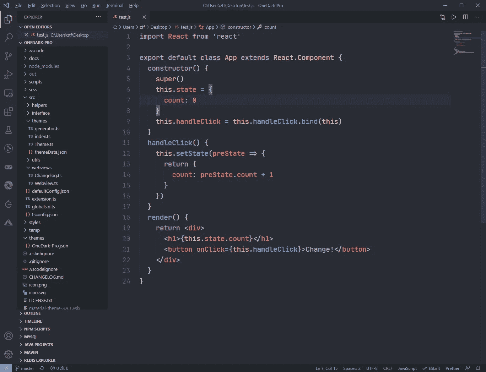
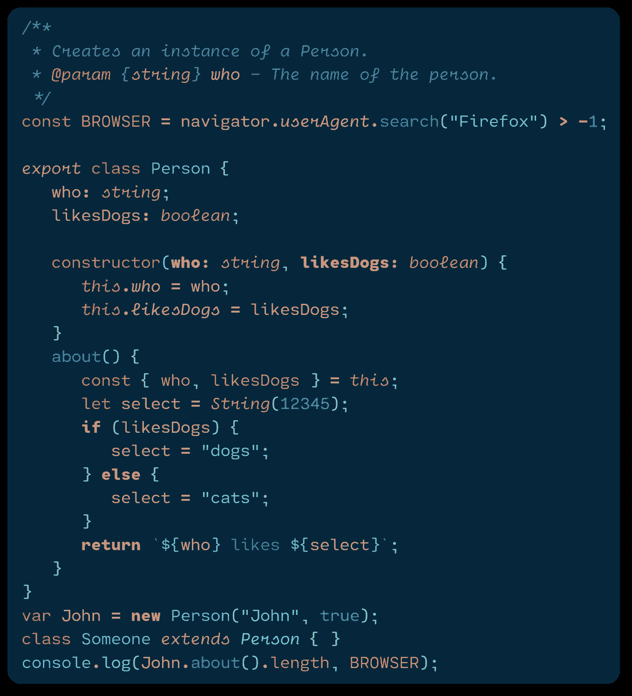
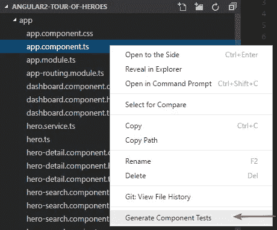
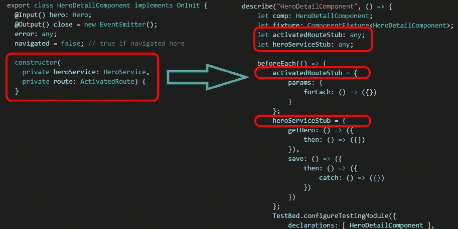
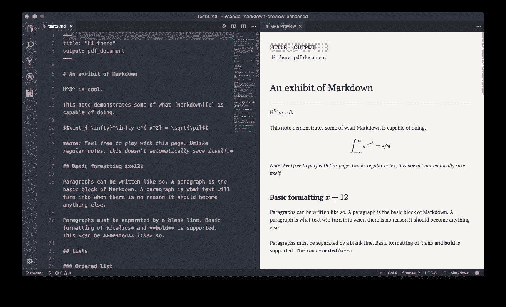

# 50 VS 代码扩展，让你成为更好的开发者

> 原文：<https://javascript.plainenglish.io/50-visual-studio-code-extensions-thatll-make-you-a-better-developer-ae8159e095a?source=collection_archive---------0----------------------->

**The “Hulk buster” Iron Man suit from the movie “Avengers: Age of Ultron”**

如果您是一名程序员，您很有可能使用 Visual Studio 代码进行开发。它是 2015 年发布的免费源代码编辑器，由微软开发，运行于 Windows、Linux 和 macOS。开箱即用，它包括对大多数常见编程语言的基本支持。它可能不如 visual studio 强大，但由于其用户友好性和强大的扩展，它在几年内就成为了#1 开发工具。

[https://insights.stackoverflow.com/survey/2019#development-environments-and-tools](https://insights.stackoverflow.com/survey/2019#development-environments-and-tools)

# 扩展ˌ扩张

Visual Studio 代码最有用的功能之一是扩展。开发人员可以使用扩展来添加语言、调试器、开发工具、主题、支持开发工作流的新特性等等。VS 代码中的扩展运行在它们自己的进程中，并且是延迟加载的。有很多可用的扩展，可以在 visual studio 市场上浏览。

 [## Visual Studio 市场

### Visual Studio、Azure DevOps 服务、Azure DevOps 服务器和 Visual Studio 代码的所有扩展都集中在一个地方…

marketplace.visualstudio.com](https://marketplace.visualstudio.com/VSCode) 

这里是最有用的扩展的精选列表，帮助开发人员提高他们的生产力，使他们成为更好的开发人员。

# **清理代码&重构**

## **1。代码度量**

计算 TypeScript/JavaScript/Lua 文件的复杂性。

 [## CodeMetrics - Visual Studio 市场

### 计算 TypeScript / JavaScript / Lua 文件的复杂性。计算步骤:从输入创建 AST

marketplace.visualstudio.com](https://marketplace.visualstudio.com/items?itemName=kisstkondoros.vscode-codemetrics) 

## **2。Abracadabra，重构这个**

一个强大的扩展，为 JavaScript 和 TypeScript 带来了自动化重构。下面是这个扩展可以做的一些重构

1.  重命名符号
2.  提取变量，泛型类型
3.  内嵌变量、函数
4.  向上/向下移动语句
5.  将 If/Else 转换为三进制，反之亦然
6.  将 If/Else 转换为 Switch，反之亦然
7.  合并/拆分 If 语句

 [## 阿布拉卡达布拉，重构这个！- Visual Studio 市场

### 重构(名词):对软件内部结构的改变，使其更容易理解，成本更低

marketplace.visualstudio.com](https://marketplace.visualstudio.com/items?itemName=nicoespeon.abracadabra) 

## **3。骗局**

一个自动化的重构扩展，在 JavaScript 和类型脚本中创建函数/变量/类/开关案例。

 [## Hocus Pocus - Visual Studio 市场

### 给出反馈 Hocus Pocus 是一个 Visual Studio 代码扩展，它用 JavaScript 和…

marketplace.visualstudio.com](https://marketplace.visualstudio.com/items?itemName=nicoespeon.hocus-pocus) 

## **4。索纳林特**

SonarLint 会在您编写代码时强调错误和安全漏洞

 [## SonarLint - Visual Studio 市场

### SonarLint 是一个 IDE 扩展，它可以帮助你检测和修复质量问题

marketplace.visualstudio.com](https://marketplace.visualstudio.com/items?itemName=SonarSource.sonarlint-vscode) 

## **5。ESLint**

将 [ESLint](http://eslint.org/) 集成到 VS 代码中。

 [## ESLint - Visual Studio 市场

### 将 ESLint 集成到 VS 代码中。如果您是 ESLint 的新手，请查看文档。扩展使用 ESLint 库…

marketplace.visualstudio.com](https://marketplace.visualstudio.com/items?itemName=dbaeumer.vscode-eslint) 

## **6。更好的评论**

更好的注释扩展将有助于在代码中创建更人性化的注释。

 [## 更好的评论- Visual Studio 市场

### 更好的注释扩展将帮助您在代码中创建更加人性化的注释。有了这个扩展，你…

marketplace.visualstudio.com](https://marketplace.visualstudio.com/items?itemName=aaron-bond.better-comments) 

## **7。记录这个**

自动为 TypeScript 和 JavaScript 文件生成详细的 JSDoc 注释

 [## 记录此内容- Visual Studio 市场

### Visual Studio 代码的扩展——在 TypeScript 和 JavaScript 文件中自动生成详细的 JSDoc 注释。

marketplace.visualstudio.com](https://marketplace.visualstudio.com/items?itemName=oouo-diogo-perdigao.docthis) 

## **8。代码拼写检查器**

帮助找出常见的拼写错误。

 [## 代码拼写检查器- Visual Studio 市场

### Visual Studio 代码扩展-源代码拼写检查器

marketplace.visualstudio.com](https://marketplace.visualstudio.com/items?itemName=streetsidesoftware.code-spell-checker) 

## **9。Visual Studio IntelliCode**

该扩展通过在完成列表的顶部显示代码上下文的推荐完成项，提供了人工智能辅助的智能感知。

 [## Visual Studio intelli code-Visual Studio 市场

### Visual Studio 代码的扩展-人工智能辅助开发

marketplace.visualstudio.com](https://marketplace.visualstudio.com/items?itemName=VisualStudioExptTeam.vscodeintellicode) 

## **10。待办事项高亮显示**

有时我们会忘记回顾编码时添加的待办事项。这个扩展突出了他们，提醒他们还有笔记或者事情没有做。

 [## 待办事项突出显示- Visual Studio 市场

### 突出显示代码中的 TODO、FIXME 和其他注释。有时你会忘记查看你添加的待办事项…

marketplace.visualstudio.com](https://marketplace.visualstudio.com/items?itemName=wayou.vscode-todo-highlight) 

# **代码片段**

开发中枯燥的部分就是一遍又一遍的打同样的东西。下面是帮助自动生成代码并减少开发工作量的代码片段。

## **11。JavaScript (ES6)代码片段**

这个扩展包含 JavaScript 在 ES6 语法中的代码片段，用于 [Vs 代码](https://code.visualstudio.com/)编辑器(支持 JavaScript 和 TypeScript)。

 [## JavaScript (ES6)代码片段- Visual Studio 市场

### Visual Studio 代码的扩展 ES6 语法的 JavaScript 代码片段

marketplace.visualstudio.com](https://marketplace.visualstudio.com/items?itemName=xabikos.JavaScriptSnippets) 

## **12。ES7 React/Redux/graph QL/React-Native 片段**

这个扩展在 ES7 中为您提供了 JavaScript 和 React/Redux 片段，具有 Babel 插件特性

 [## ES7 React/Redux/graph QL/React-本机代码片段- Visual Studio 市场

### 这个扩展为你提供了 ES7 中的 JavaScript 和 React/Redux 代码片段，以及 VS 代码启动的 Babel 插件特性…

marketplace.visualstudio.com](https://marketplace.visualstudio.com/items?itemName=dsznajder.es7-react-js-snippets) 

## **13。Vue 2/3 片段**

该扩展将 Vue 3 代码片段添加到 Visual Studio 代码中。

 [## Vue 2/3 片段- Visual Studio 市场

### Visual Studio 代码扩展——vue . js 2 和 Vue.js 3 代码片段扩展

marketplace.visualstudio.com](https://marketplace.visualstudio.com/items?itemName=hollowtree.vue-snippets) 

## **14。棱角分明的 10 个片段**

用于 Angular 2、4、5、6、7、8、9 和 10 的 Visual Studio 代码类型脚本和 Html 片段以及代码示例。

 [## Angular 10 snippet-TypeScript，Html，Angular Material，ngRx，RxJS & Flex Layout - Visual Studio…

### cli 备忘单 Cli 备忘单 e-atbr 期望异步解析 e-ntbd 期望未定义 e-ntbf 期望未定义…

marketplace.visualstudio.com](https://marketplace.visualstudio.com/items?itemName=Mikael.Angular-BeastCode) 

## **15。Reactjs 代码片段**

React 的代码片段

 [## Reactjs 代码段- Visual Studio 市场

### Visual Studio 代码的扩展-以 ES6 语法进行 Reactjs 开发的代码片段

marketplace.visualstudio.com](https://marketplace.visualstudio.com/items?itemName=xabikos.ReactSnippets) 

## 16 岁。Bootstrap 4，Font awesome 4，Font Awesome 5 免费& Pro snippets

自举 4，字体牛逼 4 和字体牛逼 5 免费及专业片段。

 [## Bootstrap 4，Font awesome 4，Font Awesome 5 免费和专业片段- Visual Studio Marketplace

### Visual studio 代码插件，包含 Bootstrap 4、Font awesome 4 和 Font Awesome 5 免费和专业片段。这个插件…

marketplace.visualstudio.com](https://marketplace.visualstudio.com/items?itemName=thekalinga.bootstrap4-vscode) 

## 17。Angular Jasmine 单元测试片段

Jasmine 中的角度单元测试片段

 [## Angular Jasmine 单元测试片段- Visual Studio 市场

### Jasmine 中的 Visual Studio 代码角度单元测试片段这些片段是在观察到这些…

marketplace.visualstudio.com](https://marketplace.visualstudio.com/items?itemName=madhusuthanan.angular-unit-testing-snippets) 

## **18。节点片段**

Node.js 的简短代码片段

 [## 节点代码段- Visual Studio 市场

### Visual Studio 代码扩展 Node.js 的简短代码段

marketplace.visualstudio.com](https://marketplace.visualstudio.com/items?itemName=devdoge1.node-snippets) 

# 数据库ˌ资料库

如果你不想让 VS 代码执行数据库相关的活动，那么有一些扩展适合你。以下是可以执行的一些活动

*   连接到 Microsoft SQL Server、Azure SQL 数据库和 SQL 数据仓库。
*   创建和管理连接配置文件和最近使用的连接。
*   使用 IntelliSense 编写 T-SQL 脚本，转到定义、T-SQL 片段、语法着色、T-SQL 错误验证和`GO`批处理分隔符。
*   在一个简单易用的网格中执行您的脚本并查看结果。
*   将结果保存为 JSON 或 CSV 文件格式，并在编辑器中查看。
*   可定制的扩展选项，包括命令快捷键等。

## **19。SQL 服务器(mssql)**

Visual Studio 代码的 SQL Server 客户端。

 [## SQL Server (mssql) - Visual Studio 市场

### 欢迎使用 mssql for Visual Studio 代码！一个用于开发微软 SQL Server，Azure SQL 数据库和 SQL…

marketplace.visualstudio.com](https://marketplace.visualstudio.com/items?itemName=ms-mssql.mssql) 

## **二十。MySQL**

Visual Studio 代码的 MySQL 客户端

 [## MySQL - Visual Studio 市场

### MySQL Client For Visual Studio 代码项目站点:vscode-mysql 特性从 vscode marketplace 安装 vscode-mysql…

marketplace.visualstudio.com](https://marketplace.visualstudio.com/items?itemName=cweijan.vscode-mysql-client2) 

## **21。PostgreSQL**

Visual Studio 代码的 PostgreSQL 9.4+客户端

 [## PostgreSQL - Visual Studio 市场

### 这是一个 PostgreSQL 数据库的查询工具。虽然有一个数据库浏览器，但它不是用来创建/删除…

marketplace.visualstudio.com](https://marketplace.visualstudio.com/items?itemName=ckolkman.vscode-postgres) 

## **22。MongoDb**

用于 Visual Studio 代码的 MongoDB 客户端

 [## MongoDB for VS 代码- Visual Studio 市场

### MongoDB for VS 代码使得使用 MongoDB 变得很容易，无论是您自己的实例还是在 MongoDB Atlas 中。浏览您的…

marketplace.visualstudio.com](https://marketplace.visualstudio.com/items?itemName=mongodb.mongodb-vscode) 

## **23。SQLTools**

VSCode 的数据库管理

*   美化者/格式化者
*   查询运行器、历史和书签
*   连接浏览器
*   查询生成器(仅插入)

 [## SQLTools - Visual Studio 市场

### 数据库管理做得好。连接资源管理器、查询运行器、智能感知、书签、查询历史。感觉像一个…

marketplace.visualstudio.com](https://marketplace.visualstudio.com/items?itemName=mtxr.sqltools) 

# **主题&造型**

如果你不喜欢你的 visual studio 代码的默认颜色/主题，那么有很多扩展可供你定制编辑器的外观和感觉。

## 24。冬天来了主题

**Dark Black Theme**

**Light Theme**

 [## 冬天来了主题- Visual Studio 市场

### John Papa 的 Visual Studio 代码首选暗/亮主题的扩展

marketplace.visualstudio.com](https://marketplace.visualstudio.com/items?itemName=johnpapa.winteriscoming) 

## **25。一个黑暗职业**

Atom 标志性的 One Dark 主题，也是 VS 代码安装最多的主题之一！

 [## 一个黑暗的专业视觉工作室市场

### Atom 标志性的 One Dark 主题，也是 VS 代码安装最多的主题之一！消除上下文切换和成本高昂的…

marketplace.visualstudio.com](https://marketplace.visualstudio.com/items?itemName=zhuangtongfa.Material-theme) 

## **26。夜啼**

明亮和黑暗主题的集合，暖色和冷色的完美融合

 [## Noctis - Visual Studio 市场

### Noctis 是一个明亮和黑暗主题的集合，具有温暖和寒冷的中等对比色的良好平衡的混合。的…

marketplace.visualstudio.com](https://marketplace.visualstudio.com/items?itemName=liviuschera.noctis) 

## **27。素材主题**

Visual Studio 代码现在最史诗般的主题

 [## 材料主题- Visual Studio 市场

### 最史诗的主题遇上 Visual Studio 代码。您可以通过在此报告问题来提供帮助。你可以安装这个很棒的主题…

marketplace.visualstudio.com](https://marketplace.visualstudio.com/items?itemName=Equinusocio.vsc-material-theme) 

## **28。吸血鬼主题**

官方德古拉主题。对于许多编辑器、shells 等来说，这是一个黑暗的主题。

 [## 吸血鬼官方-视觉工作室市场

### Visual Studio 代码的扩展-官方德古拉主题。对于许多编辑器、shells 等来说，这是一个黑暗的主题。

marketplace.visualstudio.com](https://marketplace.visualstudio.com/items?itemName=dracula-theme.theme-dracula) 

## **29。VS 代码图标**

Visual Studio 代码的彩色图标

 [## vscode-icons - Visual Studio 市场

### 将图标添加到您的 Visual Studio 代码中(支持的最低版本:1.40.2)要安装该扩展，只需执行…

marketplace.visualstudio.com](https://marketplace.visualstudio.com/items?itemName=vscode-icons-team.vscode-icons) 

## 30。更漂亮

使用更漂亮的代码格式化

 [## 更漂亮的代码格式化程序- Visual Studio 市场

### Visual Studio 代码的扩展-使用更漂亮的代码格式化程序

marketplace.visualstudio.com](https://marketplace.visualstudio.com/items?itemName=esbenp.prettier-vscode) 

## 31。美化

为 VS 代码美化代码

 [## 美化- Visual Studio 市场

### 美化 Visual Studio 代码中的 javascript、JSON、CSS、Sass、HTML。VS 代码内部使用 js-美化，但是缺少…

marketplace.visualstudio.com](https://marketplace.visualstudio.com/items?itemName=HookyQR.beautify) 

## 32。孔雀

微妙地改变你的工作空间的颜色。当您有多个 VS 代码实例并且想要快速识别哪个是哪个时，这是理想的选择。

 [## 孔雀- Visual Studio 市场

### 微妙地改变 Visual Studio 代码工作区的颜色。当你有多个 VS 代码实例时，使用 VS…

marketplace.visualstudio.com](https://marketplace.visualstudio.com/items?itemName=johnpapa.vscode-peacock) 

# **源码控制**

## **33。GitLens**

GitLens 帮助你更好的理解代码。快速浏览一行或代码块被更改的人、原因和时间。回顾历史，深入了解代码是如何以及为什么进化的。轻松探索代码库的历史和演变。

 [## GitLens - Git 增压版- Visual Studio 市场

### Visual Studio 代码扩展-增强内置于 Visual Studio 代码中的 Git 功能-可视化代码…

marketplace.visualstudio.com](https://marketplace.visualstudio.com/items?itemName=eamodio.gitlens) 

## 34。Git 历史记录

Git 历史，搜索和更多(包括 git 日志)

 [## Git 历史记录- Visual Studio 市场

### 查看和搜索 git 日志以及图表和详细信息。查看文件的以前副本。查看和搜索历史记录…

marketplace.visualstudio.com](https://marketplace.visualstudio.com/items?itemName=donjayamanne.githistory) 

## **35。码流**

一个开发人员协作平台，将基本的开发工具，如 GitHub、GitLab、Bitbucket、Slack、Teams、吉拉、Trello 等集成到 VS 代码中

 [## CodeStream: GitHub、GitLab、Bitbucket PRs 和代码评审- Visual Studio Marketplace

### CodeStream 是一个开发者协作平台，集成了一些重要的开发工具，如 GitHub、GitLab…

marketplace.visualstudio.com](https://marketplace.visualstudio.com/items?itemName=CodeStream.codestream) 

# **调试**

VS 代码扩展来调试你的 JavaScript 代码

## 36。Chrome 调试器

 [## Chrome 调试器- Visual Studio Marketplace

### Visual Studio 代码扩展——在 Chrome 浏览器或任何其他支持的目标中调试您的 JavaScript 代码

marketplace.visualstudio.com](https://marketplace.visualstudio.com/items?itemName=msjsdiag.debugger-for-chrome) 

## **37。Firefox 的调试器**

 [## Firefox 调试器- Visual Studio Marketplace

### 从 VS 代码中调试在 Firefox 中运行的 JavaScript 代码。一个 VS 代码扩展，用于调试 web 应用程序和…

marketplace.visualstudio.com](https://marketplace.visualstudio.com/items?itemName=firefox-devtools.vscode-firefox-debug) 

## **38。节点**的调试器

 [## 节点调试- Visual Studio 市场

### 该扩展与 Visual Studio 代码捆绑在一起，并与 Node Debug (legacy)一起形成 Node.js 调试…

marketplace.visualstudio.com](https://marketplace.visualstudio.com/items?itemName=ms-vscode.node-debug2) 

# **实用程序**

## 39。波拉科德

宝丽来为您的代码

 [## Polacode - Visual Studio 市场

### Visual Studio 代码的扩展-📸宝丽来为您的代码

marketplace.visualstudio.com](https://marketplace.visualstudio.com/items?itemName=pnp.polacode) 

## 40。直播服务器

启动开发本地服务器，为静态和动态页面提供实时重新加载功能

 [## 实时服务器- Visual Studio 市场

### 对不起，但是我现在非常忙。如果你想成为项目的维护者，欢迎随时联系我！你已经…

marketplace.visualstudio.com](https://marketplace.visualstudio.com/items?itemName=ritwickdey.LiveServer) 

## 41。进口成本

这个扩展将在编辑器中以内联方式显示导入包的大小。该扩展使用带有 [babili-webpack-plugin](https://www.npmjs.com/package/babili-webpack-plugin) 的 webpack 来检测导入的大小。

 [## 导入成本- Visual Studio 市场

### Visual Studio 代码的扩展-在编辑器中显示导入/要求包大小

marketplace.visualstudio.com](https://marketplace.visualstudio.com/items?itemName=wix.vscode-import-cost) 

## **42。VS 代码计数器**

VS 代码扩展:计算许多编程语言中源代码的空行、注释行和物理行。

 [## VS 代码计数器- Visual Studio 市场

### VS 代码扩展:计算许多编程语言中源代码的空行、注释行和物理行…

marketplace.visualstudio.com](https://marketplace.visualstudio.com/items?itemName=uctakeoff.vscode-counter) 

## 43。设置同步

使用 GitHub Gist 在多台机器上同步设置、代码片段、主题、文件图标、启动、按键绑定、工作区和扩展。

 [## 设置同步- Visual Studio 市场

### 虽然是免费和开源的，如果你觉得它有用，请考虑通过 PayPal 或 open 来支持它…

marketplace.visualstudio.com](https://marketplace.visualstudio.com/items?itemName=Shan.code-settings-sync) 

## **44。编辑器配置**

Visual Studio 代码的 EditorConfig 支持

 [## VS 代码的 editor config-Visual Studio 市场

### 此插件试图用. editorconfig 文件中的设置覆盖用户/工作区设置。没有额外的或…

marketplace.visualstudio.com](https://marketplace.visualstudio.com/items?itemName=EditorConfig.EditorConfig) 

# **键映射**

如果你正在开发 Java。Net，那么您可能已经使用了其他 ide，如 Eclipse、Visual studio，并且您可能也想对 VS 代码使用相同的键盘快捷方式。下面是允许你使用相同键盘快捷键的扩展。

## **45。Visual Studio**

该扩展将流行的 Visual Studio 键盘快捷键移植到 Visual Studio 代码。

 [## Visual Studio 键盘映射- Visual Studio 市场

### 该扩展将流行的 Visual Studio 键盘快捷键移植到 Visual Studio 代码。安装完扩展和…

marketplace.visualstudio.com](https://marketplace.visualstudio.com/items?itemName=ms-vscode.vs-keybindings) 

## **46。原子**

该扩展将流行的 Atom 键盘快捷键移植到 Visual Studio 代码。

 [## Atom 键盘映射- Visual Studio 市场

### 该扩展将流行的 Atom 键盘快捷键移植到 Visual Studio 代码。安装完扩展和…

marketplace.visualstudio.com](https://marketplace.visualstudio.com/items?itemName=ms-vscode.atom-keybindings) 

## **47。崇高的文字**

这个扩展将按键绑定和设置从 Sublime 文本导入到 VS 代码中。

 [## Sublime 文本键映射和设置导入程序- Visual Studio 市场

### 这个扩展将按键绑定和设置从 Sublime 文本导入到 VS 代码中。这个扩展端口是最受欢迎的…

marketplace.visualstudio.com](https://marketplace.visualstudio.com/items?itemName=ms-vscode.sublime-keybindings) 

## **48。日食**

这个扩展将流行的 Eclipse 键盘快捷键移植到 Visual Studio 代码。

 [## Eclipse 键盘映射- Visual Studio 市场

### 这个扩展将流行的 Eclipse 键盘快捷键移植到 Visual Studio 代码。Eclipse 键绑定是为…提供的

marketplace.visualstudio.com](https://marketplace.visualstudio.com/items?itemName=alphabotsec.vscode-eclipse-keybindings) 

## **49。记事本++**

这个扩展将流行的记事本++键盘快捷键移植到 Visual Studio 代码。

 [## 记事本++键盘映射- Visual Studio 市场

### 这个扩展将流行的记事本++键盘快捷键移植到 Visual Studio 代码。安装完扩展和…

marketplace.visualstudio.com](https://marketplace.visualstudio.com/items?itemName=ms-vscode.notepadplusplus-keybindings) 

## **50。Jetbrains IDE**

这个扩展将键绑定从 JetBrains 导入到 VS 代码中。

 [## JetBrains IDE 键盘映射- Visual Studio 市场

### 灵感来自微软的崇高文本键盘映射扩展。这个扩展将键绑定从 JetBrains 导入到 VS…

marketplace.visualstudio.com](https://marketplace.visualstudio.com/items?itemName=isudox.vscode-jetbrains-keybindings) 

# **奖金**

## **51。Vim**

Visual Studio 代码的 Vim 仿真

 [## Vim - Visual Studio 市场

### Vim emulation for Visual Studio Code VSCodeVim 是一个用于 Visual Studio 代码的 Vim 模拟器。🚚如需…的完整列表

marketplace.visualstudio.com](https://marketplace.visualstudio.com/items?itemName=vscodevim.vim) 

## **52。休息客户端**

REST 客户端允许您发送 HTTP 请求，并直接在 Visual Studio 代码中查看响应。

 [## REST 客户端- Visual Studio 市场

### Visual Studio 代码的扩展-Visual Studio 代码的 REST 客户端

marketplace.visualstudio.com](https://marketplace.visualstudio.com/items?itemName=humao.rest-client) 

## **53。节点模块**

Visual Studio 代码的简单扩展，允许您快速删除或搜索项目的 node_modules 目录

 [## 节点模块- Visual Studio 市场

### visual studio 代码的简单扩展，允许您快速删除项目的 node_modules 目录。使用…

marketplace.visualstudio.com](https://marketplace.visualstudio.com/items?itemName=Wscats.delete-node-modules) 

## **54。西蒙测试**

这个扩展分析您的代码，创建必要的存根，配置测试床，甚至生成基本的测试。

 [## SimonTest - Visual Studio 市场

### 它负责测试组件和服务最乏味的部分:模仿依赖。这种延伸…

marketplace.visualstudio.com](https://marketplace.visualstudio.com/items?itemName=SimonTest.simontest) 

## **55。降价预览增强**

这个扩展提供了 VS 代码中 markdown 文档的实时预览。

 [## 降价预览增强版- Visual Studio 市场

### atom & vscode 如果您有兴趣，请试用我们的新原型 web 应用程序:0xGG/crossnote Markdown 预览增强版…

marketplace.visualstudio.com](https://marketplace.visualstudio.com/items?itemName=shd101wyy.markdown-preview-enhanced) 

如果有你喜欢使用但不在上面的扩展，请在评论区随意添加。