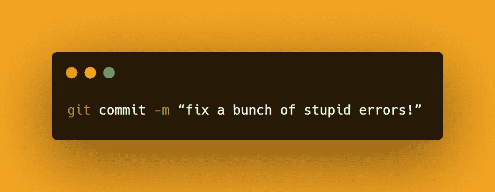

# 6 个常见的 Git 错误以及如何修复它们

> 原文：<https://javascript.plainenglish.io/6-common-git-mistakes-and-how-to-fix-them-b519bd351001?source=collection_archive---------4----------------------->

## 如何通过这些简单的命令立即摆脱困境

[](http://How most developers would like to name their commits)

How most developers would like to name their commits

作为开发人员，Git 可能是您最好的朋友，但它也可能是您工作流程中相当多错误的来源。这里列出了最常见的问题、日常问题以及解决方法。

*注意:如果你不知道这里显示的任何命令，你可以在文章底部找到它们的官方 Git 文档链接。*

# 1.您拼错了最后一条提交消息

你意识到你刚刚提交了一个错误的拼写，比如`"Fix lanting page"`，你不想让你的同事觉得你很笨。

只需使用:

```
git commit --amend 
```

或者

```
git commit --amend -m "Fix landing page"
```

此命令将允许您将任何暂存的更改与您的最后一次提交相结合。如果没有暂存任何内容，您可以使用它来更新提交消息，就像在这种情况下一样，或者通过新的 CLI 提示符(如第一个命令所示),或者直接使用它(如第二个命令所示)。

# 2.您在上次提交时忘记了一个文件

在这种情况下，你也可以使用`git commit --amend`，比如，假设你在最后一次提交时忘记了一个文件。

只需将其添加到临时区域，然后再次运行该命令。

```
git add landingpage.js
git commit --amend
```

# 3.您推送了一个有问题的提交

您意识到您用一些您认为可以运行的代码进行了提交，但是它实际上是不可接受的。

您可以通过运行以下命令来解决这个问题:

```
git revert <SHA>
```

该命令将创建一个与您出错的提交相反的提交。有点像往火上泼水。旧提交中删除的任何内容都将被添加到新恢复的提交中，类似地，以前添加的内容也将被删除。

# 4.你想取消一些未提交的代码

当你意识到你在写完全无用的东西时，你会想尽快摆脱它。

如果还没有提交任何东西，您可以通过运行:

```
git checkout --<bad filename>
```

这个命令将把工作目录中的文件恢复到 Git 以前知道的状态。你可以给它提供一个分支名、文件夹名，甚至是你想返回的特定的`SHA`。但是在使用它之前要小心，因为这个命令会完全取消你撤销的所有操作，并且你不能再恢复它。

# 5.您想要取消一些未推送的提交

你开始写一个特性的一部分，然后意识到所有的东西都是垃圾。

如果你想去掉你留下的任何脚印，你可以通过跑步来实现:

```
git reset <last good SHA>
```

或者:

```
git reset --hard <last good SHA>
```

该命令会将您的历史倒回到指定的`SHA`。不过，在第一种情况下，工作目录将被保留，这意味着您的提交将被删除，但仍在磁盘上。

在第二种情况下，甚至您执行的那些更改都将被删除。

# 6.您在主分支上进行了一些提交

因此，你疯狂地开始为一个新特性输入代码，自豪地提交一些代码，却意识到你在主分支上推动了那些变化。

注意:确保你首先提交或保存你的更改，否则一切都将丢失。

您可以使用以下三个命令将所有这些更改回滚到一个新分支:

```
git branch future-brunch
git reset HEAD~ --hard
git checkout future-brunch
```

这三个命令将在将 master 回滚到更改前的位置之前创建一个新的分支，然后实际移动到您希望最初进行更改的分支。

## 结论

像你看到的这种常见的 Git 错误会成为你日常生活中的一大障碍。现在你应该有了一个小工具包，可以轻松快速地解决这些问题。一如既往，感谢您花时间阅读这些文章，不要忘记在下面的评论区发表您的意见！

— *皮耶罗*

## 资源

*   [Git 提交命令 。](https://git-scm.com/docs/git-commit)
*   [*Git 回复*](https://git-scm.com/docs/git-revert) *。*
*   [*Git 结账*](https://git-scm.com/docs/git-checkout) *。*
*   [*Git 复位*](https://git-scm.com/docs/git-reset) *。*
*   [*吉特科*](https://git-scm.com/docs/git-branch) *。*