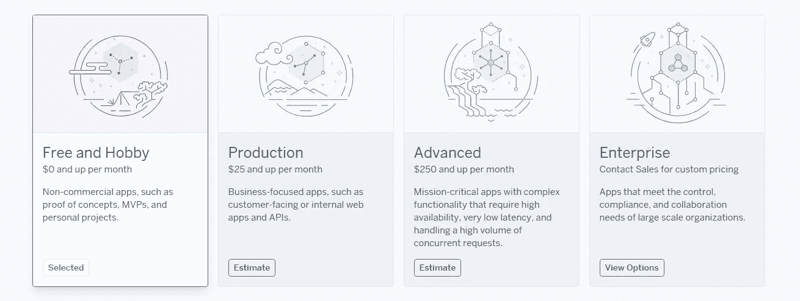
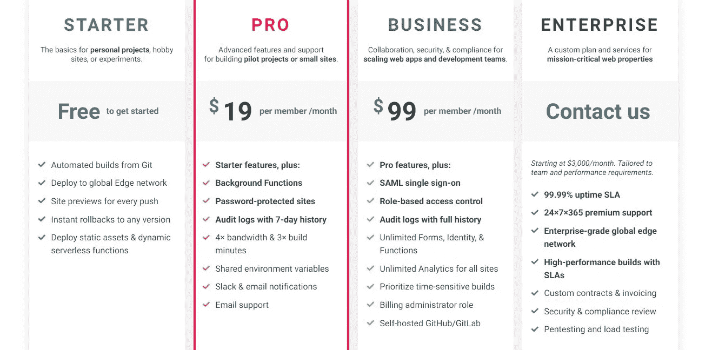
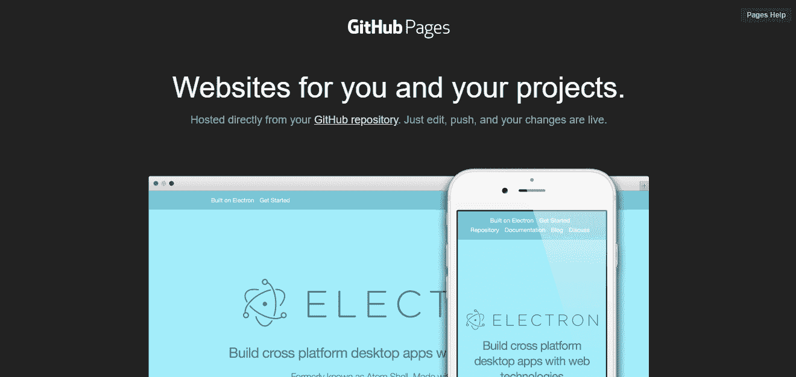
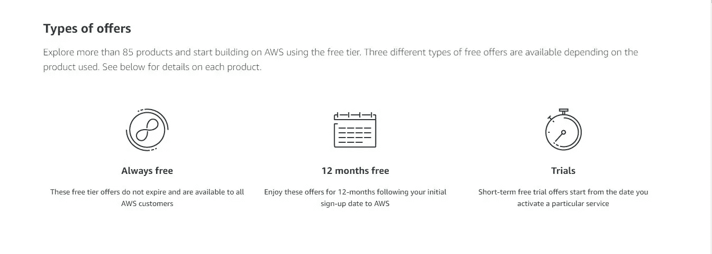
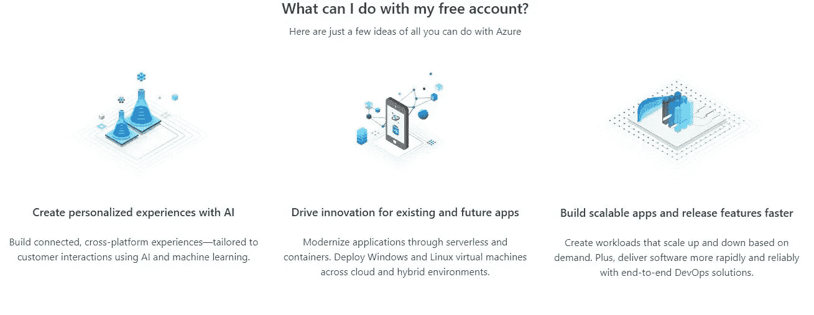

# 6 个免费平台托管您的应用

> 原文：<https://javascript.plainenglish.io/6-free-platforms-to-host-your-apps-b29372b530be?source=collection_archive---------2----------------------->

## 选择合适的平台，经济地部署您的项目。

Photo by [Aneta Pawlik](https://unsplash.com/@anetakpawlik?utm_source=medium&utm_medium=referral) on [Unsplash](https://unsplash.com?utm_source=medium&utm_medium=referral)

作为开发人员，我们构建大量的项目来展示我们的技能或尝试新事物。

尽管如此，我们通常希望这些项目能够很容易地被全世界看到，然而主持这些项目可能是一个相当大的挑战，尤其是当你预算紧张的时候。

幸运的是，有相当多的平台提供可靠、快速、成熟的方法来免费部署你的应用。

请注意，由于我只列出完全免费的选项，我不得不排除一些著名的平台，如[数字海洋](https://try.digitalocean.com/developerbrand/?utm_campaign=apac_brand_kw_en_cpc&utm_adgroup=digitalocean_exact_exact&_keyword=digitalocean&_device=c&_adposition=&utm_medium=cpc&utm_source=google&gclid=Cj0KCQiAifz-BRDjARIsAEElyGIzTUG51zKTpdTEjzTjOVmLATnbkAd2c5wtSbAHv_VX_Kj3zmWhrW4aAvtDEALw_wcB)，即使他们有免费试用期(60 天)。

下面是 6 个平台，你可以用它们来免费部署你的下一个应用。

# 1.赫罗库

Heroku 被列在这个列表的最顶端，仅仅是因为它非常简单，而且他们的免费计划对大多数项目来说都绰绰有余。

Heroku Pricing. Source: [Heroku](https://www.heroku.com/pricing)

我使用 Heroku 已经一年多了，到目前为止，我还没有遇到任何重大问题。

它支持几乎所有的框架，包括 Node.js 之类的。

免费计划提供 550 小时的动态小时，但是，一旦你通过提供你的信用卡详细信息(他们不收费)来验证自己，限制增加到 1000 动态小时。

此外，您可以添加自己的定制域，也可以使用 Git 和 Docker 进行部署。

我最喜欢 Heroku 的一点是它的 [CLI](https://devcenter.heroku.com/articles/heroku-cli) ，这使得直接从你的代码编辑器部署项目变得非常容易。

使用 Heroku free tier 计划的一个缺点是服务器在 30 分钟不活动后会休眠。

通俗地说，如果 30 分钟内没有人访问你的网站，那么你的应用程序就会进入睡眠状态，当有人稍后访问时，Heroku 会使用类似`npm build`的命令再次运行该应用程序。

这意味着你的页面将需要很长的加载时间(超过 10 秒)，并且你将丢失你的应用实例(就像你存储在变量中的任何数据一样)。

然而，你可以使用 [cron-jobs](https://cron-job.org/en/) 每 30 分钟 ping 一次你的 Heroku 应用程序以保持其运行。

# 2.网络生活

Netlify 是另一个允许快速部署以及允许[部署预览](https://www.netlify.com/products/build/#start:~:text=Show%20and%20share%20Deploy%20Previews)的平台。

Netlify 提供了[即时连续部署](https://www.netlify.com/products/build/)，这使得部署变得轻而易举。你所要做的就是将代码提交给 Github，它会生成一个完整的预览站点并自动部署你的提交。

免费计划也提供即时回滚。

Netlify Pricing. Source: [Netlify](https://www.netlify.com/pricing/)

然而，Netlify 最大的一个缺点是它只适用于静态站点。

因此，它不能托管您的 NodeJS 应用程序。但是，它可以托管 React、Vue、Angular 等框架的静态构建输出。

与 Heroku 不同，它不会在 30 分钟后让服务器进入睡眠状态。

Netlify 提供了 [Netlify 函数](https://www.netlify.com/products/functions/)，允许你编写和运行 Lambda 函数。

但是如果你的应用已经是用 Node 编写的，那么就不值得重写整个服务器端代码。相反，使用 Heroku 或列表中提到的其他可能的解决方案。

# 3.重火力点

谷歌提供 [Firebase](https://firebase.google.com/) 作为亚马逊 [AWS](https://aws.amazon.com/) 的替代品。

虽然 Firebase 提供了一系列广泛的服务，如存储和机器学习功能，但在本文中，我们将重点关注 [Firebase 的托管](https://firebase.google.com/docs/hosting/quickstart)服务。

免费计划提供 10GB 的存储空间，但你每天只能传输 360 MB 的数据。

它还提供对自定义域、SSL 认证以及每个项目多个站点的支持。

Firebase Hosting(带有[云构建](https://cloud.google.com/cloud-build/))提供了一个 DevOps 就绪的解决方案，用于为您的项目自动化一个连续的部署工作流。

**值得注意的是，如果您的 Firebase 项目在 Spark 计费计划(他们的免费计划)中，并且您将 Firebase 项目与云计费帐户相关联，则您的 Firebase 项目会自动升级到 Blaze(按需付费)计费计划。**

Firebase 支持 Node.js(在撰写本文时是版本 10 和 12 ),并提供了一个关于如何在 Firebase 上托管 Node.js 应用程序的优秀教程[。](https://www.youtube.com/watch?v=LOeioOKUKI8)

加入 Firebase 提供的免费 Spark 计划的其他好处是，您可以获得一系列全面的功能，如电话认证、分析、Firestore、云消息以及更多功能。

我发现使用 Firebase 托管的一个缺点是，你可以不受限制地访问谷歌自己的服务，但是如果你想调用第三方服务(如 MongoDB 端点)，你需要启用计费。

总而言之，Firebase 仍然是一个很好的平台，它慷慨地提供了许多免费服务，是一个起点。

# 4.Github 页面

Home page of Github Pages. Source: [Github Pages](https://pages.github.com/)

如果你想托管静态网站，Github Pages 是一个很好的选择。

GitHub Pages 是一个静态的站点托管服务，它直接从 GitHub 上的存储库中获取 HTML、CSS 和 JavaScript 文件，可以选择通过构建过程运行这些文件并发布一个网站。

我经常使用 Github 来托管我的项目的演示站点，展示我的项目的所有方面。然而，你可以使用这个平台来托管简历和其他类似的静态网站。

首先，你必须有一个 Github 账户(这是免费的),并将你的代码上传到那里的一个公共库。

完成后，您必须将 README.md 文件重命名为 index.html 文件，并在其中插入相关的 HTML 内容，然后向下滚动并提交新的更改。

您的网站将在 1-10 分钟内在 YOUR_USERNAME.github.io URL 上线。

也可以上传多文件网站。要了解如何做到这一点，请查看这里提供的教程。

除此之外，你还可以[创建自定义 404 页面](https://help.github.com/categories/20/articles)和使用[自定义域名](https://help.github.com/articles/setting-up-a-custom-domain-with-pages)。

# 5.自动警报系统

尽管 AWS 是如此受欢迎和完整的平台，但它没有登上榜首的原因是因为它不是完全免费的。

我早些时候说过，我没有提到 DigitalOceans 的原因是它提供了试用期，亚马逊的 AWS 也提供了同样的服务。

然而，DigitalOcean 的试用期是 60 天，在我看来，这对于托管你的应用程序来说是很短的时间。另一方面，AWS 提供 12 个月的试用期。

AWS offers. Source: [AWS](https://aws.amazon.com/free/?trk=ps_a134p000003yhluAAA&trkCampaign=acq_paid_search_brand&sc_channel=ps&sc_campaign=acquisition_IN&sc_publisher=google&sc_category=core&sc_country=IN&sc_geo=APAC&sc_outcome=Acquisition&sc_detail=amazon%20aws&sc_content=Amazon%20AWS_e&sc_matchtype=e&sc_segment=453325184866&sc_medium=ACQ-P|PS-GO|Brand|Desktop|SU|AWS|Core|IN|EN|Text&s_kwcid=AL!4422!3!453325184866!e!!g!!amazon%20aws&ef_id=Cj0KCQiAifz-BRDjARIsAEElyGI0g4yaM6LwXHFFXN2fiPctO1DiM_VzIZERffhdXDzMyVmKELNjg0kaAsStEALw_wcB:G:s&s_kwcid=AL!4422!3!453325184866!e!!g!!amazon%20aws&all-free-tier.sort-by=item.additionalFields.SortRank&all-free-tier.sort-order=asc#Types_of_offers:~:text=Types%20of%20offers).

对于 Node.js 这样的 JavaScript 框架，亚马逊提供了 [Elastic Beanstalk](https://docs.aws.amazon.com/elasticbeanstalk/latest/dg/create_deploy_nodejs.html) 。

AWS 实际上提供的远不止主机服务，即使是免费计划。

除此之外，你还可以免费获得 DynamoDB 25GB 存储空间(即使在你的试用期过后)。

使用 [AWS Amplify，您可以轻松托管静态网站以及持续部署。](https://aws.amazon.com/amplify/hosting/)

# 6.蔚蓝的

再说一次，Azure 在列表底部的原因是因为它是完全免费的，但提供 12 个月的免费试用期。

你还可以获得 200 美元的信用来探索 Azure。然而，该信用在 30 天后到期。

Azure free account benefits. Source: [Azure](https://azure.microsoft.com/en-us/free/).

微软 Azure 提供的[网络应用服务](https://azure.microsoft.com/en-in/services/app-service/web/)提供了或多或少与 AWS 和谷歌云相同的功能。

你还可以支持 WordPress 和 Umbraco，以及使用脸书、谷歌、Twitter 等的社交认证。

虽然我从未亲自使用过 Azure， [Azure 应该比 AWS 便宜 4–12%。](https://www.smbnation.com/big-data-analytics/2255-5-reasons-why-azure-is-better-than-aws#t3-content:~:text=Azure%20is%204%2D12%25%20cheaper%20than%20AWS)

另一个显著的区别是 Azure 的现收现付模式优于 AWS，因为它按分钟收费，而 AWS 按小时收费。

此外，如果你习惯了 Windows 操作系统，那么学习曲线将不会那么陡峭，因为 Azure 是基于 Windows 平台的。

# 最后的想法

选择一个合适的平台来托管你的项目是非常耗时的，尤其是有这么多免费和付费的选择。

当你正在为你的简历建立各种各样的项目，并且不想在托管费用上花一分钱的时候，选择免费层是有意义的。

虽然一些平台只专注于应用程序的部署和托管，但其他平台如 Firebase 和 AWS 提供了一整套工具。

然而，依赖 Firebase 等单一平台进行托管、身份验证、数据库和其他基本功能可能会导致供应商锁定。

供应商锁定意味着你将依赖于使用该平台的服务，如果没有巨大的转换成本，你将无法使用另一个供应商。

## 进一步阅读

 [## 如何使用 Klotho 采用代码优先的方法构建云原生应用

### 为云开发应用程序很困难，因为学习曲线很陡，再加上你必须放弃…

aws .平原英语. io](https://aws.plainenglish.io/how-to-take-a-code-first-approach-to-building-cloud-native-apps-with-klotho-485ac803b450) 

*更多内容请看*[***plain English . io***](https://plainenglish.io/)*。报名参加我们的* [***免费周报***](http://newsletter.plainenglish.io/) *。关注我们关于*[***Twitter***](https://twitter.com/inPlainEngHQ)[***LinkedIn***](https://www.linkedin.com/company/inplainenglish/)*[***YouTube***](https://www.youtube.com/channel/UCtipWUghju290NWcn8jhyAw)***，以及****[***不和***](https://discord.gg/GtDtUAvyhW) *对成长黑客感兴趣？检查* [***电路***](https://circuit.ooo/) ***。*****