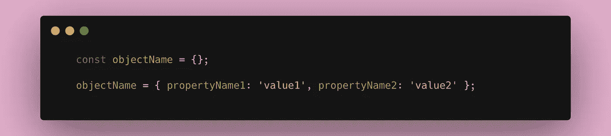
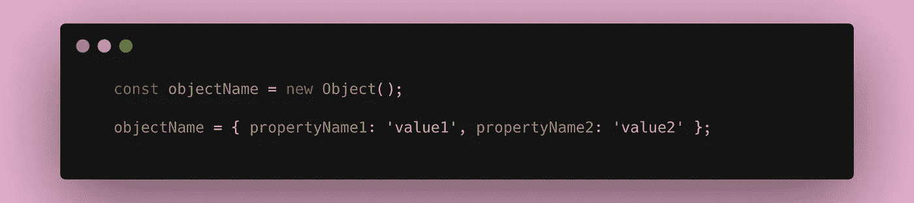
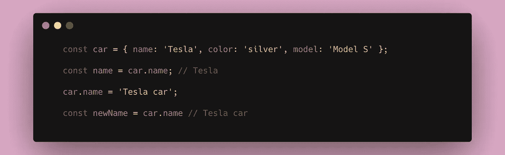
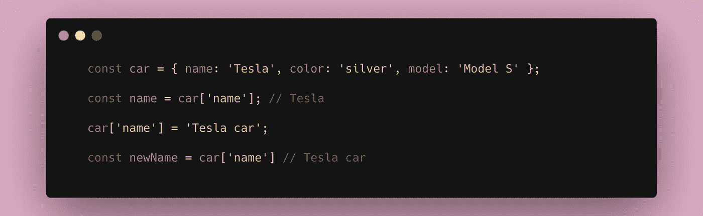
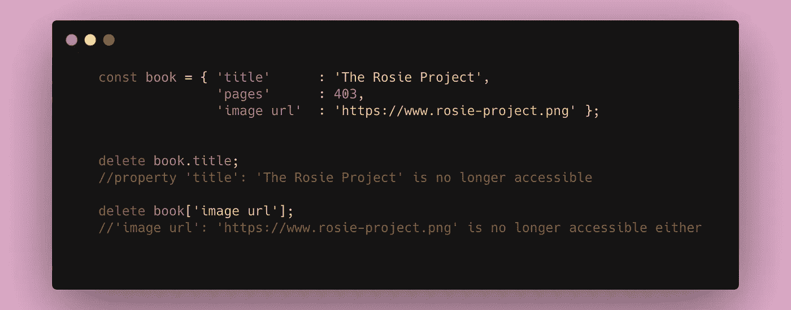
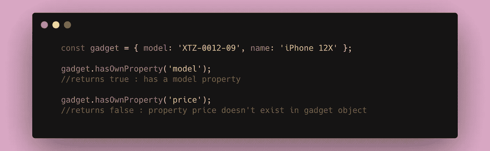
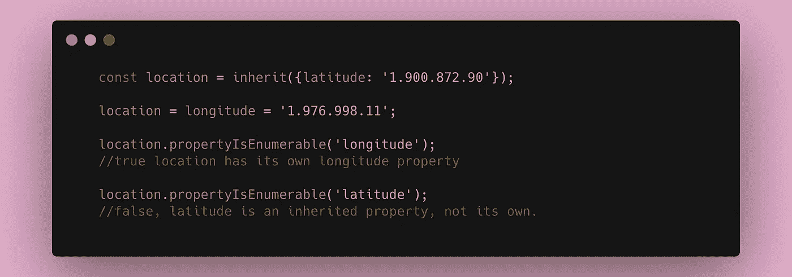
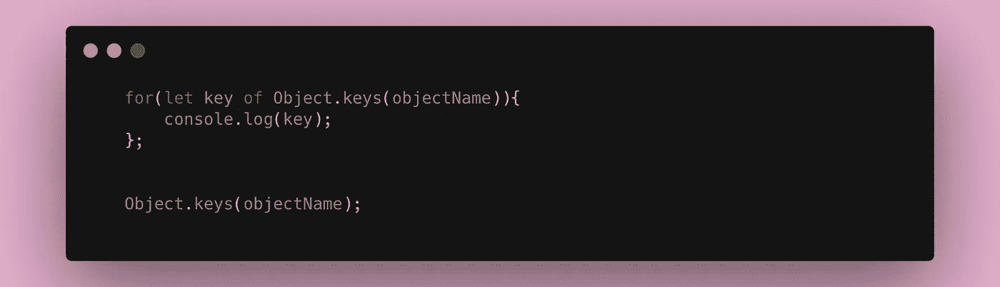
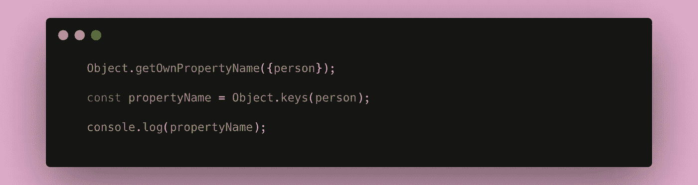

# 关于 JavaScript 对象你应该知道的 6 件重要事情

> 原文：<https://javascript.plainenglish.io/6-important-things-you-should-know-about-javascript-object-413b7609a481?source=collection_archive---------16----------------------->

## JavaScript 基础知识

## 理解 JavaScript 对象以及可以用来操作其属性的重要特性

Photo by [Ulises Baga](https://unsplash.com/@ulisesbaga?utm_source=unsplash&utm_medium=referral&utm_content=creditCopyText) on [Unsplash](https://unsplash.com/s/photos/javascript-objects?utm_source=unsplash&utm_medium=referral&utm_content=creditCopyText).

在当今时代，我们经常深入编程的复杂部分。我们经常全神贯注于追赶新的趋势，担心不知道使用最好的工具，以及学习什么编程语言。他们称这种社交焦虑为 FOMO——害怕错过。然而，了解和掌握基本原理是完善你的手艺的关键。

因此，在本文中，我们将深入探讨 JavaScript 对象的基础知识。

# 什么是对象？

根据 [MDN web docs](https://developer.mozilla.org/en-US/docs/Web/JavaScript/Guide/Working_with_Objects#:~:text=JavaScript%20is%20designed%20on%20a,or%20key)%20and%20a%20value.&text=This%20chapter%20describes%20how%20to,to%20create%20your%20own%20objects.) 中的这篇文章。

对象是属性的集合，属性是名称(或*键*)和值之间的关联。属性值可以是一个函数，在这种情况下，该属性称为方法。

# 创建对象的 3 种方法

下面将演示创建对象的不同方法:

1.  **对象字面量**:对象可以通过定义它的名字后跟一对花括号来创建。

Creating an object — object literal.

2. **new keyword:** 另一种方式是通过使用关键字 *new* 后跟 *Object()* 函数。

Creating an object — new keyword.

3. **create()函数:** ECMAScript 5 介绍了这种创建对象的方式。

Creating an object — create function.

# **分配和访问对象值的两种方式**

要检索值并分配给对象，您可以执行以下操作之一:

1.  通过使用**(。)符号**后跟对象的属性名。

Accessing and assigning value to an object — dot notation.

1.  通过使用指定对象名后跟 **([])方括号。**

Accessing and assigning value to an object — square brackets.

# 如何删除对象属性

要删除一个对象，你可以使用关键字 **delete** ，后跟对象及其属性名。

Deleting an object.

# 测试对象属性

有两种方法可用于测试对象属性:

1.  **hasOwnProperty():** 这将测试对象是否具有给定名称的自己的属性。

Testing an object — hasOwnProperty() method.

2.**propertyIsEnumerable():**如果给定的属性被定义为它自己的，而不是从另一个对象继承的，这将测试对象。

Testing an object — propertyIsEnumerable() method.

# 枚举到对象属性

要获得对象的所有属性的列表，可以使用以下命令:

1.  **为…在**循环中。

Enumerating to Object properties — for..in loop.

**2。Object.keys()** :返回可枚举对象的所有属性的数组。

Enumerating to Object properties — Object.keys().

3.**object . getownpropertymanames()**:这类似于 Object.keys，但是它返回所有的属性名，而不仅仅是可枚举的属性。

Enumerating to Object properties — Object.getOwnPropertyName().

要了解有关对象枚举的更多信息，您可以阅读这篇文章:

 [## 用 JavaScript 枚举属性和克隆对象

### 这是我参加#100DaysOfCode 挑战的第二天。你可以在这里查看我以前的文章。

medium.com](https://medium.com/@erinlejhimmy/enumerating-properties-and-cloning-an-object-in-javascript-97a39c36a506) 

# 序列化对象

序列化对象是将对象属性转换为字符串的过程。

这可以通过以下方式实现:

1.  **JSON.stringify():** 这个序列化过程会将对象属性转换为字符串，但会将方法保留为原始状态。
2.  **JSON.parse()。**

如果您想了解更多关于序列化对象的信息，您可以查看下面的这篇文章:

 [## 使用 ES6 模板字符串和 eval 序列化对象方法

### 理解 AJAX 和 JSON 操作在 JavaScript 中的工作方式将会使编写一个

medium.co](https://medium.com/@oprearocks/serializing-object-methods-using-es6-template-strings-and-eval-c77c894651f0) 

## 参考资料:

JavaScript 权威指南，第六版。

[雄辩的 JavaScript，第 3 版](https://eloquentjavascript.net/)。

你觉得这个博客有帮助吗？别忘了在评论区留下一些反馈。