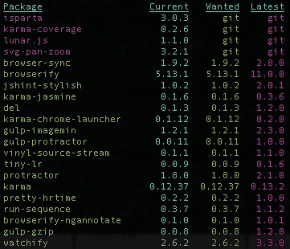

# 你可能还不知道的 6 个最有用的 NPM 命令

> 原文：<https://javascript.plainenglish.io/6-most-useful-npm-commands-that-you-may-do-not-know-d1a71e69bdf2?source=collection_archive---------3----------------------->


# 1.` npm 视图<package>`(查看信息)</package>

`npm view <package>`查看关于包的信息

```
$ npm view axios
```

仅获取关于 axios 的`version`信息(已安装的软件包):

```
$ npm view axios version> 0.19.2
```

# 2.` npm -h `(助手方法)

可执行命令可以通过`-h`选项进行搜索

```
$ npm -h
```

尤其是，`npm <command> -h`是针对特定的`<command>`获得快速帮助的命令。举个例子，

`npm install -h`显示了`install`命令的一些语法用法

```
$ npm install -h
```

# 3.` npm ls-only =<environment>`(高级` NPM 列表` )</environment>

```
npm ls --only=dev --depth=0npm ls --only=prod --depth=0
```

`npm list`是一个显示已安装软件包的有用命令

但是通常情况下，它会带来太多的安装包，并且几乎不可能看到安装包的列表

**开发环境**

```
npm ls --only=dev --depth=0 **// --depth=0 is an optional**
```

它*仅*显示您在`dev`环境中安装了什么

**生产环境**

```
npm ls --only=prod --depth=0 **// --depth=0 is an optional**
```

它*仅*显示您在`prod`环境中安装了什么

# 4.` npm 安装<package>`(安装命令)</package>

`install`是最有用和最常用的 npm 命令。`npm install <module>`命令安装指定的模块

安装 mysql 模块的命令:

```
$ npm install mysql
```

# 5.` npm 移除<package>`(移除命令)</package>

`npm remove <module>`删除已安装的模块(与`install`命令相反)

```
$ npm remove mysql
```

另外，`npm uninstall <module>`删除已安装的模块

```
npm uninstall mysql
```

# 6.` npm 已过时`(显示已安装软件包的版本)

可以使用`npm outdated`找到可用的更新包:



如果`Current` & `Wanted`不同，需要更新

**只更新*某些包*:**

```
$ npm update [package name]
```

**更新*所有*包:**

```
$ npm update
```

> 谢谢大家！

## **用简单英语写的 JavaScript**

喜欢这篇文章吗？如果有，通过 [**订阅我们的 YouTube 频道**](https://www.youtube.com/channel/UCtipWUghju290NWcn8jhyAw) **获取更多类似内容！**