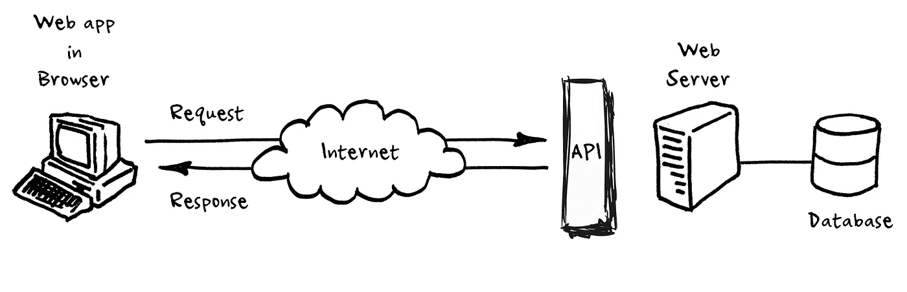
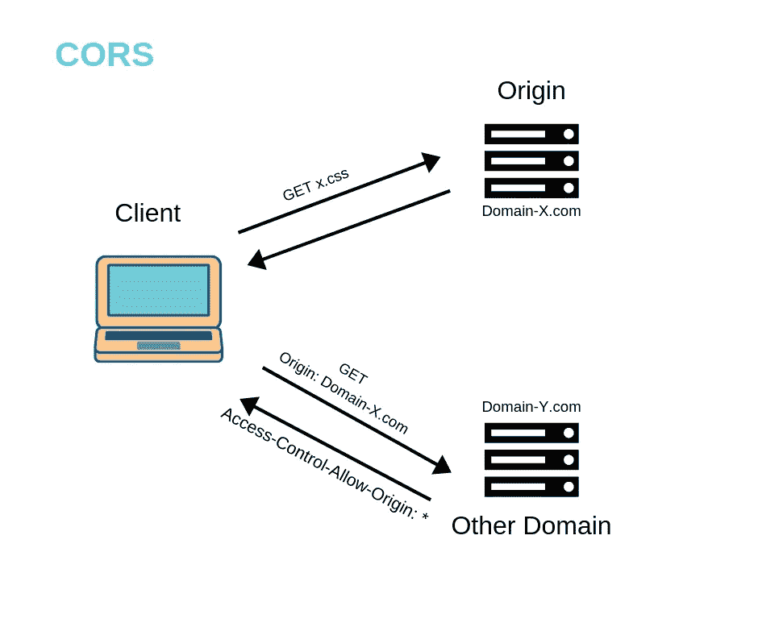
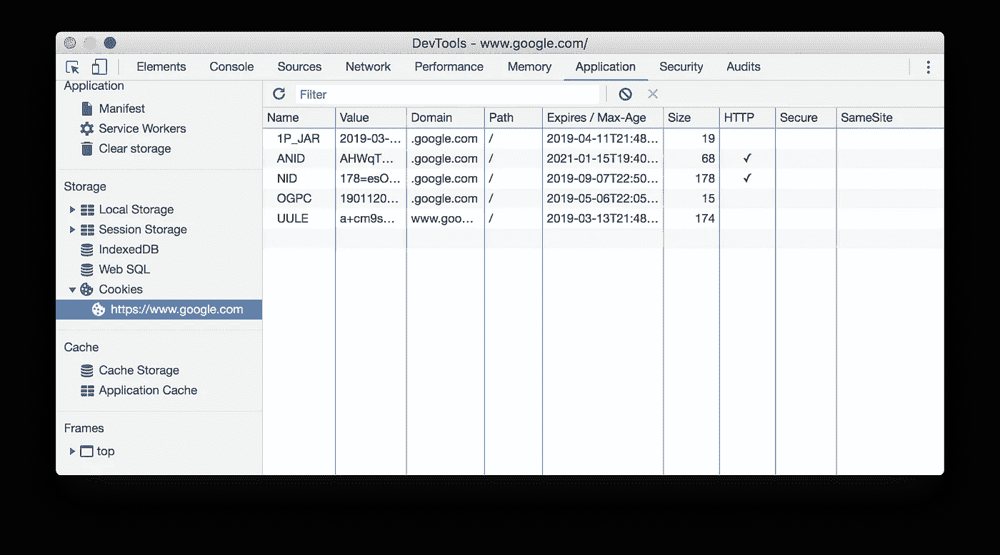
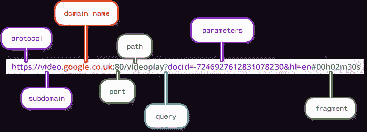

# 关于跨源资源共享的 6 件必知之事(CORS)

> 原文：<https://javascript.plainenglish.io/6-must-know-things-about-cross-origin-resource-sharing-cors-aaca9703c904?source=collection_archive---------0----------------------->


## TLDR；

由于**同源政策，没有 **CORS，**网站**被**限制只能**访问**来自同一域名的**资源。换句话说，如果没有 CORS，我们无法请求 Spotify(不同来源的服务器)提供的 API 数据，因为我的网站`www.gplee.com`与`www.spotify.com`不是同一个来源


总之， **CORS** 比纯粹的同源请求允许更多的自由和功能，但比简单地允许所有跨源请求更安全



# 1.什么是跨源资源共享(CORS)？

CORS 是一种**安全机制**，允许来自一个域或来源的网页访问不同域的资源(**跨域请求)**

如果没有像 CORS 这样的功能，网站就会被限制只能通过所谓的同源策略访问来自同一来源的资源

经常有这样的情况，你需要对`https://api.mydomain.com`或`https://mydomain`进行 AJAX(即 Axios)调用，整合你的 Node.js 服务器或一些第三方字体或分析提供商，如 Google Analytics。**跨源资源共享(CORS)** 支持这些跨域请求

> 允许跨域请求，绕过同源策略



# 2.什么是**同源政策？**

**同源策略**是一个关键的安全机制，它限制从一个源加载的文档或脚本如何与另一个源的资源交互

它有助于隔离潜在的**恶意**文档，减少可能的攻击媒介，如 **CSRF 攻击**

> 同源策略是 web 应用的安全模型


# 3.什么是跨域漏洞？

**同源策略**通过将 HTTP 调用限制在同一来源(即浏览器选项卡的域)，关闭了一些黑客后门，如跨站点请求伪造(CSRF) (CSRF 令牌仍然是必要的)

浏览器允许网站以 cookies 的形式将信息存储在客户的计算机上



**饼干的优点【在 CORS 的背景下】**

*   浏览器存储 cookie(如 cookie 的名称、创建时间、用户信息等信息)，因此每当用户向可访问该 cookie 的域发出请求时，cookie 就会被发送到该域的服务器
*   不需要不断从服务器检索用户信息；方便我们在客户端(用户的浏览器)存储和检索信息

```
Cookie: cookiename=chocolate;
Domain=.bakery.com; 
Path=/ [//  ;otherDdata]
```

**饼干的缺点【在 CORS 的语境下】**

*   `malicious-site.com`可以在用户不知情的情况下将这些 cookies 发送给`your-bank.com`
*   如果您访问了恶意网站，并且没有同源策略，恶意用户可以下订单从您的帐户向他的帐户转移 1000 美元，您可能不喜欢这样😞

# 4.“起源”的定义是什么？

在这一点上，有人可能想知道**起源**的定义🤔

**来源**包括协议、域和端口的组合。换句话说，

以下 URL 是不同的来源

```
[https://www.google.com](https://www.google.com) vs. https://www.**api**.google.com[http://localhost:9000](http://localhost:9000) vs. [http://localhost:8080](http://localhost:8080)
```

虽然以下 URL 是相同的来源

```
[http://w](http://localhost:9000)ww.example.com/dir/page.html 
vs. 
[http://w](http://localhost:9000)ww.example.com/dir/page2.html
```



# 5.CORS 是如何运作的

有两种类型的 CORS 请求

1.  简单的请求
2.  预检请求

**1。简单的请求**

不需要飞行前请求的 CORS 请求

**第一步**

向`https://www.mydomain.com`打开的浏览器标签向`https://api.domains.com/widgets`发起 AJAX 请求`GET`

**第二步**

除了添加像`Host`这样的头之外，浏览器还会自动为跨源请求添加`Origin`请求头

**第三步**

服务器检查`Origin`请求头。如果允许原始值，它将`Access-Control-Allow-Origin`设置为请求报头`Origin`中的值

**第四步**

当浏览器收到响应时，浏览器会检查`Access-Control-Allow-Origin`标题，看它是否与选项卡的原点匹配

否则，响应将被阻止

```
**Access-Control-Allow-Origin: *** allows all origins
--> a large security risk
```

**2。预检请求**

预触发请求是一种 CORS 请求，在发送请求之前，浏览器需要发送一个**预触发**请求，请求被**预触发以询问服务器是否允许原始 CORS 请求继续进行**

**如果**出现以下情况，任何 CORS 请求都必须被预先审核

*   **AJAX 调用将 JSON 数据发布到 REST API，意思是** `**Content-Type**` **头是** `**application/json**` **→ RESTful API 请求**
*   AJAX 调用一个 API，该 API 使用一个令牌来验证请求头中的 API，如`Authorization` → **使用令牌授权请求**

**第一步**

浏览器首先发送`OPTIONS`请求(也称为预检请求)

**第二步**

服务器返回指定允许的 HTTP 方法和头。如果最初的 CORS 请求打算发送列表中没有的报头或 HTTP 方法，**失败**

**第三步**

由于**头和方法**通过了检查`200 OK`，浏览器发送原始的 CORS 请求(请求中的`Origin`头)

**第四步**

响应在`Access-Control-Allow-Origin`标题中有正确的来源，因此检查通过，控制权交还给浏览器选项卡

# 6.如何使用 Node.js 实现 CORS

**对于语言和后端框架，实现请求头以设置 CORS 是不同的**

我们将使用 Node.js / Express。

**第一步**

安装 CORS 中间件:

```
$ npm install cors
```

# 就是这样！

## **简单英语的 JavaScript**

喜欢这篇文章吗？如果有，通过 [**订阅我们的 YouTube 频道**](https://www.youtube.com/channel/UCtipWUghju290NWcn8jhyAw) **获取更多类似内容！**