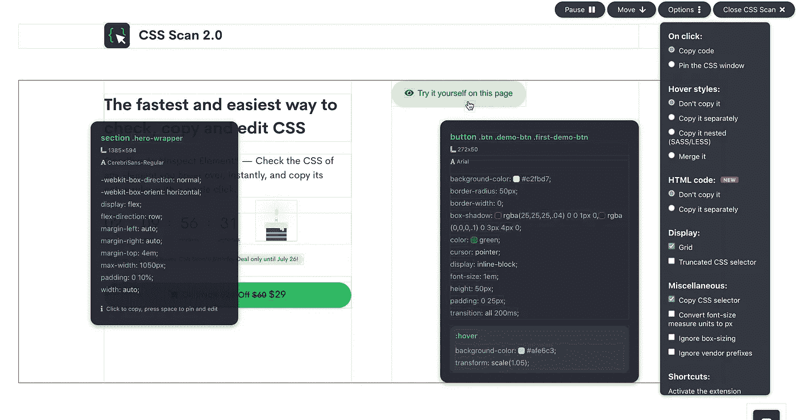
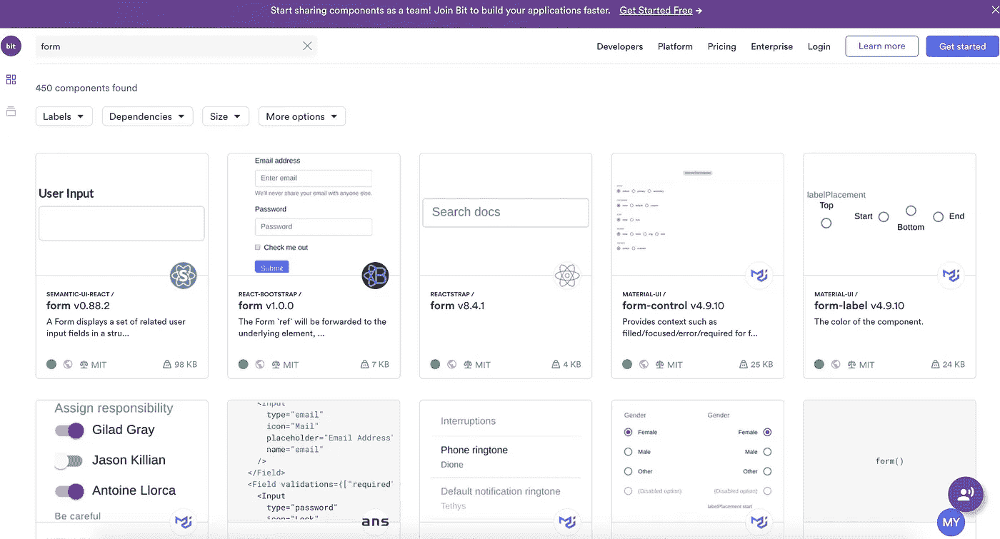
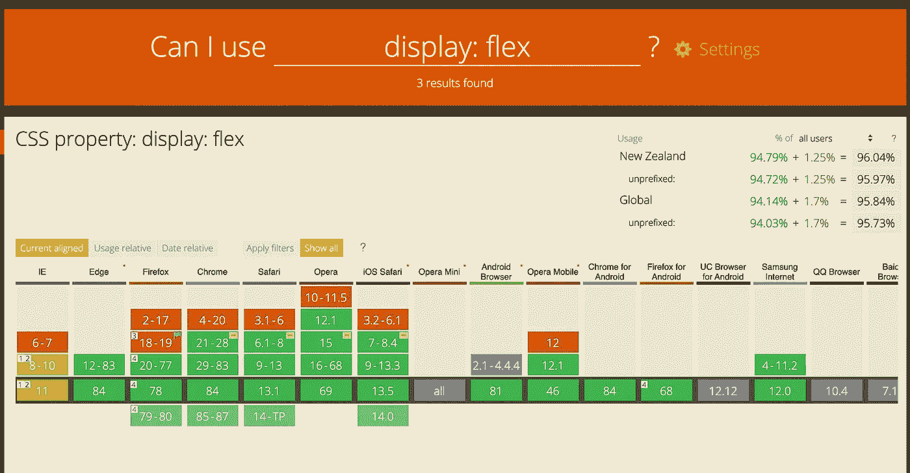
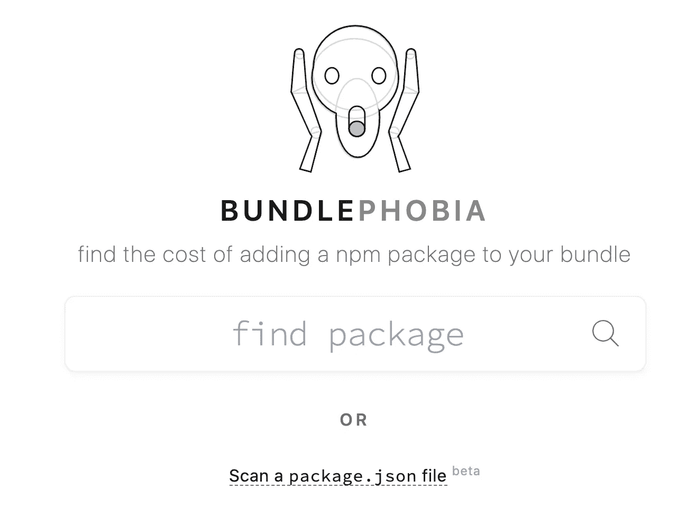
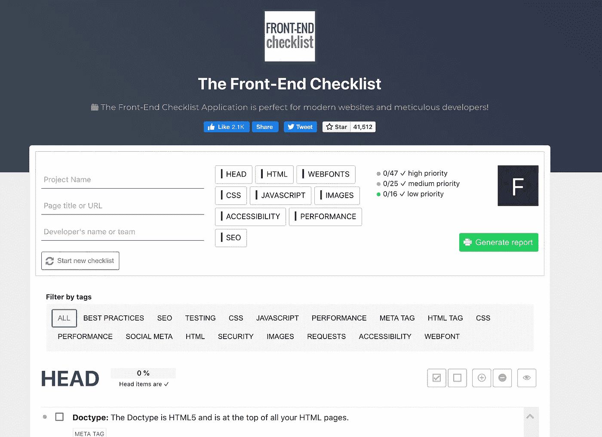
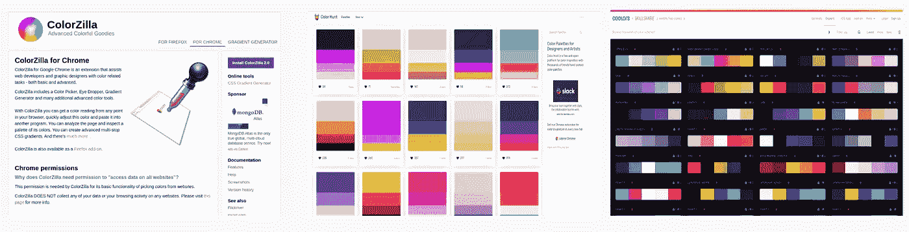
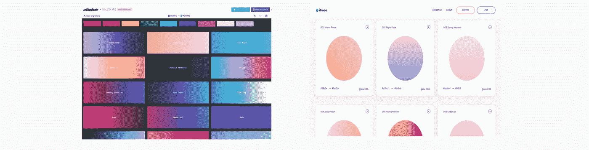
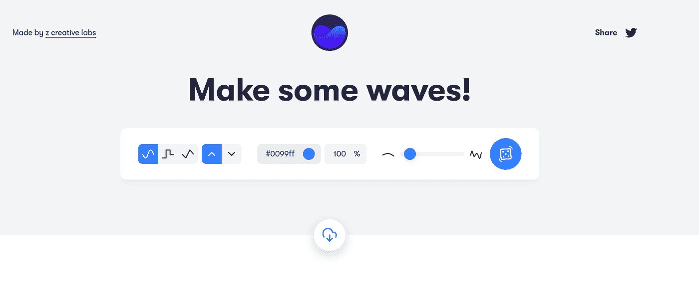

# 面向前端开发人员的 6 种生产力工具

> 原文：<https://javascript.plainenglish.io/6-productivity-tools-for-front-end-developers-d9981cba7f13?source=collection_archive---------0----------------------->

## 提高前端开发人员生产力的 6 个工具。

今天，我想与您分享我作为前端开发人员提高工作效率的日常工具。

Not my tools, but it could bePhoto by [Todd Quackenbush](https://unsplash.com/@toddquackenbush?utm_source=unsplash&utm_medium=referral&utm_content=creditCopyText) on [Unsplash](https://unsplash.com/s/photos/tools?utm_source=unsplash&utm_medium=referral&utm_content=creditCopyText)

# # 1:[sizy](http://sizzy.co/mariequittelier)

让你的网站反应灵敏(几乎)没有痛苦，使用 Sizzy！在我作为网站开发人员的第一次经历中，我的任务是改进网站的响应站点。这是一堂很好的 CSS 学习课。但是，每次我做出改变时，切换到移动视图也是一件痛苦的事情。就是在那个时候我开始使用[sizy](http://sizzy.co/mariequittelier)。

并且，[sizy](http://sizzy.co/mariequittelier)是我喜欢上的工具之一，因为它节省了我的时间。这不是一个免费的工具，但它是值得的！现在，让我们停止谈话，开始吃吧。一张截图，你就会明白这个工具的美妙之处:

然而，你应该记住，Sizzy 不是一个跨浏览器兼容性检查。由于它不模拟不同的浏览器渲染引擎，所以与真实设备检查可能会有一些细微的差异。

# #2: [获取 css 扫描](https://getcssscan.com/)

另一个不免费，但确实不错的工具: [GetCssScan](https://getcssscan.com/) 。这就像是对 css 的扫描。因此，它将允许你快速检查你的网页上的任何元素的 css。它作为一个附加组件工作，有一些很棒的特性，比如允许你显示网格或者显示悬停样式

Get CSS Scan

# #3: [Bit 和 Bit.dev](https://bit.dev/)

花几个小时在这个部件上？使其可重复使用！这是 Bit 背后的唯一目的。 [Bit](https://bit.dev/) ( [Github](https://github.com/teambit/bit) )让您可以轻松地从代码库中“收获”组件，并将其共享到 [bit.dev](https://bit.dev/) 中的一个集合(库)中。

> Bit 是组件协作平台。Bit 通过提供一个在应用程序之间和存储库之间共享组件的生态系统来利用组件的可重用性。

将您的组件上传到 bit 非常容易，然后，稍后，在另一个项目中重用它们。一些组件也是公开的，所以请随意查看其他开发人员的工作。

# 第四名:犬类

我不确定我是否需要展示这个，因为每个人都知道它。但是，如果没有这个工具，这篇文章是不完整的。跨浏览器兼容可能很困难，几乎和响应度一样困难。我可以用它来帮助你在浏览器中导航吗？

Can I use being used

# #5:恐束症

我有时候用的一个东西是[捆绑恐惧症](https://bundlephobia.com/)。它允许我找到添加一个包的成本。当你不得不在两个不同的软件包中选择时，或者当你想看看(并改善)你的网站性能时，这是很有用的。

Bundle Phobia

用法很简单，要么选择您的包，要么扫描您的 package.json 文件。如果您扫描 package.json 文件，您将能够根据大小对您的包进行排序，最重的包可能不是您所期望的！

# #6:前端清单

我刚刚发现的一个新工具是[前端清单](https://frontendchecklist.io/)。顾名思义，这是一个清单。它集中在所有的最佳实践和你需要在启动网站之前确保你拥有的东西。这是很普通的东西，但是有太多的东西需要记住，没有人会后悔快速复查！

# #奖励:设计工具

让我们以这个额外收获结束:一些可能有用的设计工具的列表

## 💅对于颜色和形式:

喜欢网站上的那个颜色，用 [ColorZilla](https://www.colorzilla.com/chrome/) 找。现在你有了主色，你想选择适合它的颜色，使用 [Colorhunt](https://colorhunt.co) 或[coolors.co](https://coolors.co/browser/)。

你想使用渐变。 [Uigradients](https://uigradients.com/) 和 [Webgradients](https://webgradients.com) 为你而来！

如果你想做 waves，并且自定义它，你可以使用 [Get Waves](https://getwaves.io/) 。

## 👀图标或表情符号

对于图标和表情符号，你有很多选择。我个人最喜欢的是[名词项目](https://thenounproject.com/)和[表格图标](https://tablericons.com/)。但是也有:

*   [材料](https://material.io/resources/icons/?style=baseline)
*   [Fontawesome](https://fontawesome.com/)
*   [扁平图标](https://www.flaticon.com/)
*   [图标](https://icomoon.io/)
*   [SVGRepo](https://www.svgrepo.com/)
*   [EmojiPedia](https://emojipedia.org/)
*   [羽毛图标](https://feathericons.com/)
*   [图案搜索](http://glyphsearch.com)

🖼️ **图片:**

说到图像，也有很多工具。例如您可能需要压缩它们([图像压缩器](https://imagecompressor.com/)、 [Compressor.io](https://compressor.io/) 或[压缩](https://compressjpeg.com/))。不要忘记使用版权免费的图像。您可以在这里找到一些:[uiface](https://uifaces.co/)、 [Pexel](https://www.pexels.com/fr-fr/) 、 [Unsplash](https://unsplash.com/) 或[many pixel](https://www.manypixels.co/gallery/?)。

**🎨灵感:**

有时，模型并不真正清晰。所以有很多网站可以找到你的灵感。以下为非详尽列表:

*   [Pinterest](http://www.pinterest.fr/)
*   [运球](https://dribbble.com/)
*   [Uimovement.com](https://uimovement.com)
*   [愈伤组织](https://calltoidea.com)
*   [帕拉忍者](https://www.lapa.ninja/)
*   [aww ARDS](http://www.awwwards.com/)
*   [行为](http://www.behance.net/)
*   [界面](https://interfaces.pro/)
*   [土地册](https://land-book.com/)

**那么，你呢？有什么让你的生活更简单的工具你想分享吗？请随意分享！**

## 简单英语中的 JavaScript

喜欢这篇文章吗？如果是这样，通过 [**订阅解码获得更多类似内容，我们的 YouTube 频道**](https://www.youtube.com/channel/UCtipWUghju290NWcn8jhyAw) **！**