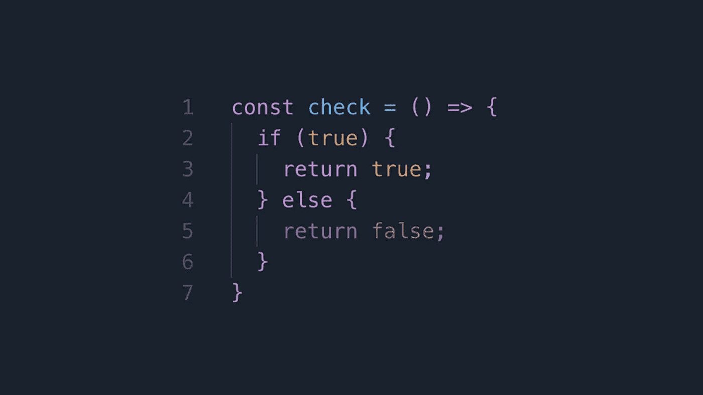

# 提高条件语句可读性的 6 个技巧

> 原文：<https://javascript.plainenglish.io/6-tips-to-improve-your-conditional-statements-for-better-readability-56256c5a5245?source=collection_archive---------0----------------------->

## 如果你希望你的代码干净，尽量避免条件语句。



对于条件语句，您不必总是使用经典的 if/switch 语法。这实际上取决于你工作的环境。

ES6 给你更多的能力来编写更好的条件语句。它更短更干净。

这就是我将在本文中向您展示的——根据上下文改进条件语句的 6 种方法。

继续读。

# 1.提前返回而不是 if…else

嵌套条件难看，难控制，容易产生 bug。如果有多层嵌套块，像 Macbook 13 ' '这样的小屏幕无法显示完整的代码行。你有时必须水平滚动才能看到整个代码，这并不能满足你。

```
const isBabyPet = (pet, age) => {
  if (pet) {
    if (isPet(pet)) {
      console.log(‘It is a pet!’);

      if (age < 1) {
        console.log(‘It is a baby pet!’);
      }
    } else {
      throw new Error(‘Not a pet!’);
    }
  } else {
    throw new Error(‘Error!’);
  }
};
```

那么，如何展平嵌套条件呢？早点回来。具体来说，如果有错误或无效的东西，应该在函数开始时返回。

```
const isBabyPet = (pet, age) => {
  if (!pet) throw new Error(‘Error!’);
  if (!isPet(pet)) throw new Error(‘Not a pet!’);

  console.log(‘It is a pet!’); if (age < 1) {
    console.log(‘It is a baby pet!’);
  }
};
```

# 2.使用数组. includes

假设您需要检查动物是否是宠物，如下所示:

```
const isPet = animal => {
  if (animal === ‘cat’ || animal === ‘dog’) {
    return true;
  }

  return false;
};
```

如果收集的宠物只包括猫和狗，那就可以了。但是如果它有更多呢？像猫，狗，鸟，蛇。这样的例子不胜枚举。当然，您可以添加更多的 **||** 操作符来完成任务。然而，我得到了一个更好的方式:

```
const isPet = animal => {
  const pets = [‘cat’, ‘dog’, ‘snake’, ‘bird’];

  return pets.includes(animal);
};
```

你看，比用 more ||运算符好看。因此，对于上述多个条件，使用 Array.includes

# 3.使用默认函数参数

我们通常确保参数不为空或未定义。如果它是 null，我们需要在使用它之前给它分配一个默认值。

```
const isBabyPet = (pet, age) => {
  if (!pet) pet = ‘cat’;
  if (!age) age = 1; if (age < 1) {
    // Do something
  }
};
```

我们真的需要写前两个 if 语句吗？不可以。通过使用默认值，您可以删除它们。

```
const isBabyPet = (pet = ‘cat’, age = 1) => {
  if (age < 1) {
    console.log(‘baby’);
  }
};
```

# 4.使用 Array.every

如果给你一组宠物，并要求你检查所有的宠物是否都有四条腿，那会怎样？

通常，我们将按如下方式操作:

```
const pets = [
  { name: ‘cat’,   nLegs: 4 },
  { name: ‘snake’, nLegs: 0 },
  { name: ‘dog’,   nLegs: 4 },
  { name: ‘bird’,  nLegs: 2 }
];const check = (pets) => {
  for (let i = 0; i < pets.length; i++) {
    if (pets[i].nLegs != 4) {
      return false;
    }
  } return true;
}check(pets); // false
```

这里我们有一个针对 T3 的 T2 和一个针对 if T5 的 T4 语句。这不是很多，但如果我们能摆脱他们，这仍然是伟大的。事实上，我们只用一行代码就可以完成任务:

```
let areAllFourLegs = pets.every(p => p.nLegs === 4);
```

很大的进步，不是吗？

# 5.使用 Array.some

让我们稍微改变一下任务。现在我们将检查是否至少有一只宠物有四条腿。是时候使用数组了

```
let check = pets.some(p => p.nLegs === 4);
```

# 6.使用索引代替开关…大小写

下面的 switch 语句将返回给定普通宠物的品种。

```
const getBreeds = pet => {
  switch (pet) {
    case ‘dog’:
      return [‘Husky’, ‘Poodle’, ‘Shiba’];
    case ‘cat’:
      return [‘Korat’, ‘Donskoy’];
    case ‘bird’:
      return [‘Parakeets’, ‘Canaries’];
    default:
      return [];
  }
};let dogBreeds = getBreeds(‘dog’); //[“Husky”, “Poodle”, “Shiba”]
```

有**情况…返回**、**情况…返回**，以及**情况…再次返回**。我是一名程序员，也是一名作家，所以我觉得重复有点无聊。看看下面更干净的方法。

```
const breeds = {
  ‘dog’: [‘Husky’, ‘Poodle’, ‘Shiba’],
  ‘cat’: [‘Korat’, ‘Donskoy’],
  ‘bird’: [‘Parakeets’, ‘Canaries’]
};const getBreeds = pet => {
  return breeds[pet] || [];
};let dogBreeds = getBreeds(‘cat’); //[“Korat”, “Donskoy”]
```

如果你和我一样，你会喜欢第二种方法，而不是第一种。

就是这样。使用条件语句时要灵活。

我错过了什么更好的方法吗？如果有，请在下面的评论中告诉我。

希望你喜欢这篇文章。

## 进一步阅读

[](https://medium.com/javascript-in-plain-english/15-simple-coding-techniques-to-get-your-tasks-done-with-shorter-code-in-javascript-59d46801db0) [## 15 种简单的编码技术，用更短的 JavaScript 代码完成任务

### 不要浪费时间写长代码，而你可以把它写得更短，更清晰，更易读。

medium.com](https://medium.com/javascript-in-plain-english/15-simple-coding-techniques-to-get-your-tasks-done-with-shorter-code-in-javascript-59d46801db0)