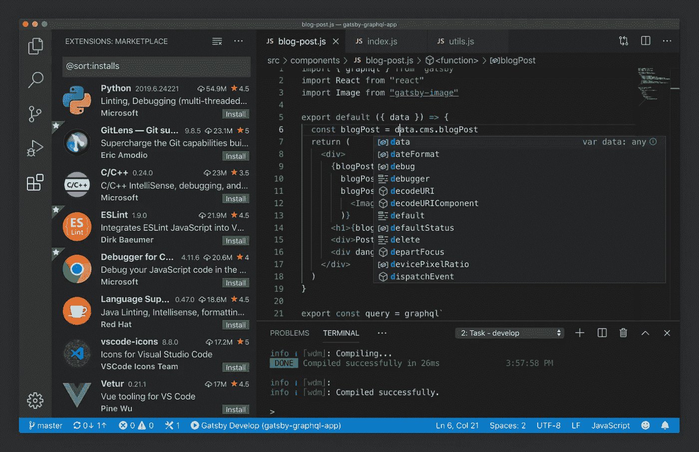

# 我在网络开发中使用的 6 个工具

> 原文：<https://javascript.plainenglish.io/6-tools-i-use-for-web-development-4d96c6db3c28?source=collection_archive---------2----------------------->

## 所有这些工具都是我在开发软件时日常使用的

Photo by [Todd Quackenbush](https://unsplash.com/@toddquackenbush?utm_source=unsplash&utm_medium=referral&utm_content=creditCopyText) on [Unsplash](https://unsplash.com/s/photos/tools?utm_source=unsplash&utm_medium=referral&utm_content=creditCopyText)

我将在本文中讨论的所有六种工具都是我日常使用的。有些你可能已经用过了，有些你可能还不知道，但是所有这些都让我成为一个更有效率和更有组织的开发者。因此，让我们直接使用第一个工具吧！

## 概念

[https://www.notion.so/](https://www.notion.so/)

我尝试了很多不同的工具(Trello、OneNote 等。)，但是它们都没有我所希望的灵活性和可定制性。然后我发现了观念，那么什么是观念呢？

它自称为“一体化工作空间”。你可以把它当作看板，用来记笔记，安排你的一天，把它当作一个 wiki，以及许多其他的任务。我主要用它来组织我的文章和项目。写下我何时在哪个平台上发表了一篇文章，以及该文章目前处于何种状态(已发表、有想法、正在研究、正在进行等)。).我也将我所有的研究与我的文章和项目联系起来，并为未来的项目和文章写下想法。使用概念，为自己设定截止日期，甚至与朋友和同事分享数据，真的很容易。移动应用程序和桌面应用程序都非常用户友好，可以根据您的需求进行定制。我强烈推荐检查这个工具。

[来源](https://www.notion.so/)

## GitHub 桌面

[https://desktop.github.com](https://desktop.github.com)

大约一年前，我偶然发现了 GitHub Desktop，它让我在处理 git 存储库时变得简单多了。它有一个漂亮干净的用户界面，让你只需点击一个按钮就可以导入一个现有的存储库。

如果您是 git CLI 老手，那么这可能不适合您。但是，如果您对 CLI 已经有足够的了解，并且希望在使用 git 时有良好的用户体验，那么这个应用程序就是为您而设计的。

[来源](https://desktop.github.com)

## 码头工人

[https://www.docker.com/](https://www.docker.com/)

自从 2013 年 3 月发布以来，Docker 是许多公司开发过程中的一个主要部分。我在我的私人项目中使用它，不仅是为了将我完成的应用程序容器化，也是为了将我的本地开发容器化。

例如，开发一个带有 MongoDB 容器化的 Express API 有助于您摆脱通常的“它在我的机器上工作”的问题。你可以对接前端应用程序，如 React，Angular 等。，也是。

如果您还没有尝试过，请尝试一下。开发时，它会让您的生活变得更加轻松！

[来源](https://www.docker.com/)

## VS 代码

[https://code.visualstudio.com/](https://code.visualstudio.com/)

我觉得 VS 代码不需要任何介绍。在切换到它之前，我使用了各种编辑器和 IDE(Atom、Notepad++和 vim 等)。).真正简单的设计，高度的可定制性，以及真正集成的市场和大量可供选择的扩展最终赢得了我的心。

如果你想知道我每天都在使用哪些扩展，那就看看我的这篇文章:[“8 VS 代码扩展我每天都在使用”](https://medium.com/javascript-in-plain-english/8-vs-code-extensions-i-use-daily-9793bd1f4d97)。

[来源](https://code.visualstudio.com/)

## 邮递员

[https://www.postman.com/](https://www.postman.com/)

当开发一个应用编程接口时，你会希望测试你已经构建了什么。这正是邮递员发挥作用的时候。

我知道有很多不同的替代邮差，但我坚持它，因为我真的很喜欢它的外观和感觉。此外，如果您想在类似 CI/CD 管道的环境中使用您的测试，保存集合并导出它们的能力也很有用。

用你的一个 API 试试看，保存你的请求并重用它们，导入和导出它们，让我知道你对这个工具的想法。

[来源](https://www.postman.com/)

## iTerm 2(maco)

我列表中的最后一个工具是我当前的终端仿真器。它有许多漂亮的小功能，总之，使它成为一个伟大的终端。

例如，它内置了搜索和自动完成功能。我知道我说了很多，但它也是高度可定制的。总的来说，这只是一个令人敬畏的开放源码软件！

如果您正在使用苹果操作系统，那就试试吧！

[来源](https://iterm2.com/)

## 结论

本文到此为止，我希望这将帮助您从现有的大量不同工具中选择适合您工作的工具。让我知道您对这六种工具的看法，以及您每天使用的工具。

[Subscribe to Decoded, our official YouTube channel!](https://www.youtube.com/channel/UCtipWUghju290NWcn8jhyAw)