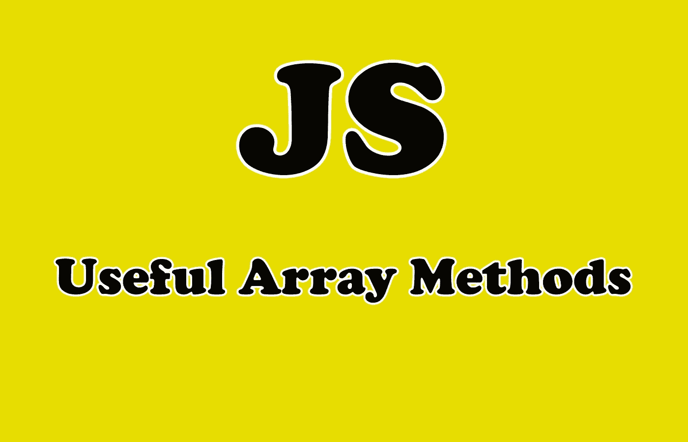

# 每个初学者都应该知道的 6 个有用的 JavaScript 数组方法

> 原文：<https://javascript.plainenglish.io/6-useful-javascript-array-methods-every-beginner-should-know-35f1db5e8491?source=collection_archive---------7----------------------->

## 强大的 JavaScript 初学者数组方法和实际例子


Photo by [Shamin](https://unsplash.com/@haky?utm_source=medium&utm_medium=referral) on [Unsplash](https://unsplash.com?utm_source=medium&utm_medium=referral)

# 介绍

JavaScript 中的数组非常有用和重要，它们主要用于存储和操作数据。在 JavaScript 中使用这种类型的数据结构非常简单，特别是当您使用 ES6 这样的语言的新特性作为例子时。数组是类似列表的对象，其原型具有执行遍历和变异操作的方法。

在本文中，我们将探索一些您应该知道的 JavaScript 中有用的数组方法。让我们开始吧。



Image Created with ❤️️ By [Mehdi Aoussiad](https://mehdiouss315.medium.com/).

# 1.推送方法

JavaScript 中的方法`push()`使您能够将元素添加到数组的末尾。让我们试一试。

看看下面的例子:

```
let arr = [ 1, 2, 3 ];
arr.**push(4)**;
console.log(arr); //Prints: [ 1, 2, 3, 4 ]
```

如你所见，我们在数组末尾添加了数字 4。您可以像上面那样添加任何其他数据类型。

# 2.流行方法

JavaScript 中的方法`pop()`移除数组的最后一个元素。

看看下面的例子:

```
let arr = [ 1, 2, 3, 4 ];

arr.**pop();**

console.log(arr)

// output [ 1, 2, 3 ];
```

对于方法`push`的同一个例子，我们使用方法`pop()`删除了数字 4。

# 3.移位和非移位方法

方法`shift()`与`pop`相反。它移除 JavaScript 中数组的第一个元素。让我们试一试。

看看下面的例子:

```
let arr = [ 1, 2, 3, 4 ];

arr.**shift()**;

console.log(arr)

// [ 2, 3, 4 ];
```

如您所见，方法`shift`移除了数组的第一个元素。另一方面，方法`unshift()`在 JavaScript 中向数组的开头添加一个元素。

让我们看看下面的例子:

```
let arr = [ 1, 2, 3 ];

arr.**unshift('hello')**;

console.log(arr);

// [ 'hello' , 1, 2, 3 ];
```

正如你在上面的例子中看到的，我们使用方法`unshift()`在数组的开头添加了一个字符串`hello`。

# 4.连接方法

方法`join()`允许您在 JavaScript 中将数组转换为字符串。它将所有数组元素连接成一个字符串。除此之外，您还可以指定分隔符。让我们试一试。

```
var fruits = ["Banana", "Orange", "Apple", "Mango"];
var joinedStr = fruits.**join(" * ")**;console.log(joinedStr); //Output: Banana * Orange * Apple * Mango
```

如您所见，我们使用带有星号`*****`的方法`join`加入了水果数组，这将把我们的数组转换成一个字符串，并在元素之间放置一个星号。在本例中，我们指定星号`*`作为分隔符。

这是另一个例子，我们用一个空字符串作为分隔符来连接同一个数组。

```
var fruits = ["Banana", "Orange", "Apple", "Mango"];
var joinedStr = fruits.**join(" ")**;console.log(joinedStr); //Output: Banana  Orange  Apple  Mango
```

我想你现在明白了，很简单。顺便说一下，您也可以使用流行的方法`toString()`将数组转换为字符串。

```
var fruits = ["Banana", "Orange", "Apple", "Mango"];
var str = fruits.**toString()**;console.log(str); //Output: Banana,Orange,Apple,Mango
```

# 5.该拼接方法

方法`splice()`可以在 JavaScript 中添加和删除数组中的元素。它接受三个参数:

1.  第一个参数(start)指定应该插入或移除元素的索引。
2.  第二个参数指定从提供的起始索引开始要移除的元素总数。
3.  第三个参数指定要添加到数组中的元素。

这里有一个例子:

```
let friends = ['Ope', 'Dupe', 'Ola'];//Adds Ayobami at the array of friends at index 3\. And removes 0(nothing).friends.**splice(3, 0, 'Ayobami')**; // Ope, Dupe, Ola, Ayobami
```

这是非常强大的，因为我们能够在数组的任何索引处添加和删除元素。

# 6.切片法

方法`slice()`用于复制数组的片段。你也可以复制整个数组。

slice 方法选择从给定的 ***开始*** 参数和 ***结束*** at 参数开始的元素，但不包括给定的*结束*参数。它有两个参数，开始和结束索引。

看看下面的例子:

```
var fruits = ["Banana", "Orange", "Lemon", "Apple", "Mango"];
var citrus = fruits.slice(1, 3);Console.log(citrus); // Output: ["Orange", "Lemon"]
```

注意，不考虑结束索引(它只打印索引 1 和 2)。

# 结论

正如您所看到的，我们没有涵盖 JavaScript 中的所有数组方法。然而，当你掌握了这些有用的方法，你就会明白如何在 JavaScript 中轻松地操作和使用数组。

感谢您阅读本文，希望您觉得有用。

# 进一步阅读

[](https://medium.com/javascript-in-plain-english/top-10-javascript-string-methods-you-should-know-975a05bca0d6) [## 您应该知道的 10 大 JavaScript 字符串方法

### 10 种 JavaScript 字符串方法及实例

medium.com](https://medium.com/javascript-in-plain-english/top-10-javascript-string-methods-you-should-know-975a05bca0d6)