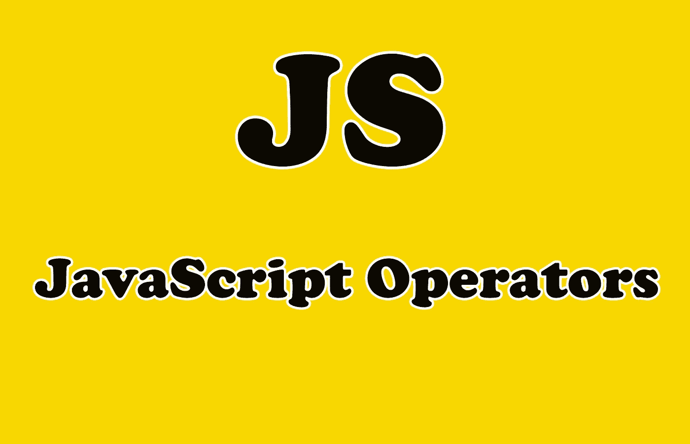

# 你应该知道的 6 个有用的 JavaScript 操作符

> 原文：<https://javascript.plainenglish.io/6-useful-javascript-operators-that-you-should-know-1c2cbcd8a6f?source=collection_archive---------10----------------------->

## 实用的 JavaScript 操作符和实例


Photo by [Arnold Francisca](https://unsplash.com/@clark_fransa?utm_source=medium&utm_medium=referral) on [Unsplash](https://unsplash.com?utm_source=medium&utm_medium=referral)

# 介绍

JavaScript 中的运算符非常有用，也非常重要。他们可以做各种各样的事情，并采取许多不同的形式。JavaScript 中有几个不同的操作符家族，但是今天我们将关注那些对 web 开发最有用的。

在本文中，我们将通过实际例子探索 JavaScript 中一些有用的操作符。让我们开始吧。



Image Created with ❤️️ By [Mehdi Aoussiad](https://mehdiouss315.medium.com/).

# 1.赋值运算符

赋值操作符`**=**` 是 JavaScript 中你必须知道的基本操作符之一。赋值运算符将右边的值赋给左边的值。除了(`=`)之外，还有许多赋值操作符是有用的**简写**。

看看下面的例子:

```
// Assign a value to a new variable
var variable = 0;

// Shorthand to increase variable's value by 1
variable += 2;// Shorthand to decrease the variable's value by 1
variable -= 1;// Our variable is at 1
console.log(variable);

// Shorthand to multiply a value into variable
variable *= 2;// Shorthand to divide variable by value
variable /= 2;// Our variable is at 1
console.log(variable);
```

这些速记赋值操作符让我们不必写两次变量。例如，不写`variable = variable +1`，我们可以写`variable += 1`或`variable++`。

# 2.比较运算符

另一类运算符叫做比较运算符。它们用于比较两个值。其中一些操作符是:`**>**`、`**<**`、`**≥**`和`**≤**`。

这些运算符根据我们比较的值返回一个布尔值(真/假)。看看下面的例子:

```
// Assign a variable for comparison
var target = 4;

// Is variable greater than the target?
console.log(variable > target);// Is variable less than the target?
console.log(variable < target);// Assign the target to the variable
variable = target;// Is the variable greater than or equal to the target?
console.log(variable >= target);// Is it less than or equal to the target?
console.log(variable <= target);
```

# 3.等式运算符

我所知道的 JavaScript 中的等式运算符是`==`和`===`。你可能会疑惑，这两个操作符有什么区别？

嗯，操作符`==`比较两种数据类型的值。另一方面，`===`运算符比较两种数据类型的值和类型。

这两者的主要区别在于，`**==**` 会在将两个值转换为通用类型后对它们进行比较，而`**===**` 会在不尝试转换任何一个的情况下对值进行比较。看看下面的例子:

```
// Let's start with a string (a single number).
var str = '3';

// Abstract equals says an integer is equal to our string
console.log(str == 3);// Strict equals recognizes that a string and an integer are different types.
console.log(str === 3);// To return true, we can compare with a literal string
console.log(str === '3');
```

# 4.算术运算符

我们可以使用算术运算符来处理值并返回一个数字。这个系列中一个有用的操作符是**余数**操作符(%)，它返回左、右给定数相除的余数。

```
// Get the remainder of 5 divided by 2
console.log(5 % 2); //Returns: 1.
```

还有几个有用的速记可以让我们有效地就地进行数字操作:`+`、`--`、`—`和`++`。

看看下面的例子:

```
// Shorthand to increase a number by 1
variable++;console.log(variable);
// Shorthand to decrease a number by 1
variable--;// Variable is back where we started
console.log(variable);

// Shorthand to negate a value
console.log(-variable);
```

使用一元运算符`+`将字符串转换为数字:

```
const str = '5';
console.log(+str); // Returns a number(5).
```

# 5.逻辑运算符

就我个人而言，我知道 JavaScript 中的两个逻辑运算符:

运算符`**&&**` (and)，只有运算符两边都为真，才会返回**真**。以及`**||**` (or)运算符，仅当其中一个运算符为真时，该运算符才返回**真**。我们可以用这些和`if`语句来表达我们想要做某事的条件。看看下面的例子:

```
const speed = 20;
const age = 18;
if(speed === 20 && age === 25){
      console.log('yes');
}else{
      console.log('no');
}
// The above will print 'no' because age is equal to 18. if(speed === 20 || age === 25){
      console.log('yes');
}else{
      console.log('no');
}
// The above will print 'yes' because speed is equal to 20(One condition is achieved).
```

# 6.条件(三元)运算符

JavaScript 中的三元运算符出现在您的代码中，带有字符`**?**`和`**:**`。理解三元运算符如何工作的最好方法是将其与一个`**if**`条件进行比较:

```
// Traditional condition:
if (something) {
  console.log("Yes");
} else {
  console.log("No");
}// Ternary condition:something ? console.log("Yes") : console.log("No");
```

如果你想了解更多关于三元运算符的知识，可以看看我的文章。

[](https://medium.com/javascript-in-plain-english/better-javascript-the-ternary-operator-d181338c4c20) [## 更好的 JavaScript——三元运算符

### 理解 JavaScript 中的三元运算符以及如何使用它

medium.com](https://medium.com/javascript-in-plain-english/better-javascript-the-ternary-operator-d181338c4c20) 

# 结论

如你所见，操作符在 JavaScript 中非常有用和重要。它们允许我们用语言表达各种关系。这是一组重要的识别和理解操作符。

感谢您阅读本文，希望您觉得有用。

# 更多阅读

[](https://medium.com/javascript-in-plain-english/5-fun-apis-for-your-next-javascript-projects-1834626864c) [## 为您的下一个 JavaScript 项目准备的 5 个有趣的 API

### 您可以在 JavaScript 项目中使用的 5 个有用的 API

medium.com](https://medium.com/javascript-in-plain-english/5-fun-apis-for-your-next-javascript-projects-1834626864c)