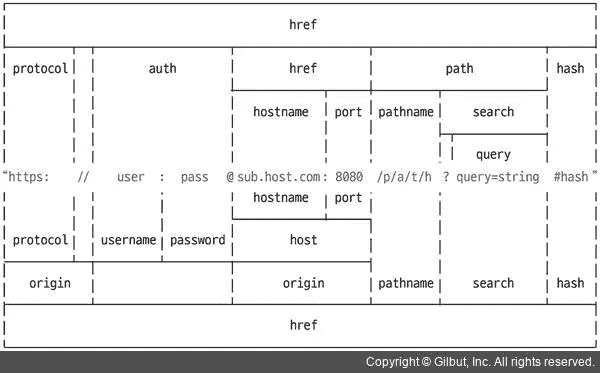

# 6 个有用的 Node.js 内部模块

> 原文：<https://javascript.plainenglish.io/6-useful-node-js-internal-modules-b3748c89c899?source=collection_archive---------3----------------------->

## *在网络浏览器中，Node 比 JavaScript 拥有更多的功能。让我们在这里学习它们吧！*


# 1.操作系统（Operating System）

*网页浏览器中的 JavaScript 无法获取操作系统信息，但节点可以*

*   **os.type()** :显示操作系统类型
*   **os.uptime()** :操作系统启动后的时间
*   **os.hostname()** :显示计算机名
*   **os.release()** :显示操作系统版本
*   **os.homedir()** :显示主目录路径
*   **os.freemem ()** :显示可用 RAM
*   **os.totalmem()** :显示全部内存容量

# 2.小路

*帮助操作文件夹&文件路径*

*   路径模块非常有用，因为每个操作系统都有不同的路径分隔符
*   Windows 类型和 POSIX 类型
*   **窗型**:被₩(即 C:₩Users₩gplee)隔开
*   POSIX 类型用于基于 Unix 的操作系统，如 macOS 和 Linux
*   **POSIX 类型**:由/(即/home/gplee)分隔

*   **__filename** ， **__dirname** 分别代表当前文件和当前文件夹路径
*   **路径:sep** :路径分隔符(即 Windows : `\`，POSIX : `/`)
*   **path.delimiter** : env 变量分隔符(即 Windows : `;`，POSIX `:`)
*   **path.dirname(path)** :文件路径
*   **path.extname(path)** :文件扩展名
*   **path.basename(路径，扩展名)**:文件名
*   **path.parse(path)** :将文件路径分为根、目录、基本、扩展、名称
*   **path . format(object)**:path . parse()对象到文件的路径
*   **path.noramlize(path)** :删除重复项/ \
*   **path . isabsolute(path)**:return boolean 告知文件路径是绝对路径还是相对路径
*   path.join(path，…):组合成一个路径
*   path.resolve(path，…):组合成一个路径

```
difference between path.join & path.resolve
--
- path.resolve : absolute path
- path.join : relative pathpath.join('/a', '/b', 'c'); // /a/b/c
path.resolve('/a', '/b', 'c'); // /b/c
```

# 3.全球资源定位器(Uniform Resource Locator)

*它有助于操纵互联网地址(url)*

*   它们是两种类型的 url 操作 1) WHATWG url 2)传统节点 url



*   **url.parse(address)** :单独的 url
*   **url.format(object)** :重组 url

# 4.查询字符串

*将 url 的搜索参数转换成对象*

*   **query string . parse(query)**:URL 查询到 JavaScript 对象
*   **query string . string ify(object)**:将对象查询为字符串

# 5.秘密党员

## 1.单向加密

*   无法解密的加密
*   例如，用户的密码不需要解密(只需比较数据库中加密的密码和用户在登录时输入的密码)

## >哈希


*   **createHash(算法)**:创建要使用的哈希算法。md5、sha1、sha256 和 sha512 可用
*   **更新(字符串)**:要加密的字符串
*   **摘要(编码)**:编码算法。base64，hex，latin1base64 具有最短的结果字符串长度

## > pbkdf2(字符串+盐)


*   使用**随机字节**方法创建**盐**
*   pdkdf2()方法采用 1)字符串来加密“密码”2) salt 3)调用次数(重复)4)哈希算法作为参数
*   换句话说，上面的方法使用 **sha512** 哈希算法对文本**密码**加密 10k 次
*   10k 次只需要 1 秒

## 2.双向加密

*   加密可以被解密
*   **密钥**用于加密和解密**(同一密钥)**

## >密码

*   crypto.createCipher(algorithm，key):使用的算法& key
*   **cipher.update(string，encoding，output encoding)** :我们使用 **utf8** 编码，使用 **base64** 加密
*   **cipher.final(输出编码)**:加密完成给定的输出编码 base64
*   **crypto . create deciplate(算法，密钥)**:用于解密(使用相同的加密**算法** & **密钥**)
*   **declate . update(字符串，编码，输出编码)**:同加密
*   **解密.最终(输出编码)**:与加密相同

# 6.跑龙套

*   **util** 模块具有所有实用功能
*   随着 API 被弃用，许多 API 被添加和删除

*   **util.deprecate** :该函数告知该函数已被弃用
*   **util.promisify** :将回调模式改为承诺模式。异步/等待


Photo by [Pete Pedroza](https://unsplash.com/@peet818?utm_source=medium&utm_medium=referral) on [Unsplash](https://unsplash.com?utm_source=medium&utm_medium=referral)