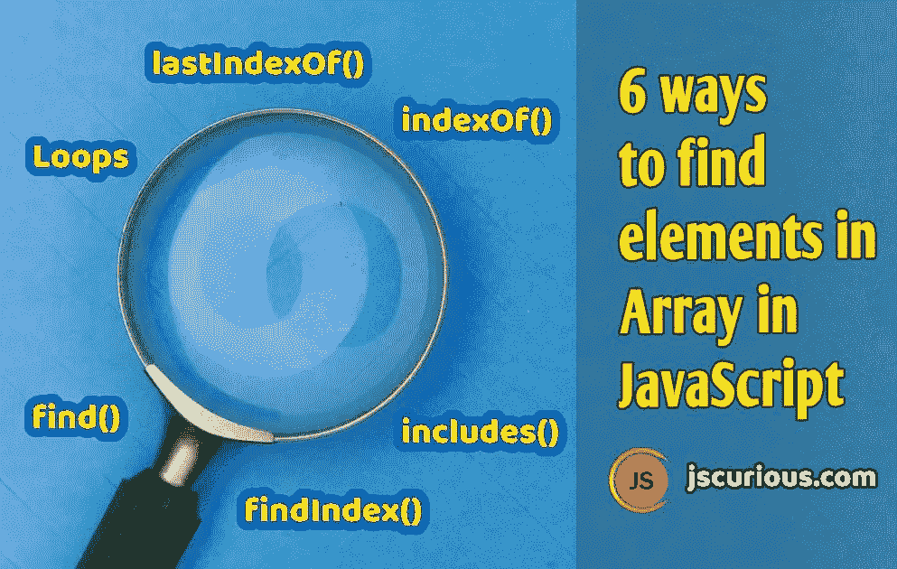

# 在 JavaScript 中查找数组元素的 6 种方法

> 原文：<https://javascript.plainenglish.io/6-ways-to-find-elements-in-array-in-javascript-35a865c04a77?source=collection_archive---------3----------------------->



Posted by jscurious.com

有各种方法可以找到元素或它们在数组中的位置。但是我们总是可以选择满足我们搜索标准的方法，也就是说，我们是在搜索元素还是它在数组中的位置。

我们将讨论在数组中查找的 6 种方法。各种方法有`find`、`findIndex`、`includes`、`indexOf`、`lastIndexOf`和循环(`for`、`filter`、`map`)。让我们简单地检查一下。

# find()方法

Array `find()`方法返回数组中满足条件的第一个匹配元素。`find()`方法将一个函数作为参数，根据某种条件返回 true 或 false。`find()`方法为数组的每个元素执行这个函数。如果函数为任何元素返回 true，那么该元素将由`find()`方法返回，并停止进一步检查其余的元素。如果没有元素通过条件，那么`find()`方法将返回`undefined`。

```
let score = [55, 73, 82, 66, 48]; let value = score.find(val => val > 60); 
// returns the first element that passed the condition console.log(value); // 73
```

# findIndex()方法

Array `findIndex()`方法返回数组中满足条件的第一个匹配元素的索引。该方法还接受一个返回 true 或 false 的函数参数。

除了`find()`返回第一个匹配元素和`findIndex()`返回第一个匹配元素的索引之外，`findIndex()`方法与`find()`方法的工作方式相同。如果在数组中没有找到匹配，那么`findIndex()`返回-1。

```
let score = [55, 73, 82, 66, 48]; let index = score.findIndex(val => val > 60); 
// returns the index of first element that passed the condition console.log(index); // 1
```

# includes()方法

此方法检查数组中是否存在指定的元素，并返回一个布尔值。如果数组中存在指定的元素，则返回 true，否则返回 false。此方法区分大小写。

```
let teams = ['CSK', 'KKR', 'MI', 'RCB']; console.log(teams.includes('KKR')); // trueconsole.log(teams.includes('rcb')); // false
```

此方法接受一个可选参数，该参数指定开始搜索元素的位置。如果我们指定了一个位置，那么它将从这个位置开始寻找元素，直到数组结束。默认值为 0。

```
let teams = ['CSK', 'KKR', 'MI', 'RCB'];console.log(teams.includes('KKR', 2)); // false
```

# indexOf()方法

此方法返回数组中第一个匹配元素的索引。如果没有匹配的元素，则返回-1。此方法区分大小写。

```
let shop = ['Amazon', 'Flipkart', 'Wallmart', 'Myntra', 'Flipkart'];console.log(shop.indexOf('Myntra')); // 3console.log(shop.indexOf('Flipkart')); // 1 console.log(shop.indexOf('amazon')); // -1
```

此方法接受一个可选参数，该参数指定开始搜索元素的位置。如果我们指定了一个位置，那么它将从这个位置开始寻找元素，直到数组结束。默认值为 0。

```
let shop = ['Amazon', 'Flipkart', 'Wallmart', 'Myntra'];console.log(shop.indexOf('Amazon', 1)); // -1
```

> *如果你想检查数组中是否有任何元素，那么你只需检查数组中该元素的索引。所以如果* `*index >= 0*` *，则该元素存在，否则如果* `*index = -1*` *，则该元素不存在于数组中。*

# lastIndexOf 方法

此方法返回数组中最后一个匹配元素的索引。此方法从数组的末尾到开头搜索元素。如果没有匹配的元素，则返回-1。此方法区分大小写。

```
let items = ['car', 'phone', 'watch', 'car', 'bike'];console.log(items.lastIndexOf('car')); // 3 console.log(items.lastIndexOf('watch')); // 2 console.log(items.lastIndexOf('BIKE')); // -1
```

此方法接受一个可选参数，该参数指定开始搜索元素的位置。如果我们指定了一个位置，那么它将从这个位置开始寻找元素，直到数组的开始。

```
let items = ['car', 'phone', 'watch', 'car', 'bike']; 
//start searching from index 2 to 0 console.log(items.lastIndexOf('car', 2)); // 0
```

# 遍历数组元素并查找

我们可以循环遍历每个数组元素，并根据任何条件找到任何元素或它们的位置。

# 使用 for 循环

```
let arr = ['Gold', 'Silver', 'Platinum', 'Iron']; let isPresent = false; for(let item of arr) { 
   if(item === 'Silver') isPresent = true; 
} if(isPresent) console.log('Silver Exists !'); 
else console.log('Silver Not found !');
```

# 使用 map()方法

让我们看一个例子，找出大于 30 的数字。

```
let marks = [53, 29, 65, 22, 71]; let pass = []; marks.map(val => { 
  if(val >= 30) pass.push(val); 
}); console.log(pass); // [53, 65, 71]
```

# 使用 filter()方法

此方法查找并筛选出不符合条件的元素。此方法将返回 true 或 false 的函数作为参数。这个函数对数组中的每个元素执行。如果函数对任何元素返回 true，那么只有该元素包含在返回的数组中。

```
let marks = [53, 29, 65, 22, 71]; let pass = marks.filter(val => val >= 30); console.log(pass); // [53, 65, 71]
```

# 参考

*   [如何在 JavaScript 中迭代数组](https://jscurious.com/different-ways-to-iterate-through-objects-and-arrays-in-javascript/)
*   [JavaScript 中的 map()和 filter()方法](https://jscurious.com/map-and-filter-methods-of-array-in-javascript/)

*感谢您的宝贵时间* ☺️
更多网络开发博客，请访问[jscurious.com](http://jscurious.com/)