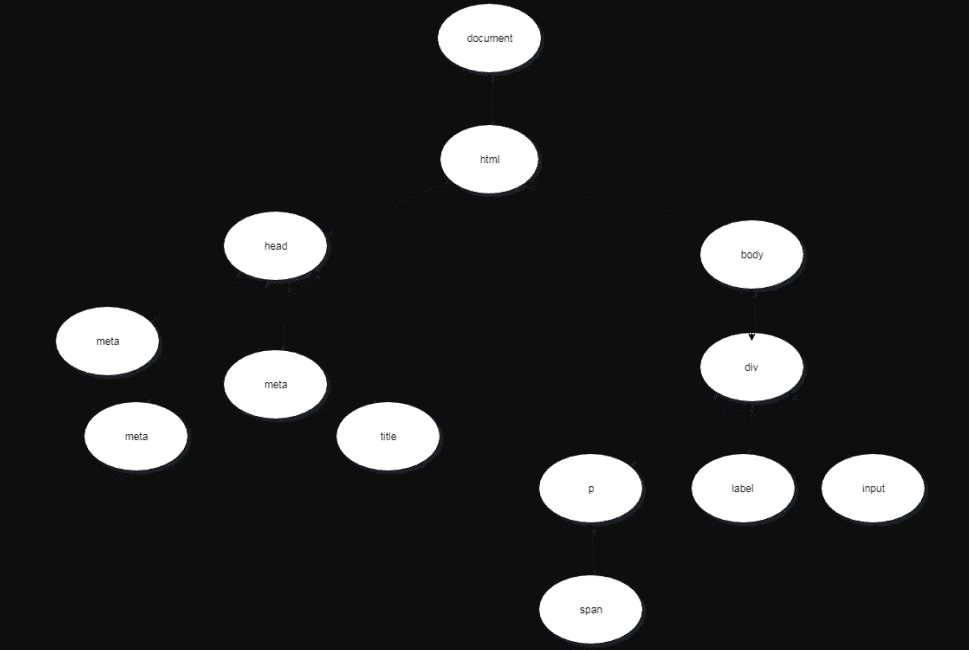
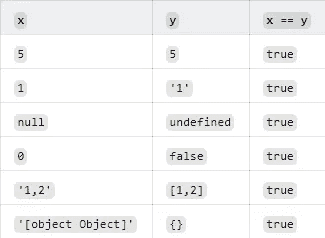
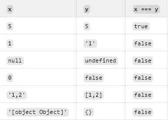

# 你应该知道的 7 个初学 JavaScript 面试问题

> 原文：<https://javascript.plainenglish.io/7-beginner-javascript-interview-questions-that-you-should-know-54fc3e15abf9?source=collection_archive---------10----------------------->

## 7 个 JavaScript 面试问题及答案


Photo by [NeONBRAND](https://unsplash.com/@neonbrand?utm_source=medium&utm_medium=referral) on [Unsplash](https://unsplash.com?utm_source=medium&utm_medium=referral)

# 介绍

面试是招聘过程中很重要的一部分。对于雇主来说，这是筛选出不适合某个职位的候选人的最可靠的方法之一。作为一名 JavaScript 开发人员，你必须在面试前做好准备，因为这将增加你被公司、创业公司或其他公司聘用的机会。这会让你有信心在技术面试中表现出色。

在本文中，我决定给你一些你应该知道的初级到中级 JavaScript 面试问题。


Image Created with ❤️ ️By Mehdi Aoussiad.

# 1.什么是 DOM？

有时在技术面试中，他们会问 DOM 的定义。所以你必须确保给他们一个好的答案。

**DOM** 代表**文档对象模型。**它是 HTML 和 XML 文档的接口或 API。当浏览器第一次读取(*解析*)我们的 HTML 文档时，它会基于 HTML 文档创建一个大对象，这就是我们所说的 DOM。它只是组成 web 上文档的结构和内容的对象的数据表示。DOM 在 JavaScript 中用于交互和修改 DOM 结构或特定的元素和节点。

假设我们有这样一个 HTML 结构:

```
<!DOCTYPE html>
<html lang="en">

<head>
   <meta charset="UTF-8">
   <meta name="viewport" content="width=device-width, initial-scale=1.0">
   <meta http-equiv="X-UA-Compatible" content="ie=edge">
   <title>Document Object Model</title>
</head>

<body>
   <div>
      <p>
         <span></span>
      </p>
      <label></label>
      <input>
   </div>
</body>

</html>
```

对应的 **DOM** 如下所示:



DOM Elements.

# 2.什么是“event.target”？

`**event.target**`是事件**发生的元素。**让我们尝试一些例子:

HTML:

```
<div>
 <button id="btn">Click Me</button>
</div>
```

JavaScript:

```
const btn = document.getElementByID("btn");
btn.addEventListener("click",(**event**)=>{
         console.log(**event.target**);
 };
```

下面的代码将打印事件发生的元素，在这种情况下是按钮。如果您点击按钮，它将记录**按钮**标记。

# 3.什么是“event.currentTarget”？

`**event.currentTarget**`是我们显式附加事件处理程序的元素。让我们举一些例子:

HTML:

```
<div onclick="clickFunc(**event**)" style="text-align: center;margin:15px;
border:1px solid red;border-radius:3px;">
    <div style="margin: 25px; border:1px solid royalblue;border-radius:3px;">
        <div style="margin:25px;border:1px solid skyblue;border-radius:3px;">
          <button style="margin:10px">
             Button
          </button>
        </div>
    </div>
  </div>
```

JavaScript:

```
function clickFunc(event) {
  console.log(event.currentTarget);
}
```

如果你点击按钮，它将记录最外层的 **div** 标记，即使我们点击了按钮。所以在这个例子中，我们可以断定`**event.currentTarget**`是我们附加事件处理程序的元素。

# 4.`==`和`===`有什么区别？

运算符`**==**` 只比较*强制*后的值。另一方面，运算符`**===**` 在没有*强制*的情况下比较值和类型(number-object…)。以下示例将使用两个运算符比较 x 和 y:



x == y.



x === y.

# 5.什么`！！`符做什么？

操作符`**!!**`根据我们放在它后面的值返回一个布尔值(真或假)。这是将值转换为布尔值的好方法。看看下面的例子:

```
console.log(!!null); //logs false
console.log(!!undefined); //logs false
console.log(!!''); //logs false
console.log(!!0); //logs false
console.log(!!NaN); //logs false
console.log(!!' '); //logs true
console.log(!!{}); //logs true
console.log(!![]); //logs true
console.log(!!1); //logs true
console.log(!![].length); //logs false
```

# 6.JavaScript 中的作用域是什么？

JavaScript 中的作用域是我们可以访问变量或函数的区域。有三种类型的范围:

1.  **全局作用域:**在我们的代码中，变量和函数在任何地方都可以被访问。

```
// Global Scope.
var x = 5;
function age(){
  console.log("I'm "+x+" years old."); //x is accessible everywhere.
}
```

2.**函数范围:**在函数中声明的变量、函数和参数在函数内部是可访问的，但在函数外部是不可访问的。

```
function age(){
  // Function Scope.
  const x = 5;
  console.log("I'm "+x+" years old."); 
}
// x is not accessible here.
```

3.**块范围:在块`{}`内声明的 V** 变量 **(** `**let**` **，** `**const**` **)** 只能在块`{}`内访问。

```
function testBlock(){
   if(true){
     let z = 5;
   }
   return z; 
 }

 testBlock(); // Throws a ReferenceError "z" is not defined
```

# 7.什么是函数式编程

**函数式编程**是一种关于我们如何用函数构建应用程序的声明式编程范式或模式。它将程序分成小的、可测试的部分。你可以用多种方式组合基本功能来构建越来越复杂的程序。

JavaScript 数组有 **map** 、 **filter** 、 **reduce、**和更多的方法，它们是函数式编程世界中最著名的函数。如果您想了解更多，可以查看我关于函数式编程的文章。

[](https://medium.com/javascript-in-plain-english/understand-functional-programming-in-javascript-57840c4edc8) [## 理解 Javascript 中的函数式编程

### Javascript 中的函数式编程。

medium.com](https://medium.com/javascript-in-plain-english/understand-functional-programming-in-javascript-57840c4edc8) 

# 结论

了解并练习 JavaScript 中的常见面试问题会让你在参加编码面试时充满自信。熟能生巧。

感谢您阅读本文，希望您觉得有用。

# 进一步阅读

[](https://medium.com/javascript-in-plain-english/top-5-javascript-coding-conventions-that-you-should-know-98ca7451c872) [## 你应该知道的 5 大 JavaScript 编码惯例

### 面向初学者的 JavaScript 风格指南和编码约定

medium.com](https://medium.com/javascript-in-plain-english/top-5-javascript-coding-conventions-that-you-should-know-98ca7451c872)