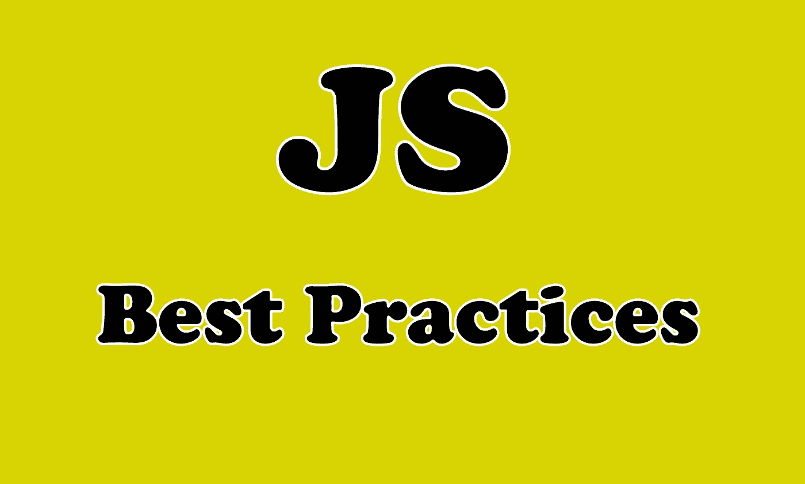

# 编写更好的 JavaScript 的 7 个最佳实践

> 原文：<https://javascript.plainenglish.io/7-best-practices-to-write-better-javascript-838bd289943e?source=collection_archive---------9----------------------->

## JavaScript 最佳实践和一些实际例子


Photo by [Nicole Wolf](https://unsplash.com/@joeel56?utm_source=medium&utm_medium=referral) on [Unsplash](https://unsplash.com?utm_source=medium&utm_medium=referral)

# 介绍

JavaScript 是一种强大的编程语言，允许您在编写代码时使用不同的方法。掌握 JavaScript 并编写有组织和高性能代码的开发人员已经成为就业市场上最受欢迎的人。

在本文中，我们将与您分享一些您应该知道的有用的 JavaScript **最佳实践**。让我们开始吧。



Image created with ❤️️ By author.

# 1.避免使用全局变量

尽可能减少全局变量的使用。这包括所有数据类型、对象和函数。因为全局变量在任何地方都是可访问的，它们可以被其他脚本覆盖。

总是使用局部变量，如果你不知道闭包，我也建议你学习一下。

# 2.使用严格模式

通过在脚本或函数的开头添加“use strict”来声明严格模式。例如，在严格模式下，不能使用未声明的变量。

这里有一个例子:

```
"**use strict**";
myFunction();

function myFunction() {
  y = 3.14;   // This will also cause an error because y is not declared
}
```

正如您所看到的，严格模式将确保您得到的错误会悄悄地发生。

# 3.避免使用 var 关键字

如果你已经知道了提升，你也会知道所有带有关键字`**var**`的声明都是提升的，这使得 var 声明在声明发生之前是可访问的。这就是为什么我认为使用关键字`let`和`const`是一个很好的实践。

# 4.总是初始化你的变量

在声明变量时对它们进行初始化是一个很好的编码实践。因为这将给出一个更干净的代码，提供一个初始化变量的地方，并避免未定义的值。

```
// Declare and initiate at the beginning
 const firstName = "John",
 const lastName = "Doe",
```

# 5.始终使用运算符"`=== "`

`===`操作符检查并强制比较值和类型。这是你大部分时间都会做的事情。所以，我认为养成习惯并不是一个坏习惯，因为它有助于避免不良影响。

```
1 === "1" // false
1 === 1  //  true
"1" === "1" // true
```

# 6.使用析构

析构赋值是一种特殊的语法，它可以将数组中的值或对象中的属性解包到不同的变量中。

这里有一个例子:

```
// With object.
**const { name, age } = user;**
//Prints: name = 'John Doe', age = 34// With an array.
const [a, b] = [1, 2, 3, 4, 5, 6];
console.log(a, b); // 1, 2
```

如你所见，通过使用 ES6 析构，我们的代码变得更干净，更容易被其他开发人员维护。有兴趣可以看看我下面的文章。

[](https://medium.com/javascript-in-plain-english/better-javascript-the-destructuring-assignment-d128bd2a8d9a) [## JavaScript 中的析构赋值及实例

### 更好的 JavaScript——析构赋值

medium.com](https://medium.com/javascript-in-plain-english/better-javascript-the-destructuring-assignment-d128bd2a8d9a) 

# 7.使用类型脚本

TypeScript 可以帮助您交付更好的代码。如果你以前从未尝试过一个类型系统，这需要一些时间来适应。但从长远来看，它会变得非常有用，因为它并不复杂，你只需要进入其中。

# 结论

正如你所看到的，我只是给了你一些我所知道的 JavaScript 的简单的最佳实践。通过应用这些简单的规则，你的代码会变得更好。

感谢您阅读本文，希望您觉得有用。

# 更多阅读

[](https://medium.com/javascript-in-plain-english/5-amazing-front-end-development-tools-that-you-should-know-7372dc377d7) [## 你应该知道的 5 个惊人的前端开发工具

### 每个开发人员都应该知道的有用的前端开发工具

medium.com](https://medium.com/javascript-in-plain-english/5-amazing-front-end-development-tools-that-you-should-know-7372dc377d7)