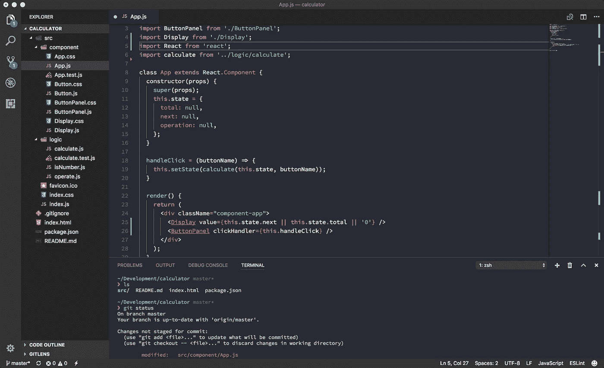
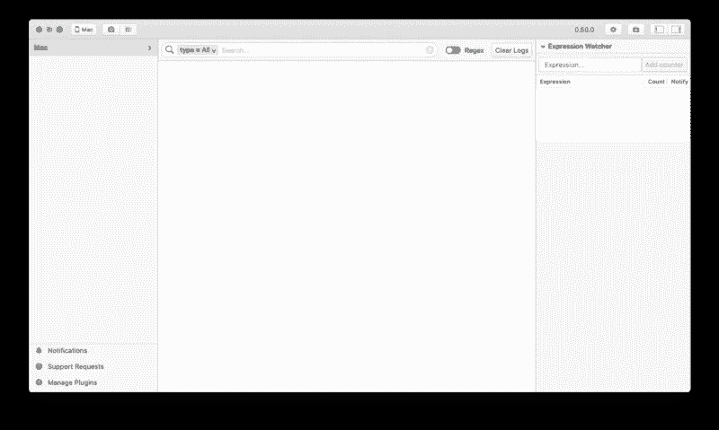
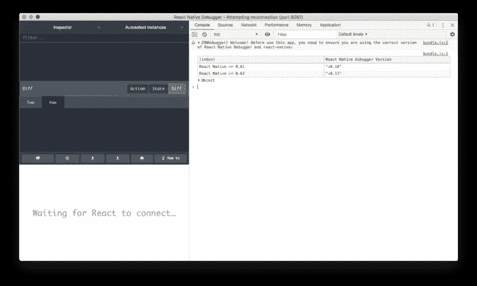
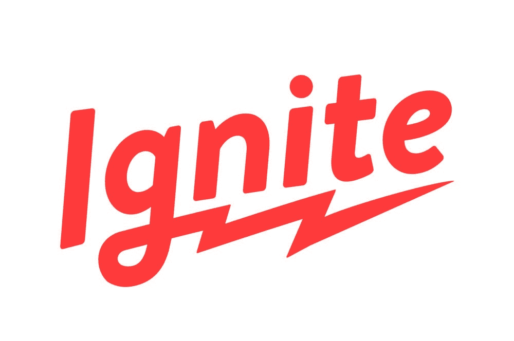

# 面向移动开发者的 7 款最佳反应原生开发工具

> 原文：<https://javascript.plainenglish.io/7-best-react-native-development-tools-for-mobile-developers-d76f6bd1a588?source=collection_archive---------2----------------------->

Photo by [Todd Quackenbush](https://unsplash.com/@toddquackenbush?utm_source=medium&utm_medium=referral) on [Unsplash](https://unsplash.com?utm_source=medium&utm_medium=referral)

在过去的几年里，React Native 在移动应用程序开发人员中广受欢迎，工具生态系统也因此得到了很大的改善。在本文中，我们列出了最好的 React 原生开发工具，这些工具对于任何希望在开发和调试过程中尽可能高效的 React 原生开发人员来说都是不可或缺的。

React Native 是一个 JavaScript 框架，用于为不同的移动操作系统(如 iOS 和 Android)编写真实的、本地呈现的移动应用程序。这个框架基于 React，一个用于创建用户界面的 JavaScript 库。但它的目标不是浏览器，而是移动平台。React 原生开发工具可以简化 React 原生应用的开发。此外，web 开发人员无需学习新的编程语言，就可以编写看起来和感觉上都非常自然的移动应用程序。所有这些都来自他们已经熟悉的 JavaScript 库。此外，由于您编写的大部分代码可以在平台(web、桌面、iOS、Android)之间转移，React 原生堆栈在生产率和开发速度方面是一个真正的游戏规则改变者。

React Native 让 Android 和 iOS 都可以轻松流畅地开发。与 React for Web 类似，React 本地应用程序是使用 JavaScript 和 XML 风格标记的组合创建的。React Native Bridge 调用 Native 使某人处于特定状态 API in Objective-C/Swift for iOS 或 Java/Kotlin for Android。因此，您的应用程序将使用真正的移动 UI 组件和*而不是* web 视图来呈现，并且看起来和感觉起来像任何其他移动应用程序。React Native 有助于揭示平台 API 的 JavaScript 接口的真正的、令人讨厌的本质。

React Native 用于将标记语法翻译成真实的本地 UI 元素，并利用现有的方法来呈现视图。此外，React Native 计算其任务并独立于主 UI 线程工作，因此您的应用程序可以在不牺牲功能的情况下以高性能运行。React Native 中的更新周期与 React 中的相同:当 props 或 state 发生变化时，它会重新呈现视图。React Native 和 React 在浏览器中最重要的区别在于，React Native 通过向其主机平台的 UI 库中添加新的东西来实现这一点，而不是使用 HTML 和 CSS 标记。

React Native 使用其主机平台的标准呈现 API 使某人或某物处于特定状态，这一事实使其能够从大多数用于跨平台应用程序开发的现有工具中脱颖而出。虽然这种方法可以正确使用，但它也有一些缺点，主要是在性能方面。因此，他们通常没有权限访问宿主平台的一组本机 UI 元素。

工具和插件有助于使开发更加容易和复杂。在这一点上，这里有一些最常用和最好的 React 原生开发工具，可以帮助您使 React 原生应用程序的开发更加简单和高效。

## 1. [Visual Studio 代码](https://code.visualstudio.com/)

Visual Studio 代码是目前最流行的 React 本地开发工具。它是 React 本机开发最常用的 IDE，可以跨所有平台工作(如 Windows、Mac 和 Linux)。

Visual Studio 代码是用编程语言编写的，如 TypeScript、JavaScript 和级联样式表。微软负责开发 Visual Studio 代码。这是一个强大的免费开源代码编辑器。此外，它的一些内置功能包括智能智能编码、调试代码、内置 Git 命令、可扩展和可定制的主题、语言等。

# 2.[鳍状肢](https://fbflipper.com/)

[Flipper](https://fbflipper.com/) 是目前市场上最好的 React 原生开发工具。它非常完整，会让你的编码效率暴涨。Flipper 是一个动态调试平台，用于调试为 iOS、Android 和 React Native 构建的应用程序。它提供了从简单的桌面界面可视化、检查和控制移动应用的能力。我们也可以使用 Flipper 工具作为扩展插件 API。它适用于所有操作系统平台(Windows、Mac 和 Linux)。

FB Flipper 平台提供的开箱即用的服务有网络日志、日志(控制台日志)、React DevTools、用于简化 UI 开发的布局检查、Hermes 调试器等。它还赋予你构建自己的插件的超能力，以满足你的日常开发需求。

# 3. [React 原生调试器](https://github.com/jhen0409/react-native-debugger)

如果你正在寻找一个调试 React 原生移动应用的工具，这个 [React 原生调试器](https://github.com/jhen0409/react-native-debugger)工具是第一个尝试的。你会惊讶于你的生产力会提高多少。

React 本机调试器是一个独立的应用程序，用于调试 React 本机应用程序。强有力的卖点是它支持开箱即用的 Redux 机制，这意味着它也提供 Redux 开发工具。

另一个有助于开发人员进行 UI 设计工作的有用特性是能够检查屏幕上的可视元素并做出相应的更改。该工具基于官方的 React 调试器工具以及更多有用的用例。这无疑使开发和错误调试过程更快、更有效。

## 4.[世博会](http://expo.io/)

Expo 是一项开源技术，可以免费使用。这是一个围绕 React Native 创建的工具链。因此，它在使用 JavaScript 和 React 本地语言创建 iOS 和 Android 应用程序时非常有用。它是由硅谷的盈利公司 Expo 开发的。它的一些独特服务包括文档、社区论坛、Slack 社区和开发工具。

最好的功能之一是能够通过扫描二维码在设备上预览任何应用程序。这是一个非常棒的 React 原生开发工具，因为你可以向客户、顾客或用户演示你的应用，只需让他们扫描二维码。不需要试飞或 apk。

通过利用 Expo 零食，您还可以直接在浏览器中编写和预览 React 本机代码，Expo 零食是一个浏览器编辑器，也是一个令人印象深刻的 React 本机开发工具。

## 5. [Redux](https://redux.js.org/)

Redux 是用 JavaScript 编写的免费源代码库。大多数有经验的开发人员强烈推荐 Redux 用于 React 原生移动开发过程。Redux 是 React 本机应用程序最流行的状态管理库。

它提供实时代码编辑以及关于内容的时间旅行知识。此外，它的一些其他服务包括轻松测试应用程序，并创建可以在各种环境下运行的应用程序，如客户端、服务器和本机。

## 6.[点燃](https://infinite.red/ignite)

Ignite 本质上是免费和开源的，由 Infinite Red 开发。Ignite CLI 是一个 React 本机工具链，包含代码和插件部分。它的样板文件可以在 iOS 和 Android 上运行。它的一些产品包括组件、使用示例、API 测试和可定制的主题。

## 7.[核素](https://nuclide.io/)

Nuclide 是一款免费的开源 React 本地开发工具(ide ),可帮助 React 本地开发人员完成软件开发任务。之所以首选 React Native development 的原因之一是它提供了可攻击性。而且，它也有一个社区的支持，这个社区总是愿意指导你。它的其他一些功能包括内置调试、远程开发、JavaScript 开发等。它还提供黑客开发、任务运行器、工作集和 Mercurial 支持。

最后，您可以看到，使用完美的 React 原生开发工具，您可以在很短的时间内开发一个响应迅速的移动应用程序。有时可能很难选择能帮助您获得预期结果的确切工具。

作为一名 React 原生开发人员，熟悉一套可靠的 React 原生开发工具极其重要，这样才能尽可能地提高工作效率。了解这些工具可以让你赚更多的钱。开发变得更快，挫败感消失，应用程序更快地发布并且没有错误。

合适的工具将使您能够更快地进行移动开发，并在 Web 上共享更高效的代码，而不会牺牲最终用户的体验或应用程序的质量。

## 后续步骤

既然您已经了解了 best React 本机开发工具，下面是一些您可以研究的其他主题

如果你需要一个基础来启动你的下一个 React 原生应用，你可以通过利用我们的 [React 原生模板](https://www.instamobile.io/templates/)来节省几个月的开发时间。

## **用简单英语写的 JavaScript**

喜欢这篇文章吗？如果有，通过 [**订阅获取更多类似内容解码，我们的 YouTube 频道**](https://www.youtube.com/channel/UCtipWUghju290NWcn8jhyAw) **！**