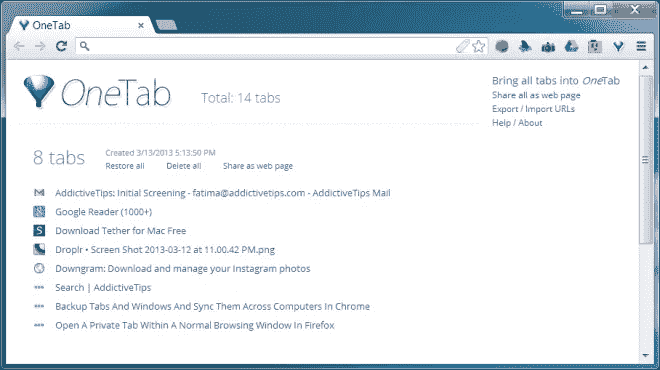
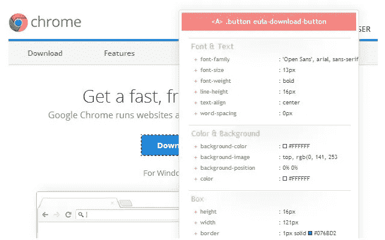
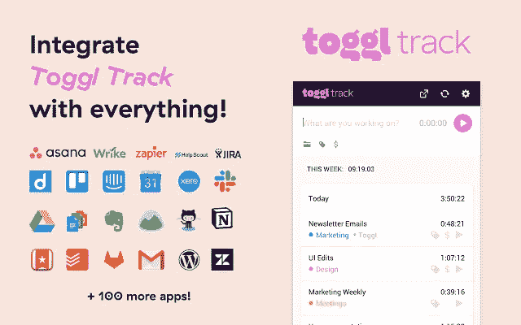
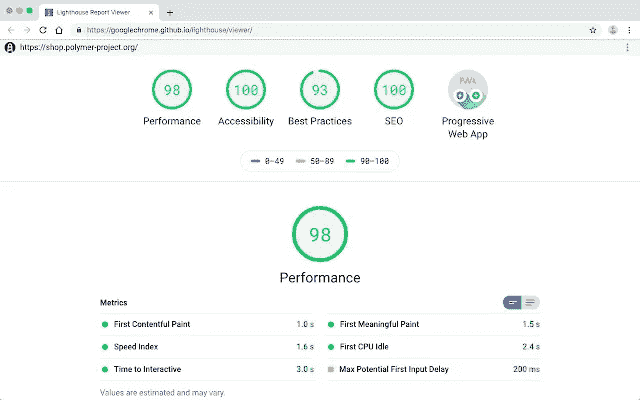
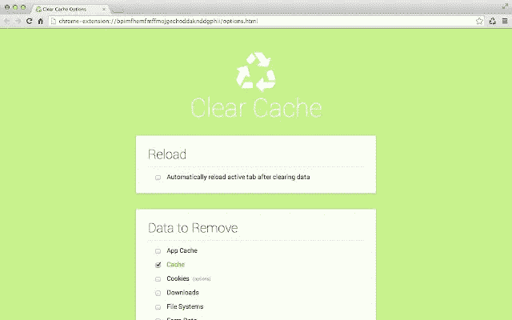

# 每个开发者都必须拥有的 7 个 Chrome 扩展

> 原文：<https://javascript.plainenglish.io/7-chrome-extensions-every-developer-must-have-d01a9c119d3c?source=collection_archive---------1----------------------->

## 更聪明地工作，而不是更努力。使用这些扩展使您的开发更加容易

Photo by [Caio](https://www.pexels.com/@caio?utm_content=attributionCopyText&utm_medium=referral&utm_source=pexels) from [Pexels](https://www.pexels.com/photo/light-smartphone-macbook-mockup-67112/?utm_content=attributionCopyText&utm_medium=referral&utm_source=pexels)

Web 开发人员在做其他 10 件事情的同时，还要做出数百万个决定。每一个决定都可能浪费你宝贵的时间或节省时间。

我们需要有效地完成任务，而不是精疲力竭。一个好的开发人员在他/她的任务中是高效的。

提高效率的一个方法是让最好的工具在你身边，这些工具可以节省你的时间，并以最有效的方式完成工作。

Chrome 扩展只是众多超级有用的工具之一。下面是我经常使用的最好的扩展列表。我希望他们也能帮助你。

# 1.OneTab

作为开发人员，我们做了大量的研究，包括大量的谷歌搜索。这意味着打开了很多 chrome 标签。

但是 chrome 标签会让人不知所措，因为大多数时候我们会同时做两件以上的事情。我们无法区分标签，完全迷路了。

OneTab Chrome 扩展优雅地解决了这个问题。

每当您发现自己有太多的选项卡时，单击 OneTab 图标将所有选项卡转换为一个列表。当您需要再次访问这些选项卡时，可以单独恢复它们，也可以一次全部恢复。如果使用得当，这个扩展可以让你的生活轻松很多。

 [## OneTab

### 节省高达 95%的内存，减少标签混乱

chrome.google.com](https://chrome.google.com/webstore/detail/onetab/chphlpgkkbolifaimnlloiipkdnihall) 

# 2.瓦帕里斯

这个浏览器扩展是一个技术剖析器，它向你展示了网站和网络应用程序是用什么构建的。好奇用什么技术、框架、Javascript 库等等来构建一个网站或者一个 web 应用？用 Wappalyzer 就行了。

 [## 瓦帕里斯

### 识别网络技术

chrome.google.com](https://chrome.google.com/webstore/detail/wappalyzer/gppongmhjkpfnbhagpmjfkannfbllamg?hl=en) 

# 3.CSS 查看器

这个浏览器扩展使得访问元素的 CSS 属性变得非常简单，只需将鼠标悬停在元素上即可。我只是喜欢这个扩展。

我讨厌仅仅为了查看 CSS 而使用 chrom dev 工具。这很麻烦。但是 CSS viewer 让我的生活变得更加轻松。是必备的扩展。

 [## CSSViewer

### 一个简单的 CSS 属性查看器。

chrome.google.com](https://chrome.google.com/webstore/detail/cssviewer/ggfgijbpiheegefliciemofobhmofgce?hl=en) 

# 4.Toggl 跟踪:生产率和时间跟踪

如果你是一个忙碌的自由职业者，如果你远程工作，或者如果你只是需要跟踪你在一个项目上花费的时间，那么 Toggl 就是你的选择。

此扩展要求您在使用之前创建一个帐户。登录后，您可以使用存储在 Toggl 帐户中的所有数据快速轻松地实时跟踪生产力。

它带有一个内置的 Pomodoro 计时器，以及一整套互联网服务的集成(如 GitHub、Trello 和 Slack)。我最喜欢的功能之一是，当你空闲时，它会弹出一个通知，让你放弃时间。

 [## Toggl 跟踪:生产率和时间跟踪

### 将计时器放入任何网络工具中，并允许快速实时跟踪存储在您的 Toggl 上的所有数据…

chrome.google.com](https://chrome.google.com/webstore/detail/toggl-track-productivity/oejgccbfbmkkpaidnkphaiaecficdnfn) 

# 5.灯塔

Lighthouse 是一个开源的自动化工具，用于提高网页的性能和质量。

这个扩展最好的一点是，它是由谷歌制作的，大概使用了与他们的搜索引擎相同的排名因素。这意味着它可以为你提供一些关于如何优化你的网站的最佳建议。

 [## 灯塔

### Lighthouse 是一个开源的自动化工具，用于提高 web 应用程序的性能、质量和正确性…

chrome.google.com](https://chrome.google.com/webstore/detail/lighthouse/blipmdconlkpinefehnmjammfjpmpbjk) 

# 6.清除缓存

这是一个在开发和测试过程中非常有用的 Chrome 扩展，因为它允许你从工具栏中清除缓存。

它可以根据您想要清除的数据量进行定制，包括应用缓存、下载、文件系统、表单数据、历史记录、本地存储、密码等等。

 [## 清除缓存

### 只需单击一个按钮，即可清除您的缓存和浏览数据。

chrome.google.com](https://chrome.google.com/webstore/detail/clear-cache/cppjkneekbjaeellbfkmgnhonkkjfpdn) 

# 7.字体忍者

如果你曾经喜欢任何网站上的字样或字体，那么你可以使用这个扩展来轻松找到字体类型。

 [## 字体忍者

### 加快您的设计工作流程！

chrome.google.com](https://chrome.google.com/webstore/detail/fonts-ninja/eljapbgkmlngdpckoiiibecpemleclhh) 

我希望你喜欢这个列表，感谢你的阅读。