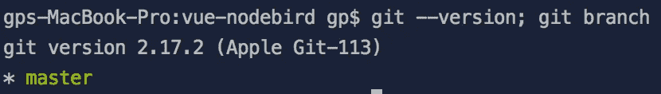
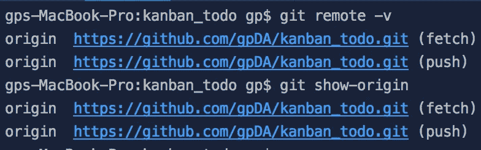
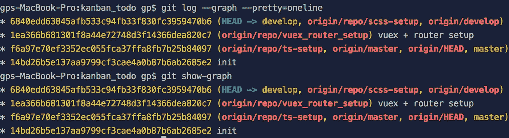
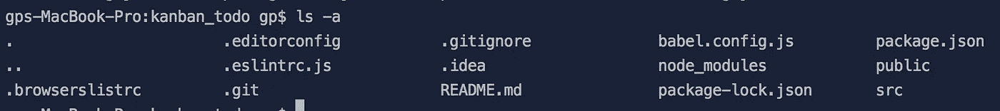
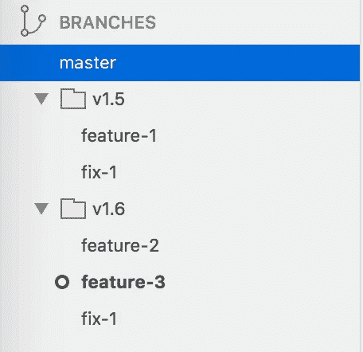
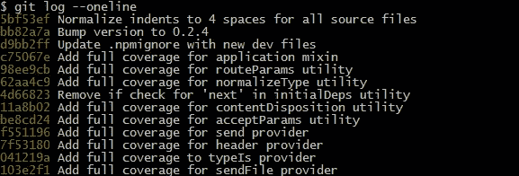

# 7 个你可能还不知道的 Git 命令/概念

> 原文：<https://javascript.plainenglish.io/7-git-commands-concepts-you-may-do-not-know-yet-d0aa9dbee7b1?source=collection_archive---------2----------------------->


# 1.多个 git 命令由“”分隔；`(分号)

您可以使用由`;`(分号)分隔的多个 Git 命令

```
$ git --version; git branch // separated by semi-colon
```



# 2.别名 git 命令

为了可重用性，您可以将命令设为别名

让我们将`git remote -v`(检查远程原点的命令)别名为**显示原点**

```
$ git config --global alias.show-origin 'remote -v'
$ git show-origin
```



让我们将`git log --graph --pretty=oneline`(打印提交日志的命令)别名为**显示图**

```
$ git config --global alias.show-graph 'log --graph --pretty=oneline'
$ git show-graph
```



# 3.名为` . git `的隐藏文件夹

`.git`隐藏的文件夹包含提交、分支和文件的历史记录。因此，你需要复制`.git`文件夹来复制整个应用程序及其 git 历史(提交历史等)

要复制隐藏的文件夹，您需要运行`-r`选项

```
$ cp -r <originalFolder> <destinationFolder>
```

要查看隐藏的文件夹，您需要运行`ls -a`而不是`ls`

```
$ls -a
```



# 4.在` . gitignore `中指定文件夹和文件的多种方法

`.gitignore`配置文件包含您不想在 git 系统中管理的文件&文件夹

在`.gitignore`中有许多不同的方式来指定文件夹和文件

首先，`#`在。gitignore 用于注释(类似于 Python 中的`#`注释)

**4.1 简单文件名**

```
# exclude **dbinfo.php** file in git system
dbinfo.php
```

**4.2 模式匹配——使用星号(*)的“globbing”**

*Globbing 是大多数 Unix shells 使用的通配符技术*

```
# exclude **obj** files
*.obj
```

**4.3 指定不想排除的文件/文件夹**

您可以指定不想排除的文件/文件夹。当您与团队一起工作，并且想要重新断言这个文件/文件夹不应该从 git 系统中排除时，这是一个有用的实践

```
# do not exclude the following configuration file
!config.php
```

**4.4 相对文件路径**

```
# exclude the file in the current directory
/readme.txt# exclude all files in **/pub/** directory
/pub/# exclude all txt files whose parent is **doc**doc/**/*.txt
```

# 5.空消息选项

有时您希望在没有消息的情况下提交，而消息是提交的必要条件。您可以使用`--allow-empty-message`选项

```
$ git commit --allow-empty-mesage -m "" --- no commit message
```

# 6.分支层次结构

当一个分支中有斜杠(/)时，它被存储为一个目录层次结构

```
Branch name
--> v1.5/feature-1
--> v1.5/fix-1--> v1.6/feature-2
--> v1.6/feature-3
--> v1.6/fix-1
```



# 7.显示日志

有很多方法可以显示 git 日志

**漂亮=在线选项**

```
$ git log --pretty=onelineOR$ git log --oneline
```



**图形选项**

```
$ git log --online --graph
```


**数字选项**

```
$ git log --online --graph -5 // SHOW only 5 most recent commits
```

> 快乐的饭桶！


Photo by [Brina Blum](https://unsplash.com/@brina_blum?utm_source=medium&utm_medium=referral) on [Unsplash](https://unsplash.com?utm_source=medium&utm_medium=referral)