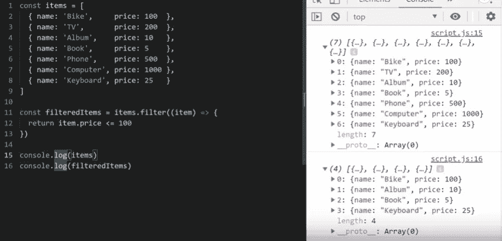
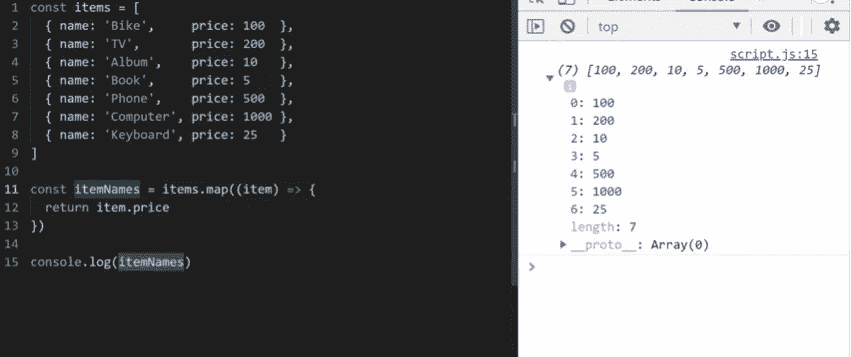
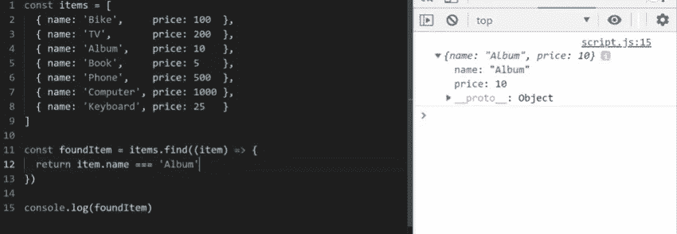
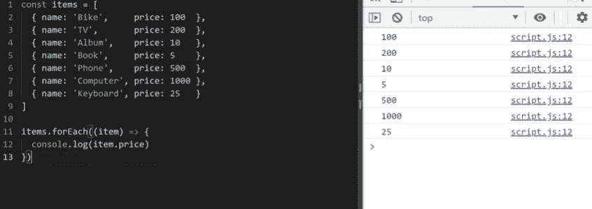
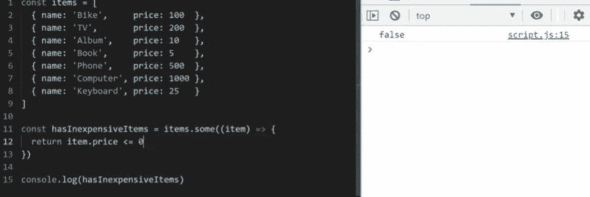
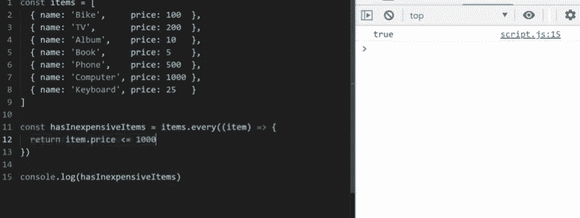
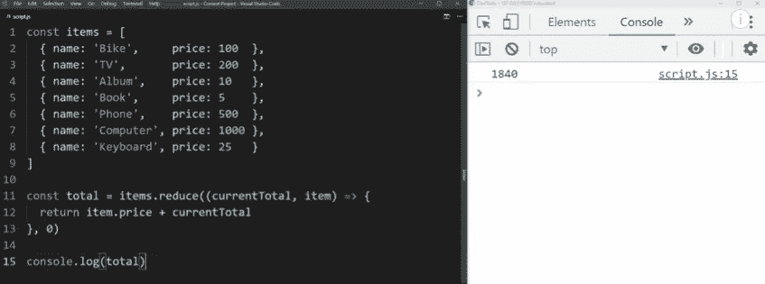

# 7 个重要的 JavaScript 数组方法

> 原文：<https://javascript.plainenglish.io/7-important-javascript-array-methods-250a4caaad02?source=collection_archive---------1----------------------->

# 。过滤器()

```
const filteredItems = items.filter((item) => {
      return item.price <= 100
})
```

过滤方法是 JavaScript 中的一种方法，用于过滤项目数组中的一些项目，其条件类似于 items < 100 here in below. So when we execute the below filter method on the items array it gives us back a new Array with the filtered items.



JavaScript filter() method

items.filter does not mutate the original array but it creates a new array of items.

# .map()

```
const filteredItems = items.map((item) => {
      return item.price 
})
```

This method is super useful in js where we use it in many scenarios like a substitute for for loops or in cases where we want to return some properties of object items in an array like price as in below image.



javaScript map() function

Like the way in filter() method, items.map also does not mutate the original array but it creates a new array of items.

# .find()

```
const filteredItems = items.find((item) => {
      return item.name === 'Album' 
})
```

This method is useful to find a particular item in array if it returns true then the item exist or else not. Similar to .map() and .filter() it also takes item as a parameter and it checks for an item with name ‘Album’. If it finds it prints out the item.

P.S: If there are two items with same then it will only print out the first occurrence of the item.



javaScript .find() method

# .forEach()

```
items.forEach((item) => {
    console.log(item.price)
})
```

This method is useful when you want to get each item in an array while looping over it and you want to perform some actions on each item. It also take item as a parameter and you can see we have just printed out the price of all items while doing a forEach on the array



javaScript ForEach() method

# .some()

```
const hasInExpensiveItems = items.some((item) => {
    return item.price <= 0
})
```

This method is useful when we want to check whether some items in the array has (a condition) like less than 100 dollars as in the below example. So if any item in the array satisfies the condition the array returns true for the entire execution as in case if it is false.



javaScript .some() method

# .every()

```
const hasInexpensiveItems = items.every((item) => {
     return item.price <= 1000
})
```

This method unlike .some() method, checks for every items in the array to satisfy the condition (like item.price ≤ 1000) and if it is true then it returns true for the whole execution and false vice-versa.



javaScript every() method

# .reduce()

```
const total = item.reduce((countTotal, item) => {
   return item.price + countTotal;
},0)
```

This method is useful when you want to do some cumulative calculations with the values of each item.As in below image the method takes two parameters, a total which we want to return and each item.

This currentTotal is initialised from 0, as we have declared in the callback method. So whenever we are in “Bike”, countTotal is 0 (100+0), then when it comes to ‘TV” countTotal becomes 300(200+100) and so on…..



javaScript reduce() method

Thanks for reading! If you have any questions, feel free to reach out at rajrock38@gmail.com, connect with me on [LinkedIn](https://www.linkedin.com/in/rajdeepcoder/) 或 follow me on [Medium](https://medium.com/@rajrock38) 和 [Twitter](https://twitter.com/rajrock38) 。

如果你觉得这篇文章很有帮助，给它一些掌声会很有意义👏并分享出来帮别人找！并欢迎在下方发表评论。