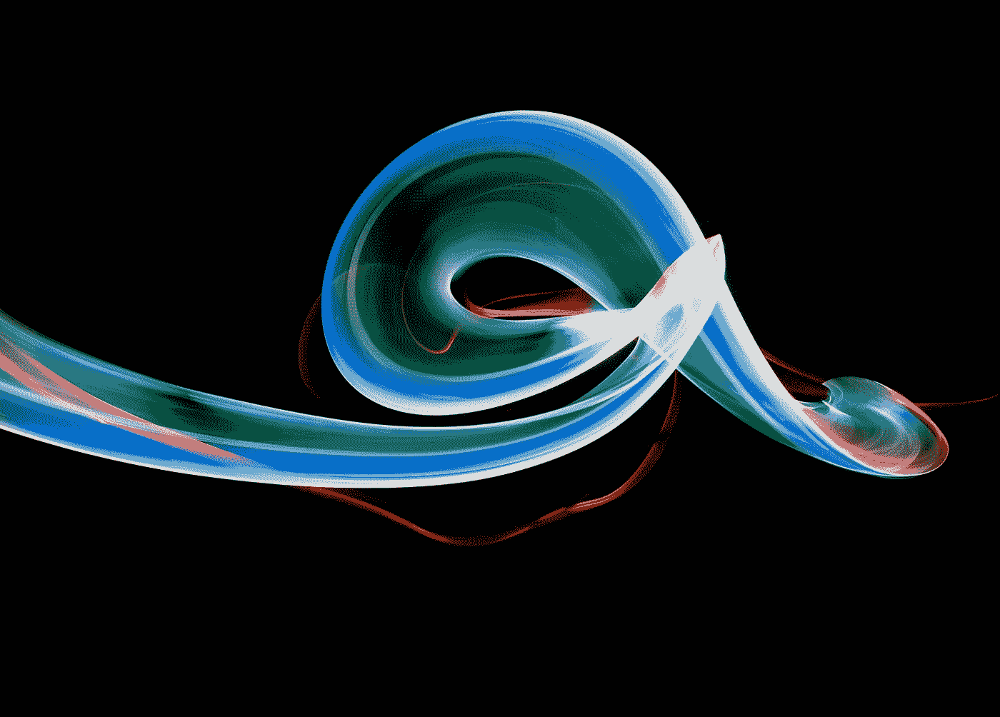
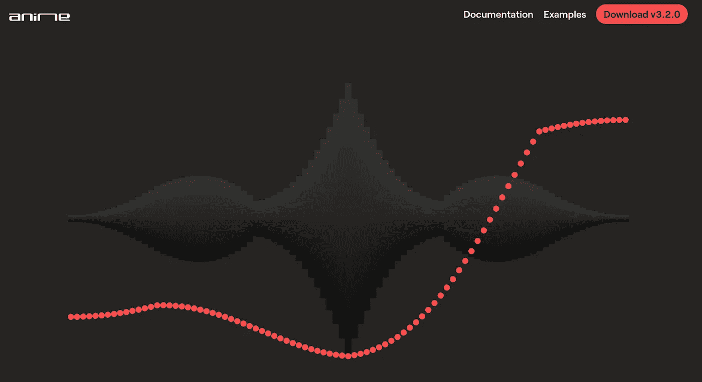
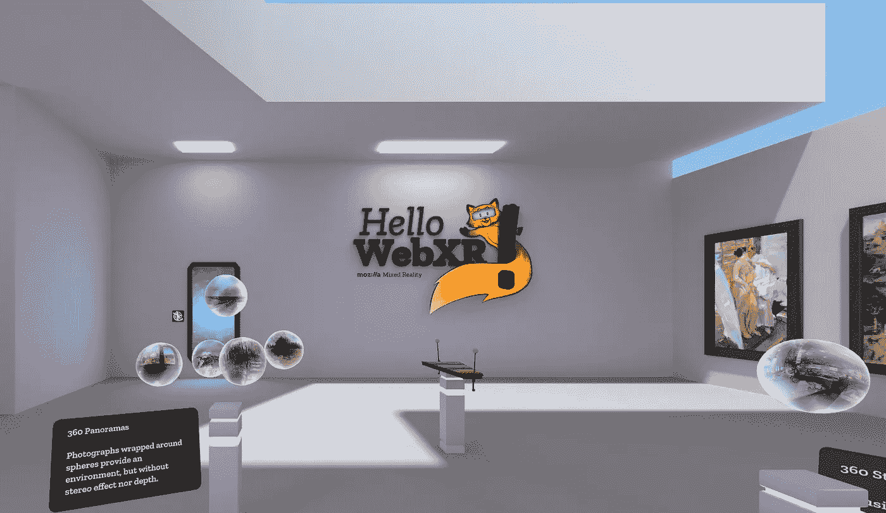
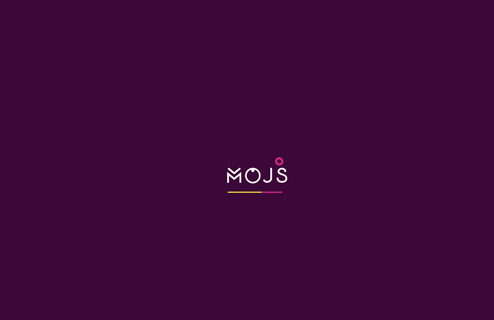
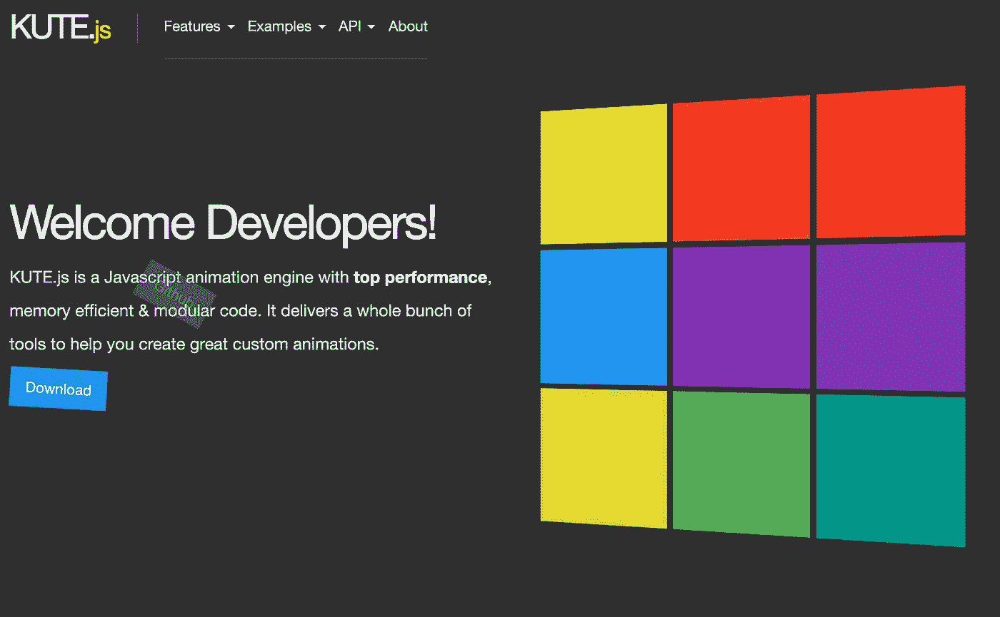
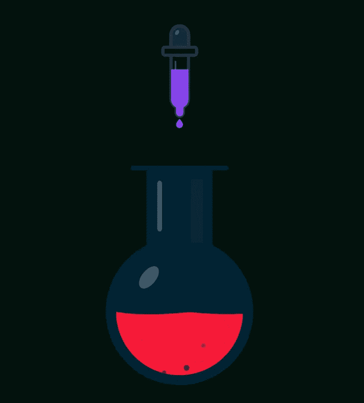
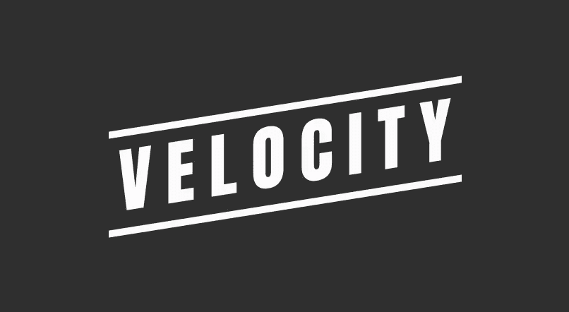

# 7 个 JavaScript 动画库，你现在就可以使用，让你的用户大吃一惊

> 原文：<https://javascript.plainenglish.io/7-javascript-animation-libraries-you-can-use-right-now-b5ae28dd8b4a?source=collection_archive---------4----------------------->

Photo by [Nikolay Trebukhin](https://unsplash.com/@yo_hoho?utm_source=medium&utm_medium=referral) on [Unsplash](https://unsplash.com?utm_source=medium&utm_medium=referral)

你访问一个网站的第一印象是什么？

对我来说，没有什么比引人注目的动画更吸引人了。

要知道，最初抓住用户的脚是非常重要的。一个无聊、差的网站，能让用户马上跳出去。

而动画是打动用户的有效方式之一。

想知道如何创作出如此惊艳的动画？下面的库会对你有所帮助。

# 洛蒂

[https://airbnb.io/lottie](https://airbnb.io/lottie)

我第一次使用 Lottie 是为了一个 Android 项目。后来我发现也有网络版。

这是一个由 Airbnb 的人创建的很酷的动画库。你可以很容易地创造出流畅的动作。

你需要做的就是在 Adobe After Effect 中创建动作，并将其导出到 JSON 文件，然后使用 Lottie 在你的应用程序中渲染为动画。

你不知道怎么用后效？没关系。你仍然可以从 https://lottiefiles.com/[获得免费的 JSON 文件](https://lottiefiles.com/)

# AnimeJS

【https://animejs.com/ 

需要一个轻量级的 Javascript 库动画？也许 AnimeJS 是你最好的选择。

它支持大多数浏览器。你可以通过改变 CSS，DOM，SVG 属性来创建简单到复杂的动作。

# 三个 j

[https://threejs.org/](https://threejs.org/)

渲染 3D 物体有困难吗？好吧，三个 j 为你而来。

使用 3D 是我经历过的最具挑战性的任务之一。它不仅关乎细致的计算，更关乎性能。

但是有了三个 j，事情就简单多了。它可以帮助您轻松创建 3D 对象、相机、材质和灯光。

ThreeJS 使用 WebGL 渲染对象，现在的浏览器大多支持。所以不需要担心兼容性问题。

# MoJS

[https://mojs.github.io/](https://mojs.github.io/)

对于 web 编程来说，动画是最棒的部分之一。但是如果每个网站都有一样的动画，那就没意思了。

如果你想创造更特殊和更有创造性的动作，你应该使用 MoJS。这不仅仅是动画，这是一门真正的艺术。凭借你的创造力，你可以创作出你喜欢的动人画面。

# 库特伊斯

[https://thednp.github.io/kute.js/](https://thednp.github.io/kute.js/)

使用动画时需要考虑的一个问题是性能。不管你的动画有多棒，如果表现不好，有时候坏了浏览器对用户来说是不好的体验。

这就是为什么你要关注 Kutejs，一个关心性能的动画库。

此外，Kutejs 是一个非常易于使用的库，您可以扩展它以获得更多有吸引力的特性。

# 格林索克兹

[https://greensock.com/](https://greensock.com/)

另一个轻量级和易于使用的动画库。

你可以控制任何东西，从画布对象，CSS 值，DOM 属性等等。

# VelocityJS

http://velocityjs.org/

可以像 jQuery 一样使用 VelocityJS。最好的部分是:你不需要 jQuery 来使它工作。

既然您已经知道如何使用 jQuery，那么访问 VelocityJS 就更容易了。其实 VelocityJS 比 jQuery 性能更好。

# 额外收获:只需使用纯 CSS

说到性能，我不认为有哪个库能超越纯 CSS。

尽管使用 CSS 动画有局限性，但是有了性能的优势，我觉得对于简单的动画来说也就够用了。

# 让我们让你的网站更棒

这些是你可以用来为你的网站创建酷动画的库。

根据预期用途，选择其中一个，让你的用户大吃一惊。