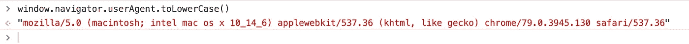
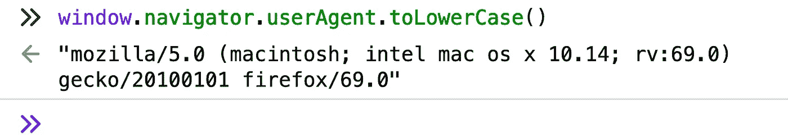
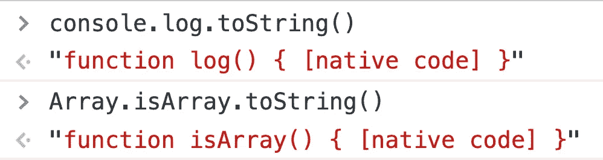
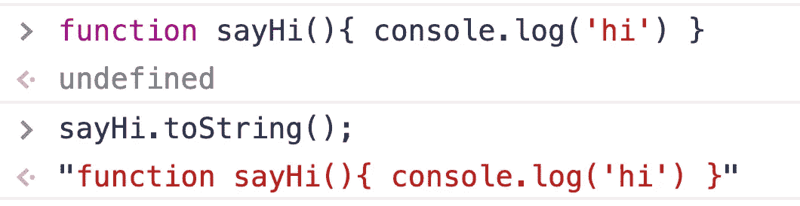
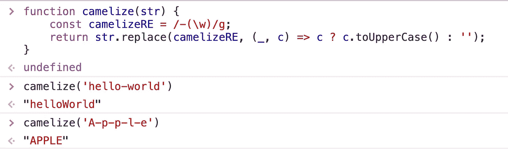
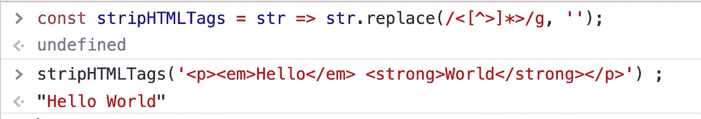
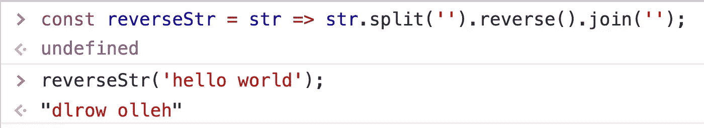
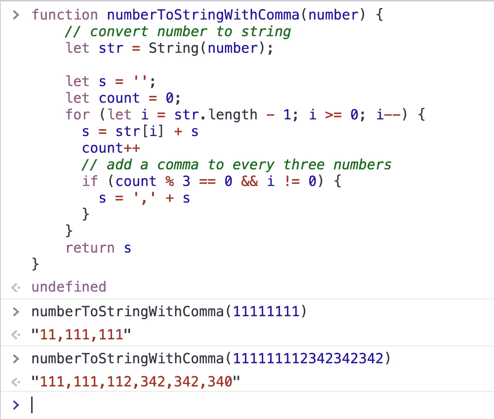
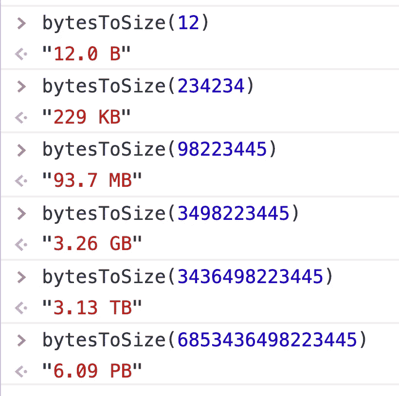

# 7 个 JavaScript 实用函数来提高您的效率

> 原文：<https://javascript.plainenglish.io/7-javascript-utility-functions-to-improve-your-efficiency-79d27132f186?source=collection_archive---------2----------------------->

## 检测浏览器，检测函数类型，将连字符大小写转换为字母大小写，删除字符串中的 HTML 标签，反转字符串，等等。


Photo by [🇨🇭 Claudio Schwarz | @purzlbaum](https://unsplash.com/@purzlbaum?utm_source=medium&utm_medium=referral) on [Unsplash](https://unsplash.com?utm_source=medium&utm_medium=referral)

# 检测浏览器

不同浏览器有不同的`navigator.useragent`。我们可以通过检查这个值来检测浏览器类型。

示例:



Chrome on Mac OS

结果上有一个`'chrome'`字符串。



Firefox on Mac OS

结果上有一个`'firefox'`字符串。

所以我们只需要检查`navigator.useragent`中是否有浏览器品牌名称，然后就可以检测出浏览器类型。

# 检测函数类型

有两种类型的功能:

*   运行时环境提供的本机函数。比如`Array.isArray`、`console.log`。
*   用户编写的函数

在一些复杂的情况下，您可能需要区分这两种类型的函数。

那么我们如何在代码中区分这两种类型的函数呢？很简单，当转换成字符串时，它们有不同的结果。



Native Functions



user-written function

当我们将一个本地函数转换成一个字符串时，结果将总是包含`native code`。

所以我们可以写这个函数:

# **将母鸡转换成骆驼箱**

将`hello-world`样式的字符串转换成`helloWorld`样式的字符串是一个非常常见的需求。为此，我们可以使用正则表达式。

我们可以用`/-(\w)/g`匹配`—`之后的所有小写字母，然后用它的大写替换。



# 删除字符串中的 HTML 标记

出于安全原因，我们经常需要从字符串中移除 HTML 标签。通过一个简单的正则表达式，我们可以轻松完成这项任务。

```
**const** stripHTMLTags = str => str.replace(/<[^>]*>/g, '');
```



# 反转一根绳子

反转字符串是一个常见要求。为此，我们可以将一个字符串拆分成一个数组，然后反转数组并将其连接起来。

```
**const** stripHTMLTags = str => str.replace(/<[^>]*>/g, '');
```



# 用逗号将数字格式化为字符串

为了让大数字更容易阅读，我们经常在数字中间加一些分隔符。

*   `111111` = > `111,111`
*   `123456789` = > `123,456,789`

通常，我们每三个数字加一个逗号。



# 将字节单位转换为合理的单位

在计算机内部，文件的大小通常以字节来衡量。但是如果它是一个很大的数字，它对人类来说是不可读的。

比如 98223445B，当我们第一次看到这个数字的时候，很难有什么直观的感受。但是如果用 93.7 MB，我们就很熟悉了。所以我们需要写一个函数，这个函数非常方便我们完成这个目标

