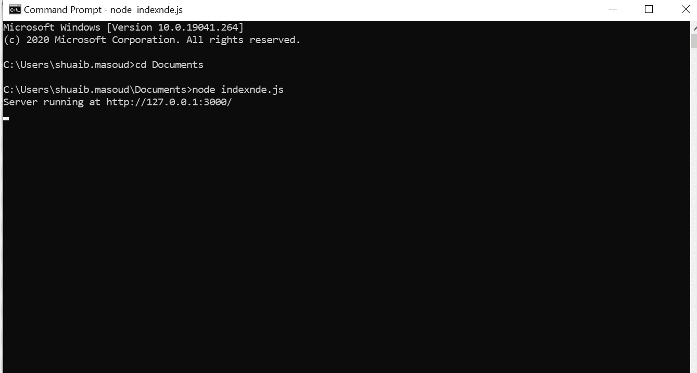
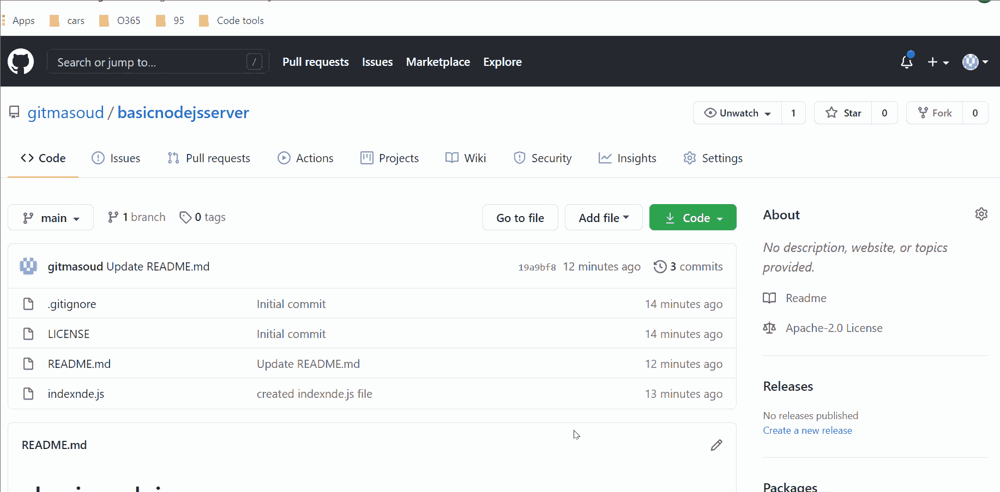
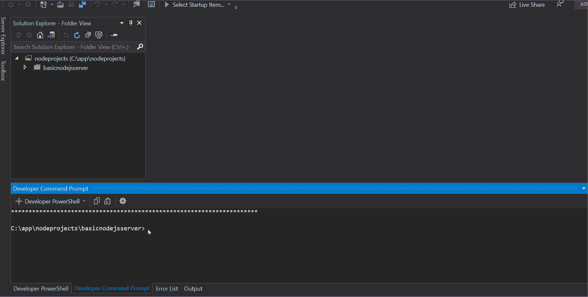
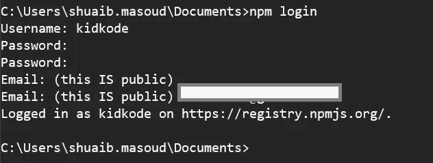
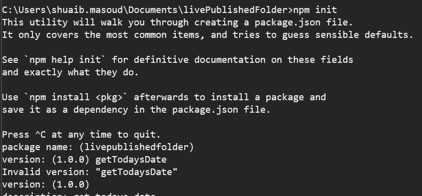
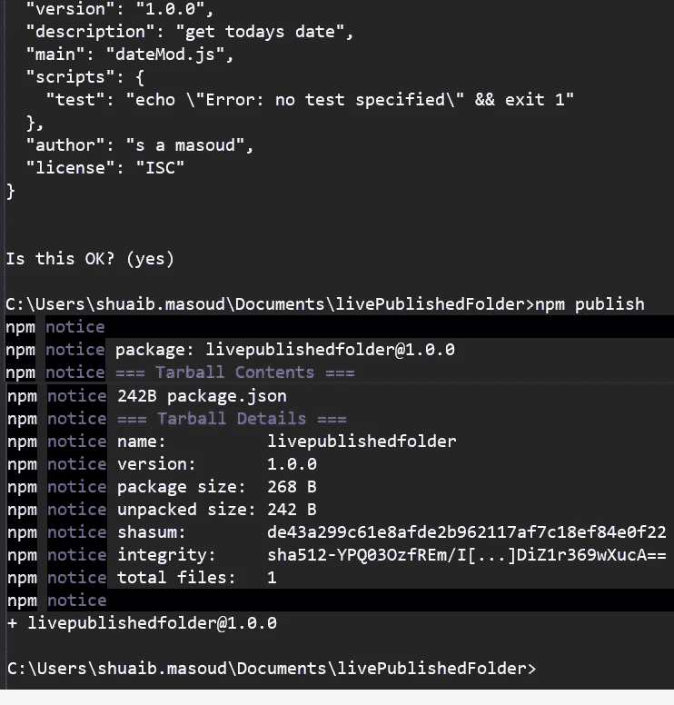
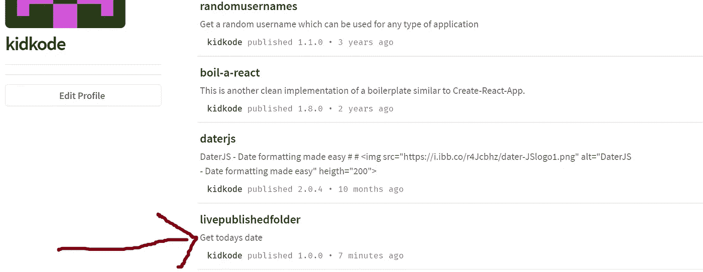
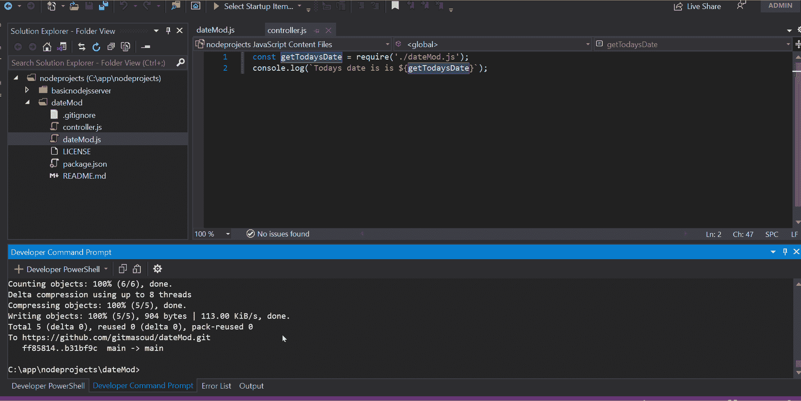

# 让生活更简单的 7 个 Node.js 工具+真实世界的例子

> 原文：<https://javascript.plainenglish.io/7-nodejs-tools-that-make-life-easier-real-world-examples-60a0ac35dd67?source=collection_archive---------0----------------------->


## 加上现实世界的例子。你会很容易爱上这些网站工程。

NodeJS。这对你意味着什么？它仅仅是一个后端工具吗？它仅仅是一个制作本地包的工具吗？或者你把它作为一个 web 服务器使用吗？或者它是创建可重用模块的完美工具吗？还是以上都有？？

不管你用它做什么——NodeJS 毫无疑问是强大的。

我们的目标是通过这 7 个有用且强大的 web 工程工具，让你的编码生活变得更加简单。老实说，从一开始，NodeJS 核心模块中的一些东西就非常复杂，以至于我甚至不知道一些模块是做什么用的，也没有找到用例，它们只是低级工具到实用工具的工具。

尽管如此，这里我认为是最有用的——毕竟，我不想让你没有好的用例演示就挂掉！


Lot’s of examples? YES!

# 1.网络服务器

当作为服务器使用时，用于 web 应用程序开发的 NodeJS 可能是最有用的功能。用 Node 创建一个 web 服务器也非常简单——所以让我们看看如何做。

1.1 将下面的代码复制粘贴到您喜欢的代码编辑器中，保存为 **index.js** 。请仔细阅读代码中的注释——用双正斜杠(//)标记。

nodeJSWebServer.js

1.2 接下来，在 VS 代码或您打开的任何代码 IDE 中的终端窗口中，找到 **index.js** 文件并运行:**节点** **index.js —注意**在我的示例中，我的服务器文件被称为 **nodeJSWebServer.js** 在上面和下面的示例中，它是 **indexnde.js** —这不是最佳实践，您必须确保您的文件都被称为 **index.js** 和

以下是运行此命令的示例和结果:服务器运行在 http://127.0.0.1.3000/



接下来打开您的浏览器，导航到我们指定的主机名和端口，即 [http://127.0.0.1:3000](http://127.0.0.1:3000) ，您将看到您创建的服务器输出的结果如下。简单对吗？？


请记住，对于新手来说，我们在浏览器中看到的是 HTTP 响应，即 HTTP 进程给出了什么响应，即浏览器( **Hello World** )而我们在终端控制台中看到的是服务器响应(服务器运行在 [http://127.0.0.1.3000/](http://127.0.0.1.3000/) )。这是后端和前端或服务器端渲染的最基本和最好的例子。

这就是纯(几乎)NodeJS 的 web 服务器。当然，我们可以向我们的服务器添加更多内容，并使用其他强大有用的工具，如 Express web server 来管理——不过，也许以后我们会这样做，这样我们就不会分散注意力。如果你想在自己的项目中使用 Github repo，那么它就是 https://github.com/gitmasoud/basicnodejsserver。

如果你是一个视觉学习者，这是我为你制作的一个关于如何做的视频



## 2.**自定义 Node.js 模块和包—导出和导入**

让我们首先创建我们自己的本地包，然后创建一个 NodeJS 模块或一些人所说的包。

为了让它变得超级简单，我们将创建一个日期包——它的底层只是一个可重用的 NodeJS 模块，告诉我们今天的日期，并将其格式化为您当前的语言环境。

那么为什么要创建自己的模块呢？在软件工程和开发的世界里，独立的模块从早期就被创造出来了，这也是有原因的。

好处:

*   它们帮助你拥有独立的代码片段，很少或很少被关注
*   更少的错误，因为更少的调试，因为更少的复杂性
*   此外，作为一个单元来测试模块个体的能力也是一个前期和后期的辅助——随着软件的增长，这是非常有益的
*   您可以在尽可能多的类和组件中导出和导入它们
*   你可以为开源运动做出贡献，让你部署在 NPM 上的模块被全世界使用

**让我们创建我们的模块**

2.1 创建一个新文件，将其命名为 dateMod.js，并向其中添加以下代码，首先获取今天的日期，然后将其导出。仅此而已。只有两行代码。

dateMod.js

2.2 我们如何使用它很简单——创建一个新的 Nodejs 文件，并将其命名为 controller.js/your 主节点文件(index.js ),添加此代码以导入并调用我们的模块的导出方法:

```
const getTodaysDate = require('./dateMod.js');
console.log(`Todays date is is ${getTodaysDate}`);
```

2.3 打开终端或 cmd 窗口，然后像这样运行上面的文件:

```
node controller.js 
```

或者在下面运行:

```
node index.js
```

2.4 您将在控制台中看到输出:

```
Todays date is Sat Dec 05 2020 19:45:56 GMT+0000 (Greenwich Mean Time)
```

Github 的回购协议是[https://github.com/gitmasoud/dateMod](https://github.com/gitmasoud/dateMod)

这是一个创建可恢复模块以及如何导出/导入节点模块的视频版本



## **3。发布 NPM 包**

让我们更进一步，把我们之前建立的东西发布到 NPM，让全世界看到，并在他们自己的软件应用中使用我们的模块。一旦被推送到 NPM，他们就可以通过在任何项目(例如

```
npm i dateMod
```

3.1 首先打开终端或 VS 代码，登录 NPM——如果你还没有账户，请先在这里创建一个>[https://www.npmjs.com/](https://www.npmjs.com/)



3.2 在同一个内直接为包/模块创建一个新的—这样做更好，这样更简洁，也更准确。

```
md livePublishedFolder
```

3.3 进入新文件夹:

```
cd livePublishedFolder
```

3.4 运行 npm init 来初始化新项目和 package.json 文件创建

```
npm init
```

遵循所有的步骤



3.5 然后在这个目录下添加我们之前创建的模块文件— **dateMod.js —** 你可以把文件复制粘贴进去。你可以进一步修改它，即使你想添加更多的功能或在新的文件中添加新的模块。

3.6 然后运行 **npm publish** ，一旦完成，你将会看到你已经上传到 npmjs.com 的包的版本号。以下显示为 **npm 通知版本:1.0.0**



如果您现在等待大约 1-10 分钟并刷新您的 npmjs.com 个人资料，您将会看到我们在 packages 下发布的新模块！



Our new module now available as an npm package from NPMJS.com. Anyone worldwide can use it now

上面的源代码在下面，如何进行端到端的 NPM 发布在下面的视频中——请注意上面我的文件夹和包名是 **livePublishedFolder** ,但是在我下面的视频中这个包名为 **dateMod** ,在这里找到**[https://www.npmjs.com/package/datemod](https://www.npmjs.com/package/datemod)**

****

## **4.**核心 Node.js 模块—文档****

**这是文档中一些非常有用的模块。在我看来，这些可能也是最常用的。我不会在这里给出演示，因为文档中有很好的演示，例如文件系统或查询字符串。但是对于大多数有经验的开发人员来说，这里也没有问题。**

**流——读写数据流[https://nodejs.org/docs/latest-v12.x/api/stream.htm](https://nodejs.org/docs/latest-v12.x/api/stream.htm)l 这里有一个关于如何使用流的视频**

**查询字符串—使用 URL 查询字符串[https://nodejs.org/docs/latest-v12.x/api/querystring.html](https://nodejs.org/docs/latest-v12.x/api/querystring.html)**

**流程—与所有运行流程的节点深入合作—[https://nodejs.org/docs/latest-v12.x/api/process.html](https://nodejs.org/docs/latest-v12.x/api/process.html)**

**路径和文件-使用路径和文件-[https://nodejs.org/docs/latest-v12.x/api/path.html](https://nodejs.org/docs/latest-v12.x/api/path.html)**

**操作系统——用这个来查询 CPU 或内存之类的东西—[https://nodejs.org/docs/latest-v12.x/api/os.html](https://nodejs.org/docs/latest-v12.x/api/os.html)**

**Net —网络方法—[https://nodejs . org/docs/latest-v 12 . x/API/net . html # net _ socket _ connect](https://nodejs.org/docs/latest-v12.x/api/net.html#net_socket_connect)—也可以处理服务器事件和套接字。异步网络 API，用于创建基于流的 TCP 或 [IPC](https://nodejs.org/docs/latest-v12.x/api/net.html#net_ipc_support) 服务器(`[net.createServer()](https://nodejs.org/docs/latest-v12.x/api/net.html#net_net_createserver_options_connectionlistener)`)和客户端(`[net.createConnection()](https://nodejs.org/docs/latest-v12.x/api/net.html#net_net_createconnection)`)。**

**Package.json 修改—通过添加高级特性来创建和扩展您的 Package.json 文件—[https://nodejs.org/docs/latest-v12.x/api/packages.html](https://nodejs.org/docs/latest-v12.x/api/packages.html)**

**模块—使用模块的实例—[https://nodejs.org/docs/latest-v12.x/api/module.html](https://nodejs.org/docs/latest-v12.x/api/module.html)**

**使用 ES6 约定的 JS 模块—[https://nodejs.org/docs/latest-v12.x/api/esm.html](https://nodejs.org/docs/latest-v12.x/api/esm.html)**

**使用标准模块 API 创建模块—[https://nodejs.org/docs/latest-v12.x/api/modules.html](https://nodejs.org/docs/latest-v12.x/api/modules.html)**

**文件系统—广泛处理文件，从读取到上传，再到流式传输和下载文件—[https://nodejs.org/docs/latest-v12.x/api/fs.html](https://nodejs.org/docs/latest-v12.x/api/fs.html)**

**DNS —查找 IP 和主机名—[https://nodejs.org/docs/latest-v12.x/api/dns.html](https://nodejs.org/docs/latest-v12.x/api/dns.html)**

**进程外调试—[https://nodejs.org/docs/latest-v12.x/api/debugger.html](https://nodejs.org/docs/latest-v12.x/api/debugger.html)—通过 [V8 检查器](https://nodejs.org/docs/latest-v12.x/api/debugger.html#debugger_v8_inspector_integration_for_node_js)和内置调试客户端访问的进程外调试实用程序**

**压缩文件和流—[https://nodejs.org/docs/latest-v12.x/api/zlib.html](https://nodejs.org/docs/latest-v12.x/api/zlib.html)**

**子流程—处理正在运行的节点流程的子流程—[https://nodejs.org/docs/latest-v12.x/api/child_process.html](https://nodejs.org/docs/latest-v12.x/api/child_process.html)**

**VM —将您的代码作为 VM 运行—[https://nodejs.org/docs/latest-v12.x/api/vm.html](https://nodejs.org/docs/latest-v12.x/api/vm.html)—对于创建抽象和虚拟化代码非常有用，就像它在其他机器上运行一样。**

**使用核心 V8 引擎——尝试一些很酷的方法，如堆数据和 V8 版本等。—[https://nodejs.org/docs/latest-v12.x/api/v8.html](https://nodejs.org/docs/latest-v12.x/api/v8.html)—`v8`模块公开了特定于内置于 Node.js 二进制文件中的 [V8](https://developers.google.com/v8/) 版本的 API**

**[https://nodejs.org/docs/latest-v12.x/api/url.html](https://nodejs.org/docs/latest-v12.x/api/url.html)—使用密码、查询字符串、在 URL 中搜索、获取和设置用户名等。还有更多。**

## **5.**微服务&无服务器功能****

**参赛人员:[https://expressjs.com/en/guide/using-template-engines.html](https://expressjs.com/en/guide/using-template-engines.html)，[https://expressjs.com/en/guide/routing.html](https://expressjs.com/en/guide/routing.html)**

**在 NodeJS 模块之外，没有什么比使用 Express 和创建无服务器应用和微服务更让我兴奋的了。**

**5.1 这里有一个完整的例子:**

```
var express = require('express');
var app = express();

// respond with "hello world" when a GET request is made to the //homepage
app.get('/', function (req, res) {
  res.send('hello world')
})
```

**如果你愿意，你也可以直接从 NodejS 服务器和/或 Jada 或 Pug 等引擎提供动态前端页面。这对于网页(或任何其他客户端)和服务器之间的两次通信非常有用。**

**5.2 这里有一个例子:**

```
var express = require('express');
var app = express();//set pug as a View engine to output html
app.set('view engine', 'pug')
//set route and data to be injected into the view
app.get('/', function (req, res) {
  res.render('index', { title: 'Hey', message: 'Hello there!' })
})
```

**你说我这里的**微服务**怎么样？？不用担心，这里有一个使用 GCP Firebase 创建干净快速的微服务的例子。一旦你完成了[的安装](http://how to setup microservices with firebase functions)，你就可以使用 Firebase 的函数库在 10 分钟内创建、部署和调用微服务。你不相信我？点击这里查看我的视频**

**5.3 下面这段代码创建了一个微服务，并在 index.js 文件中仅定义了一个名为 helloWorld 的微服务:**

```
exports.helloWorld = functions.https.onRequest((req, res) => {
  // Grab the a text parameter.
  const qParam = req.query.text;

  // Send back a message and send back what was requested
  res.send('Hello world your parameter was: ${qParam} '});
});
```

**只需记住在 Firebase 函数中——每个函数都是一个微服务或端点(对于遗留开发人员；-) ).**

## **6. **Utils 模块****

**参考:[https://nodejs.org/docs/latest-v12.x/api/util.html](https://nodejs.org/docs/latest-v12.x/api/util.html)**

**顾名思义，这个模块也为模块和应用开发者提供了实用功能。它非常强大。让我们看看它提供的一些功能:**

**6.1 util.callbackify()**

**`**util.callbackify(original)** — adds callbacks to Async or Promise methods. This is useful because it forces responses from the methods and a nice callback is returned. Heres how to add a callback to the fn function and once resolved return the value that it returns i.e. hello world`**

```
const util = require('util');

async function fn() {
  return 'hello world';
}
const callbackFunction = util.callbackify(fn);

callbackFunction((err, ret) => {
  if (err) throw err;
  console.log(ret);
});
```

**6.2 util.deprecate()**

> **`***util.deprecate(fn, msg[, code])****- Ever wanted to deprecate some of you deep functions? Use this for a clean way to do it as it outputs messages for you too. I never heard of this function before but seems really cool and will useful for large projects. See the exmaple below:*`**

```
const util = require('util');exports.obsoleteFunction = util.deprecate(() => {
  // Do something here.
}, 'obsoleteFunction() is deprecated. Use newShinyFunction() instead.');
```

**请务必在此查看 NodeJS 已弃用 api 的完整列表[https://NodeJS . org/API/depreciations . html # depreciations _ list _ of _ depreciated _ API](https://nodejs.org/api/deprecations.html#deprecations_list_of_deprecated_apis)**

**6.3 util.format()**

```
**util.format(format[, ...args]) -** method returns a formatted string using the first argument. There's many format specifiers to choose from.
```

**这里有一个如何使用它的例子:**

```
util.formatWithOptions({ colors: true }, 'See object %O', { foo: 42 });
// Returns 'See object { foo: 42 }', where `42` is colored as a number
// when printed to a terminal.
```

**更多格式化选项，如 CSS 或 JSON，请参阅完整文档。**

**6.4 util.getSystemErrorName()**

**`**util.getSystemErrorName(err)**- Return system errors that come from NodeJS API fs.access('file/that/does/not/exist', (err) => {
const name = util.getSystemErrorName(err.errno);
console.error(name); // ENOENT
});`**

**上面是一个试图访问一个不存在的文件的方法。你可以通过管道将错误返回到 getSystemErrorName，以便它输出一个错误号，然后在控制台窗口中显示它。**

**6.5 util.inspect()**

**`**util.inspect(object[, options])-**` 检查字符串格式的对象。小心这一点，因为您知道在运行时事情会发生变化。这里有一些如何使用它的例子。你可以看到我们有 4 个例子。首先，我们有一个名为 Foo 的类，它获得一个数组类型字符串标签，并注入一个字符串“bar ”,因此通过使用这个方法，我们可以快速检查并获得这个 **Foo [bar] {}** 的结果，我们知道一个类定义是否有一个数组字符串。接下来，我们有一个名为 Bar 的空类，并这样定义'**类 Bar {}** '，由于保留的关键字类总是被忽略，所以使用相同的 Inspect 方法返回 **Bar {}** 。我们有一个对象，它有一个使用 object 类创建对象的定义，当检查时，打印出它是一个 null 对象，即没有值，我们将一个值传递到数组的查找位置。这是这样打印的**[Object:null prototype][foo]{ }****

**6.6 util。IsDeepStrictEqual()**

```
class Foo {
 get [Symbol.toStringTag]() {
 return ‘bar’;
 }
}
class Bar {}
const baz = Object.create(null, { [Symbol.toStringTag]: { value: ‘foo’ } });
const workers = { a: 1, b: 2, c: 3};console.log(util.inspect(new Foo())); // ‘Foo [bar] {}’
console.log(util.inspect(new Bar())); // ‘Bar {}’
console.log(util.inspect(baz)); // ‘[foo] {}’
console.log(util.inspect(workers));**util.isDeepStrictEqual(val1, val2)** — If deep strict equality exists return true. This doesn’t check just high level values and types but deep too e.g. the object and all its properties, all those properties’ properties and so on etc. etc. Heres an example:const util = require('util');
const isdeepequal = util.isDeepStrictEqual;
console.log('deep equal is: '+isdeepequal(1,2)); //< change this 1,1 and result will be true
```

**6.7 效用承诺**

**`**util.promisify(original)** — return a version of a callback that returns a promise`**

**下面是我们如何检查文件细节，并以错误优先的回调方式接收这些信息，以及接收返回承诺的版本。在我们的例子中，我们使用非常有用的 fs。Stats 方法，返回整个 stats 对象以及文件创建时间(stats.birthtimeMs):**

```
const util = require('util');
const fs = require('fs');

const stat = util.promisify(fs.stat);
stat('.').then((stats) => {
  // Do something with `stats`
  console.log(stats);
  //read created time
  console.log('this file was create at this time: ' +stats.birthtimeMs);
}).catch((error) => {
  // Handle the error.
});
```

**其他有用的方法包括编码/解码，检查类型是数组还是整型还是日期类型等等。等等。除此之外，您还会了解到——实用程序应该是您编码工具箱的一部分。**

## **7. **Worker_threads****

**这使得可以使用并行执行 JavaScript 的线程，并执行 CPU 密集型的 JS 调用。一个很好的例子是大型数据工作者列表可以极大地提高数据获取和处理的性能。请记住，工作线程只是主线程和一个 web 工作线程之间的通信，但是不能有多个 web 工作线程。因此说你只能使用端口 1 和端口 2。所以不适合创建聊天室场景。**

**这是可行的:**

```
const { port1, port2} = new MessageChannel();
port1.postMessage({ hello: 'world' });console.log(receiveMessageOnPort(port2));
// Prints: { message: { hello: 'world' } }
```

**但这并不:**

```
const { port1, port2, port3 } = new MessageChannel();
port1.postMessage({ hello: 'world' });
port2.postMessage({ hellos: 'worlds' });console.log(receiveMessageOnPort(port3));
// Prints: { message: { hello: 'world' } }
```

 **[## Node.js v15.3.0 文档

### 源代码:lib/worker _ threads . js worker _ threads 模块支持在…中使用执行 JavaScript 的线程

nodejs.org](https://nodejs.org/docs/latest-v12.x/api/worker_threads.html)** 

**希望你喜欢这篇文章，请务必与所有感兴趣的人分享，并在这里关注我。**

## **学生**

**如果你目前[在学院或大学学习，并且想从事编码和软件开发](/part-1-how-to-break-into-software-development-the-ultimate-guide-for-university-and-college-358cc17b2cd5)，那么在这里 阅读我的下一篇文章[。](/part-1-how-to-break-into-software-development-the-ultimate-guide-for-university-and-college-358cc17b2cd5)**