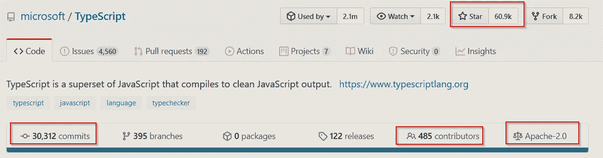

# 使用 TypeScript 的 7 个明显理由

> 原文：<https://javascript.plainenglish.io/7-really-good-reasons-to-use-typescript-f90cd541ba9b?source=collection_archive---------1----------------------->

## 为什么在企业软件开发中使用 TypeScript 比普通 JavaScript 更好

Photo by [Ales Nesetril](https://unsplash.com/@alesnesetril?utm_source=unsplash&utm_medium=referral&utm_content=creditCopyText) on [Unsplash](https://unsplash.com/s/photos/programming?utm_source=unsplash&utm_medium=referral&utm_content=creditCopyText)

布兰登·艾希最初开发 **JavaScript** 作为操纵**浏览器 DOM** 的简单语言。多年来，JavaScript 已经发展成为一种强大的多范例编程语言和网络通用语言。早期版本的 JavaScript (pre **ES5** )在开发大型和企业规模的软件开发方面有许多问题，因为它的动态特性和语言设计问题，如下所示:

为了克服 JavaScript 的缺点，谷歌早在 2006 年就开发了一个工具集 **GWT** ，将 Java 编译成 JavaScript。这些年来，出现了许多其他编程语言，它们可以将文件转换成 JavaScript: **CoffeeScript、flow、ClojureScript、Scala.js、Dart、TypeScript、Elm、PureScript** 。

在这些语言中，有一种语言脱颖而出:**打字稿**。**微软在 2014 年开发了** TypeScript 作为“**JavaScript 的类型化超集，**”，获得了极高的人气。不是每个人都喜欢 TypeScript。许多 JavaScript 开发人员不喜欢 TypeScript 的类型化本质，认为现代 JavaScript ( **post ES5** )对于企业级和大规模的 Web 开发已经足够好了。

我使用过 JavaScript(在 Node.js 项目中)和 TypeScript(在 Angular 项目中)。两者都是优秀的编程语言。在之前一篇关于主流编程语言的文章中，我将 JavaScript 列为第二大主流语言:

 [## 2020 年最受欢迎的 10 种编程语言

### 针对求职者和新开发人员的顶级编程语言的深入分析和排名

towardsdatascience.com](https://towardsdatascience.com/top-10-in-demand-programming-languages-to-learn-in-2020-4462eb7d8d3e) 

在另一篇关于现代编程语言的文章中，**我将 TypeScript 列为第四大最苛刻的现代编程语言**:

 [## 现在要学习的 7 种现代编程语言

### Rust、Go、Kotlin、TypeScript、Swift、Dart、Julia 如何促进您的职业发展并提高您的软件开发技能

towardsdatascience.com](https://towardsdatascience.com/top-7-modern-programming-language-to-learn-now-156863bd1eec) 

这里我想描述为什么使用 TypeScript 而不是普通的 JavaScript 是更好的选择，特别是对于大规模和企业软件开发。这篇文章不是要描述什么是 TypeScript 或 JavaScript，我假设读者已经了解了 TypeScript 和 JavaScript。

# 它是打字的

在其官网上提到， **TypeScript 是添加了类型注释**的 JavaScript。现在，可能会出现静态类型语言是否比动态类型语言更好的问题。答案是:看情况。由于其类型系统，TypeScript 比 JavaScript 具有以下优势:

*   它提供了编译时的安全性
*   这更容易理解
*   使用现代 IDE 实现更快(代码自动完成，更自然的搜索)。
*   重构更容易
*   它提供了更好的性能

另一方面，就其动态类型而言，JavaScript 比 TypeScript 具有以下优势:

*   没有额外的编译步骤
*   简洁明了的代码
*   无需学习“额外”类型系统
*   用“鸭子”打字，更容易破解
*   无需类型系统，更容易编写更高级别的抽象

现在，究竟是 TypeScript 还是 JavaScript 更有效率还很难说，这将更多地取决于开发人员。对于规模较小的代码库，JavaScript 可能比 TypeScript 更有优势。但是对于**这样一个在商业应用中很常见的大型代码库来说**，TypeScript 由于其类型注释而具有优势。此外，现在，大多数开发人员都知道几种语言(包括一些类型化语言)并使用现代 IDE。如果有人已经知道一种类型化语言和 JavaScript，那么学习 TypeScript 只需很少的努力，他们就可以拥有类型化语言的所有优势。

# 它有出色的语言设计

还有许多其他类型的 JavaScript 语言。让 TypeScript 与众不同的是语言设计。安德斯·海尔斯伯格是一位经验丰富的编程语言设计师，他曾开发过 Delphi、Turbo Pascal 和 C#等编程语言。他利用自己所有的经验将 TypeScript 设计成一种干净、优雅的编程语言。

大多数其他编程语言首先设计它们的类型系统，然后使用它。但是 TypeScript 设计者首先关注 JavaScript 用例，后来开发了类型系统，以便它能够改进 JavaScript 用例。此外，与使用**名义类型**的 C 系列语言不同，TypeScript 使用 S **结构类型**。

此外，TypeScript 使用一些最先进的类型系统，如**联合类型、交集类型、差异类型、可空类型、条件类型**。这里是 [**TypeScript 的高级类型**](https://www.typescriptlang.org/docs/handbook/advanced-types.html) 的官方文档。像许多其他现代语言一样，它也提供**类型推理**。

在语言设计方面，它可以与其他现代语言相媲美，如 **Kotlin、Go、Rust** 。

# 它给出了开发规模

通过开发缩放，我想说的是团队的生产力将保持很高，即使更多的团队被添加到项目中。

通常，从事一个项目的一群优秀的 JavaScript 开发人员可能不需要 TypeScript。但是如果许多团队都在同一个 JavaScript 项目上工作，生产率就会下降。

由于其类型系统，优雅的语言设计，IDE 支持:在大型项目中，与 JavaScript 相比，TypeScript 将提供更好的开发伸缩性。难怪 TypeScript 的官方口号是:“**可伸缩的 JavaScript。”**由于开发规模是当今软件开发行业的一个重要因素，许多大公司和大型开源项目越来越多地使用 TypeScript。

# 开发者喜欢它

微软的**安德斯·海尔斯伯格**和 **TypeScript** 团队在将 TypeScript 设计成一种**实用、现代、优雅的编程语言**方面做得非常出色。他们的辛勤工作被证明是正确的，因为软件开发社区喜欢 **TypeScript** 。我曾经向一群纯 JavaScript 开发人员介绍过 TypeScript，他们在那之前只使用 JavaScript，不了解任何类型化编程语言。最初，我担心他们是否会喜欢使用 TypeScript。在最初的学习阶段(几周)之后，他们都表达了对 TypeScript 的喜爱和满意，并希望坚持使用它，而不是回到 JavaScript。

在 2019 年 Stackoverflow 开发者调查中，TypeScript **在最受欢迎的语言类别中与 Python** 并列第二:

# 它很受欢迎，而且越来越受欢迎

一种语言可以有优秀的特性，但不代表这种语言就会流行。此外，一些语言获得了流行和立即击中(如 Scala，CoffeeScript)，但后来逐渐消失。

> 对于组织和公司来说，选择一门新语言总是一个棘手的问题。如果这种语言在 5 年内不再流行，会发生什么？如果我们不能雇佣新的开发人员，我们将如何处理我们的生产代码库？由于这个原因，转移到一种新的编程语言总是需要特殊的考虑和仔细的观察。

幸运的是，对于 TypeScript，企业不必担心，因为它已经是一种流行的语言。根据 GitHub 的贡献，TypeScript 进入了前 10 名(排名第 7):

Source: [Octoverse](https://octoverse.github.com/)

它也是发展最快的语言之一，去年以 161%的增长率排名第五:

Source: [Octoverse](https://octoverse.github.com/)

TypeScript 的另一个关键因素是，近年来它在行业中的应用越来越多。每周有近 1200 万次下载，这是 JavaScript 领域适应最快的技术之一:

[Source: NPM Trends](https://www.npmtrends.com/typescript)

“2019 年 JavaScript 现状”调查显示，它也是最受欢迎的将文件转换为 JavaScript 的编程语言:

Source: [The State of JavaScript, 2019](https://2019.stateofjs.com/javascript-flavors/)

# 它是开源的，由微软提供支持

2014 年，微软首次创建了 TypeScript。由于**谷歌**当时也计划开发类似的类型化 JavaScript，他们与微软团队合作，共同开发 TypeScript。因此，从一开始，T4 四大科技公司中的两家就支持 TypeScript。它也是开源的，拥有非常宽松的 Apache 2.0 许可证。目前，TypeScript 得到了许多其他大公司和软件开发社区的支持。

> 它拥有 60k+ GitHub stars 和 30k commits，是最活跃的 GitHub 项目之一:

Source: GitHub

我知道很多人对微软的历史有所保留。但 2020 年的微软与 2000 年代的微软相比，是一个不同的公司，有着不同的理念。今天，微软是最大的开源贡献者，甚至加入了 Linux 基金会。此外，最流行的开源 IDE **VSCode** 是由微软开发的。**所以，没有理由不使用微软开发的 TypeScript**。

# 它是 JavaScript 的超集

TypeScript 的另一个致命特性是，它是带一些额外特性的类型化 JavaScript，这些特性现在还没有出现在 JavaScript 中，但将来可能会出现。这里，TypeScript 与 CoffeeScript 等其他语言不同，coffee script 想要创造一种新的语言。

还有，当 TypeScript 第一次添加类和模块支持时，JavaScript 没有它们。一旦 JavaScript 合并了它们，TypeScript 就与 JavaScript 结盟了。因此，TypeScript 查看 ECMAScript [**规范**](https://www.ecma-international.org/publications/standards/Ecma-262.htm) **，**和 [**TC39 委员会**](https://github.com/tc39) 并在 JavaScript 之前实现建议**、草案或候选特性**。大多数情况下，这个特性是在 JavaScript 中实现的。因此，学习这些特性绝不是浪费时间。例如，这里有一些 JavaScript 中还没有的类型脚本特性:

*   可选链接
*   无效合并
*   枚举类型
*   ECMAScript 私有字段
*   顶级等待

因此，有了三个月的发布周期，TypeScript 可以比官方 JavaScript 更快地添加提议的 ECMAScript 特性。

# 流行的框架和大公司都在使用它

**Angular** 是第一个使用过 TypeScript 的顶级 JavaScript 框架。最近，**尤雨溪**(**vue . js**的创建者)已经声明 **Vue.js** 将在 3.0 版本中进行一次大修，他们将为 **Vue.js 3.0:** 使用 TypeScript

Source: [Vue.js Roadmap](https://github.com/vuejs/roadmap)

在他看来，与 JavaScript 相比，TypeScript 在以简洁的方式维护像 Vue.js 这样的大型复杂代码库方面具有显著的优势。甚至 Ember.js 的核心团队也在他们的改进版 Ember Octane 中转向了 TypeScript。另一个热门的 JavaScript 框架 Svelte 也使用了 TypeScript。很少有人比 Node.js 的创建者 Ryan Dahl 更有 JavaScript 经验。在他的新 JavaScript 和 TypeScript 运行时引擎 **Deno.js** 中，Ryan Dahl 在 JavaScript 上使用了 TypeScript，这是一个支持 TypeScript 的巨大声明:

Source: GitHub

在开发的早期阶段，TypeScript 由**微软**创建，由**谷歌**支持，被大公司大量改编和支持。此外，由于其企业友好的特性(开发人员生产力、类型化、可伸缩、优雅、IDE 支持)，这些特性对于编写和维护大型代码库非常有价值，越来越多的大公司正在使用 TypeScript。这里有一个很好的博客，描述了为什么 [**Lyft 已经转移到 TypeScript**](https://eng.lyft.com/typescript-at-lyft-64f0702346ea) 。

# 类似文章:

 [## 2020 年要学习的十大 JavaScript 框架

### 现代 JavaScript 开发中最重要的 JavaScript 框架的精选列表

towardsdatascience.com](https://towardsdatascience.com/top-10-javascript-frameworks-to-learn-in-2020-a0b83ed3211b)  [## 现在要学习的 7 种现代编程语言

### Rust、Go、Kotlin、TypeScript、Swift、Dart、Julia 如何促进您的职业发展并提高您的软件开发技能

towardsdatascience.com](https://towardsdatascience.com/top-7-modern-programming-language-to-learn-now-156863bd1eec)  [## 2020 年最受欢迎的 10 种编程语言

### 针对求职者和新开发人员的顶级编程语言的深入分析和排名

towardsdatascience.com](https://towardsdatascience.com/top-10-in-demand-programming-languages-to-learn-in-2020-4462eb7d8d3e) 

# 用简单英语写的便条

你知道我们有四份出版物和一个 YouTube 频道吗？你可以在我们的主页[**plain English . io**](https://plainenglish.io/)上找到所有这些信息——关注我们的出版物并 [**订阅我们的 YouTube 频道**](https://www.youtube.com/channel/UCtipWUghju290NWcn8jhyAw) **来表达你的爱吧！**