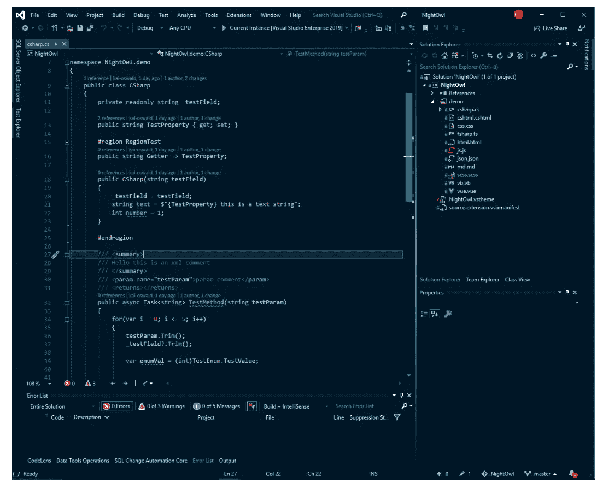
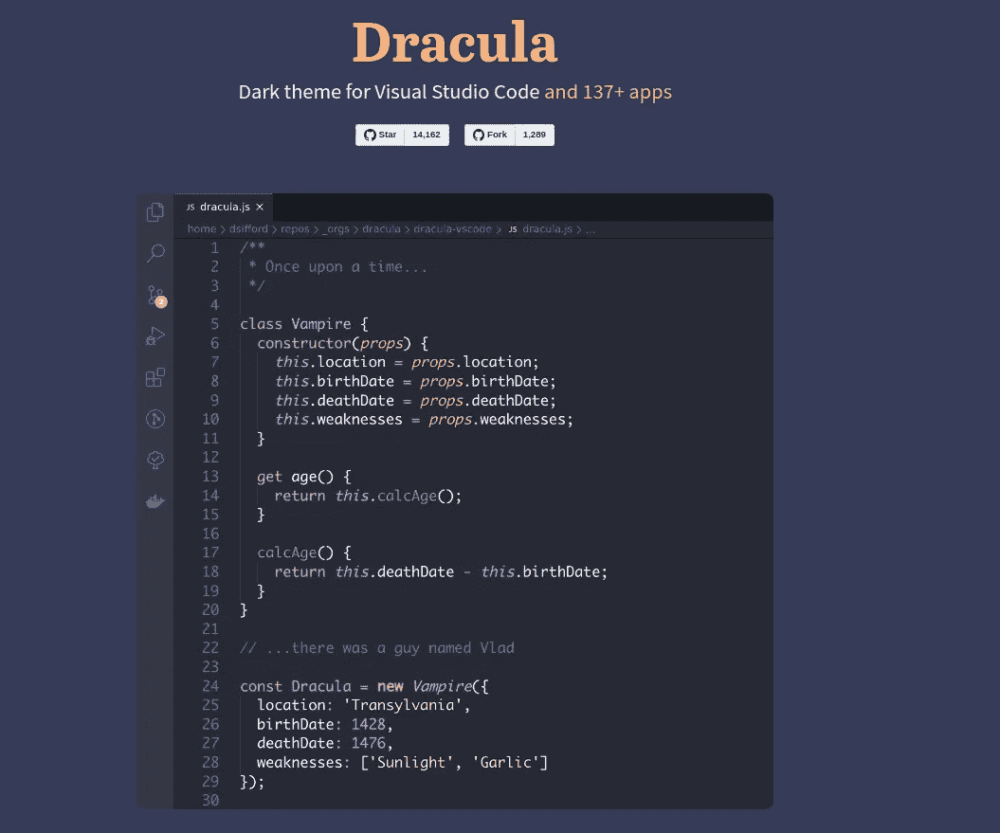
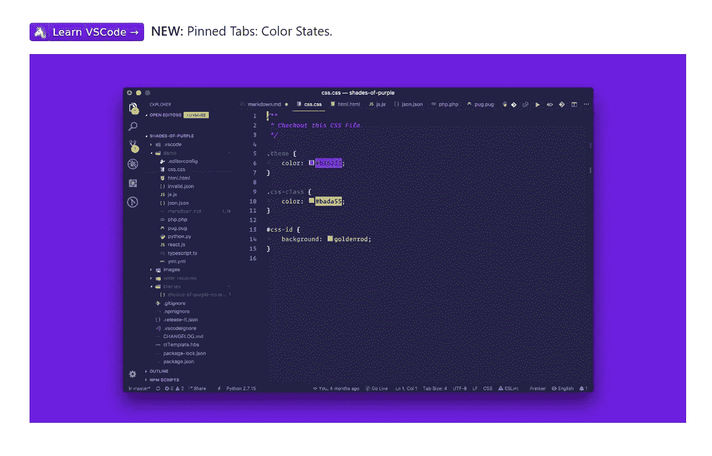
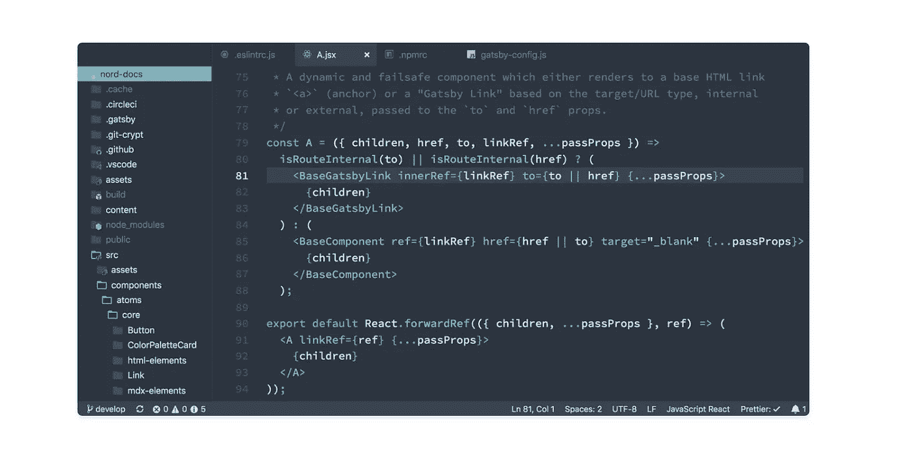
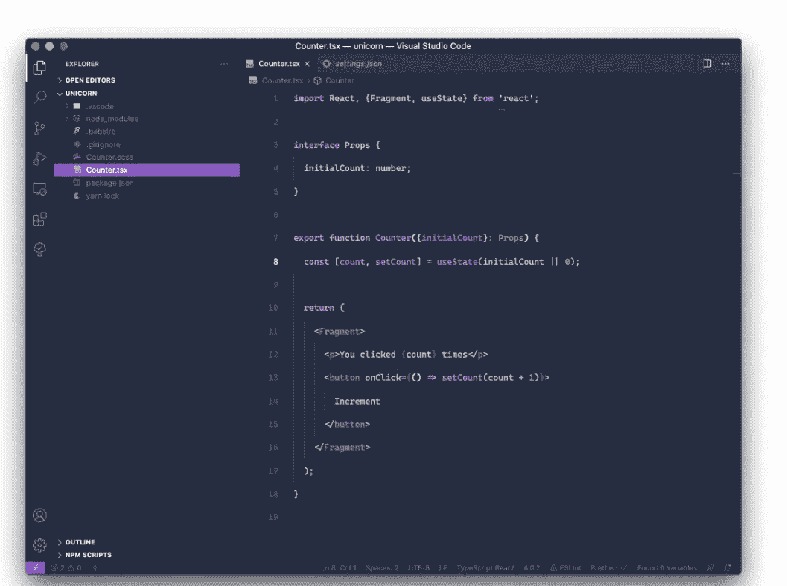
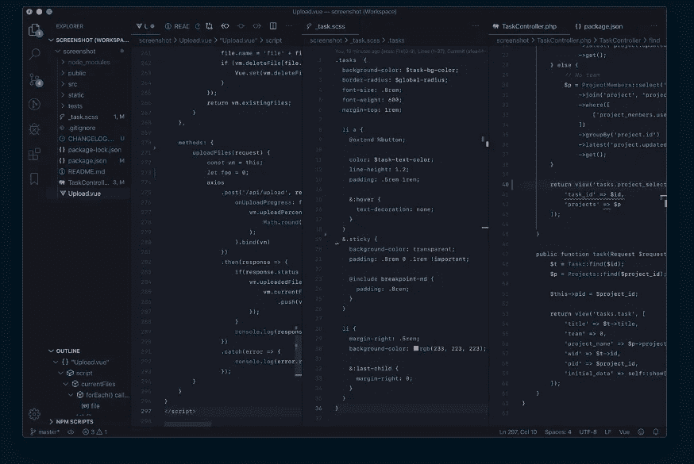
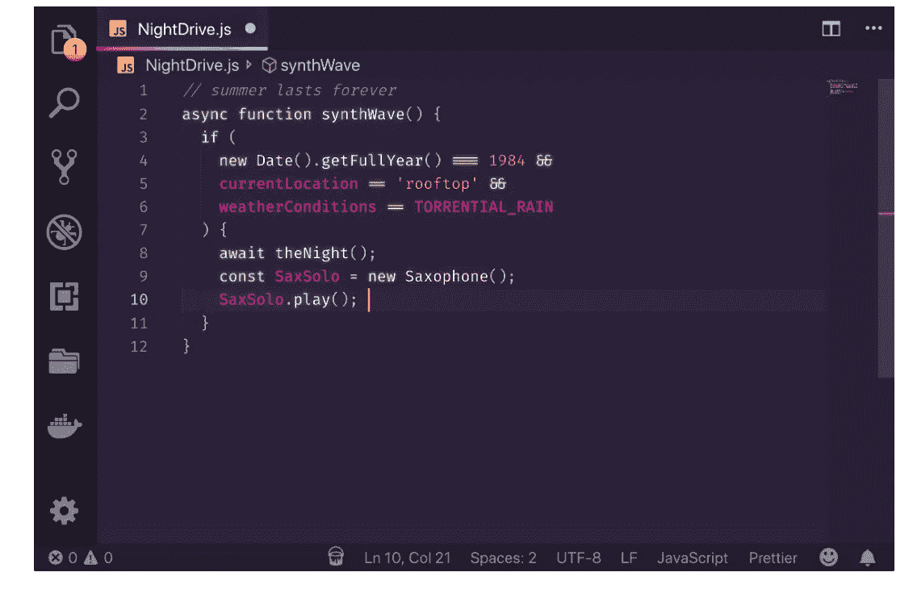

# 让你的 VS 代码看起来漂亮的 7 个主题

> 原文：<https://javascript.plainenglish.io/7-themes-to-make-your-vs-code-look-beautiful-762b0d9d4609?source=collection_archive---------11----------------------->

## 让你的日常代码看起来很棒

Photo Credits to [Tech Daily](https://techdaily.ca/)

你的代码是艺术，你可以让它看起来像艺术一样美丽。

我相信，当我们看到自己的作品看起来美丽而优雅时，我们都会在满足感方面受益。今天，我在这里给你带来一些我最喜欢的主题想法，让你的 vs 代码编辑器完成这样一个赏心悦目的任务。

## [夜猫子](https://marketplace.visualstudio.com/items?itemName=sdras.night-owl)(我个人选择)

对我自己来说，我一直想要一个好看的图形主题，强制使用深色调色板，但颜色不能过于明亮，以免干扰我的眼睛。

我在主题《夜猫子》中发现了所有这些特征，你可以在下面看到。

## [德拉库拉](https://draculatheme.com/visual-studio-code/)

德古拉是 vs 代码的另一个伟大的黑暗主题，比夜猫子稍微亮一点，让这个主题看起来很卡通。

## [深浅不一的紫色](https://marketplace.visualstudio.com/items?itemName=ahmadawais.shades-of-purple)

一个看起来很漂亮的主题，全部基于不同深浅的紫色，给你的编辑一个怪异梦幻的外观。

## [诺德](https://vscodethemes.com/e/arcticicestudio.nord-visual-studio-code)

他们说冬天来了，这个主题是对你的一个完美的提醒。

## [Palenight](https://marketplace.visualstudio.com/items?itemName=whizkydee.material-palenight-theme)

Visual Studio 代码的一个优雅而有趣的受材料启发的主题。

## [东京之夜](https://marketplace.visualstudio.com/items?itemName=enkia.tokyo-night)

这个主题的灵感来自东京夜晚美丽的灯光，非常适合在晚上编码时搭配一些[高保真音乐](https://medium.com/javascript-in-plain-english/how-the-right-music-can-boost-your-coding-productivity-2a651b1e8690)。

## [合成波](https://marketplace.visualstudio.com/items?itemName=RobbOwen.synthwave-vscode)

对于那些一直喜欢 80 年代作品的人来说，这个主题会让你很快回到过去，明亮的灯光和色彩，就像一个古老的街机游戏。

## 结论

我确信你可以从看到你的代码由于主题而变得漂亮中受益。如果你已经在用了，我建议你试着改变一段时间，因为即使是一点点的不同也能激发你做更多的事情，并为一些伟大的工作感到动力。

一如既往，感谢你的阅读，别忘了在下面发表评论，提出一些你认为有效的更酷的主题。

— *皮耶罗*