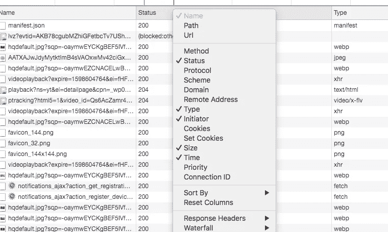
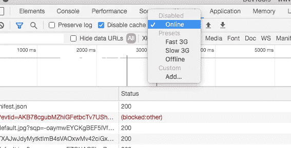
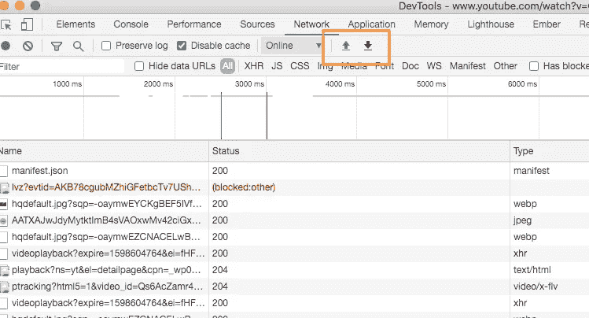
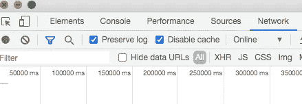
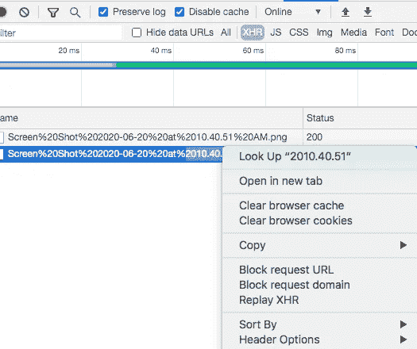
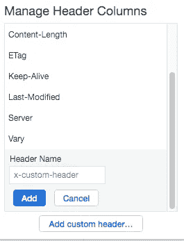
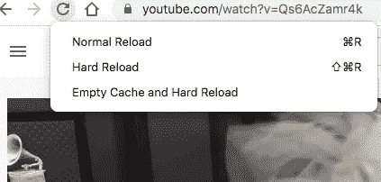

# 像有经验的开发者一样使用谷歌 Chrome dev tool[网络]标签的 7 个技巧

> 原文：<https://javascript.plainenglish.io/7-tips-to-use-google-chrome-devtool-network-tab-like-an-experienced-developer-81400cbc1cc9?source=collection_archive---------3----------------------->

## 何时使用网络面板

Chrome Devtool 中的网络选项卡或面板是软件开发人员，尤其是 Web 和前端开发人员可以使用的最流行的调试工具之一

网络面板最常见的使用案例是

*   确保资源确实被上传或下载
*   检查单个资源的属性，如 HTTP 头、内容、大小等

## 介绍

我相信这篇文章的很多读者都有过至少一次使用 Chrome Devtool 的经历。检查诸如 2xx(成功)、4xx 客户端错误、5xx 服务器错误之类的状态代码是软件工程师查看 HTTP 请求/响应是否安全地发送到服务器或从服务器接收的常见做法之一

Chrome DevTools 的[网络]选项卡提供了更多的功能，让我们来看看它们的一些功能，让你的调试更加容易

为了更好地解释，我将从美国消费者新闻与商业频道 Youtube 视频中打开的 Chrome DevTools 截图，该视频名为**你需要大学学位才能幸福吗？**

## 提示 1

**显示更多信息**

默认情况下，有许多列是隐藏的，您可能会发现这些列很有用。您可以右键单击网络日志表的标题，并选择要显示的列

## 提示 2

**模拟较慢的网络连接**

通过限制页面，您可以更好地了解在较慢的网络环境(如移动设备)中加载一个页面需要多长时间

您可以从**快速 3G、慢速 3G、离线、在线**选项中进行选择

## 提示 3

**HAR 文件:导入/导出网络日志**

HAR 是 HTTP Archive 的缩写，是一种用于在 web 浏览器和网站之间跟踪信息的格式。当你与其他前端/后端开发人员交流并解释你的浏览器网络选项卡中发生的事情时，HAR 文件通常非常有用。HAR 文件可以帮助其他开发者通过在他们的浏览器网络标签中导入来轻松模拟你的网络日志，这大大减少了潜在的沟通障碍

## 提示 4

**跨页面加载保存请求**

当您“刷新”页面时，您以前的所有网络日志都会消失。要跨页面加载保存请求，请选中网络面板上的**保留日志**复选框。DevTools 保存所有请求，直到您禁用**保留日志**

## 提示 5

**重播 XHR 的请求**

您可以通过右击请求表中的请求并选择 **Replay XHR 来重放 XHR 请求。**当您想要再次发出相同的请求而不明确触发任何事件时，这很有用。您可以选择只为 XHR 请求**重放 XHR** (在这个例子中，我过滤了 XHR 的请求)

## 提示 6

**添加自定义列**

您可以通过右键单击请求表的标题并选择**响应标题>管理标题列**来向请求表添加一个定制列

## 技巧 7

**缓存和重新加载**

如果你打开 devtools 并点击“重新加载”图标 1~2 秒钟，你会看到 3 个重新加载的选项。普通重载和硬重载的区别取决于你是否想使用缓存中的任何东西。

正常重新加载—与按“F5”相同

硬重新加载—强制浏览器重新下载每个 JavaScript 文件、图像、文本、文件等

这有利于测试最终用户的初始渲染速度

## 结论

Chrome DevTools 是开发者可用的最强大的调试工具之一。希望你从阅读这篇文章中有所收获，祝你编码和调试愉快！谢谢大家！

## **用简单英语写的 JavaScript**

你知道我们有三份出版物和一个 YouTube 频道吗？在 [**plainenglish.io**](https://plainenglish.io/) 找到所有内容的链接！