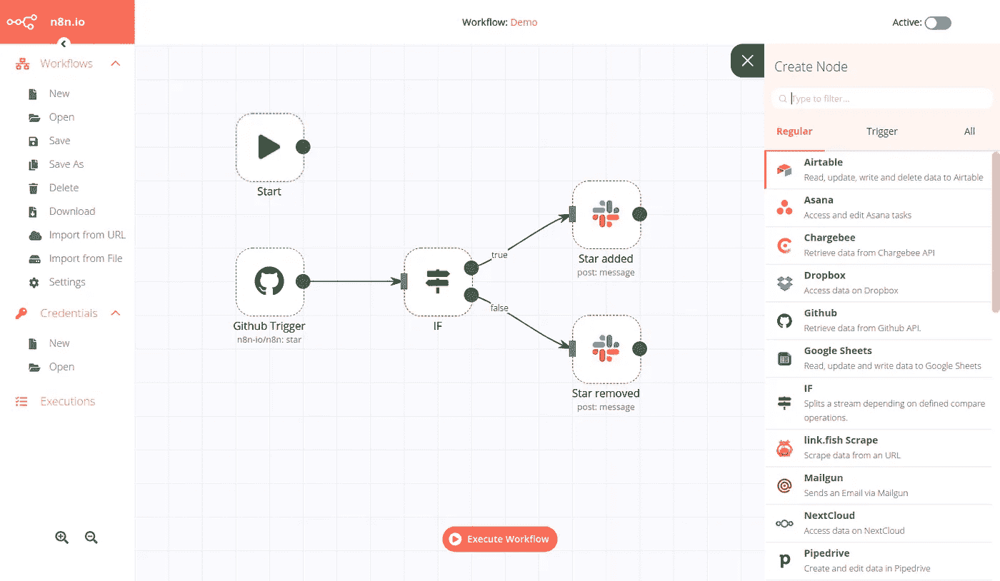

# GitHub 上的 7 个趋势类型脚本项目

> 原文：<https://javascript.plainenglish.io/7-trending-typescript-projects-on-github-675d3fc8ecae?source=collection_archive---------2----------------------->

## 您应该签出的类型脚本项目

这里有一些趋势性的 TypeScript 项目，可以让你的生活更轻松。

# 1.故事书

[Storybook](https://github.com/storybookjs/storybook)

**储存库**:【https://github.com/storybookjs/storybook】T4

**星星** : 54.5k

**Storybook** 是 UI 组件的开发环境(沙盒)。它允许开发人员查看大量的组件目录，在这些目录中他们可以测试和分析组件的不同状态。它是为 Vue、React、Angular 和许多其他框架而构建的。这对于测试组件及其边缘情况特别有用。您可以轻松地测试组件，而不需要任何业务逻辑。

# 2.格拉夫纳

[Preview](https://play.grafana.org/d/000000012/grafana-play-home?orgId=1)

**储存库**:[https://github.com/grafana/grafana](https://github.com/grafana/grafana)

**星星** : 37.9k

**Grafana** 是由 Grafana Labs 创建的用于监控和观察的开源平台。无论您将指标存储在哪里，Grafana 都可以帮助您理解、查询和可视化您的数据。您可以创建适合您需求的各种仪表板，并在您的团队中共享它们。动态仪表板使您能够创建可重用的仪表板，并且查看每个指标的日志非常简单。

# 3.涡轮链

[Turbolinks](https://github.com/turbolinks/turbolinks)

**储存库**:[https://github.com/turbolinks/turbolinks](https://github.com/turbolinks/turbolinks)

**星星** : 11.9k

**Turbolinks 的**支持更快的网络应用导航。该库的目标是获得单页应用程序的性能优势。当你点击另一个页面的链接时，Turbolinks 将处理获取页面，交换它的`<body>`并合并它的`<head>`，而不必完全刷新页面并产生通常的加载时间。它可以在所有现代桌面和移动浏览器上运行，也支持移动应用程序。

# 4.打字稿深潜

[TypeScript Deep Dive](https://basarat.gitbook.io/typescript/)

**储存库**:[https://github.com/basarat/typescript-book](https://github.com/basarat/typescript-book)

**星星** : 11.4k

由 Basarat Ali Syed 创建的 **TypeScript Deep Dive** 是学习、改进和更新 TypeScript 所有内容的绝佳资源。它是免费和开源的，支持 12 种语言。它包含了大量的例子和提示来支持它的内容。当之无愧的明星/书签！

# 5.n8n —工作流自动化工具

[n8n](https://docs.n8n.io/)

**储存库**:【https://github.com/n8n-io/n8n】T2

**星星** : 10.2k

n8n 是一款免费的工作流自动化工具，可以帮助您通过 API 将所有应用程序互联在一起，无需代码即可共享和操作数据。凭借 170 多个不同的节点来自动化您的工作流程， **n8n** 具有高度的可定制性。它可以托管在您自己的服务器上，以确保您的数据安全。凭借其出色的用户界面，您可以立即构建工作流。

# 6.GraphQL 航海家号

[Demo](https://apis.guru/graphql-voyager/)

**储存库**:[https://github.com/APIs-guru/graphql-voyager](https://github.com/APIs-guru/graphql-voyager)

**星星** : 5.5k

**GraphQL Voyager** 是一个交互式图形，允许您表示任何 GraphQL API。由 APIs Guru 创建，您现在可以可视化地探索您的 GraphQL 的 API 数据模型并与之交互。在构建数据模型时，这是一个很好的工具。

# 7.超级生产力

[Super Productivity](https://super-productivity.com/)

**储存库**:[https://github.com/johannesjo/super-productivity](https://github.com/johannesjo/super-productivity)

**星星** : 2.5k

Johannes Millan 的《超级生产力》是一个很好的工具，可以把你的日常任务都集中在一个地方。简单来说，**超级生产力**就是待办事项、时间跟踪器、任务管理器。您可以集成来自吉拉、GitHub 和 GitLab 的任务。实际上，这将帮助您节省管理多个工具的时间，并使您能够在一个仪表板中看到需要做什么以及何时做。