# 你可能不知道的 8 个很酷的控制台黑客

> 原文：<https://javascript.plainenglish.io/8-cool-console-hacks-you-might-not-know-3fcc56115fdc?source=collection_archive---------10----------------------->

## 见证新的控制台日志方法如何使我们的调试变得容易。

Photo by [Cookie the Pom](https://unsplash.com/@cookiethepom?utm_source=medium&utm_medium=referral) on [Unsplash](https://unsplash.com?utm_source=medium&utm_medium=referral)

我确信你可能在日常工作中大量使用了控制台方法，不管使用的是什么技术。此外，您可能已经知道一些流行的方法，如 *console.table()、console.warn()、*和 *console.error()* 但是在本文中，我们将探索一些更有趣、更方便、更有帮助的控制台方法，为单调的控制台屏幕增添一些乐趣。

首先，让我们看一下来自 risingstack.com 的一份调查，以理解为什么我们今天在这篇文章中分享最有用的控制台技巧。

# 开发人员仍然信任 console.log 来进行调试

Console.log 仍然领先于其他调试解决方案，如**节点检查器**、**内置调试器**和**调试模块**。大约有 10%的节点开发人员使用它来查找应用程序中的错误，同时也有更复杂的解决方案。

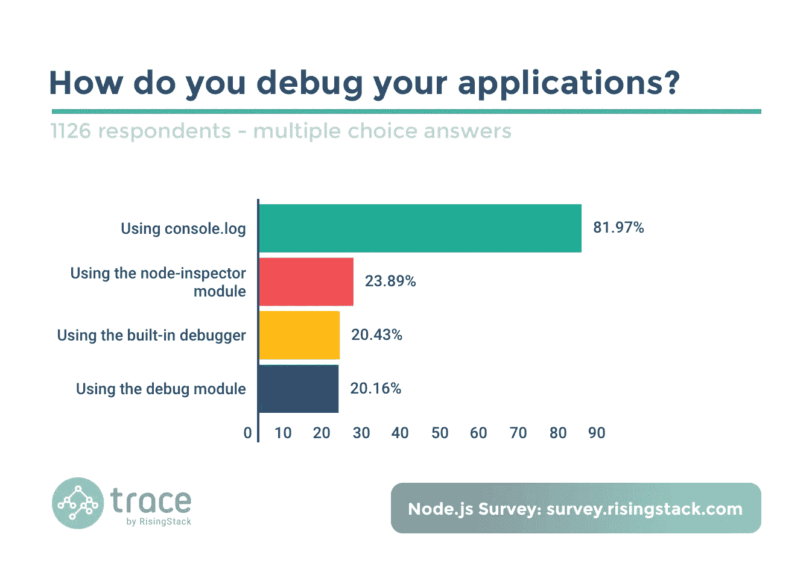

Survey from risingstack.com

虽然在我们的生产代码中使用控制台日志不是一个好的做法，但是我们使用一些生产就绪的工具包和技术来进行日志记录和调试，这将在本文的后半部分进行分享。

> 我们都知道“**在 JavaScript 中一切最终都是一个对象**，因此这里为我们再举一个:
> > `typeof console`
> `"object"`

## 在浏览器中检查完整的控制台对象

让我们试着在您最喜欢的浏览器中控制整个控制台对象。您会发现许多未知的函数和方法，如下图所示:

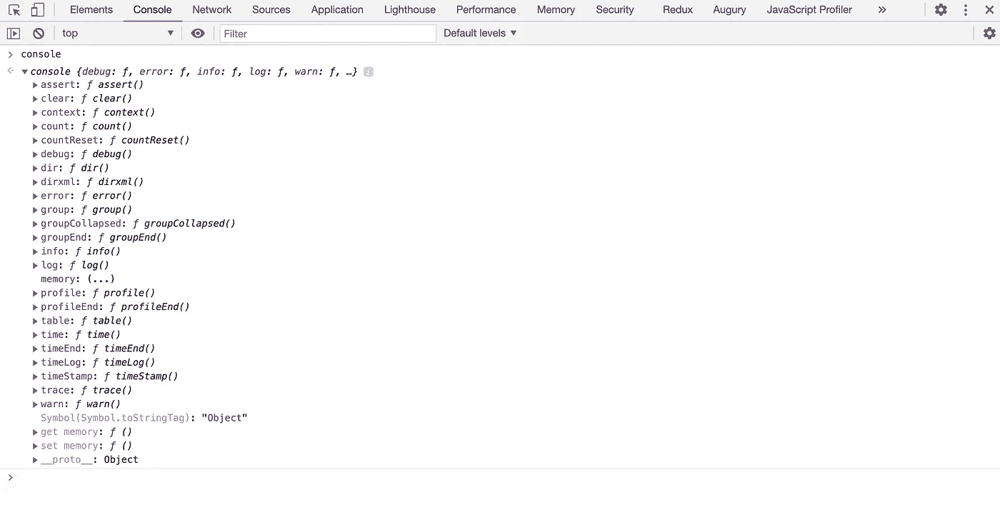

Console the console object in Google Chrome browser

正如我们可以看到的，我们有许多未开发的方法，如时间、组、内存、断言和许多其他方法。因此，事不宜迟，让我们一个接一个地直接跳到所有的黑客。

> 注意:我们将在整篇文章的所有例子中使用谷歌 Chrome 浏览器。

## 1.向控制台提供样式

你知道我们可以给我们的控制台消息赋予颜色或字体样式吗？这真的是一个技巧，知道如何使用一个`%c`标志用 CSS 来设计`console.log`的输出。示例:

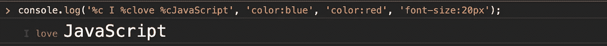

Providing styles like CSS colors, fonts

## 2.创建图像精灵

虽然我们不能使用`%c`来实现基本的文本样式，但是我们可以将背景图像应用到空间中，并实现一些粗糙的精灵，如下所示。我们应该以`background-size`为例`cover.` 选择最佳的空格数:

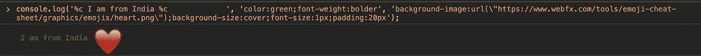

Adding heart emoji image to your logs

你可以用任何图片代替表情符号。

## 3.使用 console.group()组织日志

有时，当您调试函数中的语句时，您会控制台记录这些函数的每个阶段。所有这些控制台日志可能会变得非常杂乱无章。很难分析每个日志的来源。在这种情况下，`console.group()`前来救援。这将把你所有的日志分组到一个组中，这样就不会和其他日志混淆。如果你希望它们被折叠和隐藏，我们也可以使用`console.groupCollapsed()`。示例:

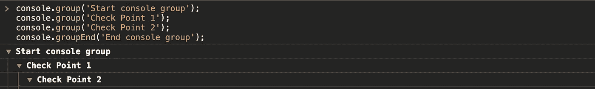

console group methods

source: giphy.com

## 4.使用 console.time() & console.timeEnd()跟踪所用的时间

我们应该使用这个控制台程序而不是典型的 setTimeout()函数来跟踪函数/循环所花费的时间。使用`console.time()`启动计时器，使用`console.timeEnd()`结束计时器。这两个命令之间的时间将以毫秒为单位输出。这对于用户体验(UX)来说也是惊人的。示例:

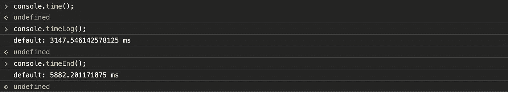

track the time taken

## 5.使用 console . count()& console . count reset 调试循环

调试循环总是有点复杂，不使用控制台日志迭代器来跟踪循环中的其他日志，而是在循环中使用`console.count()`非常简单。

为了将计数器重置回 0，只需使用`console.countReset().` 示例:

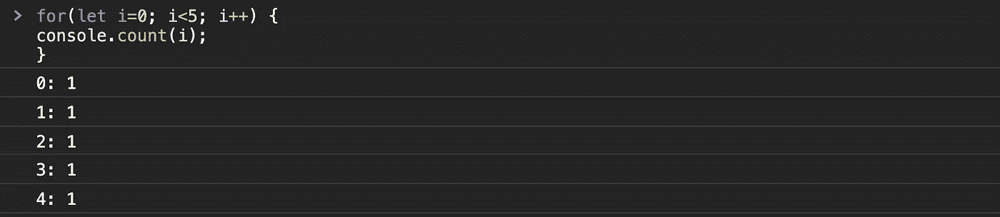

console.count()

## 6.用 console.table()保持整洁

在许多情况下，数组或对象数据的`console.log()`输出看起来很难看，有时混乱得难以理解，尤其是在嵌套的情况下。在这种情况下，我们可以用`console.table().`举例:

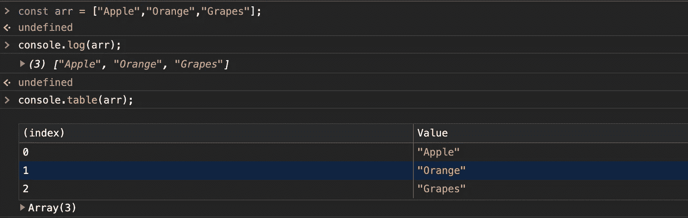

console.log() vs console.table()

在我看来，对嵌套数组/对象使用`console.table()`是最好的用例。因为如果您将结果与传统的 console.log()进行比较，您的结果会更容易阅读。

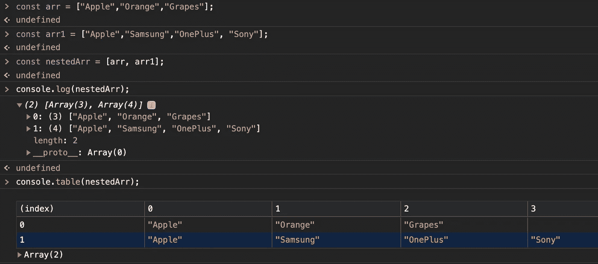

console.table() for nested arrays

## 7.用 console.assert()处理 if 语句

如果您希望避免仅针对控制台记录条件数据的 If 语句，我们可以利用`console.assert()`，因为它是处理 if 语句的一个很好的工具，当语句不满足时，它会在控制台中显示一个错误。示例:

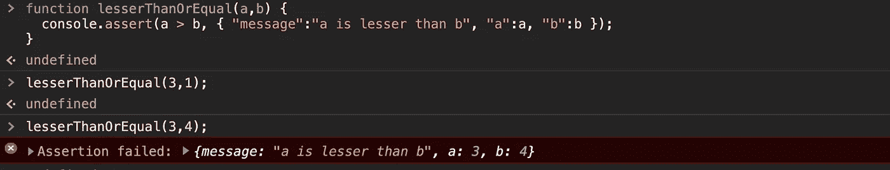

console.assert()

`console.assert()`带 2 个参数，(if 语句，{label: 'info '，label: 'info' …..})

## 8.使用 console.memory 检查堆大小

`console.memory()`是控制台的一个属性(不是功能),用于存储您的 HeapSize。跟踪使用的堆内存可能会有所帮助。示例:

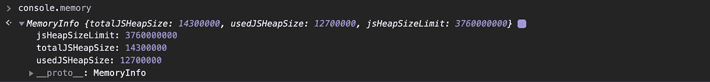

console.memory

# JavaScript/Node.js 应用程序调试工具包

正如本文前面所承诺的，我们将在后面分享一些用于日志记录和调试的生产就绪工具。为了调试全栈 JS 应用程序，我们确实需要更加成熟和增强的生产级解决方案:

*   [Chrome DevTools](https://developers.google.com/web/tools/chrome-devtools/) ，现在除了支持 js 代码在本地浏览器运行外，还支持 [Node.js 调试](https://medium.com/the-node-js-collection/debugging-node-js-with-google-chrome-4965b5f910f4)
*   Node.js [调试](https://github.com/visionmedia/debug)模块

因为在生产代码中不使用控制台选项是一种很好的做法，我们可以使用其他工具，如 [**Winston**](https://github.com/winstonjs/winston) 或 [**Loglevel**](https://github.com/pimterry/loglevel) 来记录生产级日志，如信息、警告、错误等。

这就是通过各种控制台黑客调试的所有开发。希望能让你接下来的调试变得轻松有趣！😃

让我们在 LinkedIn([@ kapilraghuwansh](https://www.linkedin.com/in/kapilraghuwanshi/)I)和 Twitter ( [@techygeeek](https://twitter.com/techygeeeky) y)上保持联系，以获取更多此类引人入胜的技术文章和教程。🤝

在下面的评论区写下你的建议和反馈。