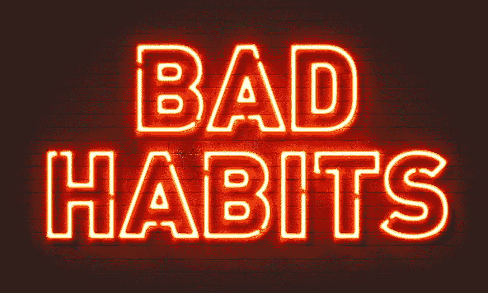
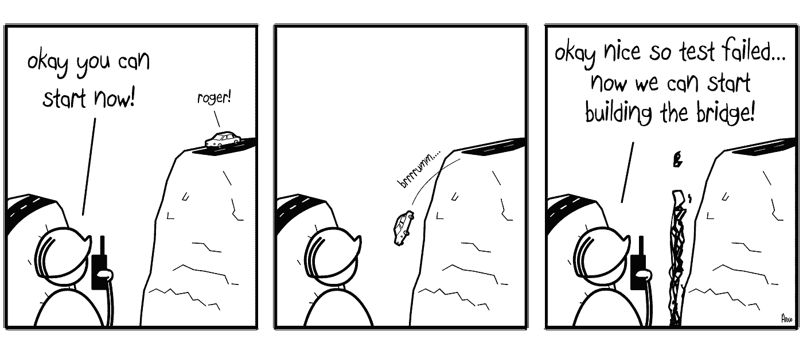

# 使用 Javascript 开发时应该避免的 8 个习惯

> 原文：<https://javascript.plainenglish.io/8-habits-you-should-avoid-when-developing-with-javascript-a39a5ca2fae6?source=collection_archive---------0----------------------->

## 今天比明天更好地离开这些坏习惯

众所周知 **Javascript** 已经变得很时髦了(我想我们都同意这一点)。这意味着对工作机会的需求增加，以及承诺在 6 个月内培训开发人员的“*训练营*”的激增。

From zero to hero in 6 months

然而，当我们开始深化这种语言时，很容易陷入一系列难以摆脱的习惯或倾向(特别是如果它是在绕过一些最基本和最重要的点的快速通道上学习的)。这就是为什么我觉得写这篇文章很有趣的原因，在这篇文章中，我将谈论一些如果我们想成为这种语言的优秀开发者，最好避免的习惯。

让我们看看他们！

# 1.使用 JQuery

A minute of silence by jQuery 😢

对于最新的 **jQuery** 来说，它是一个库，在 web 开发热潮之初，它在 Javascript 生态系统中扮演了非常重要的角色。在浏览器以他们自己的方式实现规范的时候(问候 Internet Explorer！)由于 jQuery 提供的抽象，它帮助标准化了许多东西；由于它的“ *helpers* ”，它简化了操作 DOM 的方式；并且提供了一种简单的方法来进行 AJAX 调用。总之，如果我说如果没有 jQuery，我们所知道的 web 就不会存在，我想没有人会把手放在头上。

然而，今天它给我们带来的所有优势都不复存在了，因为它的许多特性已经属于标准，例如用于 AJAX 调用的 fetch 或用于操作 DOM 的新函数，我在本文中已经提到过:

 [## 香草 JS。AddEventListener，querySelector y closest

### 我对艺术很感兴趣，尤其是对艺术有兴趣的人。

medium.com](https://medium.com/@ger86/vanilla-js-addeventlistener-queryselector-y-closest-ef95b3a0a2c1) 

此外， **React** 和其他库的出现以更好的方式解决了控制应用程序状态等问题，因此即使在那里 jQuery 也输掉了比赛。毫不奇怪，使用 DOM 元素作为状态存储是很常见的，这导致必须编写相当复杂的代码来计算下一个或上一个状态。

因此，俗话说，对凯撒来说，什么是凯撒的，但今天 jQuery 是 100%可牺牲的。

如果你想阅读更多关于这个主题的内容，这里有一篇来自 GitHub 团队的文章，他们在文章中评论了从基础代码中移除 jQuery 的决定:

 [## 从 GitHub.com 前端移除 jQuery

### 我们最近完成了一个里程碑，我们可以把 jQuery 作为前端代码的依赖项，用于…

github.blog](https://github.blog/2018-09-06-removing-jquery-from-github-frontend/?source=post_page-----7761dda3bd90----------------------) 

# 2.不要一直学

Don’t keep learning Javascript

一旦我们熟悉了一门语言，我们就会停止学习，不再把我们在工作中已经熟知的东西付诸实践，这是很常见的。此外，**在一家公司内继续培训有时是多么困难**也强化了这一点:有些东西是“现在”需要的，似乎永远没有时间继续学习。

然而，如果你真的喜欢编程(这个建议对你使用的任何语言都有效)**我的建议是，你每周至少预定几个小时来学习新的东西**，阅读几篇关于编程的文章，甚至查看一个库的源代码:通过查看其他开发人员编写的代码，你会对自己学到的东西感到惊讶。

当然，也有替代“单独”学习的方法。例如，在大城市有许多聚会，有非常有趣的谈话，人们很高兴分享知识，像 [**CodeWars**](https://www.codewars.com) 这样的网站用一些最常见的编程语言提出了一个日常挑战来解决它(你也可以看到对所提问题的最巧妙的解决方案)。

无论如何，走出你的舒适区，继续学习！

# 3.忽视你的身心健康

Do not neglect your physical or mental health

我已经在业余水平下了很长时间的国际象棋，当我深入研究大师们的生活时，对我影响最大的事情之一是他们必须完全以物理形式存在的需要。

这就是为什么我认为我们应该更经常地记住“mens sana in corpore sano”这句话，因为如果我们想发挥 100%的能力，保持最佳的身体状态是非常重要的。这种需求在开发人员这样的职业中更加突出:我们在电脑前坐了很长时间，从长远来看，不良姿势导致的背部疼痛等问题似乎是不可避免的。

我的建议是，每天留出半小时做一些运动，即使是低强度的运动，比如快走或爬楼梯。从长远来看，你会欣赏它的。

到目前为止物理部分。但是精神上的呢？最近，关于什么是 10x 开发人员的争论以及定义他的是他的社交技巧。然而，通过多挣一两个小时的工作来忽视日常生活的这一方面是一个很容易犯的大错误。

在工作的高峰期，很容易长时间工作而不抬头，不与任何人交谈，但人类的大脑也需要清理，与其他人互动并“断开”长时间孤立自己可能会导致焦虑或抑郁问题，所以休息一下吧。毫无疑问，这一天的时间比你想象的要长，你可以借此机会去喝点啤酒、看电影或参加一项团队运动。

# 4.不要编写测试

Write tests when developing applications

不写测试是主要的错误之一，尤其是当我们正在学习或者必须开发我们的第一个项目的时候。事实上，在大型的应用程序中，为了减少时间……直到对代码的每一次修改都开始出现错误，放弃它们是很常见的。

换句话说，**尽管起初看起来编写测试是浪费时间和金钱**，但是最终将它们集成到您的开发方法中比在项目的初始阶段放弃它们要花费更少的成本。毫不奇怪，测试是*测试驱动开发的基石。*

除了别的以外，测试使得代码更易于维护，提供了某种保证，即一切都按预期工作，并且允许验证引入的更改不会影响代码的其他部分。也就是说，不管代码看起来运行得有多顺利，总会有边界(极端)的情况，如果没有足够的测试，我们将无法找到它们。

就 Javascript 而言，有几个库允许您以简单的方式编写测试，因此如果您想深入研究，我建议您参考以下文章:

 [## 2018 年 JavaScript 测试概述

### 本指南旨在让您了解 JavaScript 最重要的推理、术语、工具和方法…

medium.com](https://medium.com/welldone-software/an-overview-of-javascript-testing-in-2018-f68950900bc3) 

# 5.使用框架学习 Javascript

Learn Javascript using frameworks. A bad idea

一旦你迈出了 Javascript 和 web 开发的第一步，就很容易开始使用 React、Vue 或 Angular 等社交网络上的库或框架。然而，**同时学习** **Javascript 和一个库或框架似乎不是一个好主意。**

我的建议是你至少花一些时间学习语言的基础，熟悉它们的模式，然后跳到一个库/框架，因为否则你很可能放弃了解某些库已经以某种方式解决的元素。这在 Angular 的情况下更加令人担忧( *bootcamps* 的主要问题),因为它有自己的许多元素的实现(Angular 方式),并大量使用了高级库，如 RxJS，这些库抽象了许多概念，在我看来，了解这些概念是很重要的。

像“ [**你不知道的 Javascript**](https://github.com/getify/You-Dont-Know-JS) ”这样的书读起来相当过瘾，有很多例子和解释让你获得和理解 Javascript 的主要元素。

当然，一旦你开始对 Javascript 感到非常舒服，就开始学习一个库或框架(我的建议是你选择 React，因为它将允许你继续改进 Javascript，同时选择一个非常受欢迎的库，这是目前通往其他库的标志)，因为目前许多工作机会要求了解 React、Angular 或 Vue，所以我们可以说，如果你想在工作场所取得进展，管理其中一个是必不可少的。

# 6.不要学习好的实践

SOLID principles

> 如果你真的想成为一名开发人员(不管用什么语言),你必须投入时间获取关于干净代码、设计模式和坚实原则的坚实知识。

**这是我能给你的主要建议**，你越早开始学习这一系列概念，随着时间的推移，你将有越多的选择成为高级开发人员。

为什么对学习干净代码的原则如此感兴趣？我为这一立场辩护的主要论点是，这些概念和良好实践适用于任何语言，因为它们对于涉及开发代码的任何问题都是通用的，因此具有其价值。此外，它们提供了额外的抽象思维，这在开发好的代码时是非常必要的，如果你已经很好地内在化了它们，它们通常会产生一个更干净的，最重要的，可维护的代码。

因此，正如我在上一点中建议您在开始使用库之前加深对 Javascript 的理解一样，现在我想鼓励您熟悉这些概念，并尝试在您开发的每个应用程序中应用它们:短期和长期的好处都是巨大的，并且将允许您将自己与采用"*快速通道*"的其他开发人员区分开来。

# 7.不要直接从事大型项目

Photo by [Tim Gouw](https://unsplash.com/@punttim?utm_source=medium&utm_medium=referral) on [Unsplash](https://unsplash.com/?utm_source=medium&utm_medium=referral)

另一个常见的错误是结束培训或“T8”训练营，开始为一家大公司工作，承担复杂的项目，通常涉及已经取得的进展。

> 如果你想很快变得沮丧，我认为没有更好的办法了

为什么？首先，如果你还不是高级开发者，**你很可能没有时间及时完成**。开发一个大型应用程序涉及大量的元素，而不仅仅是代码开发:编写测试、建立可扩展的架构、应用简化解决方案的设计模式……也就是说，要考虑很多事情，这样一个初级开发人员就要对所有这些事情负责。

相反，选择小项目可以让你继续学习并实践开发可靠且可维护的应用程序所需的所有概念，另一方面，这也是一种为你的文件夹添加元素的"*快速*"方式，以便更安全地进行工作面试。

我想给你的另一个建议是，如果你有选择的话，选择处于早期开发阶段或者还没有直接开始的项目。通过这种方式，您将不会被迫学习或使用其他开发人员的不良实践(不幸的是，我认为发现自己开发不良和肮脏代码的概率比从事一个计划良好的项目的概率更高)。

因此，常言道:“慢慢地给我穿衣服，我在赶时间”。😄

# 8.不要学习算法或数据结构

Photo by [Markus Spiske](https://unsplash.com/@markusspiske?utm_source=medium&utm_medium=referral) on [Unsplash](https://unsplash.com/?utm_source=medium&utm_medium=referral)

在这一点上，你肯定会认为有很多东西需要学习。是真的。如果你想成为一名开发人员**,仅仅知道如何做事是不够的，还必须知道做事情的最佳方式。**

因此，随着您作为开发人员技能的提高，我的建议是预留一些时间来熟悉现有的主要数据结构和算法(排序通常是一个很好的起点)。不一定要在开始的时候(因为我想让你移动的想法也不是要培训两年，因为工作世界不幸地不等待)，但是我确实认为你应该考虑在中期做一些事情，因为**算法**和**数据结构**都代表了软件开发的关键支柱之一。

# 结论

这里是我列出的当你学习 Javascript 或任何其他编程语言时必须尽快改掉的坏习惯。

我希望你已经发现它很有趣，如果你开始你的职业生涯作为一名开发人员，你将能够提高和加强你所学的一切。

# 你想看更多这样的文章吗？

如果你喜欢这篇文章，我鼓励你订阅我每周日发送的时事通讯，里面有类似的出版物和更多的推荐内容:👇👇👇

 [## 拿铁和代码

### 这是一份最新的时事通讯，代码是 recibirás cada domingo。在她的房间里:…

eepurl.us20.list-manage.com](https://eepurl.us20.list-manage.com/subscribe?u=c14cad2102bcf33bf216cc69e&id=2790da9378)