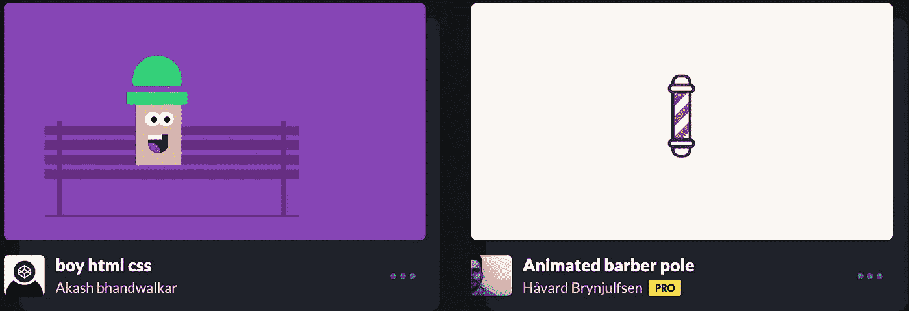
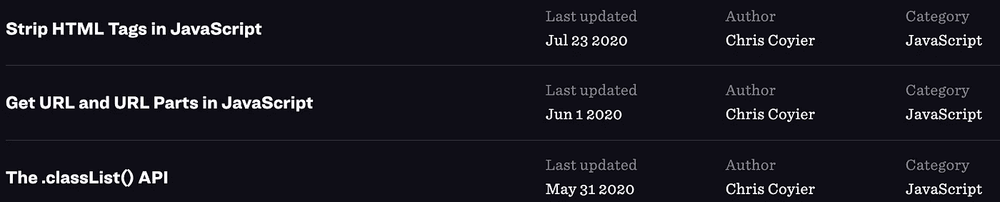
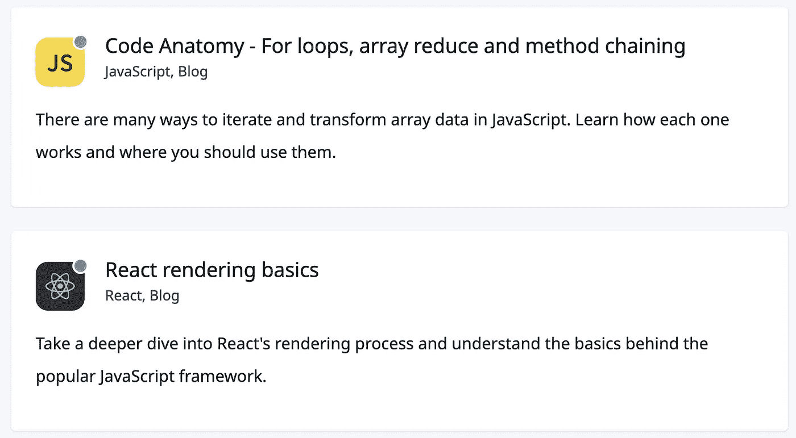
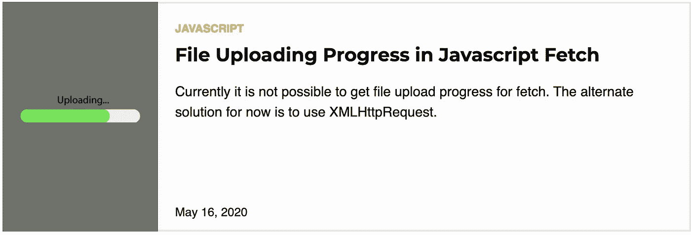
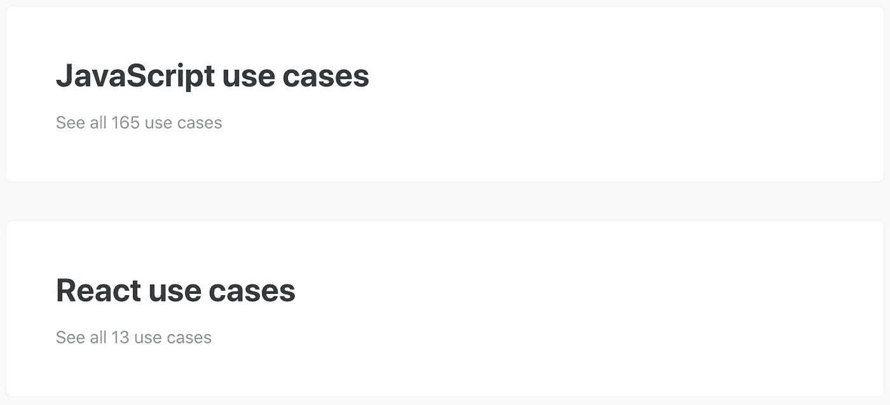
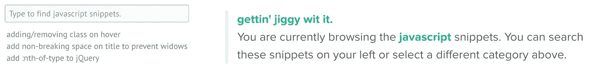

# 找到有用的 JavaScript 代码片段的 8 个地方

> 原文：<https://javascript.plainenglish.io/8-places-to-find-helpful-javascript-snippets-3733b8a62768?source=collection_archive---------2----------------------->

## 为自己节省大量时间。

Photo by [Ross Sneddon](https://unsplash.com/@rosssneddon?utm_source=medium&utm_medium=referral) on [Unsplash](https://unsplash.com?utm_source=medium&utm_medium=referral)

你是那种喜欢写每一行代码的程序员吗？还是知道在哪里找到片段并从中获益的人？

我是第二种。当你知道那里有你需要的片段时，为什么还要自己写呢？你可能认为你写的代码越多，你提高的技能就越多。不，不是的。尤其是当你一遍又一遍地写同样的代码的时候。

因此，让片段的正常逻辑将更多的精力放在重要的任务上。

以下是您可以找到有用片段的地方。看看这个。

# 1.密码笔

[https://codepen.io](https://codepen.io)

除了是一个很棒的在线游乐场，codepen 还包含了许多对你的任务有益的代码片段。此外，您还会从主页上的 snippets 集合中获得灵感。它们光滑又漂亮。

# 2.CSS-技巧

https://css-tricks.com/snippets/javascript/

嗯，CSS 招数，不应该是 CSS 资源吗？是的，但不仅仅是 CSS。事实上，您可以在这里找到非常有用的 JS 片段。

名单只有一个人选，克里斯·科伊尔，所以你不能指望它是大名单。但如果你在这里找到适合你任务的东西，应该不是问题。

# 3.30 秒的代码

【https://www.30secondsofcode.org 

本网站所说的“30 秒代码”是指你能在大约 30 秒内理解的代码。

这里的代码片段是按标签和类别组织的，方便你搜索需要的。越来越多的片段频繁更新。这可能是您找到项目所需的大部分代码片段的宝藏。

# 4.有用角度

[https://usefulangle.com/javascript](https://usefulangle.com/javascript)

有用角度的片段列表经常更新。

最好的部分:它被很好地记录和解释。

# 5.代码继续

[https://codetogo.io/all/](https://codetogo.io/all/)

简单的 UI 和非常基础的代码，适合大部分 go 代码的初学者。

# 6.Snippetlib

[https://snippetlib.com/jquery](https://snippetlib.com/jquery)

这是杰西·弗雷泽勒选的。久而久之，它成为了一个公共库，包含了许多不同编程语言的代码片段。

# 7.Snipplr

[https://snipplr.com/popular?language=javascript](https://snipplr.com/popular?language=javascript)

Snipplr 提供了两个主要特性:保存和共享您的代码片段。您可以在这里找到数以千计各种语言的代码片段，当然包括 JavaScript。使用高级搜索功能，您可以缩小搜索结果的范围，轻松选择最适合您的搜索结果。

# 8.Codota

[https://www.codota.com/code/javascript/module-index](https://www.codota.com/code/javascript/module-index)

Codota 附带了一个巨大的代码片段列表。此外，由于智能搜索功能，在这里找到您需要的片段非常容易。

现成的代码片段非常有用。不要花时间为简单和重复的任务编写代码，你应该使用代码片段来节省关注复杂任务的时间。

你知道还有什么地方可以找到片段吗？请在下面留下评论来完成这个列表。

## 进一步阅读

 [## 测试新想法的 25 个 JavaScript 平台

### 测试你的新想法，甚至开发整个产品。

medium.com](https://medium.com/javascript-in-plain-english/25-javascript-playgrounds-for-testing-new-ideas-de8735d963a7) 

## **用简单英语写的 JavaScript**

喜欢这篇文章吗？如果有，通过 [**订阅获取更多类似内容解码，我们的 YouTube 频道**](https://www.youtube.com/channel/UCtipWUghju290NWcn8jhyAw) **！**