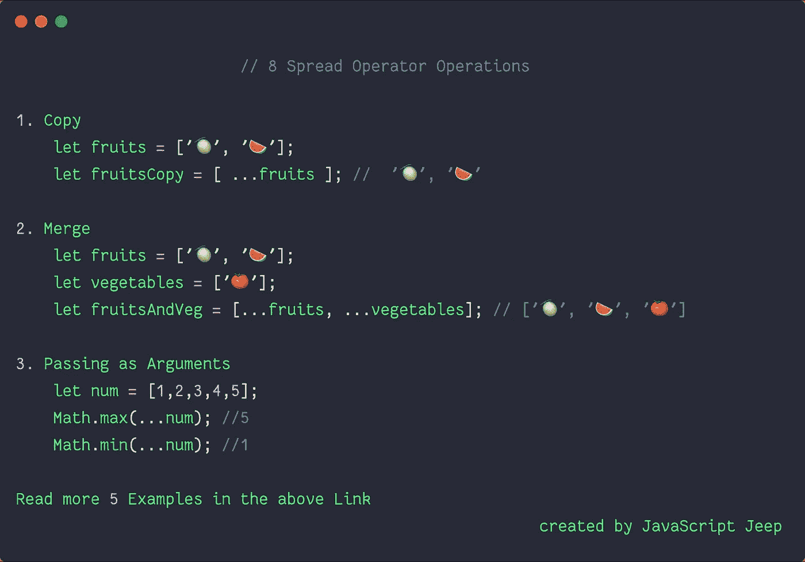

# 在 JavaScript 中使用 Spread 运算符的 8 种方式。

> 原文：<https://javascript.plainenglish.io/8-ways-to-use-spread-operator-in-javascript-b66fcf016efe?source=collection_archive---------0----------------------->

## 了解如何在 JavaScript 中使用 spread 运算符



Spread Syntax Example

在`ES6`中引入了扩展运算符`(...)`。

Spread 运算符将 iterable 对象扩展为其单独的元素。可迭代对象是任何可以用我们的`for of`循环来循环的对象。

iterable 的例子:数组、字符串、映射、集合、DOM 节点。

## 1.在测井中使用扩展算子

您可以对可迭代对象使用`console.log`中的扩展运算符

```
let fruits = ['🍈', '🍉', '🍋', '🍌'];console.log(...fruits); //🍈 🍉 🍋 🍌
```

## 2.复制数组的扩展运算符

```
let fruits = ['🍈', '🍉', '🍋', '🍌'];let fruitsCopy = [ ...fruits ]; console.log(...fruitsCopy); //🍈 🍉 🍋 🍌
```

复制对象

```
let user = {name : "John", age : 20 }let userCopy = {...user}
```

> 扩展运算符*不执行深度复制。*

## 3.用于合并的扩展算子

```
let fruits = ['🍈', '🍉', '🍋', '🍌'];let vegetables = ['🍅', '🍆', '🥒'];let fruitsAndVeg = [...fruits, ...vegetables]
```

合并对象

在合并对象时，如果一个键已经存在，那么它将被具有相同键的最后一个对象替换。

```
let user1 = {name : "John", age : 20 };let user2 = {name : "Ram", salary: '20K' };let userCopy = {...user1, ...user2};userCopy ; // **{name : "Ram", age :20 , salary : '20K'};**
```

## 4.用于作为参数传递的扩展运算符

```
function sum(a, b) {
   return a+b;
}let num = [1,2];sum(...num); // 3
```

与`math`功能一起使用

```
let num = [5,9,3,5,7];Math.min(...num);Math.max(...num);
```

## 5.析构变量中的 Spread 运算符

```
let [melon, ...fruits ] = ['🍉', '🍋', '🍌', '🍊'];melon; //🍉 fruits; // [ '🍋', '🍌', '🍊']
```

析构对象

```
let user = {name : "Ram", age: 20, salary: '20K', job : "Tester" };let { name, age, ...details } = user;name; // Ramage; // 20details; // {salary: '20K', job : 'Tester'};
```

## 6.将节点列表对象转换为数组

NodeLists 类似于数组，但没有所有的`Array`方法，如`forEach`、`map`、`filter`等。

```
let nodeList = document.querySelectorAll('.class')var nodeArray = [...nodeList]
```

## 7.将字符串转换为字符

String 也是一个 iterable 对象，所以我们也可以使用`...`来处理 string。

```
let name = "Ram";let chars = [...name];
```

## 8.消除数组中的重复项

```
let num = [1, 3, 1, 3, 3, 1];let uniqueNum = [...new Set(num)];uniqueNum; //[ 1, 3 ]
```

跟随 [Javascript Jeep🚙💨](https://medium.com/u/f9ffc26e7e69?source=post_page-----b66fcf016efe--------------------------------)。

> 原载[JavascriptJeep.com](http://javascriptjeep.com)。

[](https://www.buymeacoffee.com/Jagathish) [## Jagathish Saravanan

### 你好👋。我是 Jagathish。爱写关于 JavaScript 的文章。你的支持就像夏天吃冰淇淋一样。我…

www.buymeacoffee.com](https://www.buymeacoffee.com/Jagathish)