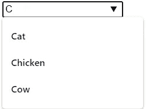

# 只用 HTML 就能做的 9 件很酷的事情

> 原文：<https://javascript.plainenglish.io/9-cool-things-you-can-do-with-just-html-3f926455a3c2?source=collection_archive---------0----------------------->

## 不敢相信只是 HTML


Photo by [nicole duncan](https://unsplash.com/@nicandmatt?utm_source=medium&utm_medium=referral) on [Unsplash](https://unsplash.com?utm_source=medium&utm_medium=referral)

## 1.画

标签在指定图像资源方面给了 web 开发者更多的灵活性。`picture`元素最常见的用途是用于响应式设计。

`<picture>`元素包含两个标签:一个或多个`<source>`标签和一个``标签。

浏览器将寻找与媒体查询匹配的第一个`<source>`元素，该元素由`srcset`属性获得。如果没有匹配的媒体查询，浏览器将使用``元素。

*示例:*

```
<picture>
   <source media="(min-width:1024px)" srcset="dog-big.jpg">
   <source media="(min-width:465px)" srcset="dog-small.jpg">
   
 </picture>
```


Img cred [Alvan Nee](https://unsplash.com/@alvannee) & [Richard Brutyo](https://unsplash.com/@richardbrutyo)

## 2.颜色选择器

一个类型为“color”的`<input>`元素提供了一个让用户指定颜色的 UI 元素。

默认值是#000000(黑色)。


Color Picker HTML

*例子:*

```
<label for="favcolor">Select your favorite color:</label>
<input type="color" id="favcolor" name="favcolor">
```

如果你想要一个非黑色的默认颜色，你只需要设置这个值。该值必须采用七个字符的十六进制表示法。


Color Picker HTML

*例如:*

```
<label for="favcolor">Select your favorite color:</label>
<input type="color" id="favcolor" name="favcolor" **value="#e66465"**>
```

## 3.标题工具提示

一个很好的简单方法是通过指定 title 属性在一些文本上做一个工具提示。


HTML Tooltip

*例如:*

```
<span title=”See, this is the tooltip. :)”>Move your mouse over me!</span>
```

## **4。内容可编辑**

对于一些 JavaScript 来说，这可能不是最有用的，但仍然是一个巧妙的技巧。

通过使用一些 JavaScript 事件处理程序，您可以将 web 页面转换成一个完整而快速的富文本编辑器。


**Content Editable (HTML)**

*例如:*

```
<div contenteditable="true">
  User can edit this div!
</div>
```

## 5.刷新浏览器

用`meta`标签刷新浏览器。

将下面的内容放入`<head>`标签，页面将每 3 秒刷新一次

```
<meta http-equiv="refresh" content="3">
```

`content`属性定义了以秒为单位的刷新频率。你也可以重定向到另一个网站。下面将在 3 秒内重定向到 google.com。

```
<**meta** http-equiv="refresh" content="3; url=https://google.com/">
```

## 6.数据列表

`<datalist>`标签用于为`<input>`元素提供“自动完成”特性。您将在键入时看到预定义选项的下拉列表。



<datalist>

*例如:*

```
<input **list="animals"** name="animal" id="animal"><datalist **id="animals"**>
    <option value="Cat">
    <option value="Dog">
    <option value="Chicken">
    <option value="Cow">
    <option value="Pig">
  </datalist>
```

`<datalist>` id 属性(见上面的粗体项目)必须等于`<input>`的列表属性，这是将它们绑定在一起的原因。

## 7.进步

`<progress>`元素表示任务的完成进度。


<progress> HTML element

*例如:*

```
<label for="course">Course completion:</label>
<progress id="course" value="67" max="100"></progress> 67%
```

## 8.米

`<meter>`元素定义了已知范围内的标量测量值或分数值。


<meter> HTML element

*例如:*

```
<label for="disk_g">Disk usage G:</label>
<meter id="disk_g" value="2" min="0" max="10">2 out of 10</meter><br><label for="disk_h">Disk usage H:</label>
<meter id="disk_h" value="0.7">70%</meter>
```

**仪表 vs 进度**

`progress`通过进度条标记“进行中”任务的完成率/进度，使用 **progress** 元素。

`meter`使用**仪表**元件来表示仪表

你可以这样想:进步=动态；仪表=静态

## 9.输出

`<output>`是一个容器元素，用户站点可以将计算结果或用户操作的结果注入其中。


<output> HTML element

*例如:*

```
<form oninput="result.value=parseInt(a.value)+parseInt(b.value)">
      <input type="number" id="b" name="b" value="10" /> +
      <input type="number" id="a" name="a" value="10" /> =
      <output name="result" for="a b">20</output>
 </form>
```

`for` attribute 其他元素的`[id](https://developer.mozilla.org/en-US/docs/Web/HTML/Global_attributes#attr-id)`的空格分隔列表，表示这些元素对输入值有贡献。

`form`与输出相关联的`<form>`元素。该属性的值必须是同一文档中某个`<form>`的`id`。

如果没有设置属性(如上),`<output>`与其祖先`<form>`元素相关联，如果有的话。

# 结论

希望你已经学到了一些新元素，可以向你的同事炫耀一下。拥有一系列你熟悉的 HTML 元素非常有用，很多开发人员在不需要的时候会直接使用 JavaScript 和 CSS

如果你想要更多的前端技巧:

[](https://medium.com/javascript-in-plain-english/11-frontend-tricks-that-most-frontend-developers-dont-know-about-68dc48199ed6) [## 大多数前端开发人员不知道的 11 个前端技巧

### 你可以用 HTML/JS/CSS 做一些有趣的技巧

medium.com](https://medium.com/javascript-in-plain-english/11-frontend-tricks-that-most-frontend-developers-dont-know-about-68dc48199ed6) 

希望你喜欢阅读！