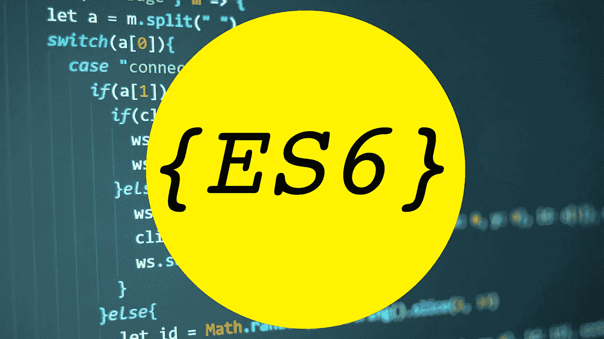

# 每个 JavaScript 开发人员都应该知道的 9 个 ES6 特性

> 原文：<https://javascript.plainenglish.io/9-es6-features-every-javascript-developer-should-know-b1f2915e7add?source=collection_archive---------4----------------------->

## 重要的 ECMAScript 版本有什么特别之处？



ES6 给 JavaScript 语言带来了更多惊人的特性。

所以，不用多说，让我们深入了解它们是什么，以及它们如何帮助您更有效地编写代码。

# 1.休息参数

看看 JavaScript 中的一个内置函数:

```
Math.max(arg1, arg2, …, argN)
```

您可以用任意数量的参数调用该函数。比如:

```
let max1 = Math.max(3, 5, 5, 1); // 5let max2 = Math.max(23, 1, 56, 23, 13, 67); // 67
```

使用 ES6 休息参数功能，您可以定义类似 **Math.max** 的函数。

方法如下:

```
function averageOf(…numbers) {
  let sum = 0;

  for (let number of numbers) {
    sum += number;
  } return sum / numbers.length;
}let average = averageOf(5, 6, 2, 1); // 3.5
```

这就是三个点(……)如何帮助您构建特殊功能的。

# 2.承诺

承诺允许你推迟进一步的任务，直到其他先前的任务完成。当您需要处理一系列延迟动作(也称异步任务)时，这一个非常有用。常见的用例是调用 API。

在引入承诺之前，我们使用回调。现在，我们有一个更好的选择。是时候放弃回调去实现承诺了。为什么？

没有人喜欢回调地狱。我们推迟的行动越多，地狱就会变得越大。它可能会变成这样一个丑陋的男孩:

```
processStep1(id, function(data1) {
  processStep2(data1, function(data2) {
    processStep3(data2, function(data3) {
      processStep4(data3, function(data4) {
        finish(data4);
      });
    });
  });
});
```

承诺将通过建立一个自然的行动链让男孩变得英俊，比如:

```
proccessStep1(id)
  .then(function(data1) {
    return processStep2(data1);
  })
  .then(function(data2) {
    return processStep3(data2);
  })
  .then(function(data3) {
    return processStep4(data3);
  })
  .then(function(data4) {
    finish(data4);
  })
  .catch(errorHandler);
```

现在代码看起来更漂亮了。你可以看到这里发生了什么。一切都按逻辑顺序串连在一起。但这还不是全部。

您可以将它与箭头功能结合起来，使它变得更好:

```
proccessStep1(id)
  .then(data1 => processStep2(data1))
  .then(data2 => processStep3(data2))
  .then(data3 => processStep4(data3))
  .then(data4 => finish(data4))
  .catch(errorHandler);
```

你看，没理由再打电话了。

# 3.箭头函数

如今，几乎现代的编程语言倾向于简化你写代码的方式，但仍然完成同样的任务。这是 JavaScript 中 arrow 函数的任务之一。

箭前生活的功能如下:

```
function sayHello(name) {
  console.log(‘Hello ‘ + name);
}sayHello(‘Amy’); // Hello Amy
```

这就是它现在的发展方式:

```
const sayHello = name => console.log(‘Hello ‘ + name);sayHello(‘Amy’); // Hello Amy
```

两个例子产生了相同的结果，但是我更喜欢第二个例子的语法。

# 4.模板文字

模板文字是字符串文字，可以分成多行并与插值表达式(${…})一起使用。

您可以使用一对单引号(')或双引号(")来声明传统的字符串。模板文字是使用回号(`)创建的。

示例:

```
const bookTitle = ‘JavaScript’;console.log(`This ${bookTitle} book is great.
I learned so much from it.`);
// This JavaScript book is great
// I learned so much from it.
```

# 5.const & let

在 ES6 之前，有一种方法可以使用关键字 **var** 来声明变量。然而，我们会遇到问题，这与范围有关。

**var** 没有阻断范围，因此会导致不可预测的行为。

示例:

```
var name = ‘Amy’;if (true) {
  var name = ‘James’;
}console.log(name); // James
```

在上面的简单示例中，您可能看不到问题。但是在大型项目中，当您处理数百行代码时，您可能不知道变量**的名称**以前已经定义过了。然后，在 if 语句的作用域中定义相同的变量。不幸的是，这一行为导致了在全球范围内的价值发生变化，而你对此并不知情。

这就是为什么你应该选择**让**和**固定**。

使用 **let** ，范围被阻塞，这意味着块中发生的所有事情都停留在块中。让我们把上面例子中的**变量**替换为**变量**，看看事情是如何运作的:

```
let name = ‘Amy’;if (true) {
  let name = ‘James’;
}console.log(name); // Amy
```

你可以看到，如果你不小心用全局变量定义了同一个变量名，那也没关系。尽管名称相同，但由于它们具有不同的作用域，因此被区别对待。

**const** 在阻塞范围上类似于 **let** 。我们使用 **const** 作为常量值。一旦你用**常量**定义了一个变量，它就不能被更新。

```
const PI = 3.14;
PI = 3; // error: Uncaught TypeError: Assignment to constant variable.
```

为了防止范围问题，使用 **let** 或 **const** over **var** 。

# 6.默认参数

JavaScript 中的默认参数允许您在不向函数传递任何值或传递未定义的值时用默认值初始化参数。

如果在调用函数时不传递参数，默认情况下它的参数将是未定义的:

```
const welcome = name => console.log(‘Welcome ‘ + name);welcome(); // Welcome undefined
```

在没有缺省参数特性的情况下，如果你想为参数**的名字**设置一个缺省值，你通常这样做:

```
const welcome = name => {
  name = name || ‘Amy’;
  console.log(‘Welcome ‘ + name);
};welcome(); // Welcome Amy
```

然后 ES6 引入了默认参数特性，情况变得好了很多:

```
const welcome = (name = ‘Amy’) => console.log(‘Welcome ‘ + name);welcome(); // Welcome Amy
```

很简单，但是很有效，对吗？

# 7.模块

当你设计你的代码库时，你应该把它分成不同的部分，每个部分都有自己的用途。在 JavaScript 中，这些部分被称为模块。

您可以将 JavaScript 中的模块视为一个文件，它将相关的内容进行分组，以实现可重用性和组织性。

以 *calculation.js* 为例:

```
export const moduleName = ‘Calculation’;export function sum(a, b) {
  return a + b;
}
```

我们使用 **export** 关键字来导出变量和函数。然后，您可以使用 **import** 关键字访问另一个文件中导出的变量和函数。

示例:

```
import { moduleName, sum } from ‘./calculation.js’;console.log(moduleName); // Calculation
let a = sum(5, 8); // 13
```

[](https://medium.com/javascript-in-plain-english/9-tips-for-writing-scalable-javascript-code-e6bcfc791882) [## 编写可伸缩 JavaScript 代码的 9 个技巧

### 您应该从一开始就准备好扩展您的项目

medium.com](https://medium.com/javascript-in-plain-english/9-tips-for-writing-scalable-javascript-code-e6bcfc791882) 

# 8.班级

在 ES6 之前，没有阶级这回事。我们想出了一个解决方法，就是使用函数作为类。

```
function Person(name) {
  this.name = name;
}Person.prototype.introduce = function () {
  console.log(`My name is ${this.name}`);
}let person = new Person(‘Amy’);
person.introduce(); // My name is Amy
```

现在，你不必再像那样四处工作了:

```
class Person {
  constructor(name) {
    this.name = name;
  } introduce() {
    console.log(`My name is ${this.name}`);
  }
}let person = new Person(‘Amy’);
person.introduce(); // My name is Amy
```

如果您熟悉 C#或 Java 等编程语言，您应该会对 ES6 的这个新特性感到高兴，因为它提供了更清晰、更方便的语法。

# 9.解构

这个特性允许我们提取对象或数组的特定部分，并将它们赋给变量。

示例:

```
let book = {
  title: ‘JavaScript’,
  price: 13,
  author: ‘Amy’
};let { title, author } = book;
console.log(title, author); // JavaScript Amy
```

除了基本的用法之外，如果在特定的用例中使用，析构会释放出它的威力，你可以在下面的文章中找到:

[](https://medium.com/better-programming/5-ways-to-make-the-most-of-destructuring-in-javascript-to-write-cleaner-code-d674c00da9c7) [## 充分利用 JavaScript 中析构的 5 种方法来编写更简洁的代码

### 析构是 ES6 最激动人心的特性之一

medium.com](https://medium.com/better-programming/5-ways-to-make-the-most-of-destructuring-in-javascript-to-write-cleaner-code-d674c00da9c7) 

# 结论

这些并不是 ES6 的全部功能，只是我觉得有趣，对我最有用的功能。有些只是甜言蜜语，有些是真正改变游戏规则的。

你最喜欢的有哪些？请在下面的评论中告诉我。

喜欢这篇文章吗？如果是这样，通过 [**订阅解码获得更多类似内容，我们的 YouTube 频道**](https://www.youtube.com/channel/UCtipWUghju290NWcn8jhyAw) **！**

# 进一步阅读

[](https://medium.com/javascript-in-plain-english/principles-of-functional-programming-in-javascript-that-will-make-your-coding-life-easier-ed1416d2b726) [## JavaScript 中的函数式编程原则将使您的编码生活更加简单

### 编写更安全的代码和限制副作用的方法。

medium.com](https://medium.com/javascript-in-plain-english/principles-of-functional-programming-in-javascript-that-will-make-your-coding-life-easier-ed1416d2b726)