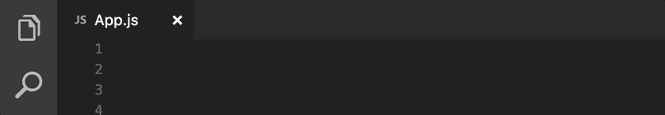

# Visual Studio 代码的 9 大 JavaScript 扩展加速您的开发

> 原文：<https://javascript.plainenglish.io/9-great-javascript-extensions-for-visual-studio-code-to-speed-up-your-development-8b3275248718?source=collection_archive---------5----------------------->

## 谁想更快更容易地编码？

你知道怎样才能成为一个伟大的代码编辑器吗？

对我来说，这些就是它提供的扩展。

我用过很多代码编辑器。但是说到扩展，我不得不说 VSCode 是一个很棒的编辑器，有很多令人惊叹的扩展。

如果您使用的是 VSCode，下面是您应该安装的扩展。

# 埃斯林特

[https://marketplace.visualstudio.com/items?itemName = dbaeumer . vs code-eslint](https://marketplace.visualstudio.com/items?itemName=dbaeumer.vscode-eslint)

我的生活一团糟，所以我不想我的代码那么乱。这就是我在所有项目中使用 ESLint 的原因。

ESLint 在保持代码的统一性和组织性方面令人惊叹。它会检查你的代码风格，寻找与使用变量相关的错误，比如未声明的变量或使用未定义的变量。优质代码就是这样构建的。

简而言之，如果你希望你的代码干净，你应该使用 ESLint。

# Chrome 调试器

【https://marketplace.visualstudio.com/items? itemName = msjsdiag . debugger-for-chrome

我之前一般都是用 console.log()调试。这是一种常见的调试方法，但不是最好的方法。要了解代码是如何工作的，必须将 console.log()放在任何地方。有时候会让你的代码变得一塌糊涂。

我所知道的最好的工具是 Chrome debugger 内置工具。现在，您可以通过安装 Chrome 调试器直接在 VSCode 中使用它。

这个工具提供了 chrome 调试器的几乎所有功能。这意味着你不需要打开 Chrome，你只需要在用你心爱的 VSCode 编辑器编码的时候直接调试。

# 阔卡

【https://marketplace.visualstudio.com/items? itemName = wallabyjs . quo kka-vs code

如果你想在不使用 Chrome 开发者工具等其他工具的情况下，在你的编辑器中快速测试一个函数，那么 Quokka 是一个很好的方法。

# 较美丽

[https://marketplace.visualstudio.com/items?itemName = es benp . prettle-vs code](https://marketplace.visualstudio.com/items?itemName=esbenp.prettier-vscode)

在团队工作的时候，可能每个人都有自己的编码风格。很难保持代码的一致性。

更漂亮是一种创造风格标准让所有人遵循的方式。最棒的是:你不用自己格式化。你只需要定义一个编码风格标准，剩下的交给你的编辑器。是的，它会自动格式化你的代码。

# 进口成本

[https://marketplace.visualstudio.com/items?itemName = wix . vs code-import-cost](https://marketplace.visualstudio.com/items?itemName=wix.vscode-import-cost)

以一种无害的方式导入一个包/模块会使你的项目变得更大。这一点都不好。

导入成本将通过内嵌显示包的大小来帮助您检查导入的包的大小。因此，您将考虑是使用那个包还是使用另一个包，以便项目的规模尽可能小。

# 吉特朗斯

[https://marketplace.visualstudio.com/items?itemName=eamodio.gitlens](https://marketplace.visualstudio.com/items?itemName=eamodio.gitlens)

您想知道是谁在 VSCode 编辑器中修改了您的代码行吗？你应该用 GitLens。

您还可以使用 GitLens 查看源文件中的所有更改，比较 2 个分支，查看责任，等等。

# JavaScript (ES6)代码片段

【https://marketplace.visualstudio.com/items? itemName=xabikos。JavaScriptSnippets 片段

这个扩展包含了用于 Vs 代码编辑器的 ES6 语法中 JavaScript 的代码片段(支持 JavaScript 和 TypeScript)，这是现代 web 开发应该使用的。只需几次击键，您就可以快速将 ES6 代码添加到您的项目中。

# 路径智能感知

【https://marketplace.visualstudio.com/items? itemName = Christian-Kohler . path-intellisense

记住要引用的确切文件路径可能很棘手，尤其是在处理大型项目时。

嗯，Path Intellisense 可以帮你解决这个问题。你所要做的只是输入一个路径，这个扩展名会自动为你完成文件名。

# 实时服务器

[https://marketplace.visualstudio.com/items?itemName=ritwickdey。直播服务器](https://marketplace.visualstudio.com/items?itemName=ritwickdey.LiveServer)

你改变你的 JavaScript 代码。你去你的浏览器刷新它。嗯，已经过时了。因为现在你有了 Live Server，支持实时重装。

使用 Live Server，您可以更改代码，保存它，就这样。如果你想加快你写代码的速度，看看这个吧。

当然，上面的扩展列表并不完整。但它们是我目前为止发现的最好的。

您想在此列表中添加更多内容吗？请在下面留下你最喜欢的扩展的评论。

# 进一步阅读

 [## 通过这 5 个网站提升你的 JavaScript 技能

### 您将掌握 Javascript 的基础知识。

medium.com](https://medium.com/javascript-in-plain-english/boost-your-javascript-skills-with-these-5-websites-8559a498ca33)