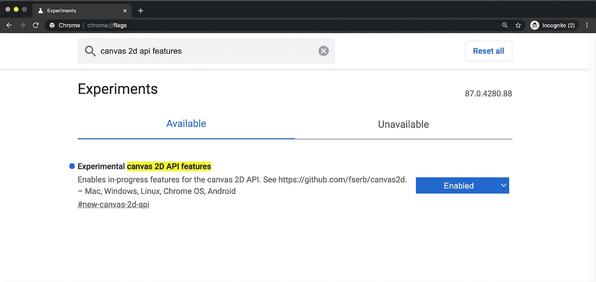
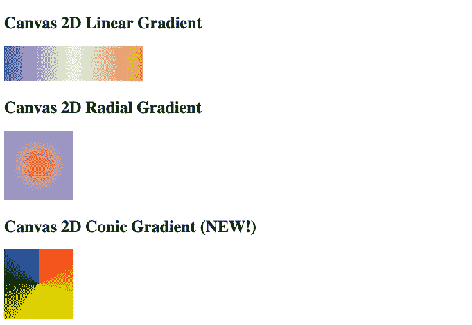
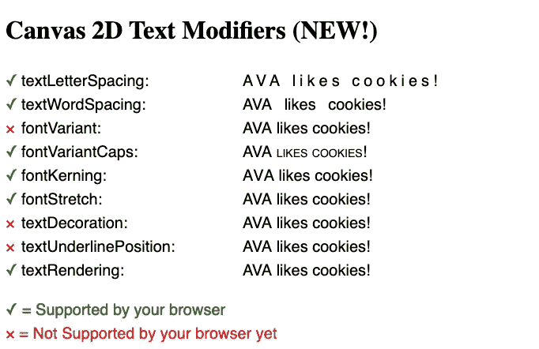
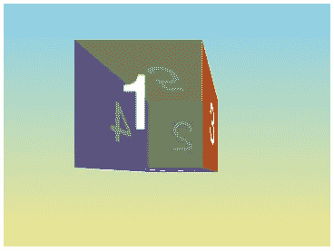
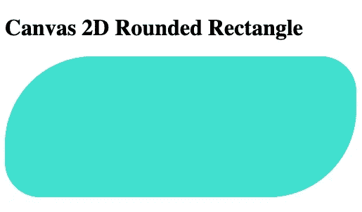
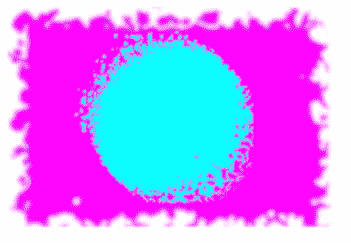

# 9 即将推出的画布 2D 功能值得期待

> 原文：<https://javascript.plainenglish.io/9-upcoming-canvas-2d-features-to-look-forward-to-a18d17647568?source=collection_archive---------10----------------------->

## 今天可以在 Chrome 上预览，很快会在其他浏览器上推出


Photo by [Daniel Cheung](https://unsplash.com/@danielkcheung?utm_source=medium&utm_medium=referral) on [Unsplash](https://unsplash.com?utm_source=medium&utm_medium=referral)

Canvas API 提供了一种使用 JavaScript 和 HTML `[<canvas>](http://developer.mozilla.org/en-US/docs/Web/HTML/Element/canvas)`元素在 web 上绘制图形的方法，主要关注 2D 图形。作为一个通用的位图操作框架，它可以用于动画、游戏图形、实时视频处理、数据可视化、图像操作等等。

但是不幸的是，引用 [MDN Web 文档](https://developer.mozilla.org/en-US/docs/Web/API/Canvas_API):*“Canvas API 非常强大，但并不总是易于使用。”*

这是因为画布 2D 是一个相对低级的光栅图形 API，其中视觉需要在像素级进行操作，交互需要手动管理。例如，要绘制一个圆角矩形，您可以使用 DOM 或 SVG 用一行 HTML 和最少的 CSS 简单地声明它，但是您需要使用画布 2D 编写至少 10 行 JavaScript 来完成同样的工作:

Achieving a rounded rectangle using DOM, SVG, and Canvas 2D. Code by [Author](https://wilsonlouie.medium.com/).

批评者会认为，不仅画布 2D 更难使用，而且 SVG 或 DOM 与 CSS 还可以做画布 2D 能做的一切，甚至更多。然而，Canvas 2D 在抽象方面的不足在底层控制和性能增益方面得到了弥补……大多数时候。一些画布 2D API，比如从`<canvas>`获取像素数据的`[getImageData](https://developer.mozilla.org/en-US/docs/Web/API/CanvasRenderingContext2D/getImageData)`，对于某些用例来说可能太慢了。

作为解决这些问题的第一步，Canvas 2D API 正在更新 9 个新特性集。你甚至可以今天就尝试(大部分)它们！前往 Chrome 上的`chrome://flags`(我个人试过 87 版)，打开实验画布 2D API 特性标志:



所有这些新特性都计划被添加到官方规范中，所以你可以期待它们最终也能在其他浏览器上使用。您也可以在此阅读更多内容并了解最新动态[。以下部分提供了这些新功能的概述。](https://github.com/fserb/canvas2d)

# 赶上 CSS

现代浏览器实现了一组丰富的呈现功能，其中许多功能都可以在 CSS 中获得。下面的新 API 弥补了这一差距，为开发人员提供了更多的能力。

## 圆锥梯度

`[createLinearGradient()](https://developer.mozilla.org/en-US/docs/Web/API/CanvasRenderingContext2D/createLinearGradient)`和`[createRadialGradient()](https://developer.mozilla.org/en-US/docs/Web/API/CanvasRenderingContext2D/createRadialGradient)`现在存在于画布 2D API 中。它们分别类似于 CSS `[linear-gradient()](https://developer.mozilla.org/en-US/docs/Web/CSS/linear-gradient())`和`[radial-gradient()](https://developer.mozilla.org/en-US/docs/Web/CSS/radial-gradient())`。有了新的 API，你将能够使用`createConicGradient(startAngle, centerX, centerY)`，它类似于 CSS `[conic-gradient()](https://developer.mozilla.org/en-US/docs/Web/CSS/conic-gradient())`:

Demonstration of Canvas 2D’s createLinearGradient(), createRadialGradient(), and the new createConicGradient(startAngle, centerX, centerY). Code by [Author](https://wilsonlouie.medium.com/).



The output of the above [JSFiddle](https://jsfiddle.net/wlouie1/cs91rkq4/) if the browser supports createConicGradient(). Image by [Author](https://wilsonlouie.medium.com/).

## 文本修饰符

CSS 支持一系列文本操作和字体选项，这些选项在今天的画布上是没有的，比如`[letter-spacing](https://developer.mozilla.org/en-US/docs/Web/CSS/letter-spacing)`、`[word-spacing](https://developer.mozilla.org/en-US/docs/Web/CSS/word-spacing)`、`[font-variant](https://developer.mozilla.org/en-US/docs/Web/CSS/font-variant)`、`[font-kerning](https://developer.mozilla.org/en-US/docs/Web/CSS/font-kerning)`、`[font-stretch](https://developer.mozilla.org/en-US/docs/Web/CSS/font-stretch)`、`[text-decoration](https://developer.mozilla.org/en-US/docs/Web/CSS/text-decoration)`、`[text-underline-position](https://developer.mozilla.org/en-US/docs/Web/CSS/text-underline-position)`和`[text-rendering](https://developer.mozilla.org/en-US/docs/Web/CSS/text-rendering)`。新的 API 改变了这一点，它为画布 2D 添加了 CSS 类似方法:

Demonstration of Canvas 2D’s new Text Modifier APIs. Code by [Author](https://wilsonlouie.medium.com/).



The output of the above [JSFiddle](https://jsfiddle.net/wlouie1/mxhL0c8e/) depending on browser support. The above is from Chrome 87 with the new APIs turned on. Image by [Author](https://wilsonlouie.medium.com/).

## 透视变换

画布 2D 也可以三维！好的，更像 2.5D。不仅现有的`[scale](https://developer.mozilla.org/en-US/docs/Web/API/CanvasRenderingContext2D/scale)`、`[translate](https://developer.mozilla.org/en-US/docs/Web/API/CanvasRenderingContext2D/translate)`和`[rotate](https://developer.mozilla.org/en-US/docs/Web/API/CanvasRenderingContext2D/rotate)`函数得到了[的增强](https://github.com/fserb/canvas2D/blob/master/spec/perspective-transforms.md)，现有的`[transform](https://developer.mozilla.org/en-US/docs/Web/API/CanvasRenderingContext2D/transform)`和`[setTransform](https://developer.mozilla.org/en-US/docs/Web/API/CanvasRenderingContext2D/setTransform)`函数也将接受 CSS 可用于执行透视(非仿射)变换的相同 4x4 变换矩阵。



Screenshot of example CSS perspective transform from [MDN Web Docs](https://developer.mozilla.org/en-US/docs/Web/CSS/transform-function/perspective()). The same would be easily achievable using Canvas 2D with the new APIs, but it seems Chrome 87 has not implemented it yet.

## 圆角矩形

圆角矩形是非常常用的，但是它们在今天却出奇的难画，正如本文开头的 [JSFiddle](https://jsfiddle.net/wlouie1/g5vLtuhd/) 所展示的。使用新的画布 2D `roundRect()`函数，实现圆角矩形只需要一个绘图调用:

Demonstration of Canvas 2D’s roundRect(). Code by [Author](https://wilsonlouie.medium.com/).



The output of the above [JSFiddle](https://jsfiddle.net/wlouie1/bLse8v7d/) if the browser supports roundRect(). Image by [Author](https://wilsonlouie.medium.com/).

# 改善人体工程学

对于某些常见的使用模式，添加了简单的内置功能。

## 重置

如今没有清理画布的规范方法。如果您过去使用过 Canvas，您可能至少完成了以下工作之一:

```
**const** canvas = document.createElement('canvas');
**const** ctx = canvas.getContext('2d');

// Doesn't reset the path
ctx.clearRect(0, 0, ctx.canvas.width, ctx.canvas.height);

// Not performant
ctx.fillStyle = "white";
ctx.fillRect(0, 0, ctx.canvas.width, ctx.canvas.height);

// Works, but feels wrong...
ctx.canvas.width = ctx.canvas.width;

// Best way today
ctx.clearRect(0, 0, ctx.canvas.width, ctx.canvas.height);
ctx.beginPath();
```

你可能也在某个时候质疑过:为什么不能有一个`reset()`函数呢？不要再怀疑了，因为新的 API 正在提供这样的功能:一个`reset()`函数，它在一次调用中清除画布、重置路径、重置转换和转换堆栈:

```
ctx.**reset**();
```

## 数组颜色输入

使用画布 2D 设置颜色的当前方法是构建字符串:

```
**const** canvas = document.createElement('canvas');
**const** ctx = canvas.getContext('2d');

**ctx**.fillStyle = 'rgba(255, 127, 0, 0.5)';
**ctx**.strokeStyle = 'rgb(255, 0, 0)';
```

如果你想制作颜色变化的动画，这会很烦人。新的 API 允许通过一系列浮点来指定 RGB 和 RGBA 颜色，通过 255:

```
**const** canvas = document.createElement('canvas');
**const** ctx = canvas.getContext('2d');

ctx.fillStyle = [1.0, 0.5, 0.0, 0.5];
ctx.strokeStyle = [1.0, 0.0, 0.0];
```

指定色彩空间的能力正在开发中。

## SVG 过滤器

今天在 2D 画布上使用 SVG 过滤器实际上是可能的，但是它很笨重，并且不适用于网络工作者:

```
<**svg**>
  <**defs**>
    <**filter** id="someFilter">
      ...
    </**filter**>
  </**defs**>
</**svg**>
<**script**>
  ctx.filter = "url('#someFilter')";
</**script**>
```

有了新的 API，您将能够为过滤器使用编程性的面向对象接口(例如来自[草案规范](https://github.com/fserb/canvas2D/blob/master/spec/filters.md)):

```
// Javascript example
**const** canvas = document.createElement('canvas');
**const** ctx = canvas.getContext('2d');

// Create filter primitives
**const** turbulence = new CanvasFilter.Turbulence(
  0.05 /* base frequency */, 2 /* numOctaves */);
**const** displacementMap = new CanvasFilter.DisplacementMap(
  turbulence /* displacement map */, 30 /* strength */);
**const** blur = new CanvasFilter.GaussianBlur(2 /* std deviation */);

/*
  Create overall filter, the first primitive will get drawing operations as input
  the output of each primitive will be sent to the input of the following element
  in the array. The final element will output to the screen.

  Here the final filter graph will look like this:

                          turbulence
                              |
  canvasDrawOps -----> displacementMap -------> blur ------> screen
*/
ctx.filter = new CanvasFilter.Sequence([displacementMap, blur]);

// Draw with created filter
ctx.fillStyle = "magenta";
ctx.fillRect(10, 10, 300, 200);

// Modify filter
turbulence.baseFrequency = 1.5; // Denser noise pattern
blur.stdDeviation = 0.5; // Less blur

ctx.filter = new CanvasFilter.Sequence([displacementMap, blur]);
// or, with an update function, just ctx.filter.update()

// Draw on top with modified filter
ctx.fillStyle = "cyan";
ctx.beginPath();
ctx.arc(160, 110, 80, 0, 2 * Math.PI);
ctx.fill();
```



The output from the above code if the new Canvas 2D filter APIs are available. It seems Chrome 87 has not implemented this yet. Image from the [draft spec](https://github.com/fserb/canvas2D/blob/master/spec/filters.md).

# 提供更好的性能

最后，许多开发人员抱怨在某些用例中很难(有时是不可能)优化 Canvas 2D 的性能。

## 会经常阅读

在某些使用情况下，尤其是在应用和游戏中，有必要在高频下操纵像素值。这通常是通过`[getImageData](https://developer.mozilla.org/en-US/docs/Web/API/CanvasRenderingContext2D/getImageData)`频繁访问像素值来实现的。但是，对于这种情况，此操作可能太慢。

新的 API 给`[CanvasRenderingContext2DSettings](https://developer.mozilla.org/en-US/docs/Web/API/HTMLCanvasElement/getContext)`增加了一个`willReadFrequently`选项，允许开发者发出画布会被大量阅读的信号。然后，浏览器可以在内部优化读取访问:

```
**const** canvas = document.createElement('canvas');
**const** ctx = canvas.getContext('2d', { **willReadFrequently**: true });
ctx.getImageData(0, 0, 200, 200).data;
```

这个功能早在火狐中就被引入了，但是它被正式添加到规范中。

## 语境缺失

Canvas 2D 上下文丢失是一个[长期存在的问题](https://github.com/whatwg/html/issues/4809)，尤其是在移动或低端设备上，很容易耗尽资源，例如 GPU 内存，并引发该问题。一旦用户重新关注页面，就没有优雅的方法来处理这个问题了……直到现在。有了新的 API，您可以告诉 Canvas 在出现问题时自动重新初始化其上下文:

```
**const** canvas = document.createElement('canvas');
**const** ctx = canvas.getContext('2d');

canvas.addEventListener('contextlost', redraw);
canvas.addEventListener('contextrestored', redraw);
```

# 结论

无论您是第一次接触 Canvas 2D，已经使用它多年，还是一直在避免使用它，我希望您对这些即将发布的 Canvas 2D API 感到兴奋。同样，您可以阅读更多内容，并在此处了解最新动态。快乐编码！