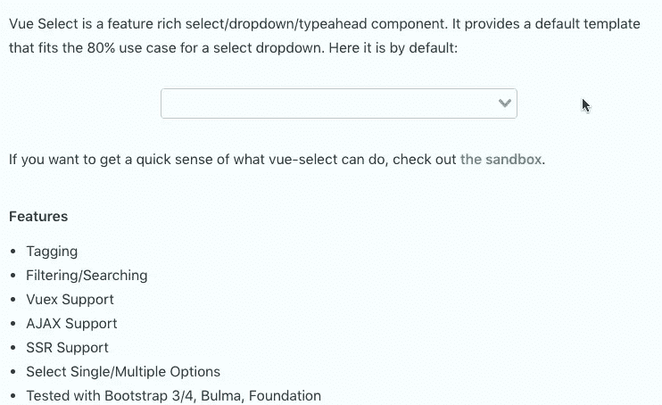
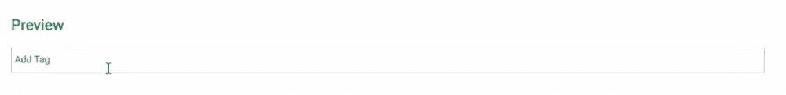
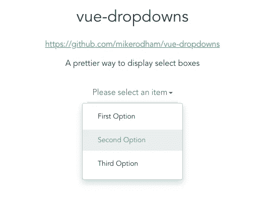
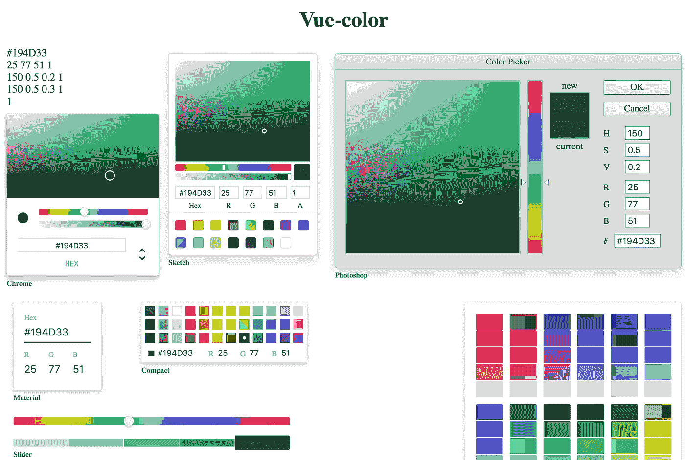
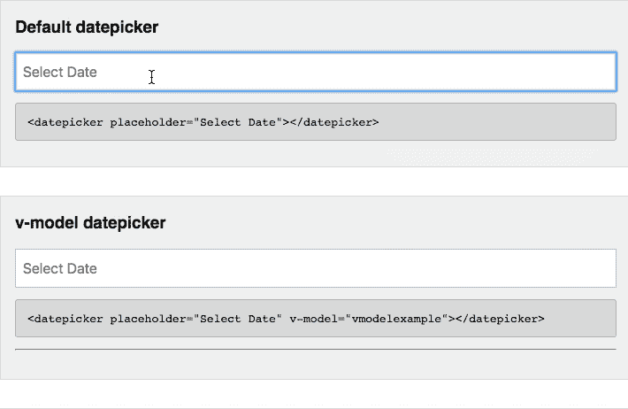
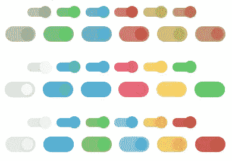
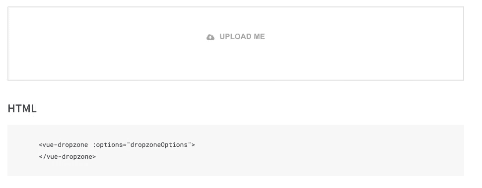
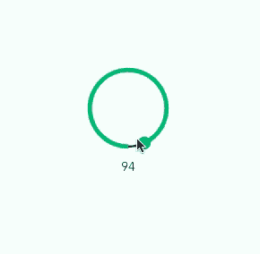
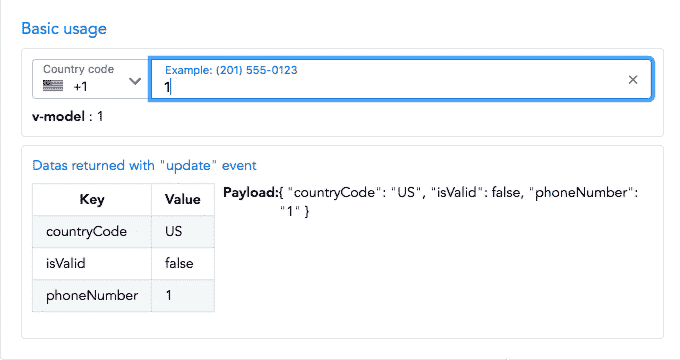

# 9 个 Vue 输入库为您的表单提供动力

> 原文：<https://javascript.plainenglish.io/9-vue-input-libraries-to-power-up-your-forms-91ca63ac389d?source=collection_archive---------2----------------------->

Photo by [Kelly Sikkema](https://unsplash.com/@kellysikkema?utm_source=medium&utm_medium=referral) on [Unsplash](https://unsplash.com?utm_source=medium&utm_medium=referral)

**设计糟糕的表单会让访问者远离你的网站。幸运的是，对于 Vue 开发者来说，有大量的 Vue 输入库可以让美化表单变得轻而易举。**

拥有直观且用户友好的表单有几个好处，包括

*   更高的转化率
*   更好的用户体验
*   更专业的品牌

像其他主要框架一样，有大量的社区解决方案可以用来构建漂亮的 Vue.js 表单。从简单的文本输入到高级的电话号码模板，您的表单有如此多的选项。

以下是我最喜欢的一些 Vue 输入库。虽然这个列表只是关于表单元素的，但是我也编译了一个 [Vue 图标库](https://learnvue.co/2019/12/8-free-vue-icon-libraries-to-pretty-up-your-web-app/)的列表。

我希望你和我一样觉得这些工具很有用！

# 1.Vue 选择

使用`<select>`元素是任何形式的重要组成部分。但是如果你有这方面的经验，你就会知道定制它们是一件非常痛苦的事情。

幸运的是， [Vue Select](https://github.com/sagalbot/vue-select) ，一个由 Jeff Sagal 开发的库提供了一种直观的方式来添加特性，例如

它很容易使用，我已经在几个项目中使用过。

# 2.Vue 输入标签

**允许站点访问者添加他们自己的标签**是表单想要的一个常见特性。然而，实现你自己的[灵活系统](https://learnvue.co/2019/12/using-component-slots-in-vuejs%e2%80%8a-%e2%80%8aan-overview/)可能会很棘手——尤其是对于刚接触 Vue 的人。

Vue 输入标签库是为表单添加强大功能的好方法。

# 3.Vue 下拉菜单

[Vue Dropdowns](https://github.com/mikerodham/vue-dropdowns) 是另一个处理`<select>`元素的库。它不仅创建了流畅的输入，还提供了设置数据和监听事件(如`change`和`blur`)的好方法。

通过一个简单的设置，这绝对是一个用最少的努力让你的表单看起来更漂亮的好方法。

# 4.Vue 颜色

Vue Color 是在表单中添加颜色选择的简单方法。从头开始实现其中一个系统需要几个小时的计划和工作，但使用 Vue Color 只需要几分钟。

这个库也是高度可定制的。

它有几种不同的样式、事件挂钩和对不同颜色格式的支持。我绝对推荐 Vue Color 为你的应用程序增加一些更高层次的可定制性。

# 5.VueJS 日期选择器

VueJS 日期选择器是我见过的最干净的日期选择器库之一。它给你一个日历视图，允许用户点击选择日期。

在我看来，它看起来非常专业，而且非常可定制。事实上，它有几十个易于编辑的道具和事件来完美匹配您的用例。然而，我认为默认设置对大多数项目来说也很棒。

但不要相信我的话，看看这个来自 Vue DatePicker 演示的截图。

# 6.Vue 开关

**切换输入是创建切换选项的一种漂亮方式**——它们时尚、直观，可以修改以匹配几乎任何应用的风格。

[Vue Switches](https://github.com/drewjbartlett/vue-switches) 是一个非常棒的库，用于创建漂亮的开关输入。有了各种各样的主题和自定义颜色和文本的能力，这是一个灵活的表单解决方案。

# **7。Vue Dropzone**

[Vue Dropzone](https://rowanwins.github.io/vue-dropzone/docs/dist/#/demo) 是一个[拖拽](https://learnvue.co/2020/01/how-to-add-drag-and-drop-to-your-vuejs-project)文件上传库。在过去的几年里，拖放文件上传已经变得越来越普遍，这是一种让你的应用感觉现代的简单方法。

Vue Dropzone 提供了几十个[自定义道具](https://learnvue.co/2020/01/creating-your-first-vuejs-custom-directive/)和事件，允许你根据你的具体项目调整它的功能。但是不管你是否选择修改它，它都是一个简单而强大的工具来添加到你的表单中。

# 8.Vue 圆形滑块

[圆形滑块](https://github.com/devstark-com/vue-circle-slider)是给你的表单添加一点**风格**的好方法。与典型的线性滑块输入不同，圆形滑块会感觉更自然，这取决于您正在收集的值。

我喜欢这个图书馆，因为它功能多样。它支持触摸控制，允许你设置最大/最小值，甚至让你控制滑块的步长。

总的来说，这是一个非常酷的选择，可以考虑给你的 Vue 应用程序添加更多的风格。

# 9.Vue 电话号码

不使用任何库，收集电话号码会变得有点棘手。你不得不担心格式、国家代码等等。

[Vue Phone Number](https://github.com/LouisMazel/vue-phone-number-input) library 会处理好一切，并附带一个漂亮的 UI，看起来既专业又安全，这两个因素会提高你的表单的转化率。

它也非常灵活，您可以定制几个功能，包括

*   有效的国家代码
*   主题和颜色
*   电话号码格式

# 包扎

虽然这绝不是 Vue 输入库的完整列表，但我列出的这 9 个已经帮助我在开发项目时节省了很多时间。另外，我认为它们都是增强表单高级功能的简单方法。

我希望您发现了一些新工具，可以将它们整合到您的 Vue 项目中。

你最喜欢的输入库是什么？我很想收到你的来信！

[如果你有兴趣了解更多关于 Vue 3 的知识，下载我的免费的 Vue 3 备忘单，里面有基本的知识，比如组合 API、Vue 3 模板语法和事件处理。](https://learnvue.co/vue-3-essentials-cheatsheet/)

*原载于 2020 年 1 月 25 日 https://learnvue.co**[*。*](https://learnvue.co/2020/01/9-vue-input-libraries-to-power-up-your-forms/)*