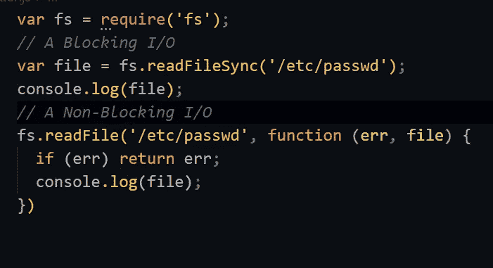

# 优化 Node.js 应用程序的 9 种方法

> 原文：<https://javascript.plainenglish.io/9-ways-to-optimize-node-js-applications-2d1444b02985?source=collection_archive---------4----------------------->

## 构建更好的优化 Node.js 应用程序

# 1.使用异步函数区分优先级。

Node.js 最好的部分是所有的异步函数执行一个**非阻塞 I/O 来避免 CPU 空闲。**对于运行大量 I/o 的应用程序，仅使用*异步函数将使服务器的性能大大提高。因为现在服务器将能够同时处理多个请求，而其中一个请求正在执行 I/O。*

*例如:*

**

# *2.将 Ngnix 用于静态服务器。*

*这个选择背后的简单原因就是 ***节点*** 。js 只是在处理数据方面表现更好，而不是服务静态文件，所以用 **Nginx** 或 **Apache** 代替它。它们有很多配置，可以通过有用的缓存方法来提供静态文件。*

> ***仅将节点服务器用于处理数据。***

# *3.使用集群模块进行并行处理。*

*集群模块原生于 ***节点*** 。js 为应用程序创建了许多进程，包括主集群，它作为负载平衡器在所有从集群中分配请求。*

> *通过使用所有 CPU 核心并行工作来优化服务器。*

# *4.使用最新但稳定的版本。*

*由于 **JavaScript V8 运行时引擎**的改进，最新稳定版本的 **Node.js** 对于制作稳定和优化的应用程序是必不可少的。*

# *5.串联 JavaScript。*

*Web 应用程序可以通过将多个 **JS** 文件连接成一个文件来加速，当您的浏览器使用 ***<脚本>*** 元素时，页面渲染会被阻止，直到获取并执行脚本(除非应用了异步属性)。*

*如果你的页面包含 8 个 JavaScript 文件，浏览器将发出 8 个 HTTP 请求来获取这些文件，这样就可以优化整体性能。*

# *6.使用标准 V8 功能。*

*并不是所有的浏览器都支持常见的操作比如 ***map，reduce & forEach，*** 为了克服这个问题我们可以在前端使用一些客户端库。但是在 **Node.js** 的情况下，我们知道 ***Google 的 V8 JavaScript*** 引擎支持哪些操作，这样我们就可以使用内置函数在服务器端操作集合。*

# *7.不要在会话中存储太多。*

*例如，在一个典型的 **Express** web 应用程序中，会话数据默认存储在内存中，当我们在会话中存储太多数据时，它会使服务器不堪重负，因此为了保持简单，您可以切换到其他类型的存储来保存会话数据，或者尝试最小化会话中存储的数据。*

# ***8。客户端渲染。***

*有了客户端的 **MVC/MVV** 框架，比如 ***Angular、Meteor、*** 等，构建单页面应用是非常容易的。不是在服务器端进行渲染，而是公开一个 API，将 **JSON** 响应发送到客户端&从服务器发送 JSON 可以节省 ***带宽*** 以提高速度，因为我们不是在每个请求中都发送布局标记。*

# *9.将 WebSockets 用于效果服务器。*

*使用 ***HTTP*** 请求模型是 web 应用程序常见的传统方法，但是 ***WebSockets*** 是 web 应用程序中 HTTP 通信的替代方法。在客户端和服务器之间提供一个长期的双向通信通道。如果信道保持开放，提供非常持久的连接，那么双方可以在任何时间以低延迟开始发送数据。*

*同时保持大量的连接需要低成本的高质量架构，这就是 WebSockets 的作用。*