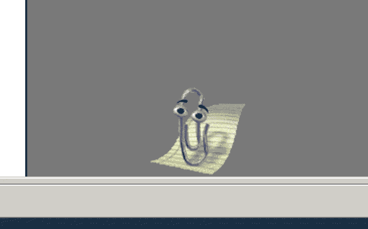
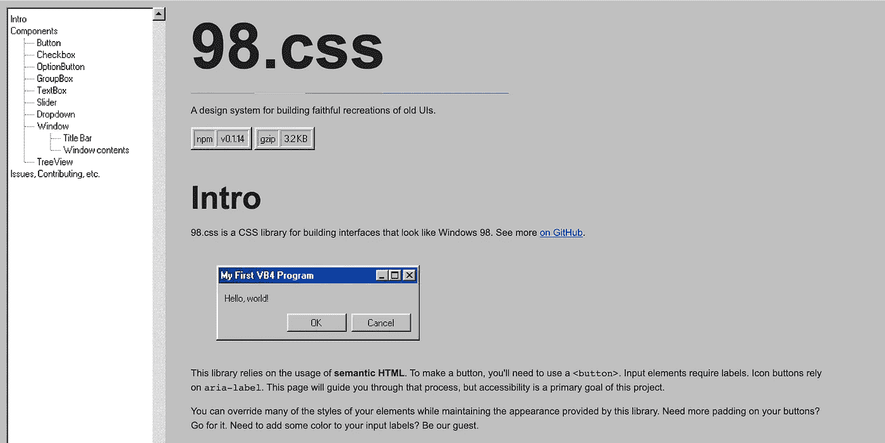
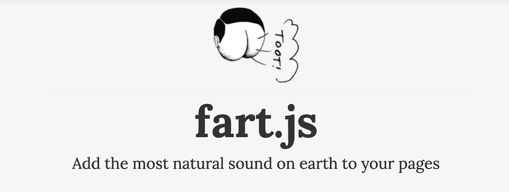
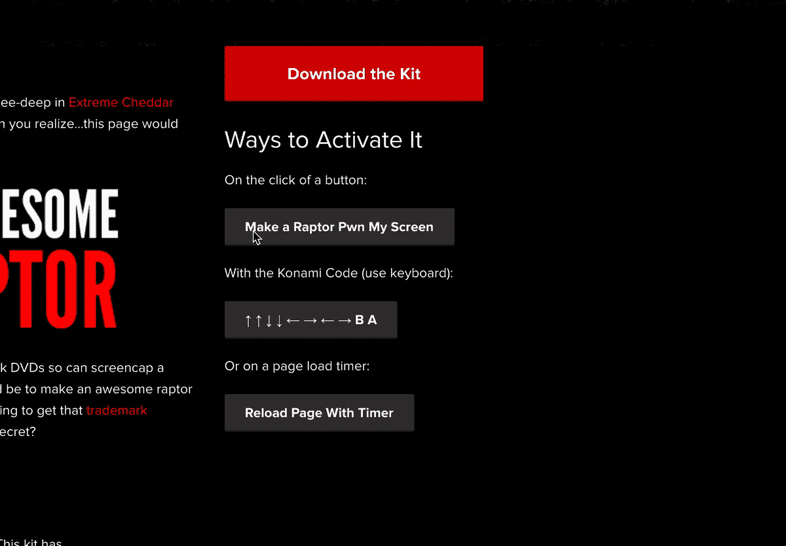
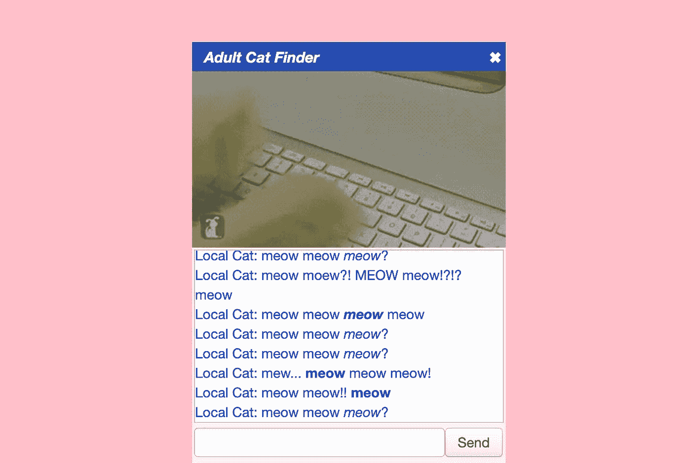
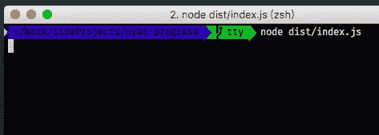
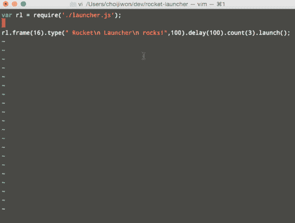

# 让你的下一个 JavaScript 项目更酷的 9 种奇怪方法

> 原文：<https://javascript.plainenglish.io/9-weird-ways-to-make-your-next-javascript-project-even-cooler-ad630accc872?source=collection_archive---------3----------------------->


## 想要一个喊着“我们超级酷”的项目？这里有些东西可能会有帮助:

这就是你的 JavaScript 项目。它可能已经完成，完成了一半，或者根本不可能完成，但它是你的，你为此感到骄傲。与此同时，你会觉得自己的一些酷感正在消失，或者，你的 T2 酷感还没有完全消失。

嗯，有没有想过这些 JavaScript 插件？

# 1.ClippyJS

即使我们不承认，我们都有点怀念 90 年代末。那时候一切似乎都更容易，世界也没有处于疫情末日的边缘。

但是我们仍然可以用 ClippyJS 把那些感觉带回来！是的，你没看错，我们可以从 Microsoft Office 中复活我们非常想念的朋友！你可以把它添加到你的网络应用程序上，然后**哇！**即使网站还没有发布，你的访问量也会增加至少 200%。他们会闻到小可爱的酷味。请确保升级您的后端服务器来处理所有这些新用户。

[](https://www.smore.com/clippy-js) [## ClippyJS -将 Clippy 或他的朋友添加到任何网站上，进行即时怀旧

### js 演示版是微软代理(又名 Clippy 和 friends)的完整 Javascript 实现，随时可以…

www.smore.com](https://www.smore.com/clippy-js) 

> **奖励组合:**添加 **98.css** 也带回 Windows 98 用户界面。你的用户肯定会喜欢它。



[https://jdan.github.io/98.css/](https://jdan.github.io/98.css/)

# 2.JS 屁



有什么比一个又老又好的屁更有趣？使用 fart.js 你可以在你的用户界面上添加放屁的声音。*你甚至可以添加特定的屁声！。*

*   用户点击一个按钮？→一个正常的屁；
*   用户关闭 Cookie 横幅？→一个嘟嘟的屁，地狱耶！；
*   用户转到设置页面？→一个升空的屁似乎是合适的；
*   用户注销账号是因为网站 ***屁声太多？*** →等等，也许是对的？
*   …现在只有天空才是极限！

[](http://jsfart.com/) [## fart.js

### 基于 Fart 的 javascript jquery 技术。使用令人敬畏的 jquery 库将屁添加到您的网页中。易于集成…

jsfart.com](http://jsfart.com/) 

PS:还有一个 React 组件做同样的事情:[https://www.npmjs.com/package/react-fartscroll](https://www.npmjs.com/package/react-fartscroll)

# 3.jQuery-Raptorize

在这一点上，你可能认为我们(嗯，*我是*)生活在一个 5 岁孩子的思想中。先放屁，然后*现在* ***恐龙*** *？使用这个 jQuery 插件，你可以在你的网站上添加一个迅猛龙。我还需要补充些什么吗？或者对你来说已经很酷了？*

[](https://zurb.com/playground/jquery-raptorize) [## ZURB

### 首先，你需要下载 Raptorize 工具包。这个工具包有…一个可怕的猛禽图形 MP3 和 OGG 音频…

zurb.com](https://zurb.com/playground/jquery-raptorize) 

# 4.连环图画

让我们低调一点，严肃一点。有了滑稽，你可以在页面加载时产生许多有趣的笑话来娱乐你的用户。


很容易将它添加到你的应用程序中，它肯定会分散用户对 React 应用程序 10 多秒加载时间的注意力。

```
import Funnies from 'funnies';
let funnies = new Funnies();
funnies.message(); // "Reticulating Splines..."
funnies.message(); // "Generating witty dialog..."
funnies.message(); // "Go ahead -- hold your breath!"
```

[](https://github.com/1egoman/funnies) [## 1 goman/滑稽

### 通过可选的 react 支持，灵活地向 webapps 添加有趣的加载消息。自连环画 1.2.0 起，连环画出货…

github.com](https://github.com/1egoman/funnies) 

# 5.滑稽日志

对于你的网络应用来说，你的信息是不是太简单了？有了滑稽日志，你可以利用文本表情符号(比如翻桌子 [(╯ □ )╯︵ ┻━┻](https://knowyourmeme.com/memes/flipping-tables-%E2%95%AF%E2%96%A1%E2%95%AF%EF%B8%B5-%E2%94%BB%E2%94%81%E2%94%BB) meme)的所有力量来最大限度地传达你的信息。

这里有一些例子:

```
const logger = new FunnyLogger();logger.iAmChampion("Logged in successfully")
=> ᕦ(ò_ó*)ᕤ Logged in successfully!logger.wtf("Email is blank")
=> (ಠ_ಠ) Email is blanklogger.soWhat("Sorry, your account was deleted in a bad SQL migration and we don't have a backup")
=> ¯_(ツ)_/¯ Sorry, your account was deleted in a bad SQL migration and we don't have a backup
```

你的用户 ***会喜欢的！***

[](https://www.npmjs.com/package/funny-log) [## 滑稽日志

### 更新用户消息的装饰器。我不知道我为什么这么做。FunnyLog on() -打开日志记录器 FunnyLog off() …

www.npmjs.com](https://www.npmjs.com/package/funny-log) 

# 6.成年猫发现者

这是我在整个互联网上看到的最奇怪的事情之一。使用成人猫查找器，您可以添加一个小聊天框，上面有一只猫在打字。就是这样。

"*买为什么要加*？"你会问。

“*为什么不是*？”我会回复的。

 [## 成年猫发现者

### 你在你的地区很难找到当地的猫吗？你希望有一种方法可以立即与一个人联系吗…

adultcatfinder.com](http://adultcatfinder.com/) 

# 7.未支付

这可能是这个列表中唯一有点用的东西，让我告诉你，我为此感到骄傲。当你的一个客户在你给他们发了发票后就停止回复你的邮件时，你可以使用“未付款”(但在网站上线前一天的晚上 11:32 要求你至少做 12 次“*还有一件事……*”)。

在他/她的网站上加上 Not Paid，它(网站，而不是客户端)每天都会一点一点的消逝。*是的，朋友*。黑暗面会让他/她回复你的邮件，让你得到报酬。

[](https://github.com/kleampa/not-paid) [## 克兰帕/未付款

### 增加 body 标签的不透明度，并每天减少，直到他们的站点完全消失。设定到期日并…

github.com](https://github.com/kleampa/not-paid) 

# 8.Nyan 猫


作为 2011 年最轰动的网络事件之一，Nyan 猫现在可以在你的网站上直播了！这是大声喊出“是的，我还活在 2010 年代，一切都很棒”的好方法。

许多插件可以让你更接近它的魔力，但我在这里只列出最好的几个:

*   [https://github.com/jimpo/nyancat](https://github.com/jimpo/nyancat)
*   [https://cwacht.github.io/nyancat/](https://cwacht.github.io/nyancat/)
*   [https://cristurm.github.io/nyan-cat/](https://cristurm.github.io/nyan-cat/)

> 奖励: **Nyan Cat 进度条**是一个 Node.js 加载栏，用于加载你的脚本。每当你需要在 S3 上上传大量数据或运行一些迁移时，这是让你的同事知道你是有史以来最酷的开发人员的正确方式。

[](https://www.npmjs.com/package/nyan-progress) [## 年进步

### 节点的 nyan cat 进度条。或者，如果您使用 npm，上面的例子将产生如 gif…

www.npmjs.com](https://www.npmjs.com/package/nyan-progress) 

# 9.火箭筒

我还在想为什么你应该把它加入到你的项目中。也许唯一的原因是因为它会让你的 node.js 后端充满如此需要的酷。编码时最好使用安全护目镜！

[](https://www.npmjs.com/package/rocket-launcher) [## 火箭发射器

### 用这个火箭发射器启动你有意义的 Node.js 应用程序！火箭发射器将发射一枚巨大的 ASCII 火箭。还有，能不能…

www.npmjs.com](https://www.npmjs.com/package/rocket-launcher) 

# 结论

现在你肯定有一些很好的方法让你的网站不那么无聊和有趣。写这篇文章的时候，我注意到一件奇怪的事情:很多都是 5 年前的。2016 年的 JavaScript 世界已经不搞笑了吗？

我们是不是对 Typescript、React Hooks 和每两周用最新的 JAMStack 更新我们的 3 帖子博客变得太无聊了？

让我知道你的想法！