# 90%的开发人员都搞错了

> 原文：<https://javascript.plainenglish.io/90-of-developers-get-this-wrong-fdbdb2e4bf66?source=collection_archive---------0----------------------->

## 你是其中之一吗？

Photo by [Wes Hicks](https://unsplash.com/@sickhews?utm_source=medium&utm_medium=referral) on [Unsplash](https://unsplash.com?utm_source=medium&utm_medium=referral)

你可能听说过变量**提升**，提升这个，提升那个。让我事先告诉你,“提升”是一个英语语言约定，我们已经制定了这个约定来讨论词法范围的概念，而没有考虑词法范围。

我将向你展示为什么它不存在，为什么它甚至不可能以一段简单的代码存在。(在开始之前，请去看看 JS 的一些基本概念，并理解所有这些可怕的术语，如[词汇环境、语法分析器、执行上下文](https://medium.com/javascript-in-plain-english/how-javascript-works-inside-workings-of-javascript-2e4281fdc08?source=friends_link&sk=3f17160a9f4db8a877313b3fe31ba29a)的含义。)

让我们来看看 JavaScript 中发生的一个现象，人们发现这个现象令人惊讶，也许有点令人困惑。这里有我的简单变量，`a`和`function b()`。

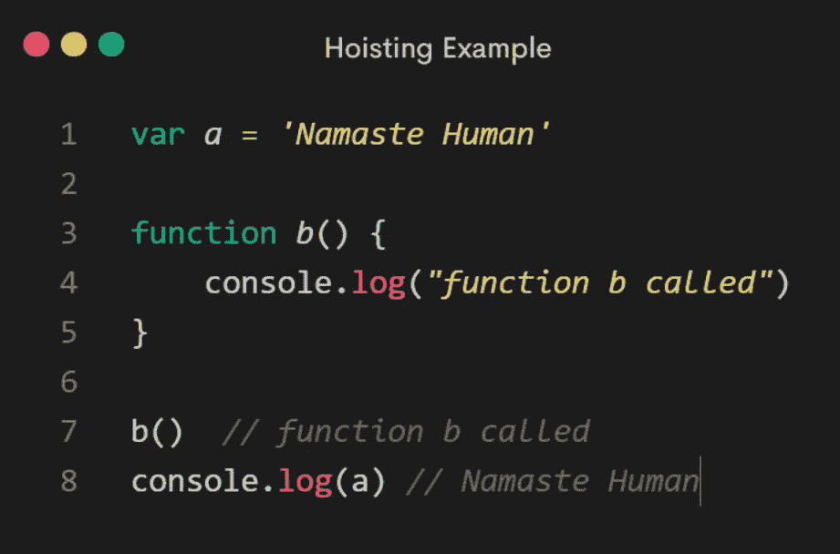

We called **function** **b()** and **variable** **a**

那么，你希望看到什么？嗯，我期待看到`*“function b called”*`，然后是`“Namaste Human*”*` *。*

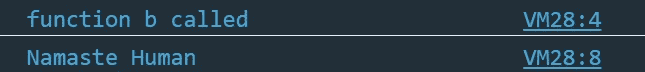

Output is as we expected.

现在让我们做一些与其他编程语言稍有不同的事情，你会期望根本不工作。我将继续并回到代码，我将把这些调用移动到页面的顶部，在那里我调用函数`b()`，在那里我输出`a`的值。

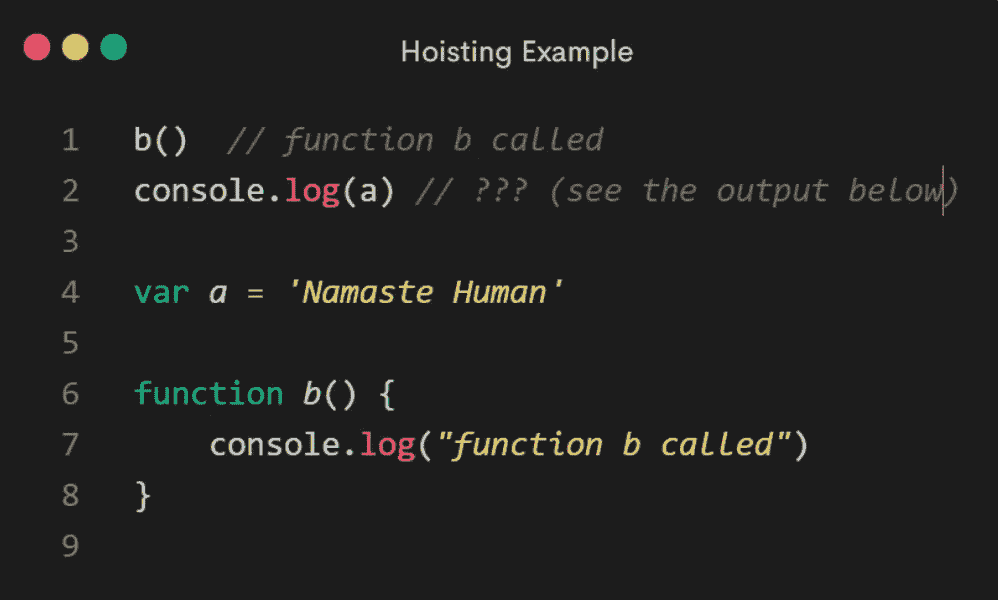

嗯，在大多数编程语言中，你会预料到一个错误，因为编程语言一次执行一行代码。因为我们还没有到函数`b()`，所以我还不能使用它。这是你通常会期望的。但是 JavaScript 不是这样的。😉

它运行了函数。它没有抛出错误，而是给了我一个值，而不是我保存的值`Namaste Human`。但是这个东西叫`undefined`。🤔

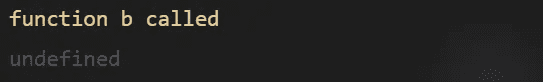

Even though the function was below where it got executed, it still ran.

事实上，这个**变量**对我来说是可用的，尽管它不是正确的值。看看如果我去掉变量`a` **会发生什么。**

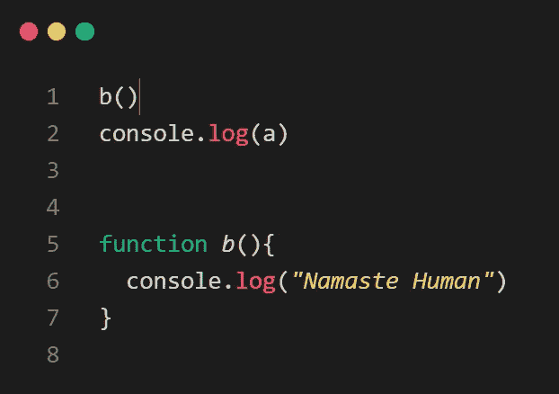

I’m trying to **console.log (a)**, and I don’t have it declared as a variable anywhere!

现在，我得到一个错误变量`a is not defined`。

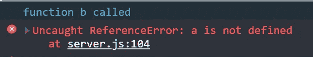

但是如果我把它放回这个 JavaScript 文件的某个地方，

I have declared variable “**a”** but instead of an error

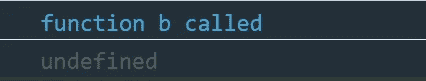

I get a value, the phrase “***undefined”***

## 这种现象被称为**吊装！**

但我认为，这种解释方式会给你错误的印象。如果你在网上寻找提升的解释，人们会说，JavaScript 中的变量和函数被 JavaScript 引擎提升或移动到顶部，就好像它们被物理地移动到顶部，这样无论你把它们放在哪里，它们都可以工作。

但是现在我们可以看出这是不正确的，因为变量没有被设置为`Namaste Human`。所以，线并没有被移动。它的行为有点像这样:

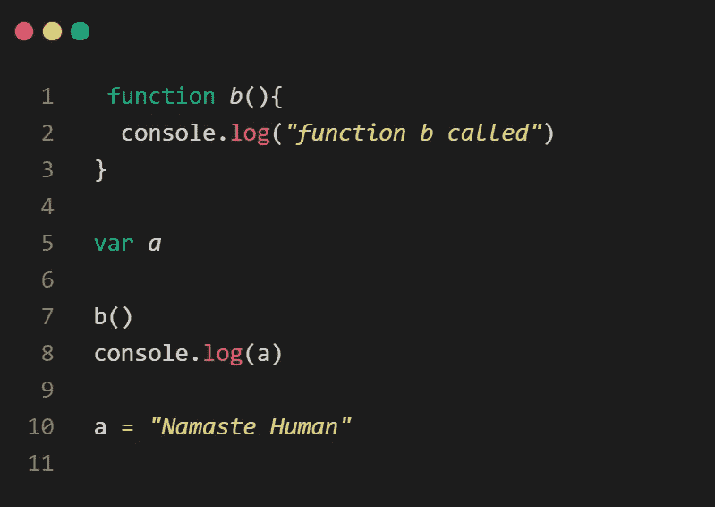

which also gives the output of **a** as **undefined**

就好像我声明了一个变量，然后再设置它的值。但是，那仍然不是正在发生的，因为我们已经说过，正在执行的不是你所写的。它被 JavaScript 引擎翻译了！

所以，这并不像是 JavaScript 引擎移动了你在代码中输入的代码，然后执行它。

这是我们写的代码。

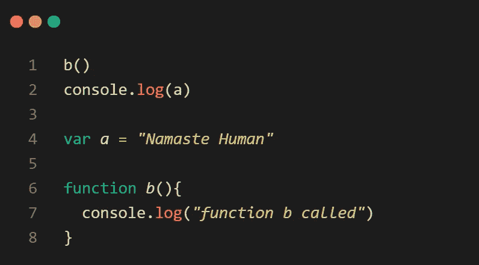

来理解 JavaScript 在做什么。我们需要更深入地挖掘执行上下文以及它是如何创建的。JavaScript 的行为方式使得变量和函数在某种程度上**可用**，即使它们是在代码的后面编写的，这是因为执行上下文是分两个阶段创建的。

第一阶段被称为创造阶段。

在这个阶段，我们知道我们有了在内存中设置的**全局对象**。然后我们有**这个**，也是在内存中设置的。

记住，**这个**总是在执行上下文中创建的。还有一个创造出来的外部环境。

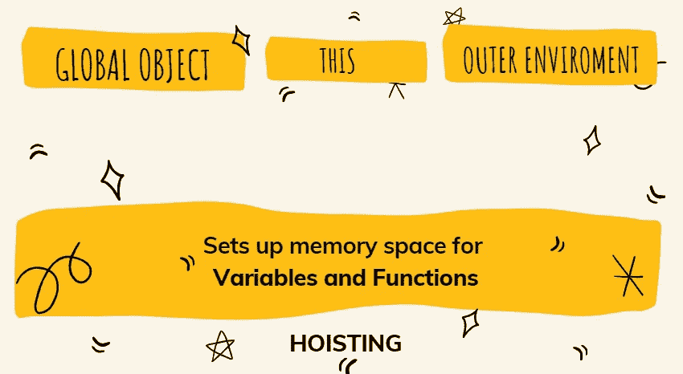

在创建阶段，当解析器运行您的代码并开始设置您编写的翻译内容时，它会识别您在哪里创建了变量，在哪里创建了函数，并在这个创建空间中设置变量和函数的内存空间。

正是这个步骤被描述为**提升**有点令人困惑！

*JavaScript 实际上并没有将代码移动到页面顶部。这意味着，在开始逐行执行代码之前，JavaScript 引擎已经为您在整个代码中创建的变量以及您创建的所有函数留出了内存空间。*

这些函数和变量已经存在于内存中。当代码开始逐行执行时，它可以访问它们。然而，当涉及到变量时，就有点不同了。整个函数都放在内存空间中。然而，下一个阶段，执行阶段，它一行一行地执行你的代码，这就是这些类型的赋值被设置的时候，变量 **a** 等于某个值。

因此，当 JavaScript 引擎为变量 **a，**设置内存空间时，并不知道它的值最终会是多少，

它可能是任何东西，

一个物体

一项功能

阵列

一根绳子

甚至是一个符号，

在开始执行这段代码之前，它会放置一个名为 undefined 的占位符。这个占位符的意思是，哦！我还不知道这个值是多少。这是我们应该有的占位符。如果我们从来没有设置它。

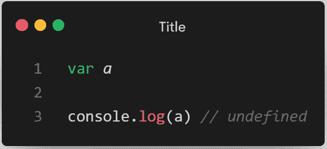

All variables in JavaScript get set to undefined.

*“JavaScript 中的所有变量最初都被设置为未定义的，函数全部位于内存中。”*

这里发生的是，在[词汇环境](https://medium.com/@polymathsomnath/how-javascript-works-inside-workings-of-javascript-2e4281fdc08)的某个地方，类似这样的事情正在发生:

The above code is just to give you an under the hood idea.

这就是为什么以任何方式依靠**提升**都不是一个好主意。你可能会遇到麻烦。当你依赖一个值，而这个值实际上是未定义的，而不是你期望的值。

虽然这在技术上是可行的

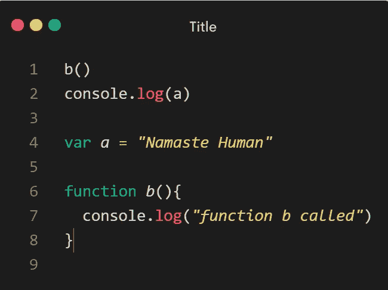

Do not call variables and function before it gets declared and initialized.

最好总是这样做

Call variables and function after it gets declared and initialized.

也就是说，我们现在理解了我们所说的提升是什么。当我们在讨论这个场景时，或者我可以调用这个函数，即使它是后来声明的，这确实与我写的不是直接被执行的这个事实有关。JavaScript 引擎然后获取我的代码并做出决定。

在创建执行上下文的第一阶段，它将为它看到的**函数**和**变量**设置内存空间，当它开始执行代码时将会用到这些内存空间。在它们实际出现在词汇环境中的页面上之前，我们已经可以以有限的方式访问它们。

有点奇怪，对吧？

但是，当您理解 JavaScript 引擎将为变量和函数设置内存空间时，就不那么重要了。因此，当代码开始执行时，变量和函数已经在计算机内存中了，因为 JavaScript 引擎查看了您的代码，并且已经为代码开始执行做好了准备。

# 在 Var 和 Let(和 Const)之间提升

下面我们看到的**和**同样适用于**常数**。

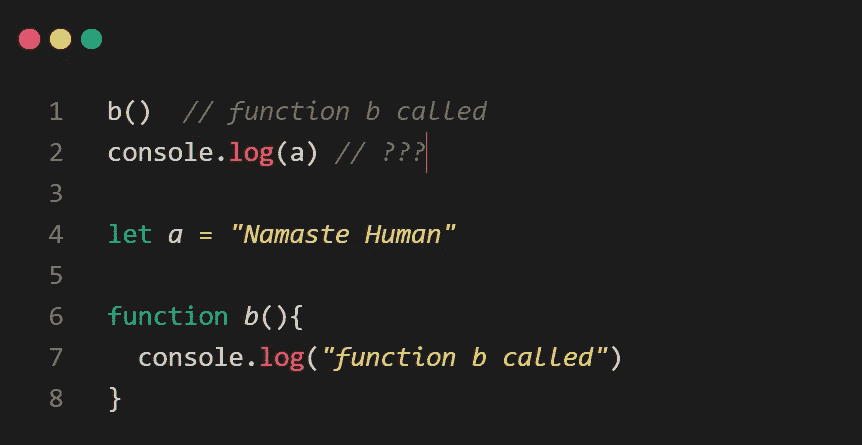

Here variable **a** is declared using the **let** keyword.

你认为输出应该是什么？

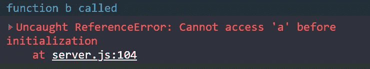

这里，我们再次得到一个引用错误。

这是因为时间死区。不要担心这个可怕的术语。它只是意味着变量创建和初始化之间的一段时间，在这段时间里你不能访问它。

这是否意味着使用 **let** 和 **const** 声明的变量没有被提升？

他们会的！

但是正如在 **var** 的情况下，用它声明的变量被赋值为 undefined，在 **let** 和 **const:** 的情况下，它们没有被初始化为关键字 undefined。

# 我们所学内容的总结

*   **我们编写的代码**并没有被直接执行，但是 *JavaScript 引擎会获取代码并做出决定*。
*   您可以在 JavaScript 中调用函数，即使它是后来声明的，但变量不是这样。
*   JavaScript 中的**变量**和**函数**被提升。这并不意味着 JavaScript 引擎会将它们移动到顶部。
*   **提升**是我们为了讨论词法范围的想法而编造的英语语言约定，没有考虑词法范围。
*   **使用**变量**声明的变量**被提升，[被初始化](https://www.youtube.com/watch?v=6vBYfLCE9-Q)未定义。
*   **函数声明**使用其函数引用进行提升和初始化，即函数整体位于内存中。
*   使用**声明的变量让**和**常量**也被提升！但是你不能在他们声明之前访问它。这是由于时间死区。

# 测试你的理解能力:

现在你知道**变量**被提升，函数完全位于内存中。因为**函数**在执行时全部存在于内存中，所以告诉我在函数或生命中声明的变量会发生什么。他们被吊起来了吗？请在评论区告诉我你的答案。

**喜欢这个帖子？我很乐意从你那里听到******。****