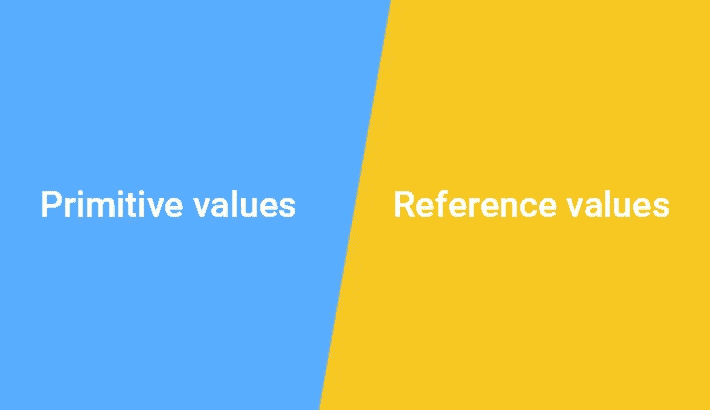

# JavaScript 原语与参考值初学者指南

> 原文：<https://javascript.plainenglish.io/a-beginners-guide-to-javascript-primitive-vs-reference-values-1f1a3c82e48b?source=collection_archive---------10----------------------->



在 JavaScript 中，变量可以存储两种类型的值:原语和引用。

## 原始类型

JavaScript 提供了六种基本类型，如未定义、空、布尔、数字、字符串和符号。

原始值的大小是固定的，因此，JavaScript 将原始值存储在堆栈中。当您将一个变量赋给这种类型时，该变量将提取值。如果你改变了这个值，这个变量就变成了新的值，就这样。让我们看一些例子-

```
let x = 10;
let y = x; // y extract the value of x
print(x, y); // 10 10
x = 20;
print(x, y); // 20 10
y = 15;
print(x, y); // 20 15
```

在这个例子中，在第 4 行我们修改了 *x* 的值。但是这个变化并没有影响到 *y* 的值。因为 *y* 提取了 *x* 的值。

## 参考类型

有两种引用类型，它们是数组和对象(因为数组是对象，所以技术上只是一种类型)。

引用值的大小是动态的，因此 JavaScript 将引用值存储在堆中。当我们创建一个新对象时，这个值并不直接赋给一个变量。相反，引用被设置为变量。让我们看一个例子-

```
let person1 = {name: "Jhon", age: 30};
let person2 = person1;
console.log(person1); // {name: "Jhon", age: 30}
console.log(person2); // {name: "Jhon", age: 30}
person2.name = "Json";
console.log(person1); // {name: "Json", age: 30}
```

在本例中，我们只修改了 person2。但是个人 1 也确实修改了。因为 person1 和 person2 都引用了*{ name:“Jhon”，age: 30}* 这个对象而没有实际值。因此，对任何对象的修改都需要修改实际对象，无论是人员 1 还是人员 2。

## 解决问题

当我们更改 person2 的名称时，它修改了原始对象。因此，我们需要为新对象创建一个新的引用，而不是引用原始对象。这样，新对象将指向自己的对象，而不是相互重叠。我们可以借助*扩展操作符创建新的对象引用。*让我们看一个例子

```
let person1 = {name: "Jhon", age: 30};
let person2 = {...person1};
console.log(person1); // {name: "Jhon", age: 30}
console.log(person2); // {name: "Jhon", age: 30}
person2.name = "Json";
console.log(person1); // {name: "Jhon", age: 30}
console.log(person2); // {name: "Json", age: 30}
```

这样我们可以解决引用类型的重叠问题。

谢谢

纳萨尔。