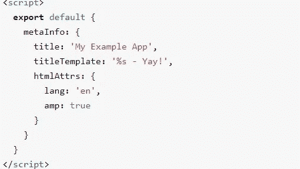

# JavaScript Web 应用程序 SEO 初学者指南

> 原文：<https://javascript.plainenglish.io/a-beginners-guide-to-seo-for-javascript-web-applications-c67d55728291?source=collection_archive---------9----------------------->

## 在建立了多个网站后，以下是我对有机流量和 SEO 的了解


Photo by [Stephen Phillips - Hostreviews.co.uk](https://unsplash.com/@hostreviews?utm_source=medium&utm_medium=referral) on [Unsplash](https://unsplash.com?utm_source=medium&utm_medium=referral)

我已经建立了多个应用程序和网站，我知道在屏幕前坐很长时间只是为了获得所有细节的痛苦。但是真正的痛苦是，尽管你付出了大量的努力和时间，你的产品却没有在网上获得足够的关注。

在社交平台上投放广告要花一大笔钱，尤其是在你刚刚起步的时候。此外，一旦你停止投放广告，你的网站流量，也就是访问你网站的人，将会大幅下降。

只有一种方法可以在不掏钱的情况下实现有机增长，那就是让谷歌这样的搜索引擎将你的文章编入搜索结果。

但是在谷歌能够索引你的网站之前，你需要向谷歌展示索引的内容。建立“搜索引擎存在”的整个过程被称为**搜索引擎优化(SEO)。**

就我个人而言，在建立网站时，我与 SEO 做了很多斗争，因此，我把我所有的知识和专业技能都放在了这本面向初学者和 JavaScript 开发人员的 SEO 终极指南中。

为了更容易阅读，我将这篇文章分成两部分。

1.  第一部分:什么是 SEO，它是如何工作的？
2.  第二部分:使用 JavaScript 的网站中的 SEO

由于这是一个关于 SEO 的初学者指南，我希望你熟悉 HTML 和基本的 JavaScript。

让我们开始吧。

# 第一部分。什么是 SEO，它是如何工作的？

SEO 是网站访客数量有机增长的关键。“有机”这个词是这里的关键词。有机增长意味着无报酬的流量，访问者访问你的网站纯粹是因为你提供的内容，而不是你运行的广告。


Search results

从上面的媒体中，你可以看到当我谷歌“投资指南”时，谷歌向我展示了与我的搜索查询匹配的最相关、优化得最好的网站。

但是谷歌是怎么找到这些网站的呢？

有各种阶段和因素的基础上，谷歌将能够索引您的网站。参考下图，快速了解这些因素。因子越低，越重要。


Image made by the author

像 Google 和 Bing 这样的搜索引擎使用一种叫做“爬虫”的东西，这只是一个对基本上发现和扫描网站的程序的花哨术语。

该程序打开一个网站，然后打开该网站上的任何链接，然后做同样的事情，直到它到达一个没有任何进一步链接的页面。

例如，该程序打开这篇文章，然后找到一个链接到我的个人资料，然后转到我的个人资料，在那里我列出了我所有的博客。然后它会浏览每一篇博客文章，并对它们进行索引。

谷歌的爬虫叫做 Googlebot，它通过网站的 HTML 来寻找内容和链接。这是 SEO 的第一步。

添加链接已经足够了，但是您可以更深入地控制爬虫应该访问哪些页面，哪些页面不应该访问，因为诸如重复内容或旧的 URL 等原因。为此，您可以在网站的根目录中包含一个 Robots.txt 文件。你可以在这里找到更精确的指南[。](https://moz.com/learn/seo/robotstxt)

从上图来看，下一步是优化关键词。关键词对于你的网站在谷歌搜索中排名靠前至关重要。

> 问问你自己，你点击了多少次谷歌搜索的第二页。

因此，**确保你出现在搜索结果的第一页比以往任何时候都更重要。**

关键词只不过是与读者的搜索查询产生共鸣的词。例如，如果你有一个关于创新的博客，根据你的博客，关键词可以是“机器学习”、“可再生能源”、“柔性显示”等等。

所有这些都是提供适当的关键字优化的流行语。

但是你怎么知道哪些关键词是流行的和相关的呢？有各种工具专门为您提供优秀的关键字。

虽然大部分都要花一毛钱，**谷歌提供免费的关键词搜索工具**，就个人而言，我用这些免费工具比付费工具成功多了。

对于初学者，我强烈推荐使用[谷歌趋势](https://trends.google.com/trends/?geo=US)，因为它相当简单。此外，您还可以比较关键词的流行程度，以及了解特定国家和时间段的情况。


Comparison between Football and Cricket search trends. Image by the author.

对于相对高级的用例，可以试试 [Google 的关键词规划器。](https://ads.google.com/intl/en_in/home/tools/keyword-planner/)我建议使用谷歌工具的主要原因是[谷歌搜索引擎拥有超过 92%的市场份额。因此优化谷歌搜索而不是必应或雅虎搜索是一个明智的选择。](https://gs.statcounter.com/search-engine-market-share)

根据我到目前为止给出的信息，你一定已经熟悉了 SEO 的基础知识。然而，下一个阶段——元标签和整体体验也很重要。

大多数初学者错过了这两个最后阶段，这极大地影响了他们的流量。

Meta 标签通过 HTML 文档提供了称为“元数据”的有价值的信息。Meta 标签是普通的 HTML 标签，但是它们对网页的视觉效果没有任何影响，相反，它们被爬虫使用。

如果你建立了一个网站，你很可能有意或无意地使用了这些标签。下面是一个代码片段，包含了一组很好的 meta 标签。

```
<head>
<meta charset="UTF-8">
<meta name="viewport" content="width=device-width, initial-scale=1.0">
<title>Title Meta Tag</title>
<meta name="description" content=" A precise description the webpage">
<meta name="robots" content="noindex" />
</head>
```

所有这些标签都在头部标签之间。虽然标题和描述是最重要的标签，但其他元标签如“机器人”也很有用。

告诉爬虫不要索引这个页面。你可以在这里[找到这些标签的完整列表](https://moz.com/blog/the-ultimate-guide-to-seo-meta-tags)，但我已经分享了最重要的几个，让你开始。

最后但并非最不重要的是，我们的整体体验是影响 SEO 的最终因素。这一个是相当不言自明的。它指的是网站的整体加载速度和内容的呈现方式。

大多数通过 JavaScript 框架构建的网站，比如 React 和 Vue，无论如何都非常快，但是如果你从外部数据库加载数据，确保它不会对加载时间产生太大影响。

此外，确保使用相关标签，如标题标签`<h1> </h1>`作为标题，因为这使爬虫更容易理解内容。

简而言之，第一部分已经涵盖了影响 SEO 如何工作的所有因素，以及标签和关键字等核心基本要素可以提高您的排名。

# 第二部分。使用 JavaScript 的网站中的 SEO

如果你仔细阅读了第一部分，你一定注意到爬虫只涉及页面的 HTML。

但是现在大多数网站都变得越来越复杂，因此结合了 JavaScript 来添加纯 HTML 无法实现的动态内容加载和功能。

幸运的是，谷歌已经覆盖了我们。他们[写了一本关于用 Javascript 理解 SEO 的深度指南。](https://developers.google.com/search/docs/guides/javascript-seo-basics)


Google’s process to crawl. Source: [Google](https://developers.google.com/search/docs/guides/javascript-seo-basics).

如上图所示，Googlebot(Google 的爬虫)分三个主要阶段处理 JavaScript web 应用程序:

1.  爬行
2.  翻译
3.  索引

由于 JavaScript 将内容注入到 HTML 中，这个过程可能需要一些时间——这段时间爬虫不必等待并查看完整呈现的 HTML。

因此，爬虫必须等待一秒钟，让 HTML 连同 JS 内容一起完全加载。因此，Googlebot 等待渲染完成。

所以对于使用 JavaScript 的网站，你真的不需要做太多。你可以随时遵循谷歌提供的[指南](https://developers.google.com/search/docs/guides/javascript-seo-basics)。不过我建议的一件事是使用[丰富结果测试](https://search.google.com/test/rich-results)来调试和理解爬虫如何解释你的站点内容。

## 但是如果使用 React 之类的 JavaScript 框架呢？

React 和其他此类框架虚拟地加载 DOM。他们发送一个带有最少标签的空 HTML 容器，然后用 JavaScript 填充它。他们在客户端的浏览器上填充 HTML，这个过程被称为**客户端渲染。**

在这些单页应用程序(用 Vue、React、Angular 等制作的网站)上实现 SEO 是相当具有挑战性的，然而，你总是可以在服务器上呈现这些页面，然后将最终的 HTML 发送给用户或爬虫。

这被称为**服务器端渲染(SSR)。**服务器端向用户发送一个完整的渲染页面，因此，爬虫会在服务器端看到注入了所有链接和内容的成品。

要在服务器上渲染 React，流行的选择是使用 [Next.js](https://nextjs.org/) ，它构建在 React 之上，极大地简化了路由之类的事情。但最重要的是，它通过向用户推出一个静态站点来支持在服务器上呈现内容，这对于 SEO 来说非常有用。

同样，对于 Angular，我们有 [Angular Universal](https://angular.io/guide/universal) ，对于 Vue，我们有 [Nuxt.js](https://nuxtjs.org/) 。使用服务器端呈现框架将提供两全其美——框架的灵活性和静态站点的 SEO。

## 那些已经用 Vue 和 React 这样的客户端框架构建的应用呢？

将一个成熟的应用程序迁移到一个新的框架，比如将 React 应用程序迁移到 Next.js 框架，可能会非常具有挑战性，而且非常耗时。

然而，并非所有的希望都落空了。

有许多软件包可以提供添加 meta 标签来增强 SEO 的能力，我在本文的第一部分已经讨论了它的好处。

要管理 Angular 中标签的动态添加，可以使用 [Ngx-meta/core](https://www.npmjs.com/package/@ngx-meta/core) 包。类似地，对于 Vue，我们有 React.js 的 [Vue-Meta](https://www.npmjs.com/package/vue-meta) 包&，我们有[React-头盔](https://www.npmjs.com/package/react-helmet)。

所有的页面都很简单，我已经分享了 3 个最广泛使用的框架的包。通常，所有其他框架也有类似的可用包。

使用这些包非常简单，正如你在下面看到的，这取决于你使用的框架。可以点击展开。



Angular(left), React(center) and Vue(right). Source: author.

值得注意的是，如果你刚刚开始你的项目，选择一个服务器端的框架来逃避所有管理 SEO 的麻烦。

使用 JAMStack 也是一个可行的选择，因为使用 CDN 可以随时加载数据，并且提供比大多数前端框架更好的 SEO 分数，而不会影响性能。

# 结论

随着对数字内容需求的增长，合理构建网站以获得尽可能多的流量变得比以往任何时候都更加重要。

虽然运行广告肯定可以提高你的流量，但掌握 SEO 可以确保长期稳定的有机增长。

因此，我试图通过揭秘与 SEO 相关的常用术语来解释 SEO 的艺术，以及营销，给你和你的文章获得高有机流量的最佳机会。

大多数开发人员认为学习和实现适当的 SEO 有一个相当陡峭的学习曲线，但事实上，他们知道 SEO 中涉及的所有技术细节，甚至已经实现了一些可能是不知不觉的。